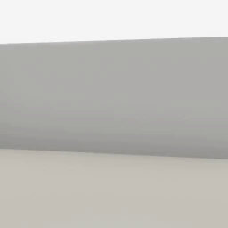
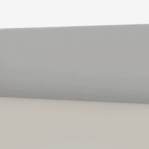
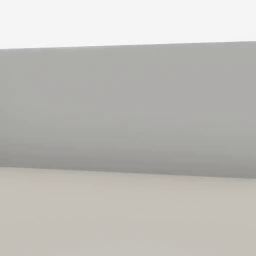

##### Replicants

# Head rotation

The Replicant can look at a target object or position, and can reset the rotation of its head. The Replicant's head moves continuously over multiple `communicate()` calls. The [camera](../core_concepts/avatars.md) attached to the head always matches the rotation of the head.

## The `look_at(target)` command

The `look_at(target)` command will tell the Replicant to start looking at a target, which can be an x, y, z dictionary position, an x, y, z numpy array position, or an object ID:

```python
from tdw.controller import Controller
from tdw.tdw_utils import TDWUtils
from tdw.add_ons.replicant import Replicant
from tdw.add_ons.image_capture import ImageCapture
from tdw.replicant.action_status import ActionStatus
from tdw.replicant.image_frequency import ImageFrequency
from tdw.backend.paths import EXAMPLE_CONTROLLER_OUTPUT_PATH


def do_action():
    while replicant.action.status == ActionStatus.ongoing:
        c.communicate([])


c = Controller()
replicant = Replicant(image_frequency=ImageFrequency.always)
c.add_ons.append(replicant)
object_id = Controller.get_unique_id()
commands = [TDWUtils.create_empty_room(12, 12)]
commands.extend(Controller.get_add_physics_object(model_name="basket_18inx18inx12iin_wicker",
                                                  object_id=object_id,
                                                  position={"x": -2, "y": 0, "z": 3}))
c.communicate(commands)
path = EXAMPLE_CONTROLLER_OUTPUT_PATH.joinpath("replicant_look_at")
print(f"Images will be saved to: {path}")
capture = ImageCapture(avatar_ids=[replicant.static.avatar_id], path=path)
c.add_ons.append(capture)
c.communicate([])
replicant.look_at(target=object_id)
do_action()
replicant.look_at(target={"x": 2, "y": 0.3, "z": 3})
do_action()
c.communicate({"$type": "terminate"})
```

Result (these images are captured from the Replicant's camera, as opposed to a third-person camera):



### The `duration` parameter

The optional `duration` parameter controls the speed in seconds at which the head turns:

```python
from tdw.controller import Controller
from tdw.tdw_utils import TDWUtils
from tdw.add_ons.replicant import Replicant
from tdw.add_ons.image_capture import ImageCapture
from tdw.replicant.action_status import ActionStatus
from tdw.replicant.image_frequency import ImageFrequency
from tdw.backend.paths import EXAMPLE_CONTROLLER_OUTPUT_PATH


def do_action():
    while replicant.action.status == ActionStatus.ongoing:
        c.communicate([])


c = Controller()
replicant = Replicant(image_frequency=ImageFrequency.always)
c.add_ons.append(replicant)
object_id = Controller.get_unique_id()
commands = [TDWUtils.create_empty_room(12, 12)]
commands.extend(Controller.get_add_physics_object(model_name="basket_18inx18inx12iin_wicker",
                                                  object_id=object_id,
                                                  position={"x": -2, "y": 0, "z": 3}))
c.communicate(commands)
path = EXAMPLE_CONTROLLER_OUTPUT_PATH.joinpath("replicant_look_at_slow")
print(f"Images will be saved to: {path}")
capture = ImageCapture(avatar_ids=[replicant.static.avatar_id], path=path)
c.add_ons.append(capture)
c.communicate([])
replicant.look_at(target=object_id,
                  duration=1)
do_action()
replicant.look_at(target={"x": 2, "y": 0.3, "z": 3},
                  duration=1)
do_action()
c.communicate({"$type": "terminate"})
```

Result:



### The `scale_duration` parameter

`duration` is measured in seconds. If the simulation is running faster than real life, this will appear too slow. To handle this, the `ReachFor` action dynamically scales the `duration` value in proportion to the actual framerate: `duration *= 60 / (1 / framerate)`. This is usually desirable, but can be suppressed by setting `scale_duration=False`.

### Low-level description

`replicant.look_at(target)` sets `replicant.action` to a [`LookAt`](../../python/replicant/actions/look_at.md) action. 

In addition to [the usual `Action` initialization commands](actions.md), `LookAt` sends either [`replicant_look_at_position`](../../api/command_api.md#replicant_look_at_position) or [`replicant_look_at_object`](../../api/command_api.md#replicant_look_at_object).

The action ends when the head stops moving (as announced by the build in the output data).

## The `rotate_head(angle, axis)` command

The `rotate_head(target)` command will tell the Replicant to start to rotate its head by an angle (in degrees) around an axis. The axis options are: `"pitch"`, `"yaw"`, `"roll"`.

### Optional parameters

The `reset_head` action has the same optional parameters as `look_at`:

- The optional `duration` parameter controls the speed in seconds at which the head turns; it works exactly the same was as it does in `rotate_head(target)`.

- The optional `scale_duration` parameter works the same way as it does in `rotate_head(target)`.

### Low-level description

`replicant.rotate_head(angle, axis)` sets `replicant.action` to a [`RotateHead`](../../python/replicant/actions/rotate_head.md) action. 

In addition to [the usual `Action` initialization commands](actions.md), `RotateHead` sends [`replicant_rotate_head_by`](../../api/command_api.md#replicant_rotate_head_by).

The action ends when the head stops moving (as announced by the build in the output data).

## The `reset_head()` command

Call `reset_head()` to start turning the head back to its neutral position:

```python
from tdw.controller import Controller
from tdw.tdw_utils import TDWUtils
from tdw.add_ons.replicant import Replicant
from tdw.add_ons.image_capture import ImageCapture
from tdw.replicant.action_status import ActionStatus
from tdw.replicant.image_frequency import ImageFrequency
from tdw.backend.paths import EXAMPLE_CONTROLLER_OUTPUT_PATH


def do_action():
    while replicant.action.status == ActionStatus.ongoing:
        c.communicate([])


c = Controller()
replicant = Replicant(image_frequency=ImageFrequency.always)
c.add_ons.append(replicant)
object_id = Controller.get_unique_id()
commands = [TDWUtils.create_empty_room(12, 12)]
commands.extend(Controller.get_add_physics_object(model_name="basket_18inx18inx12iin_wicker",
                                                  object_id=object_id,
                                                  position={"x": -2, "y": 0, "z": 3}))
c.communicate(commands)
path = EXAMPLE_CONTROLLER_OUTPUT_PATH.joinpath("replicant_look_at_reset")
print(f"Images will be saved to: {path}")
capture = ImageCapture(avatar_ids=[replicant.static.avatar_id], path=path)
c.add_ons.append(capture)
c.communicate([])
replicant.look_at(target=object_id)
do_action()
replicant.look_at(target={"x": 2, "y": 0.3, "z": 3})
do_action()
replicant.reset_head()
do_action()
c.communicate({"$type": "terminate"})
```

Result:



### Optional parameters

The `reset_head` action has the same optional parameters as `look_at` and `rotate_head`:

- The optional `duration` parameter controls the speed in seconds at which the head turns; it works exactly the same was as it does in `reset_head(target)`.

- The optional `scale_duration` parameter works the same way as it does in `reset_head(target)`.

### Low-level description

`replicant.reset_head()` sets `replicant.action` to a [`ResetHead`](../../python/replicant/actions/reset_head.md) action. 

In addition to [the usual `Action` initialization commands](actions.md), `ResetHead` sends [`replicant_reset_head`](../../api/command_api.md#replicant_reset_head).

The action ends when the head stops moving (as announced by the build in the output data).

***

**Next: [Navigation](navigation.md)**

[Return to the README](../../../README.md)

***

Example controllers:

- [look_at.py](https://github.com/threedworld-mit/tdw/blob/master/Python/example_controllers/replicant/look_at.py) Look at an object and a position, then reset the head.

Command API:

- [`replicant_look_at_position`](../../api/command_api.md#replicant_look_at_position)
- [`replicant_look_at_object`](../../api/command_api.md#replicant_look_at_object)
-  [`replicant_rotate_head_by`](../../api/command_api.md#replicant_rotate_head_by)
- [`replicant_reset_head`](../../api/command_api.md#replicant_reset_head)

Python API:

- [`Replicant`](../../python/add_ons/replicant.md)
- [`LookAt`](../../python/replicant/actions/look_at.md)
- [`RotateHead`](../../python/replicant/actions/rotate_head.md)
- [`ResetHead`](../../python/replicant/actions/reset_head.md)