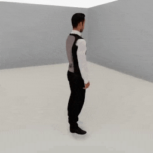
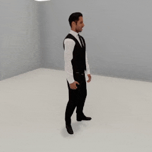
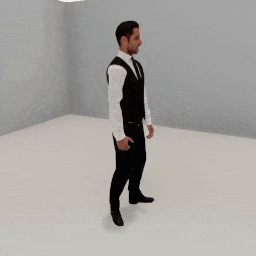
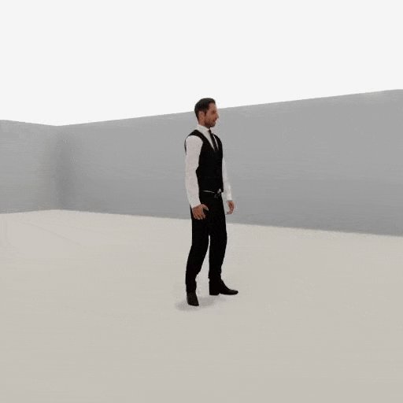
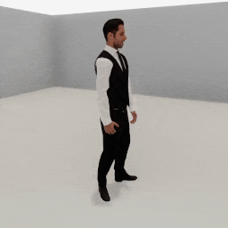

##### Replicants

# Movement

The Replicant can walk a distance, turn by an angle, walk to a target, or turn to face a target.

## The `move_by(distance)` action

Call [`replicant.move_by(distance)`](../../python/add_ons/replicant.md) to start to walk a target distance:

```python
from tdw.controller import Controller
from tdw.tdw_utils import TDWUtils
from tdw.add_ons.replicant import Replicant
from tdw.replicant.action_status import ActionStatus

c = Controller()
replicant = Replicant()
c.add_ons.append(replicant)
c.communicate(TDWUtils.create_empty_room(12, 12))
replicant.move_by(distance=2)
while replicant.action.status == ActionStatus.ongoing:
    c.communicate([])
c.communicate([])
c.communicate({"$type": "terminate"})
```

If the target distance is < 0, the Replicant will walk backwards.

In addition to `distance` there are other optional parameters; [read the API documentation for more information](../../python/add_ons/replicant.md).

### Success and failure

The `move_by(distance)` action succeeds (i.e. `replicant.action.status == ActionStatus.success`) if the Replicant moves the target distance minus a small offset (see the `arrived_at` optional parameter).

The action can end in failure due to a [collision](collision_detection.md) or because the Replicant took too long to arrive (see the `max_walk_cycles` optional parameter).

### Why there is a pause at the start of movement

The Replicant's walk animation is stored as a [humanoid animation asset bundle](../non_physics_humanoids/overview.md). The first time you call `move_by()` or `move_to()`, the animation needs to be downloaded and loaded into memory, hence the delay at the start of the action. Like all asset bundles, this is a one-time requirement. If you call `move_by()` and `move_to()` more than once, subsequent calls will begin immediately.

## The `turn_by(angle)` action

Call [`replicant.turn_by(angle)`](../../python/add_ons/replicant.md) to turn the Replicant by an angle in degrees.

```python
from tdw.controller import Controller
from tdw.tdw_utils import TDWUtils
from tdw.add_ons.replicant import Replicant
from tdw.replicant.action_status import ActionStatus

c = Controller()
replicant = Replicant()
c.add_ons.append(replicant)
c.communicate(TDWUtils.create_empty_room(12, 12))
replicant.turn_by(angle=40)
while replicant.action.status == ActionStatus.ongoing:
    c.communicate([])
c.communicate([])
c.communicate({"$type": "terminate"})
```

Unlike `move_by(distance)`, `turn_by(angle)` is not an animated motion, meaning that the Replicant will immediately rotate by the angle. There are no optional parameters and the action always ends in success.

## The `turn_to(target)` action

Call [`replicant.turn_to(target)`](../../python/add_ons/replicant.md) to turn the Replicant to face a target position or object. `target` can be an object ID, a position as an x, y, z dictionary, or a position as a 3-element numpy array:

```python
import numpy as np
from tdw.controller import Controller
from tdw.tdw_utils import TDWUtils
from tdw.add_ons.replicant import Replicant
from tdw.replicant.action_status import ActionStatus

c = Controller()
replicant = Replicant()
c.add_ons.append(replicant)
object_id = Controller.get_unique_id()
c.communicate([TDWUtils.create_empty_room(12, 12),
               Controller.get_add_object(model_name="rh10",
                                         object_id=object_id,
                                         position={"x": 2, "y": 0, "z": 2.3})])
# Turn to a target position.
replicant.turn_to(target={"x": -1, "y": 0, "z": 0})
while replicant.action.status == ActionStatus.ongoing:
    c.communicate([])
c.communicate([])
# Turn to a target position.
replicant.turn_to(target=np.array([1, 0, 0]))
while replicant.action.status == ActionStatus.ongoing:
    c.communicate([])
c.communicate([])
# Turn to a target object.
replicant.turn_to(target=object_id)
while replicant.action.status == ActionStatus.ongoing:
    c.communicate([])
c.communicate([])
c.communicate({"$type": "terminate"})
```

Like `turn_by(angle)`, this is not an animated motion, there are no optional parameters, and the action always succeeds.

## The `move_to(target)` action

Call [`replicant.move_to(target)`](../../python/add_ons/replicant.md) to tell the Replicant to walk to a target position or object.

`move_to(target)` combines a `turn_to(target)` action with a `move_by(distance)` action. It has all of the same optional parameters and collision detection rules as `move_by(distance)` plus a few more; [read the API documentation for more information](../../python/add_ons/replicant.md).

Like `turn_to(target)`, the `target` can be an object ID, a position as an x, y, z dictionary, or a position as a 3-element numpy array.

This example tells the Replicant to move to a target position behind it:

```python
from tdw.controller import Controller
from tdw.tdw_utils import TDWUtils
from tdw.add_ons.replicant import Replicant
from tdw.add_ons.third_person_camera import ThirdPersonCamera
from tdw.add_ons.image_capture import ImageCapture
from tdw.backend.paths import EXAMPLE_CONTROLLER_OUTPUT_PATH
from tdw.replicant.action_status import ActionStatus

c = Controller()
replicant = Replicant(position={"x": 0, "y": 0, "z": 2})
camera = ThirdPersonCamera(position={"x": 2, "y": 1.6, "z": 1},
                           look_at=replicant.replicant_id,
                           avatar_id="a")
path = EXAMPLE_CONTROLLER_OUTPUT_PATH.joinpath("replicant_move_to")
print(f"Images will be saved to: {path}")
capture = ImageCapture(avatar_ids=["a"],
                       path=path)
c.add_ons.extend([replicant, camera, capture])
# Create the scene.
c.communicate(TDWUtils.create_empty_room(12, 12))
# Start walking.
replicant.move_to(target={"x": 0, "y": 0, "z": -3})
# Continue walking until the action ends.
while replicant.action.status == ActionStatus.ongoing:
    c.communicate([])
c.communicate([])
c.communicate({"$type": "terminate"})
```

Result:



## Physics and collision detection

*For more information regarding collision detection, [read this.](collision_detection.md)*

### Turn actions

The `turn_by(angle)` and `turn_to(angle)` actions always succeed and ignore `replicant.collision_detection`.

### Obstacle avoidance

By default, `move_by(distance)` and `move_to(target)` will try to *avoid* obstacles *before* colliding with them.

In this example, the Replicant will start to walk to a wall and stop before it hits it:

```python
from tdw.controller import Controller
from tdw.tdw_utils import TDWUtils
from tdw.add_ons.replicant import Replicant
from tdw.add_ons.third_person_camera import ThirdPersonCamera
from tdw.add_ons.image_capture import ImageCapture
from tdw.backend.paths import EXAMPLE_CONTROLLER_OUTPUT_PATH
from tdw.replicant.action_status import ActionStatus

c = Controller()
replicant = Replicant()
camera = ThirdPersonCamera(position={"x": 2, "y": 1.6, "z": 1},
                           look_at=replicant.replicant_id,
                           avatar_id="a")
path = EXAMPLE_CONTROLLER_OUTPUT_PATH.joinpath("replicant_avoid_wall")
print(f"Images will be saved to: {path}")
capture = ImageCapture(avatar_ids=["a"], path=path)
c.add_ons.extend([replicant, camera, capture])
c.communicate(TDWUtils.create_empty_room(8, 8))
replicant.move_by(10)
while replicant.action.status == ActionStatus.ongoing:
    c.communicate([])
c.communicate([])
print(replicant.action.status)
c.communicate({"$type": "terminate"})
```

Result:



Output:

```
ActionStatus.detected_obstacle
```

This also works with any objects in the Replicant's path:

```python
from tdw.controller import Controller
from tdw.tdw_utils import TDWUtils
from tdw.add_ons.replicant import Replicant
from tdw.add_ons.third_person_camera import ThirdPersonCamera
from tdw.add_ons.image_capture import ImageCapture
from tdw.backend.paths import EXAMPLE_CONTROLLER_OUTPUT_PATH
from tdw.replicant.action_status import ActionStatus

c = Controller()
replicant = Replicant()
camera = ThirdPersonCamera(position={"x": 2, "y": 1.6, "z": 1},
                           look_at=replicant.replicant_id,
                           avatar_id="a")
path = EXAMPLE_CONTROLLER_OUTPUT_PATH.joinpath("replicant_avoid_object")
print(f"Images will be saved to: {path}")
capture = ImageCapture(avatar_ids=["a"], path=path)
c.add_ons.extend([replicant, camera, capture])
c.communicate([TDWUtils.create_empty_room(8, 8),
               Controller.get_add_object(model_name="rh10",
                                         object_id=Controller.get_unique_id(),
                                         position={"x": 0, "y": 0, "z": 2})])
replicant.move_by(10)
while replicant.action.status == ActionStatus.ongoing:
    c.communicate([])
c.communicate([])
print(replicant.action.status)
c.communicate({"$type": "terminate"})
```

Result:



Output:

```
ActionStatus.detected_obstacle
```

**To disable obstacle avoidance, set `replicant.collision_detection.avoid = False`.** If you do this:

- The Replicant will walk until it collides with non-kinematic objects.
- The Replicant will walk through kinematic objects.
- The Replicant will walk through walls.

### Collisions with non-kinematic objects

Even if you set `replicant.collision_detection.avoid = False`, a Replicant will stop walking when it *collides* with a non-kinematic object. There are two ways to toggle this off:

1. **Set `replicant.collision_detection.objects = False` to ignore *all* collisions with objects.** The Replicant will still physically interact with non-kinematic objects.
2. **Append an object ID to the `replicant.collision_detection.exclude_objects` list.** The Replicant will ignore collisions with this specific object (and will still physically interact with it).

In this example, we've disabled obstacle avoidance and object avoidance; notice how the Replicant collides with the sofa and pushes it out of the way:

```python
from tdw.controller import Controller
from tdw.tdw_utils import TDWUtils
from tdw.add_ons.replicant import Replicant
from tdw.add_ons.third_person_camera import ThirdPersonCamera
from tdw.add_ons.image_capture import ImageCapture
from tdw.replicant.action_status import ActionStatus
from tdw.backend.paths import EXAMPLE_CONTROLLER_OUTPUT_PATH

c = Controller()
camera = ThirdPersonCamera(position={"x": -0.5, "y": 1.175, "z": 6},
                           look_at={"x": 0.5, "y": 1, "z": 0},
                           avatar_id="a")
path = EXAMPLE_CONTROLLER_OUTPUT_PATH.joinpath("replicant_crash")
print(f"Images will be saved to: {path}")
capture = ImageCapture(avatar_ids=["a"], path=path)
replicant = Replicant(position={"x": 0, "y": 0, "z": 4})
# Don't try to avoid obstacles.
replicant.collision_detection.avoid = False
replicant.collision_detection.objects = False
# Append the add-ons.
c.add_ons.extend([replicant, camera, capture])
# Create a scene. Add a sofa. The sofa will be implausibly light.
commands = [TDWUtils.create_empty_room(12, 20),
            c.get_add_object(model_name="arflex_strips_sofa",
                             position={"x": 0, "y": 0, "z": 0},
                             object_id=Controller.get_unique_id())]
# Add the target object.
ball_id = Controller.get_unique_id()
commands.extend(c.get_add_physics_object(model_name="prim_sphere",
                                         object_id=ball_id,
                                         position={"x": 0, "y": 0, "z": -4.0},
                                         scale_factor={"x": 0.2, "y": 0.2, "z": 0.2},
                                         kinematic=True,
                                         gravity=False,
                                         library="models_special.json"))
# Send the commands.
c.communicate(commands)
replicant.move_to(target=ball_id)
while replicant.action.status == ActionStatus.ongoing:
    c.communicate([])
c.communicate([])
c.communicate({"$type": "terminate"})
```



### Collisions with kinematic objects and walls

Because the Replicant's Rigidbody is kinematic (non-physics), **the Replicant won't collide with other kinematic objects.** Assuming that `collision_detection.avoid = False` and `collision_detection.objects = False`, the Replicant will walk through kinematic objects without interacting with them.

Walls are environment objects that don't have Rigidbodies. If `collision_detection.avoid = False`, the Replicant will walk through walls without interacting with them.

In this example, the Replicant will walk through an object and a wall:

```python
from tdw.controller import Controller
from tdw.tdw_utils import TDWUtils
from tdw.add_ons.replicant import Replicant
from tdw.add_ons.third_person_camera import ThirdPersonCamera
from tdw.add_ons.image_capture import ImageCapture
from tdw.backend.paths import EXAMPLE_CONTROLLER_OUTPUT_PATH
from tdw.replicant.action_status import ActionStatus

c = Controller()
replicant = Replicant()
camera = ThirdPersonCamera(position={"x": 2, "y": 1.6, "z": 1},
                           look_at=replicant.replicant_id,
                           avatar_id="a")
path = EXAMPLE_CONTROLLER_OUTPUT_PATH.joinpath("replicant_non_kinematic")
print(f"Images will be saved to: {path}")
capture = ImageCapture(avatar_ids=["a"],
                       path=path)
c.add_ons.extend([replicant, camera, capture])
# Create the scene.
commands = [TDWUtils.create_empty_room(12, 12)]
# Add a kinematic object to the scene.
commands.extend(Controller.get_add_physics_object(model_name="trunck",
                                                  object_id=Controller.get_unique_id(),
                                                  position={"x": 0, "y": 0, "z": 3},
                                                  kinematic=True))
c.communicate(commands)
# Look at the Replicant.
camera.look_at(replicant.replicant_id)
# Disable obstacle avoidance.
replicant.collision_detection.avoid = False
# Disable checks for object collisions.
replicant.collision_detection.objects = False
# Start walking.
replicant.move_by(20)
# Continue walking until the action ends.
while replicant.action.status == ActionStatus.ongoing:
    c.communicate([])
c.communicate([])
c.communicate({"$type": "terminate"})
```

Result:



### Collision detection and previous actions

By default, the Replicant will fail a move action depending on the result of the *previous* action. If the previous action was a move action, and it was in the same direction, and it ended in a collision, the current move action will immediately fail (because it's assumed that it would also end in a collision).

To override this behavior, set `replicant.collision_detection.previous_was_same = False`.

## Low-level description

### Turning

`replicant.turn_by(angle)` sets `replicant.action` to a [`TurnBy`](../../python/replicant/actions/turn_by.md) action. `replicant.turn_to(target)` sets `replicant.action` to a [`TurnTo`](../../python/replicant/actions/turn_to.md).

In addition to [the usual `Action` initialization commands](actions.md), `TurnBy` sends [`rotate_object_by`](../../api/command_api.md#rotate_object_by), while `TurnTo` sends [`object_look_at_position`](../../api/command_api.md#object_look_at_position).

### Moving

`replicant.move_by(distance)` sets `replicant.action` to a [`MoveBy`](../../python/replicant/actions/move_by.md) action. `replicant.move_to(target)` sets `replicant.action` to a [`MoveTo`](../../python/replicant/actions/move_to.md) action.

In addition to [the usual `Action` initialization commands](actions.md),  `MoveBy` and `MoveTo` send [`add_humanoid_animation`](../../api/command_api.md#add_humanoid_animation) and [`play_replicant_animation`](../../api/command_api.md#play_replicant_animation) for the walk animation. Every `communicate()` call, these actions check for collisions and the distance traversed to determine if the action has ended. The action checks if the walk animation is done by checking `replicant.dynamic.output_action_status` (which will indicate that the build has signaled that an animation ended), and replay the walk animation as needed.

Due to certain low-level features in the Replicant's implementation, collision detection can be glitchy while the Replicant is walking. On every `communicate()` call, the `MoveBy` and `MoveTo` actions will send [`replicant_resolve_collider_intersections`](../../api/command_api.md#replicant_resolve_collider_intersections); this command will attempt to push forward any objects intersecting with the Replicant.

Obstacle avoidance is achieved via overlap shapes. Per `communicate()` call, the action sends [`send_overlap_box`](../../api/command_api.md#send_overlap_box), which returns [`Overlap`](../../api/output_data.md#Overlap) data. The overlap box is cast in front or behind the Replicant, depending on whether it is walking forwards or backwards. If the `Overlap` data includes walls or object IDs, the Replicant stops walking.

In addition to [the usual `Action` end commands](actions.md), `MoveBy` and `MoveTo` send [`stop_humanoid_animation`](../../api/command_api.md#stop_humanoid_animation).

***

**Next: [Animations](animations.md)**

[Return to the README](../../../README.md)

***

Example controllers:

- [move_by.py](https://github.com/threedworld-mit/tdw/blob/master/Python/example_controllers/replicant/move_by.py) Tell the Replicant to walk a target distance.
- [move_to.py](https://github.com/threedworld-mit/tdw/blob/master/Python/example_controllers/replicant/move_to.py) Tell the Replicant to walk to a target position.
- [crash.py](https://github.com/threedworld-mit/tdw/blob/master/Python/example_controllers/replicant/crash.py) Collide with an obstacle.
- [collision_detection_tests.py](https://github.com/threedworld-mit/tdw/blob/master/Python/example_controllers/replicant/collision_detection_tests.py) Tests for collision detection while walking.
- [non_kinematic.py](https://github.com/threedworld-mit/tdw/blob/master/Python/example_controllers/replicant/non_kinematic.py) Walk through an object and a wall.

Command API:

- [`rotate_object_by`](../../api/command_api.md#rotate_object_by)
- [`object_look_at_position`](../../api/command_api.md#object_look_at_position)
- [`add_humanoid_animation`](../../api/command_api.md#add_humanoid_animation)
- [`play_replicant_animation`](../../api/command_api.md#play_replicant_animation)
- [`replicant_resolve_collider_intersections`](../../api/command_api.md#replicant_resolve_collider_intersections)
- [`send_overlap_box`](../../api/command_api.md#send_overlap_box)
- [`stop_humanoid_animation`](../../api/command_api.md#stop_humanoid_animation)

Output Data API:

- [`Overlap`](../../api/output_data.md#Overlap)

Python API:

- [`Replicant`](../../python/add_ons/replicant.md)
- [`TurnBy`](../../python/replicant/actions/turn_by.md)
- [`TurnTo`](../../python/replicant/actions/turn_to.md)
- [`MoveBy`](../../python/replicant/actions/move_by.md)
- [`MoveTo`](../../python/replicant/actions/move_to.md)