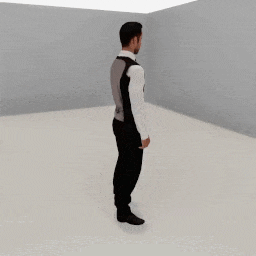

##### Replicants

# Movement

The Replicant can walk a distance, turn by an angle, walk to a target, or turn to face a target.

## The `move_by(distance)` action

Call [`replicant.move_by(distance)`](../../python/add_ons/replicant.md) to start to walk a target distance:

```python
from tdw.controller import Controller
from tdw.tdw_utils import TDWUtils
from tdw.add_ons.replicant import Replicant
from tdw.replicant.action_status import ActionStatus

c = Controller()
replicant = Replicant()
c.add_ons.append(replicant)
c.communicate(TDWUtils.create_empty_room(12, 12))
replicant.move_by(distance=2)
while replicant.action.status == ActionStatus.ongoing:
    c.communicate([])
c.communicate([])
c.communicate({"$type": "terminate"})
```

If the target distance is < 0, the Replicant will walk backwards.

In addition to `distance` there are other optional parameters; [read the API documentation for more information](../../python/add_ons/replicant.md).

### Success and failure

The `move_by(distance)` action succeeds (i.e. `replicant.action.status == ActionStatus.success`) if the Replicant moves the target distance minus a small offset (see the `arrived_at` optional parameter).

The action can end in failure due to a [collision](collision_detection.md) or because the Replicant took too long to arrive (see the `max_walk_cycles` optional parameter).

### Why there is a pause at the start of movement

The Replicant's walk animation is stored as a [humanoid animation asset bundle](../non_physics_humanoids/overview.md). The first time you call `move_by()` or `move_to()`, the animation needs to be downloaded and loaded into memory, hence the delay at the start of the action. Like all asset bundles, this is a one-time requirement. If you call `move_by()` and `move_to()` more than once, subsequent calls will begin immediately.

## The `turn_by(angle)` action

Call [`replicant.turn_by(angle)`](../../python/add_ons/replicant.md) to turn the Replicant by an angle in degrees.

```python
from tdw.controller import Controller
from tdw.tdw_utils import TDWUtils
from tdw.add_ons.replicant import Replicant
from tdw.replicant.action_status import ActionStatus

c = Controller()
replicant = Replicant()
c.add_ons.append(replicant)
c.communicate(TDWUtils.create_empty_room(12, 12))
replicant.turn_by(angle=40)
while replicant.action.status == ActionStatus.ongoing:
    c.communicate([])
c.communicate([])
c.communicate({"$type": "terminate"})
```

Unlike `move_by(distance)`, `turn_by(angle)` is not an animated motion, meaning that the Replicant will immediately rotate by the angle. There are no optional parameters and the action always ends in success.

## The `turn_to(target)` action

Call [`replicant.turn_to(target)`](../../python/add_ons/replicant.md) to turn the Replicant to face a target position or object. `target` can be an object ID, a position as an x, y, z dictionary, or a position as a 3-element numpy array:

```python
import numpy as np
from tdw.controller import Controller
from tdw.tdw_utils import TDWUtils
from tdw.add_ons.replicant import Replicant
from tdw.replicant.action_status import ActionStatus

c = Controller()
replicant = Replicant()
c.add_ons.append(replicant)
object_id = Controller.get_unique_id()
c.communicate([TDWUtils.create_empty_room(12, 12),
               Controller.get_add_object(model_name="rh10",
                                         object_id=object_id,
                                         position={"x": 2, "y": 0, "z": 2.3})])
# Turn to a target position.
replicant.turn_to(target={"x": -1, "y": 0, "z": 0})
while replicant.action.status == ActionStatus.ongoing:
    c.communicate([])
c.communicate([])
# Turn to a target position.
replicant.turn_to(target=np.array([1, 0, 0]))
while replicant.action.status == ActionStatus.ongoing:
    c.communicate([])
c.communicate([])
# Turn to a target object.
replicant.turn_to(target=object_id)
while replicant.action.status == ActionStatus.ongoing:
    c.communicate([])
c.communicate([])
c.communicate({"$type": "terminate"})
```

Like `turn_by(angle)`, this is not an animated motion, there are no optional parameters, and the action always succeeds.

## The `move_to(target)` action

Call [`replicant.move_to(target)`](../../python/add_ons/replicant.md) to tell the Replicant to walk to a target position or object.

`move_to(target)` combines a `turn_to(target)` action with a `move_by(distance)` action. It has all of the same optional parameters and collision detection rules as `move_by(distance)` plus a few more; [read the API documentation for more information](../../python/add_ons/replicant.md).

Like `turn_to(target)`, the `target` can be an object ID, a position as an x, y, z dictionary, or a position as a 3-element numpy array.

This example tells the Replicant to move to a target position behind it:

```python
from tdw.controller import Controller
from tdw.tdw_utils import TDWUtils
from tdw.add_ons.replicant import Replicant
from tdw.add_ons.third_person_camera import ThirdPersonCamera
from tdw.add_ons.image_capture import ImageCapture
from tdw.backend.paths import EXAMPLE_CONTROLLER_OUTPUT_PATH
from tdw.replicant.action_status import ActionStatus

c = Controller()
replicant = Replicant(position={"x": 0, "y": 0, "z": 2})
camera = ThirdPersonCamera(position={"x": 2, "y": 1.6, "z": 1},
                           look_at=replicant.replicant_id,
                           avatar_id="a")
path = EXAMPLE_CONTROLLER_OUTPUT_PATH.joinpath("replicant_move_to")
print(f"Images will be saved to: {path}")
capture = ImageCapture(avatar_ids=["a"],
                       path=path)
c.add_ons.extend([replicant, camera, capture])
# Create the scene.
c.communicate(TDWUtils.create_empty_room(12, 12))
# Start walking.
replicant.move_to(target={"x": 0, "y": 0, "z": -3})
# Continue walking until the action ends.
while replicant.action.status == ActionStatus.ongoing:
    c.communicate([])
c.communicate([])
c.communicate({"$type": "terminate"})
```

Result:



***

**Next: [Animations](animations.md)**

[Return to the README](../../../README.md)

***

Example controllers:

- [move_by.py](https://github.com/threedworld-mit/tdw/blob/master/Python/example_controllers/replicant/move_by.py) Tell the Replicant to walk a target distance.
- [move_to.py](https://github.com/threedworld-mit/tdw/blob/master/Python/example_controllers/replicant/move_to.py) Tell the Replicant to walk to a target position.

Python API:

- [`Replicant`](../../python/add_ons/replicant.md)