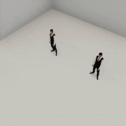
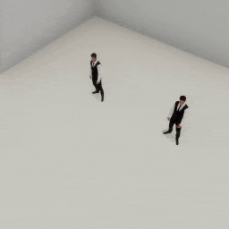
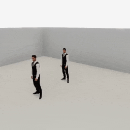
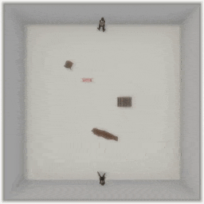

##### Replicants

# Multi-Replicant simulations

*For more information regarding multi-agent simulations, [read this](../multi_agent/overview.md).*

So far, the "simple action loop" of calling `c.communicate([])` until an action ends has been sufficient. This is because all of our controllers have assumed that there is only one agent in the scene, that the agent is a Replicant, and that we don't need to interrupt an action.

Actions and Replicants are designed for multi-agent simulations in which behavior can be interrupted. The "simple action loop" is useful when showcasing *other* aspects of the Replicant but it's *not necessary*.

## Example A: End when action(s) end

In this example, two replicants will walk forward. We've edited the "simple action loop" to check the states of *both* Replicants' actions. The loop ends when either of the Replicants end. In this case, we know that, because one Replicant needs to walk further than the other, that only the Replicant with the shorter distance will finish its action:

```python
from typing import Dict
from tdw.controller import Controller
from tdw.tdw_utils import TDWUtils
from tdw.add_ons.replicant import Replicant
from tdw.add_ons.third_person_camera import ThirdPersonCamera
from tdw.add_ons.image_capture import ImageCapture
from tdw.replicant.action_status import ActionStatus
from tdw.backend.paths import EXAMPLE_CONTROLLER_OUTPUT_PATH


class MultiReplicant(Controller):
    def __init__(self, replicants: Dict[int, Dict[str, float]],
                 port: int = 1071, check_version: bool = True, launch_build: bool = True):
        super().__init__(port=port, check_version=check_version, launch_build=launch_build)
        # Remember the Replicants. Key = ID. Value = Replicant.
        self.replicants: Dict[int, Replicant] = dict()
        for replicant_id in replicants:
            # Create a Replicant add-on. Set its ID and position.
            replicant = Replicant(replicant_id=replicant_id,
                                  position=replicants[replicant_id])
            # Append the add-on.
            self.add_ons.append(replicant)
            self.replicants[replicant_id] = replicant
        # Add a camera and enable image capture.
        # These aren't field (they don't start with self. ) because we don't need to reference them again.
        camera = ThirdPersonCamera(position={"x": -2.4, "y": 6, "z": 3.2},
                                   look_at={"x": 0, "y": 1, "z": 0},
                                   avatar_id="a")
        path = EXAMPLE_CONTROLLER_OUTPUT_PATH.joinpath("multi_replicant")
        print(f"Images will be saved to: {path}")
        capture = ImageCapture(avatar_ids=[camera.avatar_id], path=path)
        self.add_ons.extend([camera, capture])
        # Create an empty scene.
        self.communicate(TDWUtils.create_empty_room(12, 12))

    def do_actions(self) -> None:
        # Loop.
        done = False
        while not done:
            for replicant_id in self.replicants:
                # One of the actions ended. Stop.
                if self.replicants[replicant_id].action.status != ActionStatus.ongoing:
                    done = True
            # Continue the loop.
            if not done:
                self.communicate([])
        self.communicate([])


if __name__ == "__main__":
    c = MultiReplicant(replicants={0: {"x": 1.5, "y": 0, "z": -1},
                                   1: {"x": -1.5, "y": 0, "z": -1}})
    c.replicants[0].move_by(distance=2)
    c.replicants[1].move_by(distance=4)
    c.do_actions()
    print(c.replicants[0].action.status)
    print(c.replicants[1].action.status)
    c.communicate({"$type": "terminate"})
```

Result:



Output:

```
ActionStatus.success
ActionStatus.ongoing
```

We can easily revise the loop to end when *both* Replicants end their actions:

```python
from typing import Dict
from tdw.controller import Controller
from tdw.tdw_utils import TDWUtils
from tdw.add_ons.replicant import Replicant
from tdw.add_ons.third_person_camera import ThirdPersonCamera
from tdw.add_ons.image_capture import ImageCapture
from tdw.replicant.action_status import ActionStatus
from tdw.backend.paths import EXAMPLE_CONTROLLER_OUTPUT_PATH


class MultiReplicant(Controller):
    def __init__(self, replicants: Dict[int, Dict[str, float]],
                 port: int = 1071, check_version: bool = True, launch_build: bool = True):
        super().__init__(port=port, check_version=check_version, launch_build=launch_build)
        # Remember the Replicants. Key = ID. Value = Replicant.
        self.replicants: Dict[int, Replicant] = dict()
        for replicant_id in replicants:
            # Create a Replicant add-on. Set its ID and position.
            replicant = Replicant(replicant_id=replicant_id,
                                  position=replicants[replicant_id])
            # Append the add-on.
            self.add_ons.append(replicant)
            self.replicants[replicant_id] = replicant
        # Add a camera and enable image capture.
        # These aren't field (they don't start with self. ) because we don't need to reference them again.
        camera = ThirdPersonCamera(position={"x": -2.4, "y": 6, "z": 3.2},
                                   look_at={"x": 0, "y": 1, "z": 0},
                                   avatar_id="a")
        path = EXAMPLE_CONTROLLER_OUTPUT_PATH.joinpath("multi_replicant")
        print(f"Images will be saved to: {path}")
        capture = ImageCapture(avatar_ids=[camera.avatar_id], path=path)
        self.add_ons.extend([camera, capture])
        # Create an empty scene.
        self.communicate(TDWUtils.create_empty_room(12, 12))

    def do_actions(self) -> None:
        # Loop.
        done = False
        while not done:
            done = True
            for replicant_id in self.replicants:
                # One of the actions is ongoing. We're not done.
                if self.replicants[replicant_id].action.status == ActionStatus.ongoing:
                    done = False
            # Continue the loop.
            if not done:
                self.communicate([])
        self.communicate([])


if __name__ == "__main__":
    c = MultiReplicant(replicants={0: {"x": 1.5, "y": 0, "z": -1},
                                   1: {"x": -1.5, "y": 0, "z": -1}})
    c.replicants[0].move_by(distance=2)
    c.replicants[1].move_by(distance=4)
    c.do_actions()
    print(c.replicants[0].action.status)
    print(c.replicants[1].action.status)
    c.communicate({"$type": "terminate"})
```

Result:



Output:

```
ActionStatus.success
ActionStatus.success
```

## Example B: State machines

In this example,  there are two replicants:

1. `replicant_0` will [play a dance animation](animations.md) in a loop. We'll control the behavior of `replicant_0` by simply checking if the animation is done.
2. `replicant_1` will try to walk to the other side of the room. If it gets too close to `replicant_0`, it will back up and try again. We'll control the behavior of `replicant_1` with a state machine, similar to how we handled [custom actions in the previous document](custom_actions.md). Before calling `communicate([])` we'll evaluate the Replicant's state and its action status and decide what it should do next:

```python
from enum import Enum
from tdw.controller import Controller
from tdw.tdw_utils import TDWUtils
from tdw.add_ons.replicant import Replicant
from tdw.add_ons.third_person_camera import ThirdPersonCamera
from tdw.add_ons.image_capture import ImageCapture
from tdw.replicant.action_status import ActionStatus
from tdw.backend.paths import EXAMPLE_CONTROLLER_OUTPUT_PATH


class Replicant1State(Enum):
    moving_to = 1
    moving_backward = 2
    turning = 3
    moving_forward = 4


class MultiReplicantStateMachine(Controller):
    """
    Control the actions of multiple Replicants using a state machine.
    """

    def __init__(self, port: int = 1071, check_version: bool = True, launch_build: bool = True):
        super().__init__(port=port, check_version=check_version, launch_build=launch_build)
        self.replicant_0 = Replicant(replicant_id=0,
                                     position={"x": 0, "y": 0, "z": 0})
        self.replicant_1 = Replicant(replicant_id=1,
                                     position={"x": 0, "y": 0, "z": -2})
        camera = ThirdPersonCamera(position={"x": -4, "y": 3, "z": 3.2},
                                   look_at=self.replicant_1.replicant_id,
                                   avatar_id="a")
        path = EXAMPLE_CONTROLLER_OUTPUT_PATH.joinpath("multi_replicant_state_machine")
        print(f"Images will be saved to: {path}")
        capture = ImageCapture(avatar_ids=[camera.avatar_id], path=path)
        self.add_ons.extend([self.replicant_0, self.replicant_1, camera, capture])
        # Create an empty scene.
        self.communicate(TDWUtils.create_empty_room(12, 12))
        # Start animating.
        self.replicant_0_animation: str = "dancing_3"
        self.replicant_0.animate(animation=self.replicant_0_animation)
        # Set Replicant 1's target to be 6 meters in front of it.
        self.replicant_1_target = {"x": self.replicant_1.initial_position["x"],
                                   "y": self.replicant_1.initial_position["y"],
                                   "z": self.replicant_1.initial_position["z"] + 6}
        # Start moving.
        self.replicant_1.move_to(target=self.replicant_1_target)
        self.replicant_1_state = Replicant1State.moving_to

    def run(self) -> None:
        done = False
        while not done:
            # The animation ended. Play it again.
            if self.replicant_0.action.status != ActionStatus.ongoing:
                self.replicant_0.animate(animation=self.replicant_0_animation)

            # Handle Replicant 1's state machine.
            # Check if the action succeeded.
            if self.replicant_1.action.status == ActionStatus.success:
                # The Replicant finished moving forward. We're done.
                if self.replicant_1_state == Replicant1State.moving_to:
                    done = True
                # The Replicant finished moving backwards. Start turning.
                elif self.replicant_1_state == Replicant1State.moving_backward:
                    self.replicant_1_state = Replicant1State.turning
                    self.replicant_1.turn_by(35)
                # The Replicant finished turning. Start moving forward.
                elif self.replicant_1_state == Replicant1State.turning:
                    self.replicant_1.move_by(distance=0.75)
                    self.replicant_1_state = Replicant1State.moving_forward
                # The Replicant finished moving forward. Start moving to the target again.
                elif self.replicant_1_state == Replicant1State.moving_forward:
                    self.replicant_1.move_to(target=self.replicant_1_target)
                    self.replicant_1_state = Replicant1State.moving_to
            # The action ended in failure.
            elif self.replicant_1.action.status != ActionStatus.ongoing:
                # Start backing up.
                self.replicant_1_state = Replicant1State.moving_backward
                self.replicant_1.move_by(distance=-0.5)

            # Continue the loop.
            self.communicate([])
        self.communicate({"$type": "terminate"})


if __name__ == "__main__":
    c = MultiReplicantStateMachine()
    c.run()
```

Result:



## Example C: Multi-Replicant navigation

In this example, we're going to use the `Navigate` custom action that we wrote in the [previous document](navigation.md), but for multiple Replicants. We'll also take the simple multi-state system in Example B and apply it here.

If we handled all of the backing-up logic in the controller like we did in Example B, this example's code could get very complicated, especially if there were more than two Replicants. To solve this, we've moved a lot of code into a custom `Navigator` class, which is a subclass of `Replicant`. We've also introduced *two* state machines: One of them is handling the `Navigate` action and one of them is handling the `Navigator` Replicant. The `Navigate` class will evaluate its own `NavigatorState` within `on_send(resp)` to decide what to do next:

```python
from enum import Enum
from typing import List, Union, Dict, Optional
import numpy as np
from tdw.tdw_utils import TDWUtils
from tdw.controller import Controller
from tdw.output_data import OutputData, NavMeshPath
from tdw.add_ons.third_person_camera import ThirdPersonCamera
from tdw.add_ons.image_capture import ImageCapture
from tdw.backend.paths import EXAMPLE_CONTROLLER_OUTPUT_PATH
from tdw.add_ons.replicant import Replicant
from tdw.replicant.actions.action import Action
from tdw.replicant.actions.move_to import MoveTo
from tdw.replicant.action_status import ActionStatus
from tdw.replicant.replicant_static import ReplicantStatic
from tdw.replicant.replicant_dynamic import ReplicantDynamic
from tdw.replicant.collision_detection import CollisionDetection
from tdw.replicant.image_frequency import ImageFrequency


class NavigateState(Enum):
    getting_path = 1
    navigating = 2


class Navigate(Action):
    """
    Navigate using a NavMeshPath and multiple MoveTo child actions.
    """

    def __init__(self, target: Union[Dict[str, float], np.ndarray], collision_detection: CollisionDetection):
        super().__init__()
        # My collision detection. This will be used to instantiate MoveTo child actions.
        self.collision_detection: CollisionDetection = collision_detection
        # Convert the target position to a dictionary if needed.
        if isinstance(target, np.ndarray):
            self.target: Dict[str, float] = TDWUtils.array_to_vector3(target)
        elif isinstance(target, dict):
            self.target = target
        else:
            raise Exception(target)
        # We are getting the path.
        self.navigate_state: NavigateState = NavigateState.getting_path
        # My path.
        self.path: np.ndarray = np.zeros(shape=0)
        # The index of the current waypoint in the path. The point at index=0 is the current position.
        self.path_index: int = 1
        # My MoveTo action.
        self.move_to: Optional[MoveTo] = None
        # The ImageFrequency. This will be used to instantiate MoveTo child actions.
        # This will be set in get_initialization_commands()
        self.image_frequency: ImageFrequency = ImageFrequency.once
        # Don't try to detect obstacles while pathfinding.
        self.original_avoid: bool = self.collision_detection.avoid
        self.collision_detection.avoid = False

    def get_initialization_commands(self, resp: List[bytes], static: ReplicantStatic, dynamic: ReplicantDynamic,
                                    image_frequency: ImageFrequency) -> List[dict]:
        # Remember the ImageFrequency because we'll need it to instantiate MoveTo child actions.
        self.image_frequency = image_frequency
        # Get the usual initialization commands.
        commands = super().get_initialization_commands(resp=resp, static=static, dynamic=dynamic,
                                                       image_frequency=image_frequency)
        # Request a NavMeshPath. Set the path's ID to the Replicant's ID so we know whose path this is.
        commands.append({"$type": "send_nav_mesh_path",
                         "origin": TDWUtils.array_to_vector3(dynamic.transform.position),
                         "destination": self.target,
                         "id": static.replicant_id})
        return commands

    def get_ongoing_commands(self, resp: List[bytes], static: ReplicantStatic, dynamic: ReplicantDynamic) -> List[dict]:
        # Get my path.
        if self.navigate_state == NavigateState.getting_path:
            # We are now navigating.
            self.navigate_state = NavigateState.navigating
            # Parse the output data.
            for i in range(len(resp) - 1):
                r_id = OutputData.get_data_type_id(resp[i])
                # Got NavMeshPath data.
                if r_id == "path":
                    path = NavMeshPath(resp[i])
                    # This is my path.
                    if path.get_id() == static.replicant_id:
                        # We failed to pathfind to this destination.
                        if path.get_state() != "complete":
                            self.status = ActionStatus.failed_to_move
                            return []
                        # This is a valid path.
                        else:
                            self.path = path.get_path()
                            # Start moving.
                            return self.set_move_to(resp=resp, static=static, dynamic=dynamic)
        # Continue to navigate.
        else:
            # Get the child action's ongoing commands. This will also update the child action's status.
            commands = self.move_to.get_ongoing_commands(resp=resp, static=static, dynamic=dynamic)
            # The child action ended in success. Check if this is the last waypoint.
            if self.move_to.status == ActionStatus.success:
                # We arrived at the destination.
                if self.path_index >= self.path.shape[0]:
                    self.status = ActionStatus.success
                    return commands
                # Move to the next waypoint.
                else:
                    # End the current move_to action.
                    commands.extend(self.move_to.get_end_commands(resp=resp, static=static, dynamic=dynamic,
                                                                  image_frequency=self.image_frequency))
                    # Start a new move_to action. Append the new child action's initialization commands.
                    commands.extend(self.set_move_to(resp=resp, static=static, dynamic=dynamic))
            # The action ended in failure.
            elif self.move_to.status != ActionStatus.ongoing:
                self.status = self.move_to.status
            return commands

    def get_end_commands(self, resp: List[bytes], static: ReplicantStatic, dynamic: ReplicantDynamic,
                         image_frequency: ImageFrequency) -> List[dict]:
        # Reset obstacle avoidance.
        self.collision_detection.avoid = self.original_avoid
        # Get end commands.
        if self.move_to is not None:
            return self.move_to.get_end_commands(resp=resp, static=static, dynamic=dynamic,
                                                 image_frequency=image_frequency)
        else:
            return super().get_end_commands(resp=resp, static=static, dynamic=dynamic,
                                            image_frequency=image_frequency)

    def set_move_to(self, resp: List[bytes], static: ReplicantStatic, dynamic: ReplicantDynamic) -> List[dict]:
        # Set the action.
        self.move_to = MoveTo(target=self.path[self.path_index],
                              collision_detection=self.collision_detection,
                              reset_arms=True,
                              reset_arms_duration=0.25,
                              arrived_at=0.1,
                              max_walk_cycles=100,
                              bounds_position="center",
                              previous=None)
        # Update the path index
        self.path_index += 1
        # Return the initialization commands.
        return self.move_to.get_initialization_commands(resp=resp, static=static, dynamic=dynamic,
                                                        image_frequency=self.image_frequency)


class NavigatorState(Enum):
    navigating = 1
    moving_backward = 2
    turning = 3
    moving_forward = 4
    done = 5


class Navigator(Replicant):
    """
    A Replicant trying to navigate to a target position.
    """

    def __init__(self, target: Dict[str, float], replicant_id: int = 0, position: Dict[str, float] = None, rotation: Dict[str, float] = None):
        super().__init__(replicant_id=replicant_id, position=position, rotation=rotation)
        # Set the initial target, the initial state, and the action.
        self.target = target
        self.navigator_state: NavigatorState = NavigatorState.navigating
        self.navigate(target=self.target)
        # We don't care if the previous action ended in a collision.
        self.collision_detection.previous_was_same = False

    def navigate(self, target: Union[Dict[str, float], np.ndarray]) -> None:
        self.action = Navigate(target=target, collision_detection=self.collision_detection)

    def on_send(self, resp: List[bytes]) -> None:
        # Process the Replicant's action, commands, etc. as normal.
        super().on_send(resp=resp)
        # The action is ongoing. Do nothing extra.
        if self.action.status == ActionStatus.ongoing:
            return
        # The action succeeded. Check if we're done navigating.
        elif self.action.status == ActionStatus.success:
            # We're done!
            if self.navigator_state == NavigatorState.navigating:
                self.navigator_state = NavigatorState.done
            # The Replicant finished moving backwards. Start turning.
            elif self.navigator_state == NavigatorState.moving_backward:
                self.navigator_state = NavigatorState.turning
                self.turn_by(35)
            # The Replicant finished turning. Start moving forward.
            elif self.navigator_state == NavigatorState.turning:
                self.move_by(distance=0.75)
                self.navigator_state = NavigatorState.moving_forward
            # The Replicant finished moving forward. Start navigating to the target again.
            elif self.navigator_state == NavigatorState.moving_forward:
                self.navigate(target=self.target)
                self.navigator_state = NavigatorState.navigating
        # The action ended in failure. Start backing up.
        else:
            self.navigator_state = NavigatorState.moving_backward
            self.move_by(distance=-0.5)


class MultiNavigate(Controller):
    """
    An example of how to utilize the NavMesh to pathfind in a multi-Replicant simulation.
    """

    def __init__(self, port: int = 1071, check_version: bool = True, launch_build: bool = True):
        super().__init__(port=port, check_version=check_version, launch_build=launch_build)
        self.replicant_0 = Navigator(replicant_id=0,
                                     position={"x": 0, "y": 0, "z": -5},
                                     target={"x": 0, "y": 0, "z": 4})
        self.replicant_1 = Navigator(replicant_id=1,
                                     position={"x": 0, "y": 0, "z": 5},
                                     target={"x": 0, "y": 0, "z": -4})
        self.camera: ThirdPersonCamera = ThirdPersonCamera(position={"x": 0, "y": 13.8, "z": 0},
                                                           look_at={"x": 0, "y": 0, "z": 0},
                                                           avatar_id="a")
        path = EXAMPLE_CONTROLLER_OUTPUT_PATH.joinpath("multi_replicant_navigate")
        print(f"Images will be saved to: {path}")
        self.capture: ImageCapture = ImageCapture(avatar_ids=["a"], path=path)
        self.add_ons.extend([self.replicant_0, self.replicant_1, self.camera, self.capture])
        # Set the object IDs.
        self.trunk_id = Controller.get_unique_id()
        self.chair_id = Controller.get_unique_id()
        self.table_id = Controller.get_unique_id()
        self.rocking_horse_id = Controller.get_unique_id()

    def init_scene(self):
        self.communicate([{"$type": "load_scene",
                           "scene_name": "ProcGenScene"},
                          TDWUtils.create_empty_room(12, 12),
                          {"$type": "bake_nav_mesh"},
                          Controller.get_add_object(model_name="trunck",
                                                    object_id=self.trunk_id,
                                                    position={"x": 1.5, "y": 0, "z": 0}),
                          {"$type": "make_nav_mesh_obstacle",
                           "id": self.trunk_id,
                           "carve_type": "stationary"},
                          Controller.get_add_object(model_name="chair_billiani_doll",
                                                    object_id=self.chair_id,
                                                    position={"x": -2.25, "y": 0, "z": 2.5},
                                                    rotation={"x": 0, "y": 20, "z": 0}),
                          {"$type": "make_nav_mesh_obstacle",
                           "id": self.chair_id,
                           "carve_type": "stationary"},
                          Controller.get_add_object(model_name="live_edge_coffee_table",
                                                    object_id=self.table_id,
                                                    position={"x": 0.2, "y": 0, "z": -2.25},
                                                    rotation={"x": 0, "y": 20, "z": 0}),
                          {"$type": "make_nav_mesh_obstacle",
                           "id": self.table_id,
                           "carve_type": "stationary"},
                          Controller.get_add_object(model_name="rh10",
                                                    object_id=self.rocking_horse_id,
                                                    position={"x": -1, "y": 0, "z": 1.5}),
                          {"$type": "make_nav_mesh_obstacle",
                           "id": self.rocking_horse_id,
                           "carve_type": "stationary"}])

    def run(self) -> None:
        self.init_scene()
        # Wait until both Replicants are done navigating.
        while self.replicant_0.navigator_state != NavigatorState.done or self.replicant_1.navigator_state != NavigatorState.done:
            self.communicate([])
        self.communicate({"$type": "terminate"})


if __name__ == "__main__":
    c = MultiNavigate()
    c.run()
```

Result:



**Remember: the *specific* the way this behavior has been implemented is optional.** You could do the exact same thing in any of the following ways:

- Handle everything in the controller, without custom actions or Replicant subclasses.
- Handle everything in the controller without a `Replicant` add-on, using only low-level commands.
- Handle `Navigate` as a custom action but don't use a custom Replicant subclass.
- Handle everything in a Replicant subclass within `on_send`, without a custom `Navigate` action.
- Create both a `Navigate` action and a `Yield` action (the latter of which encapsulates the `moving_backward`, `turning`, and `moving_forward` states).

## Example D: Carry a Couch

In this example, two Replicants will move to opposite ends of a couch, lift it, carry it, and drop it. As we've already learned, [only one Replicant can grasp an object at a time](grasp_drop.md), so a lot of these motions *look* like cooperation without actually *being* cooperation.

Because we want to coordinate most of the movements of these Replicants, we're going to use a NavMesh but we don't need or want a `Navigate` action; we'll handle the multiple `move_to(target)` actions manually.

While navigating, the controller checks the Replicants' action statuses asynchronously and waits for both to finish. For the rest of the actions, we want the Replicants to appear to work in tandem so we'll wait for both of their actions to finish before proceeding:

```python
import numpy as np
from tdw.controller import Controller
from tdw.tdw_utils import TDWUtils
from tdw.output_data import OutputData, NavMeshPath, Bounds
from tdw.add_ons.third_person_camera import ThirdPersonCamera
from tdw.add_ons.image_capture import ImageCapture
from tdw.add_ons.replicant import Replicant
from tdw.replicant.arm import Arm
from tdw.replicant.action_status import ActionStatus
from tdw.backend.paths import EXAMPLE_CONTROLLER_OUTPUT_PATH


class CarryCouch(Controller):
    """
    Both Replicants will approach opposite sides of the sofa.
    They will reach to lift up the sofa (although only one Replicant is grasp), carry the sofa, and put it down again.

    In some cases, the Replicants will act asynchronously.
    In some cases, the Replicants will wait for each other to finish their respective actions.
    """

    def __init__(self, port: int = 1071, check_version: bool = True, launch_build: bool = True):
        super().__init__(port=port, check_version=check_version, launch_build=launch_build)
        # Set the object ID.
        self.object_id: int = Controller.get_unique_id()
        # Set the Replicants.
        self.replicant_0: Replicant = Replicant(replicant_id=0, position={"x": -1, "y": 0, "z": -1})
        self.replicant_1: Replicant = Replicant(replicant_id=1, position={"x": 1, "y": 0, "z": -1})
        # Add a camera and enable image capture.
        camera = ThirdPersonCamera(position={"x": 0, "y": 2.2, "z": -2.61},
                                   avatar_id="a",
                                   look_at=self.object_id)
        path = EXAMPLE_CONTROLLER_OUTPUT_PATH.joinpath("replicant_carry_couch")
        print(f"Images will be saved to: {path}")
        capture = ImageCapture(avatar_ids=["a"], path=path)
        self.add_ons.extend([self.replicant_0, self.replicant_1, camera, capture])
        # Initialize the scene.
        commands = [TDWUtils.create_empty_room(12, 12),
                    {"$type": "bake_nav_mesh"}]
        commands.extend(Controller.get_add_physics_object(model_name="arflex_strips_sofa",
                                                          object_id=self.object_id,
                                                          position={"x": 0, "y": 0, "z": 1}))
        commands.append({"$type": "make_nav_mesh_obstacle",
                         "id": self.object_id,
                         "carve_type": "stationary"})
        self.communicate(commands)

    def carry_sofa(self) -> None:
        """
        A "meta-action" directing both Replicants to "carry" a sofa.
        """

        # Get a response from the build.
        resp = self.communicate([])
        # Get the left and right sides of the sofa.
        left = np.zeros(shape=3)
        right = np.zeros(shape=3)
        center = np.zeros(shape=3)
        for i in range(len(resp) - 1):
            r_id = OutputData.get_data_type_id(resp[i])
            if r_id == "boun":
                bounds = Bounds(resp[i])
                for j in range(bounds.get_num()):
                    if bounds.get_id(j) == self.object_id:
                        left = bounds.get_left(j)
                        right = bounds.get_right(j)
                        center = bounds.get_center(j)
                        break
                break
        # Set the height of each bounds point to 0.
        left[1] = 0
        right[1] = 0
        center[1] = 0
        # Offset the bounds positions.
        v = left - center
        v = v / np.linalg.norm(v)
        left += v * 0.25
        v = right - center
        v = v / np.linalg.norm(v)
        right += v * 0.25
        # Set target positions for each.
        distance_left = np.linalg.norm(self.replicant_0.dynamic.transform.position - left)
        distance_right = np.linalg.norm(self.replicant_0.dynamic.transform.position - right)
        if distance_left < distance_right:
            replicant_0_target = left
            replicant_1_target = right
        else:
            replicant_0_target = right
            replicant_1_target = left
        # Get paths to each target.
        resp = self.communicate([{"$type": "send_nav_mesh_path",
                                  "origin": TDWUtils.array_to_vector3(self.replicant_0.dynamic.transform.position),
                                  "destination": TDWUtils.array_to_vector3(replicant_0_target),
                                  "id": self.replicant_0.replicant_id},
                                 {"$type": "send_nav_mesh_path",
                                  "origin": TDWUtils.array_to_vector3(self.replicant_1.dynamic.transform.position),
                                  "destination": TDWUtils.array_to_vector3(replicant_1_target),
                                  "id": self.replicant_1.replicant_id}])
        # Determine which Replicant requested this path.
        replicant_0_path = np.zeros(shape=0)
        replicant_1_path = np.zeros(shape=0)
        for i in range(len(resp) - 1):
            r_id = OutputData.get_data_type_id(resp[i])
            if r_id == "path":
                nav_mesh_path = NavMeshPath(resp[i])
                path_id = nav_mesh_path.get_id()
                if path_id == self.replicant_0.replicant_id:
                    replicant_0_path = nav_mesh_path.get_path()
                elif path_id == self.replicant_1.replicant_id:
                    replicant_1_path = nav_mesh_path.get_path()
        # These are the indices of the current waypoint in each path.
        replicant_0_path_index: int = 1
        replicant_1_path_index: int = 1
        # Start moving to each waypoint.
        self.replicant_0.collision_detection.avoid = False
        self.replicant_1.collision_detection.avoid = False
        self.replicant_0.collision_detection.objects = False
        self.replicant_1.collision_detection.objects = False
        self.replicant_0.move_to(target=replicant_0_path[replicant_0_path_index])
        self.replicant_1.move_to(target=replicant_1_path[replicant_1_path_index])
        # Wait until the Replicants stop pathfinding.
        done = False
        while not done:
            # Check if both Replicants are done navigating.
            replicant_0_done = False
            if self.replicant_0.action.status != ActionStatus.ongoing:
                replicant_0_path_index += 1
                if replicant_0_path_index >= replicant_0_path.shape[0]:
                    replicant_0_done = True
                else:
                    self.replicant_0.move_to(replicant_0_path[replicant_0_path_index])
            replicant_1_done = False
            if self.replicant_1.action.status != ActionStatus.ongoing:
                replicant_1_path_index += 1
                if replicant_1_path_index >= replicant_1_path.shape[0]:
                    replicant_1_done = True
                else:
                    self.replicant_1.move_to(replicant_1_path[replicant_1_path_index])
            done = replicant_0_done and replicant_1_done
            # Continue the loop.
            self.communicate([])
        # Look at the sofa's center.
        self.replicant_0.turn_to(target=center)
        self.replicant_1.turn_to(target=center)
        self.do_actions()
        # Reach for the couch.
        self.replicant_0.reach_for(target=self.object_id, arm=[Arm.left, Arm.right])
        self.replicant_1.reach_for(target=self.object_id, arm=[Arm.left, Arm.right])
        self.do_actions()
        # Only the first Replicant grasps the couch.
        self.replicant_0.grasp(target=self.object_id, arm=Arm.left, angle=None)
        self.do_replicant_0_action()
        # Everyone raises their hands.
        self.reach_for_height(y=0.8)
        # Do the actions.
        self.do_actions()
        # The first Replicant walks backwards. The second Replicant walks forwards.
        self.replicant_0.move_by(distance=-2,
                                 reset_arms=False)
        self.replicant_1.move_by(distance=2,
                                 reset_arms=False)
        self.do_actions()
        # Lower the sofa.
        self.reach_for_height(y=0.1)
        # Drop the sofa.
        self.replicant_0.drop(arm=Arm.left)
        self.do_replicant_0_action()
        # Reset the arms.
        self.replicant_0.reset_arm(arm=[Arm.left, Arm.right])
        self.replicant_1.reset_arm(arm=[Arm.left, Arm.right])
        self.do_actions()

    def do_actions(self) -> None:
        """
        Wait for both Replicants' actions to end.
        """

        while self.replicant_0.action.status == ActionStatus.ongoing or self.replicant_1.action.status == ActionStatus.ongoing:
            self.communicate([])
        self.communicate([])

    def do_replicant_0_action(self) -> None:
        """
        Wait for only the first Replicant's action to end.
        """

        while self.replicant_0.action.status == ActionStatus.ongoing:
            self.communicate([])
        self.communicate([])

    def reach_for_height(self, y: float) -> None:
        """
        Tell both Replicants to reach for positions relative to their left hands.

        :param y: Add this y value to the target position.
        """

        for replicant in [self.replicant_0, self.replicant_1]:
            # Get the position of the left hand.
            target = TDWUtils.array_to_vector3(replicant.dynamic.body_parts[replicant.static.hands[Arm.left]].position)
            # Raise the target's height.
            target["y"] = y
            # The left hand reaches for the target and the right hand follows.
            replicant.reach_for(target=target,
                                arm=Arm.left,
                                offhand_follows=True)
        # Both Replicants do their actions.
        self.do_actions()


if __name__ == "__main__":
    c = CarryCouch()
    c.carry_sofa()
    c.communicate({"$type": "terminate"})
```

Result:


***

**Next: [Reset](reset.md)**

[Return to the README](../../../README.md)

***

Example controllers:

- [multi_replicant.py](https://github.com/threedworld-mit/tdw/blob/master/Python/example_controllers/replicant/multi_replicant.py) A minimal multi-Replicant simulation.
- [multi_replicant_state_machine.py](https://github.com/threedworld-mit/tdw/blob/master/Python/example_controllers/replicant/multi_replicant_state_machine.py) Control the actions of multiple Replicants using a state machine.
- [multi_navigate.py](https://github.com/threedworld-mit/tdw/blob/master/Python/example_controllers/replicant/multi_navigate.py) Multiple Replicants navigate using custom actions and state machines.
- [carry_couch.py](https://github.com/threedworld-mit/tdw/blob/master/Python/example_controllers/replicant/carry_couch.py) Two Replicants appear to carry a couch together.

Command API:

- [`bake_nav_mesh`](../../api/command_api.md#bake_nav_mesh)
- [`make_nav_mesh_obstacle`](../../api/command_api.md#make_nav_mesh_obstacle)
- [`send_nav_mesh_path`](../../api/command_api.md#send_nav_mesh_path)

Output Data API:

- [`NavMeshPath`](../../api/output_data.md#NavMeshPath)

Python API:

- [`Replicant`](../../python/add_ons/replicant.md)
- [`Action`](../../python/replicant/actions/action.md)