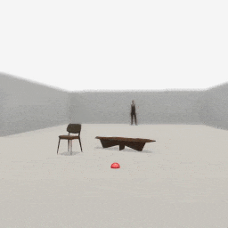
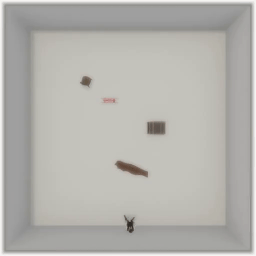

##### Replicants

# Navigation

*For more information regarding navigation in TDW, [read this.](../navigation/overview.md)*

Like all other [agents](../agents/overview.md), the Replicant doesn't have a built-in navigation system. In most cases, the best way to handle navigation is to train a model for navigation planning using the Replicant's [images, depth maps, and other output data](output_data.md).

This document explains two simple ways to handle basic navigation.

### Basic obstacle avoidance

This controller has a very basic system for handling obstacles. If the Replicant [detects an obstacle while moving](movement.md), the controller tells the Replicant to back up, turn by 45 degrees, and try moving again:

```python
from tdw.controller import Controller
from tdw.tdw_utils import TDWUtils
from tdw.add_ons.replicant import Replicant
from tdw.add_ons.third_person_camera import ThirdPersonCamera
from tdw.add_ons.image_capture import ImageCapture
from tdw.replicant.action_status import ActionStatus
from tdw.replicant.image_frequency import ImageFrequency
from tdw.backend.paths import EXAMPLE_CONTROLLER_OUTPUT_PATH


class ObstacleAvoidance(Controller):
    """
    A very simple method for navigating around obstacles.
    """

    def __init__(self, port: int = 1071, check_version: bool = True, launch_build: bool = True):
        super().__init__(port=port, check_version=check_version, launch_build=launch_build)
        # Set the target object's ID here so it can be referenced from more than one function.
        self.target_id = Controller.get_unique_id()
        # Set the replicant here so that it can be referenced from more than one function.
        self.replicant = Replicant(position={"x": 0, "y": 0, "z": -8},
                                   image_frequency=ImageFrequency.never)

    def run(self) -> None:
        # Enable image capture from a third-person camera.
        camera = ThirdPersonCamera(position={"x": -0.5, "y": 1.175, "z": 8.45},
                                   look_at={"x": 0.5, "y": 1, "z": 0},
                                   avatar_id="a")
        path = EXAMPLE_CONTROLLER_OUTPUT_PATH.joinpath("replicant_obstacle_avoidance")
        print(f"Images will be saved to: {path}")
        capture = ImageCapture(avatar_ids=[camera.avatar_id], path=path)
        self.add_ons.extend([self.replicant, camera, capture])
        # Create an empty room.
        commands = [TDWUtils.create_empty_room(12, 20)]
        # Add some objects.
        commands.extend(Controller.get_add_physics_object(model_name="chair_billiani_doll",
                                                          object_id=Controller.get_unique_id(),
                                                          position={"x": 1.35, "y": 0, "z": 2.75},
                                                          rotation={"x": 0, "y": 20, "z": 0},
                                                          library="models_core.json"))
        commands.extend(Controller.get_add_physics_object(model_name="live_edge_coffee_table",
                                                          object_id=Controller.get_unique_id(),
                                                          position={"x": 0, "y": 0, "z": 2},
                                                          rotation={"x": 0, "y": 20, "z": 0},
                                                          library="models_core.json"))
        # Add a ball.
        ball_id = Controller.get_unique_id()
        commands.extend(Controller.get_add_physics_object(model_name="prim_sphere",
                                                          object_id=ball_id,
                                                          position={"x": 5, "y": 0, "z": 3.5},
                                                          rotation={"x": 0, "y": 0, "z": 0},
                                                          scale_factor={"x": 0.2, "y": 0.2, "z": 0.2},
                                                          kinematic=True,
                                                          gravity=False,
                                                          library="models_special.json"))
        # Add the target object.
        commands.extend(Controller.get_add_physics_object(model_name="prim_sphere",
                                                          object_id=self.target_id,
                                                          position={"x": 0, "y": 0, "z": 4.0},
                                                          rotation={"x": 0, "y": 0, "z": 0},
                                                          scale_factor={"x": 0.2, "y": 0.2, "z": 0.2},
                                                          kinematic=True,
                                                          gravity=False,
                                                          library="models_special.json"))
        # Send the commands.
        self.communicate(commands)
        # Exclude the balls so they do not act as obstacles and trigger the avoidance mechanisms.
        self.replicant.collision_detection.exclude_objects = [self.target_id, ball_id]
        # Start to navigate.
        done = False
        while not done:
            # Move to the target.
            self.replicant.move_to(target=self.target_id)
            self.do_action()
            # We arrived at the target.
            if self.replicant.action.status == ActionStatus.success:
                done = True
            # Take evasive action.
            else:
                self.replicant.move_by(distance=-0.5)
                self.do_action()
                self.replicant.turn_by(angle=45.0)
                self.do_action()
                self.replicant.move_by(distance=3.0)
                self.do_action()
        self.communicate({"$type": "terminate"})

    def do_action(self) -> None:
        """
        Call `communicate([])` until the Replicant's action is done.
        """

        while self.replicant.action.status == ActionStatus.ongoing:
            self.communicate([])
        self.communicate([])


if __name__ == "__main__":
    ObstacleAvoidance().run()
```

Result:



### NavMesh pathfinding

A Replicant can follow a [NavMesh path](../navigation/nav_mesh.md). Send [`bake_nav_mesh`](../../api/command_api.md#bake_nav_mesh) and [`make_nav_mesh_obstacle`](../../api/command_api.md#make_nav_mesh_obstacle) to initialize the NavMesh. Send [`send_nav_mesh_path`](../../api/command_api.md#send_nav_mesh_path) to received [`NavMeshPath`](../../api/output_data.md#NavMeshPath) output data. Then, call [`self.replicant.move_to(target)`](movement.md) for every waypoint on the path. 

In this example controller, navigation is handled in the `navigate(destination)` function. You can repeatedly call this function to set a new destination. The function returns True if the Replicant arrived at the destination. **This isn't the best way to handle NavMesh pathfinding.** The main problem is that it won't be possible to have multiple Replicants navigating around the scene. **The next two documents in this tutorial will show increasingly better implementations of this controller.**

```python
from typing import Dict
import numpy as np
from tdw.tdw_utils import TDWUtils
from tdw.controller import Controller
from tdw.output_data import OutputData, NavMeshPath
from tdw.add_ons.third_person_camera import ThirdPersonCamera
from tdw.add_ons.image_capture import ImageCapture
from tdw.backend.paths import EXAMPLE_CONTROLLER_OUTPUT_PATH
from tdw.add_ons.replicant import Replicant
from tdw.replicant.action_status import ActionStatus


class Pathfind(Controller):
    """
    An example of how to utilize the NavMesh to pathfind.
    """

    def __init__(self, port: int = 1071, check_version: bool = True, launch_build: bool = True):
        super().__init__(port=port, check_version=check_version, launch_build=launch_build)
        self.replicant = Replicant(position={"x": 0.1, "y": 0, "z": -5})
        self.camera: ThirdPersonCamera = ThirdPersonCamera(position={"x": 0, "y": 13.8, "z": 0},
                                                           look_at={"x": 0, "y": 0, "z": 0},
                                                           avatar_id="a")
        path = EXAMPLE_CONTROLLER_OUTPUT_PATH.joinpath("replicant_pathfind")
        print(f"Images will be saved to: {path}")
        self.capture: ImageCapture = ImageCapture(avatar_ids=["a"], path=path)
        self.add_ons.extend([self.replicant, self.camera, self.capture])
        # Set the object IDs.
        self.trunk_id = Controller.get_unique_id()
        self.chair_id = Controller.get_unique_id()
        self.table_id = Controller.get_unique_id()
        self.rocking_horse_id = Controller.get_unique_id()

    def init_scene(self):
        # Load the scene.
        # Bake the NavMesh.
        # Add objects to the scene and add NavMesh obstacles.
        self.communicate([{"$type": "load_scene",
                           "scene_name": "ProcGenScene"},
                          TDWUtils.create_empty_room(12, 12),
                          {"$type": "bake_nav_mesh"},
                          Controller.get_add_object(model_name="trunck",
                                                    object_id=self.trunk_id,
                                                    position={"x": 1.5, "y": 0, "z": 0}),
                          {"$type": "make_nav_mesh_obstacle",
                           "id": self.trunk_id,
                           "carve_type": "stationary"},
                          Controller.get_add_object(model_name="chair_billiani_doll",
                                                    object_id=self.chair_id,
                                                    position={"x": -2.25, "y": 0, "z": 2.5},
                                                    rotation={"x": 0, "y": 20, "z": 0}),
                          {"$type": "make_nav_mesh_obstacle",
                           "id": self.chair_id,
                           "carve_type": "stationary"},
                          Controller.get_add_object(model_name="live_edge_coffee_table",
                                                    object_id=self.table_id,
                                                    position={"x": 0.2, "y": 0, "z": -2.25},
                                                    rotation={"x": 0, "y": 20, "z": 0}),
                          {"$type": "make_nav_mesh_obstacle",
                           "id": self.table_id,
                           "carve_type": "stationary"},
                          Controller.get_add_object(model_name="rh10",
                                                    object_id=self.rocking_horse_id,
                                                    position={"x": -1, "y": 0, "z": 1.5}),
                          {"$type": "make_nav_mesh_obstacle",
                           "id": self.rocking_horse_id,
                           "carve_type": "stationary"}])

    def navigate(self, destination: Dict[str, float]) -> bool:
        # Don't handle collision detection (it will interfere with NavMesh pathfinding).
        self.replicant.collision_detection.avoid = False
        # The origin of the path is the current position of the Replicant.
        origin = TDWUtils.array_to_vector3(self.replicant.dynamic.transform.position)
        # Request a NavMeshPath.
        resp = self.communicate({"$type": "send_nav_mesh_path",
                                 "origin": origin,
                                 "destination": destination,
                                 "id": self.replicant.replicant_id})
        # Parse the output data to get the path.
        path: np.ndarray = np.zeros(shape=1)
        for i in range(len(resp) - 1):
            r_id = OutputData.get_data_type_id(resp[i])
            if r_id == "path":
                nav_mesh_path = NavMeshPath(resp[i])
                # This path belongs to the Replicant (this is useful when there is more than one agent).
                if nav_mesh_path.get_id() == self.replicant.replicant_id:
                    # We failed to get a valid path.
                    if nav_mesh_path.get_state() != "complete":
                        self.replicant.collision_detection.avoid = True
                        return False
                    # Get the path.
                    path = nav_mesh_path.get_path()
                    # Break because we have the data we need.
                    break
        # Move to each waypoint. Ignore the first waypoint because it's the position of the Replicant.
        for i in range(1, path.shape[0]):
            target = TDWUtils.array_to_vector3(path[i])
            target["y"] = 0
            # Move to the waypoint.
            self.replicant.move_to(target=target)
            # Do the action.
            self.do_action()
            # If the Replicant failed to reach the waypoint, end here.
            if self.replicant.action.status != ActionStatus.success:
                self.replicant.collision_detection.avoid = True
                return False
        # We arrived at the destination. Re-enable obstacle detection and return True.
        self.replicant.collision_detection.avoid = True
        return True

    def do_action(self) -> None:
        while self.replicant.action.status == ActionStatus.ongoing:
            self.communicate([])
        self.communicate([])

    def end(self) -> None:
        self.communicate({"$type": "terminate"})


if __name__ == "__main__":
    c = Pathfind()
    # Initialize the scene.
    c.init_scene()
    # Navigate to a destination.
    success = c.navigate(destination={"x": 0, "y": 0, "z": 4})
    print(success)
    # End the simulation.
    c.end()
```

Result:



***

**Next: [Custom actions](custom_actions.md)**

[Return to the README](../../../README.md)

***

Example controllers:

- [obstacle_avoidance.py](https://github.com/threedworld-mit/tdw/blob/master/Python/example_controllers/replicant/obstacle_avoidance.py) A very simple method for navigating around obstacles.
- [pathfind.py](https://github.com/threedworld-mit/tdw/blob/master/Python/example_controllers/replicant/pathfind.py) An example of how to utilize the NavMesh to pathfind.

Command API:

- [`bake_nav_mesh`](../../api/command_api.md#bake_nav_mesh)
- [`make_nav_mesh_obstacle`](../../api/command_api.md#make_nav_mesh_obstacle)
- [`send_nav_mesh_path`](../../api/command_api.md#send_nav_mesh_path)

Output Data API:

- [`NavMeshPath`](../../api/output_data.md#NavMeshPath)

Python API:

- [`Replicant`](../../python/add_ons/replicant.md)