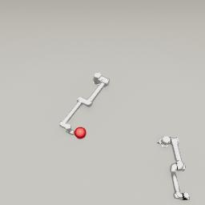

##### Robotics

# Add multiple robots

Adding multiple robots to TDW for multi-agent simulations is as simple as adding two or more `Robot` add-ons:

```python
from tdw.controller import Controller
from tdw.tdw_utils import TDWUtils
from tdw.add_ons.robot import Robot
from tdw.add_ons.third_person_camera import ThirdPersonCamera
from tdw.add_ons.image_capture import ImageCapture
from tdw.backend.paths import EXAMPLE_CONTROLLER_OUTPUT_PATH

c = Controller()
# Add two robots, a camera, and image capture.
robot_0 = Robot(name="ur5",
                robot_id=c.get_unique_id(),
                position={"x": -1, "y": 0, "z": 0.8})
robot_1 = Robot(name="ur10",
                robot_id=c.get_unique_id(),
                position={"x": 0.1, "y": 0, "z": -0.5},
                rotation={"x": 0, "y": 30, "z": 0})
camera = ThirdPersonCamera(avatar_id="a",
                           position={"x": 0, "y": 3.05, "z": 2.1},
                           look_at={"x": 0, "y": 0, "z": 0})
path = EXAMPLE_CONTROLLER_OUTPUT_PATH.joinpath("multi_robot")
print(f"Images will be saved to: {path}")
capture = ImageCapture(avatar_ids=["a"], path=path)
c.add_ons.extend([robot_0, robot_1, camera, capture])

object_id = c.get_unique_id()
commands = [TDWUtils.create_empty_room(12, 12)]
commands.extend(c.get_add_physics_object(object_id=object_id,
                                         model_name="prim_sphere",
                                         library="models_special.json",
                                         position={"x": 0.36, "y": 0, "z": 0.67},
                                         scale_factor={"x": 0.2, "y": 0.2, "z": 0.2},
                                         default_physics_values=False,
                                         mass=5))
c.communicate(commands)

# Wait for the joints to move to their initial positions.
while robot_0.joints_are_moving() or robot_1.joints_are_moving():
    c.communicate([])
```

Result:



## Subclasses and state machines

For the sake of multi-agent simulations, you might want to create subclasses of `Robot`. This isn't strictly necessary but you may find it a useful way to organize your code.

It can also be useful to use **state machines** to manage basic AI behavior. State machines typically use enum values to determine whether which discrete *state* the agent is currently in and therefore how to plan the current action.

**It is not necessary to use state machines for multi-agent simulations in TDW.** For machine learning, state machines might be too simple to be practical. However, it may still be useful to organize your code into subclasses with functions defining actions.

This example sets up a basic state machine enum and a `SwingRobot` subclass of `Robot`:

```python
from enum import Enum
from typing import Dict, Union
from tdw.librarian import RobotLibrarian, RobotRecord
from tdw.add_ons.robot import Robot


class State(Enum):
    idle = 1  # The robot isn't moving.
    swinging = 2  # The robot is rotating its shoulder.
    resetting = 4  # The robot is resetting to its neutral position.


class SwingRobot(Robot):
    def __init__(self, name: str, target_id: int, swing_direction: int, robot_id: int = 0, 
                 position: Dict[str, float] = None, rotation: Dict[str, float] = None,
                 source: Union[RobotLibrarian, RobotRecord, str] = None):
        super().__init__(name=name, robot_id=robot_id, position=position, rotation=rotation, source=source)
        self.state: State = State.idle
        self.target_id: int = target_id
        self.swing_direction: int = swing_direction
```

- `self.state` is the enum flag that sets the current state in the state machine.
- `self.target_id` is an ID of a target object (this is only required for this example).
- `self.swing_direction` determines which way the shoulder link will swing  (this is only required for this example).

In this example, a `SwingRobot` starts in an `idle` state. But it it collides with the target object, it enters the `swinging` state and starts to rotate its shoulder link.

The `on_send(resp)`  function gets called automatically within `Controller.communicate(commands`).

```python
from enum import Enum
from typing import Dict, Union, List
from tdw.librarian import RobotLibrarian, RobotRecord
from tdw.add_ons.robot import Robot


class State(Enum):
    idle = 1  # The robot isn't moving.
    swinging = 2  # The robot is rotating its shoulder.
    resetting = 4  # The robot is resetting to its neutral position.


class SwingRobot(Robot):
    def __init__(self, name: str, target_id: int, swing_direction: int, robot_id: int = 0,
                 position: Dict[str, float] = None, rotation: Dict[str, float] = None,
                 source: Union[RobotLibrarian, RobotRecord, str] = None):
        super().__init__(name=name, robot_id=robot_id, position=position, rotation=rotation, source=source)
        self.state: State = State.idle
        self.target_id: int = target_id
        self.swing_direction: int = swing_direction

    def on_send(self, resp: List[bytes]) -> None:
        super().on_send(resp=resp)
        # If the robot is idle and collides with the ball,
        if self.state == State.idle:
            # Are any of my joints currently colliding with the target object?
            for collision in self.dynamic.collisions_with_objects:
                # `collision` is a tuple. The first element is always a joint ID and the second element is always an object ID.
                if collision[1] == self.target_id:
                    self.start_to_swing()
    
    def start_to_swing(self) -> None:
        self.state = State.swinging
        self.set_joint_targets(targets={self.static.joint_ids_by_name["shoulder_link"]: 70 * self.swing_direction})
```

Once the robot has finished swinging, its state becomes `resetting` and it begins to rotate back to its neutral position. Once the robot joints have stopped moving, the state becomes `idle`.

```python
from enum import Enum
from typing import Dict, Union, List
from tdw.librarian import RobotLibrarian, RobotRecord
from tdw.add_ons.robot import Robot


class State(Enum):
    idle = 1  # The robot isn't moving.
    swinging = 2  # The robot is rotating its shoulder.
    resetting = 4  # The robot is resetting to its neutral position.


class SwingRobot(Robot):
    def __init__(self, name: str, target_id: int, swing_direction: int, robot_id: int = 0,
                 position: Dict[str, float] = None, rotation: Dict[str, float] = None,
                 source: Union[RobotLibrarian, RobotRecord, str] = None):
        super().__init__(name=name, robot_id=robot_id, position=position, rotation=rotation, source=source)
        self.state: State = State.idle
        self.target_id: int = target_id
        self.swing_direction: int = swing_direction

    def on_send(self, resp: List[bytes]) -> None:
        super().on_send(resp=resp)
        # If the robot is idle and collides with the ball,
        if self.state == State.idle:
            # Are any of my joints currently colliding with the target object?
            for collision in self.dynamic.collisions_with_objects:
                # `collision` is a tuple. The first element is always a joint ID and the second element is always an object ID.
                if collision[1] == self.target_id:
                    self.start_to_swing()
        elif self.state == State.swinging:
            if not self.joints_are_moving():
                self.start_to_reset()
        elif self.state == State.resetting:
            if not self.joints_are_moving():
                self.state = State.idle

    def start_to_swing(self) -> None:
        self.state = State.swinging
        self.set_joint_targets(targets={self.static.joint_ids_by_name["shoulder_link"]: 70 * self.swing_direction})

    def start_to_reset(self) -> None:
        self.state = State.resetting
        self.set_joint_targets(targets={self.static.joint_ids_by_name["shoulder_link"]: 0})
```

Now, we'll create a subclass of `Controller` that adds to `SwingRobot` add-ons. 

Then you just need to call `Controller.communicate()` which will automatically call `SwingRobot.on_send(resp)`, which will then evaluate and update the robot's state:

```python
from enum import Enum
from typing import Dict, Union, List
from tdw.controller import Controller
from tdw.tdw_utils import TDWUtils
from tdw.add_ons.robot import Robot
from tdw.librarian import RobotLibrarian, RobotRecord
from tdw.add_ons.third_person_camera import ThirdPersonCamera
from tdw.add_ons.image_capture import ImageCapture
from tdw.backend.paths import EXAMPLE_CONTROLLER_OUTPUT_PATH


class State(Enum):
    idle = 1  # The robot isn't moving.
    swinging = 2  # The robot is rotating its shoulder.
    resetting = 4  # The robot is resetting to its neutral position.


class SwingRobot(Robot):
    def __init__(self, name: str, target_id: int, swing_direction: int, robot_id: int = 0,
                 position: Dict[str, float] = None, rotation: Dict[str, float] = None,
                 source: Union[RobotLibrarian, RobotRecord, str] = None):
        super().__init__(name=name, robot_id=robot_id, position=position, rotation=rotation, source=source)
        self.state: State = State.idle
        self.target_id: int = target_id
        self.swing_direction: int = swing_direction

    def on_send(self, resp: List[bytes]) -> None:
        super().on_send(resp=resp)
        # If the robot is idle and collides with the ball,
        if self.state == State.idle:
            # Are any of my joints currently colliding with the target object?
            for collision in self.dynamic.collisions_with_objects:
                # `collision` is a tuple. The first element is always a joint ID and the second element is always an object ID.
                if collision[1] == self.target_id:
                    self.start_to_swing()
        elif self.state == State.swinging:
            if not self.joints_are_moving():
                self.start_to_reset()
        elif self.state == State.resetting:
            if not self.joints_are_moving():
                self.state = State.idle

    def start_to_swing(self) -> None:
        self.state = State.swinging
        self.set_joint_targets(targets={self.static.joint_ids_by_name["shoulder_link"]: 70 * self.swing_direction})

    def start_to_reset(self) -> None:
        self.state = State.resetting
        self.set_joint_targets(targets={self.static.joint_ids_by_name["shoulder_link"]: 0})


class MultiRobot(Controller):
    def run(self) -> None:
        object_id = self.get_unique_id()
        # Add two robots, a camera, and image capture.
        robot_0 = SwingRobot(name="ur5",
                             target_id=object_id,
                             swing_direction=-1,
                             robot_id=self.get_unique_id(),
                             position={"x": -1, "y": 0, "z": 0.8})
        robot_1 = SwingRobot(name="ur10",
                             robot_id=self.get_unique_id(),
                             target_id=object_id,
                             swing_direction=1,
                             position={"x": 0.1, "y": 0, "z": -0.5},
                             rotation={"x": 0, "y": 30, "z": 0})
        camera = ThirdPersonCamera(avatar_id="a",
                                   position={"x": 0, "y": 3.05, "z": 2.1},
                                   look_at={"x": 0, "y": 0, "z": 0})
        path = EXAMPLE_CONTROLLER_OUTPUT_PATH.joinpath("multi_robot")
        print(f"Images will be saved to: {path}")
        capture = ImageCapture(avatar_ids=["a"], path=path)
        self.add_ons.extend([robot_0, robot_1, camera, capture])
        commands = [TDWUtils.create_empty_room(12, 12)]
        commands.extend(self.get_add_physics_object(object_id=object_id,
                                                    model_name="prim_sphere",
                                                    library="models_special.json",
                                                    position={"x": 0.36, "y": 0, "z": 0.67},
                                                    scale_factor={"x": 0.2, "y": 0.2, "z": 0.2},
                                                    default_physics_values=False,
                                                    mass=5))
        commands.append({"$type": "send_collisions",
                         "enter": True,
                         "stay": False,
                         "exit": False,
                         "collision_types": ["obj", "env"]})
        self.communicate(commands)
        # Start swinging.
        robot_1.start_to_swing()

        for i in range(500):
            self.communicate([])
        self.communicate({"$type": "terminate"})


if __name__ == "__main__":
    c = MultiRobot()
    c.run()
```

Result:


***

**This is the last document in the "Robotics" tutorial.**

[Return to the README](../../../README.md)

***

Example controllers:

- [multi_robot.py](https://github.com/threedworld-mit/tdw/blob/master/Python/example_controllers/robotics/robot_camera.py) Multi-agent robotics example.