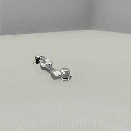

##### Robots

# Robot arm add-ons

[`RobotArm`](../../python/add_ons/robot_arm.md) is an class that extends `Robot`. The main difference is that it adds an inverse kinematics (IK) solver and a `reach_for(target)` function. If you call this function, the robot will set its joint targets to reach for the target position.

Internally, each robot arm requires its own IK chain. This chain is derived from a .urdf file but is often not the *same* as the data in the .urdf file. Reasons include differences between how ROS and Unity handle local coordinate systems and differences between the robot in TDW (which is sometimes missing fixed joints for the sake of simplicity) and the original robot. In TDW, the joint link data is stored in [the robot's metadata record](../../python/librarian/robot_librarian.md).

Currently, the following robots in TDW have joint link data, meaning that they can be used as a  `RobotArm`:

- `ur5`

This example controller adds a UR5 robot to the scene as a `RobotArm` rather than as a `Robot`, like in previous examples:

```python
import numpy as np
from tdw.controller import Controller
from tdw.tdw_utils import TDWUtils
from tdw.add_ons.robot_arm import RobotArm
from tdw.add_ons.third_person_camera import ThirdPersonCamera
from tdw.add_ons.image_capture import ImageCapture
from tdw.backend.paths import EXAMPLE_CONTROLLER_OUTPUT_PATH

c = Controller()
ur5 = RobotArm(name="ur5", robot_id=0)
camera = ThirdPersonCamera(avatar_id="a",
                           position={"x": -0.881, "y": 0.836, "z": -1.396},
                           look_at={"x": 0, "y": 0.2, "z": 0})
path = EXAMPLE_CONTROLLER_OUTPUT_PATH.joinpath("ur5_ik")
print(f"Images will be saved to: {path}")
capture = ImageCapture(avatar_ids=["a"], path=path)
c.add_ons.extend([ur5, camera, capture])
c.communicate(TDWUtils.create_empty_room(12, 12))

# Reach for a target position.
target_position = np.array([0.3, 0.7, 0.3])
ur5.reach_for(target=target_position)
while ur5.joints_are_moving():
    c.communicate([])

# Calculate the distance from the end effector to the target position.
end_effector_position = ur5.dynamic.joints[ur5.static.joint_ids_by_name["wrist_3_link"]].position
print(np.linalg.norm(target_position - end_effector_position))
c.communicate({"$type": "terminate"})
```

Output: 

```
0.023655123974454323
```



***

**Next: [Robot collision detection](collision_detection.md)**

[Return to the README](../../../README.md)

***

Example controllers:

- [ur5_ik.py](https://github.com/threedworld-mit/tdw/blob/master/Python/example_controllers/robots/ur5_ik.py) Control a UR5 robot arm with inverse kinematics (IK).

Python API:

- [`RobotArm`](../../python/add_ons/robot_arm.md)