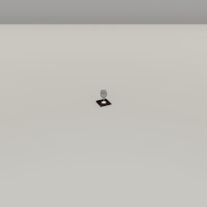
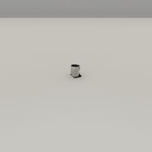
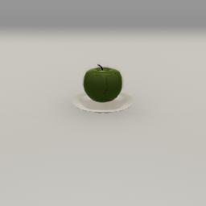
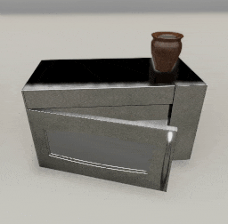
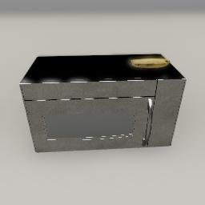
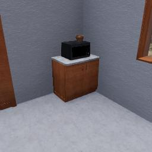

##### Scene Setup (High-Level APIs)

# Procedural object arrangements

In [`ProcGenKitchen`](proc_gen_kitchen.md), objects are grouped into pseudo-atomic "arrangements". Each arrangement is procedurally generated. For example, a single kitchen counter with objects on top of the counter and inside the cabinet is generated via a [`KitchenCounter`](../../python/proc_gen/arrangements/kitchen_counter.md) arrangement.

Arrangement data classes are similar to add-ons in that they accept parameters and generate commands, but they are meant to be used *within* an add-on in groups. In `ProcGenKitchen`, multiple kitchen counters, wall cabinets, etc. are placed alongside each other in the room.

Arrangements are procedurally generated. The models used are randomly selected from pre-categorized lists. Object positions, rotations, etc. are also randomized within various constraints.

## `Arrangement` class hierarchy

Arrangements are all data objects. Every type of arrangement is a subclass of [`Arrangement`](../../python/proc_gen/arrangements/arrangement.md). Some arrangement types may have intermediary abstract subclasses such as [`ArrangementWithRootObject`](../../python/proc_gen/arrangements/arrangement_with_root_object.md).

There are many `Arrangement` sub-classes; see the bottom of this document for a list. As adding example controller code to this document for every `Arrangement` would be so verbose as to make this document unreadable, only a few notable examples would be shown. For others, you should read the API documentation.

### Example A: `CupAndCoaster`

A [`CupAndCoaster`](../../python/proc_gen/arrangements/cup_and_coaster.md) is a subclass of [`Arrangement`](../../python/proc_gen/arrangements/arrangement.md). It creates either a cup or a wine glass. 50% of the time, there is a coaster under the cup or glass.

`CupAndCoaster` has the following constructor parameters:

- `position` sets the position of the arrangement (either the coaster or, if there is no coaster, the cup or wineglass).
- `rng` is optional and defaults to None. It is either a random seed (and integer) or a `numpy.random.RandomState` object. If None, a new `numpy.random.RandomState` object is created.

This example controller adds a `CupAndCoaster` to the scene:

```python
from tdw.controller import Controller
from tdw.tdw_utils import TDWUtils
from tdw.add_ons.image_capture import ImageCapture
from tdw.add_ons.third_person_camera import ThirdPersonCamera
from tdw.proc_gen.arrangements.cup_and_coaster import CupAndCoaster
from tdw.backend.paths import EXAMPLE_CONTROLLER_OUTPUT_PATH

# Add a camera and enable image capture.
path = EXAMPLE_CONTROLLER_OUTPUT_PATH.joinpath("cup_and_coaster")
print(f"Images will be saved to: {path}")
camera = ThirdPersonCamera(position={"x": -1.5, "y": 0.8, "z": 0},
                           look_at={"x": 0, "y": 0, "z": 0},
                           avatar_id="a")
capture = ImageCapture(avatar_ids=["a"], path=path, pass_masks=["_img"])
# Start the controller.
c = Controller()
c.add_ons.extend([camera, capture])
# Add a `CupAndCoaster` arrangement.
cup_and_coaster = CupAndCoaster(position={"x": 0, "y": 0, "z": 0},
                                rng=0)
# Create the scene.
commands = [TDWUtils.create_empty_room(12, 12)]
# Add commands to create the cup and coaster.
commands.extend(cup_and_coaster.get_commands())
# Send the commands.
c.communicate(commands)
c.communicate({"$type": "terminate"})
```

Result:



### Example B: `CupAndCoaster` and `MODEL_CATEGORIES`

`Arrangement.MODEL_CATEGORIES` is a dictionary of "proc-gen categories" and lists of model names. The categories and model names as a curated subset of models from `models_core.json`. Proc-gen categories overlap with, but are not the same as, `model_record.wcategory`.

This will print a list of all cups:

```python
from tdw.proc_gen.arrangements.arrangement import Arrangement

for model_name in Arrangement.MODEL_CATEGORIES["cup"]:
    print(model_name)
```

Output:

```
coffeecup004_fix
coffeemug
cup
```

An additional class variable, `CupAndCoaster.CUP_CATEGORIES`, controls which categories are considered "cups" for the purposes of this particular arrangement:

```python
from tdw.proc_gen.arrangements.cup_and_coaster import CupAndCoaster

for category in CupAndCoaster.CUP_CATEGORIES:
    print(category)
```

Output:

```
cup
wineglass
```

To force `CupAndCoaster` to use a specific cup or wineglass, we can set both `MODEL_CATEGORIES` and `CUP_CATEGORIES`:

```python
from tdw.controller import Controller
from tdw.tdw_utils import TDWUtils
from tdw.add_ons.image_capture import ImageCapture
from tdw.add_ons.third_person_camera import ThirdPersonCamera
from tdw.proc_gen.arrangements.cup_and_coaster import CupAndCoaster
from tdw.backend.paths import EXAMPLE_CONTROLLER_OUTPUT_PATH

# Add a camera and enable image capture.
path = EXAMPLE_CONTROLLER_OUTPUT_PATH.joinpath("cup_and_coaster")
print(f"Images will be saved to: {path}")
camera = ThirdPersonCamera(position={"x": -1.5, "y": 0.8, "z": 0},
                           look_at={"x": 0, "y": 0, "z": 0},
                           avatar_id="a")
capture = ImageCapture(avatar_ids=["a"], path=path, pass_masks=["_img"])
# Start the controller.
c = Controller()
c.add_ons.extend([camera, capture])
# Use only models from the category "cup".
CupAndCoaster.CUP_CATEGORIES = ["cup"]
# Use only the coffee mug model.
CupAndCoaster.MODEL_CATEGORIES["cup"] = ["coffeemug"]
# Add a `CupAndCoaster` arrangement.
cup_and_coaster = CupAndCoaster(position={"x": 0, "y": 0, "z": 0},
                                rng=0)
# Create the scene.
commands = [TDWUtils.create_empty_room(12, 12)]
# Add commands to create the cup and coaster.
commands.extend(cup_and_coaster.get_commands())
# Send the commands.
c.communicate(commands)
c.communicate({"$type": "terminate"})
```

Result:



### Example C: `Plate`

[`Plate`](../../python/proc_gen/arrangements/plate.md) is a subclass of [`ArrangementWithRootObject`](../../python/proc_gen/arrangements/arrangement_with_root_object.md). A plate may have food on top of it.

`Plate` has the following constructor parameters:

- `position` sets the position of the root object (the plate).
- `model` is optional and not shown in this example; set this to set the plate model. This can be either a string (a model name) or a `ModelRecord`.
- `rng` is optional and defaults to None. It is either a random seed (and integer) or a `numpy.random.RandomState` object. If None, a new `numpy.random.RandomState` object is created.

Additionally, `Plate` has a field, `root_object_id`, not found in `Arrangement` (and, by extension, not found in `CupAndCoaster`). `ArrangementWithRootObject` subclasses all have a "root object" and any number of "child objects". `root_object_id` is set after calling `get_commands()`.

This example controller adds a `Plate` to the scene. Note that in the `CupAndCoaster` example, we added the add-ons, then the `CupAndCoaster`, then called `cup_and_coaster.get_commands()`. In *this* example, the order is flipped. This is because we want the camera to look at the plate; to do this, we need to set `plate.root_object_id` which means that we need to call `plate.get_commands()` before creating the `ThirdPersonCamera`.

```python
from tdw.controller import Controller
from tdw.tdw_utils import TDWUtils
from tdw.add_ons.image_capture import ImageCapture
from tdw.add_ons.third_person_camera import ThirdPersonCamera
from tdw.proc_gen.arrangements.plate import Plate
from tdw.backend.paths import EXAMPLE_CONTROLLER_OUTPUT_PATH

# Add a `Plate` arrangement.
plate = Plate(position={"x": 0, "y": 0, "z": 0},
              rng=0)
plate_commands = plate.get_commands()
# The object ID of the plate is the root ID of the arrangement.
plate_id = plate.root_object_id
# Add a camera and enable image capture. Look at the plate.
path = EXAMPLE_CONTROLLER_OUTPUT_PATH.joinpath("plate")
print(f"Images will be saved to: {path}")
camera = ThirdPersonCamera(position={"x": 0.5, "y": 0.2, "z": 0},
                           look_at=plate_id,
                           avatar_id="a")
capture = ImageCapture(avatar_ids=["a"], path=path, pass_masks=["_img"])
# Start the controller.
c = Controller()
c.add_ons.extend([camera, capture])
# Create the scene.
commands = [TDWUtils.create_empty_room(12, 12)]
# Add commands to create the arrangement.
commands.extend(plate_commands)
# Send the commands.
c.communicate(commands)
c.communicate({"$type": "terminate"})
```

Result:



### Example D: `Microwave`

Like the previous `Plate` example, [`Microwave`](../../python/proc_gen/arrangements/microwave.md) is a subclass of [`ArrangementWithRootObject`](../../python/proc_gen/arrangements/arrangement_with_root_object.md). Unlike `Plate`, `Microwave` can actually create a sub-`Arrangement`: in this case, it might add a `Plate` arrangement inside the microwave. A `Microwave` also has objects on top of it.

`Microwave` has the following constructor parameters:

- `wall` is a [`CardinalDirection`](../../python/cardinal_direction.md). This controls the rotation of the microwave and the rest of the arrangment.
- `position` sets the position of the root object (the microwave).
- `model` is optional and can set the microwave model; it can be either a string (the model name) or a `ModelRecord`.
- `rng` is optional and defaults to None. It is either a random seed (and integer) or a `numpy.random.RandomState` object. If None, a new `numpy.random.RandomState` object is created.

All microwave models used by the `Microwave` arrangement are [composite objects](../semantic_states/composite_objects.md) with articulated doors.

This example controller adds a `Microwave` to the scene. We'll add a [`CompositeObjectManager`](../../python/add_ons/composite_object_manager.md) and use it to open the microwave door so that we can see the `Plate` arrangement. To open the door, we use some low-level API commands. In most controllers that use articulated objects, an [agent](../agents/overview.md) would open the door instead.

```python
from tdw.controller import Controller
from tdw.tdw_utils import TDWUtils
from tdw.add_ons.image_capture import ImageCapture
from tdw.add_ons.third_person_camera import ThirdPersonCamera
from tdw.add_ons.composite_object_manager import CompositeObjectManager
from tdw.proc_gen.arrangements.microwave import Microwave
from tdw.backend.paths import EXAMPLE_CONTROLLER_OUTPUT_PATH
from tdw.cardinal_direction import CardinalDirection

# Add a `Microwave` arrangement.
microwave = Microwave(position={"x": 0, "y": 0, "z": 0},
                      rng=2,
                      wall=CardinalDirection.west)
microwave_commands = microwave.get_commands()
# The object ID of the microwave is the root ID of the arrangement.
microwave_id = microwave.root_object_id
# Add a camera and enable image capture. Look at the microwave.
path = EXAMPLE_CONTROLLER_OUTPUT_PATH.joinpath("microwave")
print(f"Images will be saved to: {path}")
camera = ThirdPersonCamera(position={"x": 1, "y": 0.8, "z": 0},
                           look_at=microwave_id,
                           avatar_id="a")
capture = ImageCapture(avatar_ids=["a"], path=path, pass_masks=["_img"])
# Add a composite object manager, which we'll use to open the microwave door.
composite_object_manager = CompositeObjectManager()
# Start the controller.
c = Controller()
c.add_ons.extend([camera, capture, composite_object_manager])
# Create the scene.
commands = [TDWUtils.create_empty_room(12, 12)]
# Add commands to create the arrangement.
commands.extend(microwave_commands)
# Send the commands.
c.communicate(commands)
# Start to open the door.
commands.clear()
for object_id in composite_object_manager.static:
    if object_id == microwave_id:
        for spring_id in composite_object_manager.static[object_id].springs:
            commands.extend([{"$type": "set_spring_force",
                              "spring_force": 50,
                              "id": spring_id},
                             {"$type": "set_spring_target_position",
                              "target_position": 90,
                              "id": spring_id}])
        break
c.communicate(commands)
# Open the door.
for i in range(50):
    c.communicate([])
c.communicate({"$type": "terminate"})
```

Result:



### Example E: Set the objects `ON_TOP_OF` the `Microwave`

`ArrangementWithRootObject` (and, by extension, `Microwave` as well as `Plate`) has three dictionaries defining which single (non-arrangement) *categories* (not models) can be placed with respect to the root object. In this case, `ON_TOP_OF["microwave"]` defines the categories of models that can be placed on the microwave. You can modify this list as needed, provided that the model is also listed somewhere in `MODEL_CATEGORIES` (see above).

This example forces the `Microwave` to add only bananas on top of it:

```python
from tdw.controller import Controller
from tdw.tdw_utils import TDWUtils
from tdw.add_ons.image_capture import ImageCapture
from tdw.add_ons.third_person_camera import ThirdPersonCamera
from tdw.proc_gen.arrangements.microwave import Microwave
from tdw.backend.paths import EXAMPLE_CONTROLLER_OUTPUT_PATH
from tdw.cardinal_direction import CardinalDirection

# Add a `Microwave` arrangement.
microwave = Microwave(position={"x": 0, "y": 0, "z": 0},
                      rng=2,
                      wall=CardinalDirection.west)
# Only bananas can be on top of the microwave.
Microwave.ON_TOP_OF["microwave"] = ["banana"]
microwave_commands = microwave.get_commands()
# The object ID of the microwave is the root ID of the arrangement.
microwave_id = microwave.root_object_id
# Add a camera and enable image capture. Look at the microwave.
path = EXAMPLE_CONTROLLER_OUTPUT_PATH.joinpath("microwave")
print(f"Images will be saved to: {path}")
camera = ThirdPersonCamera(position={"x": 1, "y": 0.8, "z": 0},
                           look_at=microwave_id,
                           avatar_id="a")
capture = ImageCapture(avatar_ids=["a"], path=path, pass_masks=["_img"])
# Start the controller.
c = Controller()
c.add_ons.extend([camera, capture])
# Create the scene.
commands = [TDWUtils.create_empty_room(12, 12)]
# Add commands to create the arrangement.
commands.extend(microwave_commands)
# Send the commands.
c.communicate(commands)
c.communicate({"$type": "terminate"})
```

Result:



### Example F: `KitchenCounter`

[`KitchenCounter`](../../python/proc_gen/arrangements/kitchen_counter.md) is a subclass of [`KitchenCabinet`](../../python/proc_gen/arrangements/kitchen_cabinet.md), which is a subclass of [`ArrangementAlongWall`](../../python/proc_gen/arrangements/arrangement_along_wall.md), which is a subclass of  [`ArrangementWithRootObject`](../../python/proc_gen/arrangements/arrangement_with_root_object.md), which is a subclass of  [`Arrangement`](../../python/proc_gen/arrangements/arrangement.md). 

A `KitchenCounter` is positioned very differently than arrangements in previous examples in that it doesn't have an explicit `position` constructor parameter. Instead, a `KitchenCounter` is positioned in relationship to the room: a `distance` from a `corner` along a `wall`. 

A `KitchenCounter` may have objects inside its cabinet (which has an articulated door). On the counter top, there will either be random single objects or a `Microwave` arrangement (which in turn may have a `Plate` and objects on top of it). A kitchen counter may also create a [`WallCabinet`](../../python/proc_gen/arrangements/wall_cabinet.md) above it, which in turn may have its own objects or sub-arrangements.

`KitchenCounter` has the following constructor parameters:

- `cabinetry` defines the cabinetry set; this is used to make all kitchen cabinets, sinks, etc. in the scene look like they're part of the same set. `cabinetry` is of type [`Cabinetry`](../../python/proc_gen/arrangements/cabinetry/cabinetry.md). There are two pre-defined `Cabinetry` sets; see `tdw.proc_gen.arrangements.cabinetry.cabinetry.CABINETRY`, a dictionary where the key is a  [`CabinetryType`](../../python/proc_gen/arrangements/cabinetry/cabinetry_type.md) and the value is a pre-set [`Cabinetry`](../../python/proc_gen/arrangements/cabinetry/cabinetry.md).
- `corner` is an [`OrdinalDirection`](../../python/ordinal_direction.md) value describing the "starting corner" (this conceptually assumes that there are multiple kitchen counters, sinks, etc. along the wall, starting from `corner`). The value of `corner` must correspond to the value of `wall`;  for example, if `wall == CardinalDirection.north`, then the two valid values for `corner` are `OrdinalDirection.northwest` and `OrdinalDirection.northeast`.
- `wall` is a [`CardinalDirection`](../../python/cardinal_direction.md) value describing the location of the wall that the `KitchenCounter` abuts.
- `distance` is a float describing the kitchen counter's distance from the `corner` along the `wall`.
- `region` is the [`InteriorRegion`](../../python/scene_data/interior_region.md) that the wall, corner, and kitchen counter are located in. [Read this for more information.](rooms.md) In most cases, you can set this to `scene_record.rooms[0].main_region` (assuming that you've already defined `scene_record`).
- `allow_microwave` is an optional boolean. If True, the kitchen counter may have a microwave. This can be useful for controlling the total number of microwaves in a scene. It is optional and defaults to True.
- `cabinet_is_empty_probability` is an optional float defining the probability of the kitchen cabinet being empty.
- `model` is either a string (the name of a model) or a `ModelRecord`. This is the root kitchen counter model.
- `wall_length` is the length of the wall. If None, it defaults to the actual length of the wall. This can be useful if you want to start calculating the `distance` at an offset.
- `rng` is optional and defaults to None. It is either a random seed (and integer) or a `numpy.random.RandomState` object. If None, a new `numpy.random.RandomState` object is created.

This example adds a kitchen counter to the scene:

```python
from tdw.controller import Controller
from tdw.add_ons.third_person_camera import ThirdPersonCamera
from tdw.add_ons.image_capture import ImageCapture
from tdw.proc_gen.arrangements.kitchen_counter import KitchenCounter
from tdw.proc_gen.arrangements.cabinetry.cabinetry import CABINETRY
from tdw.proc_gen.arrangements.cabinetry.cabinetry_type import CabinetryType
from tdw.backend.paths import EXAMPLE_CONTROLLER_OUTPUT_PATH
from tdw.ordinal_direction import OrdinalDirection
from tdw.cardinal_direction import CardinalDirection
from tdw.librarian import SceneLibrarian

# Get the scene name, record, and the region where the kitchen counter will be added.
scene_name = "mm_craftroom_2a"
scene_record = SceneLibrarian().get_record("mm_craftroom_2a")
region = scene_record.rooms[0].main_region
# Generate a kitchen counter.
kitchen_counter = KitchenCounter(cabinetry=CABINETRY[CabinetryType.beech_honey],
                                 corner=OrdinalDirection.northeast,
                                 wall=CardinalDirection.north,
                                 distance=0,
                                 region=region,
                                 rng=3)
# Add a camera and enable image capture.
path = EXAMPLE_CONTROLLER_OUTPUT_PATH.joinpath("kitchen_counter")
print(f"Images will be saved to: {path}")
# Look at the root object (the kitchen counter).
camera = ThirdPersonCamera(position={"x": 0, "y": 1.8, "z": 0},
                           look_at=kitchen_counter.root_object_id,
                           avatar_id="a")
capture = ImageCapture(avatar_ids=["a"], path=path, pass_masks=["_img"])
# Start the controller.
c = Controller()
# Append the add-ons.
c.add_ons = [camera, capture]
# Add the scene.
commands = [Controller.get_add_scene(scene_name=scene_name)]
# Add the kitchen counter's commands.
commands.extend(kitchen_counter.get_commands())
c.communicate(commands)
c.communicate({"$type": "terminate"})
```

Result:



## `Arrangement` parameters

Unlike nearly all data classes on TDW, `Arrangement` subclasses are structured such that most of their parameters are in class variables rather than constructor parameters. This can be awkward to code when adding arrangements directly to a scene but it's very useful when using an add-on such as `ProcGenKitchen`. In `ProcGenKitchen`, it's impossible to know beforehand which objects will be placed where (unless you're using a known random seed), and so it's impossible to set constructor parameter values per-object. You can, however, set class variable values, which will affect all arrangements of a given type.

To learn more about the class variables, read the relevant Arrangement API document.

In this example, this controller sets `Basket.ROTATION`, which controls the maximum random rotation of all baskets in the scene:

```python
from tdw.controller import Controller
from tdw.add_ons.proc_gen_kitchen import ProcGenKitchen
from tdw.add_ons.third_person_camera import ThirdPersonCamera
from tdw.add_ons.image_capture import ImageCapture
from tdw.backend.paths import EXAMPLE_CONTROLLER_OUTPUT_PATH
from tdw.proc_gen.arrangements.basket import Basket

Basket.ROTATION = 5
path = EXAMPLE_CONTROLLER_OUTPUT_PATH.joinpath("proc_gen_kitchen_minimal")
print(f"Images will be saved to: {path}")
proc_gen_kitchen = ProcGenKitchen()
proc_gen_kitchen.create(rng=0)
camera = ThirdPersonCamera(position={"x": 2, "y": 1.8, "z": -0.5},
                           look_at={"x": 0, "y": 0.6, "z": 0},
                           avatar_id="a")
capture = ImageCapture(avatar_ids=["a"], path=path, pass_masks=["_img"])
c = Controller()
c.add_ons.extend([proc_gen_kitchen, camera, capture])
c.communicate([])
c.communicate({"$type": "terminate"})
```

## Rectangular arrangements

Many arrangements add secondary objects using a "rectangular arrangement" algorithm. In this algorithm, a rectangular area with a given (x, y, z) center position is defined and then divided into "cells". Each cell may have an object on it and objects may span multiple cells. The position of the objects are perturbed slightly and the rotations of the objects are typically random. Each cell may also be empty.

[`KitchenCounter`](../../python/proc_gen/arrangements/kitchen_counter.md), for example, has two rectangular arrangements: one on the counter top, and one enclosed by the cabinet door(s). 

- `KitchenCounter.COUNTER_TOP_CELL_SIZE` and `KitchenCounter.CABINET_CELL_SIZE` control the cell size of the rectangular arrangement. A lower value allows for smaller objects.
- `KitchenCounter.COUNTER_TOP_CELL_DENSITY` and `KitchenCounter.CABINET_CELL_DENSITY` control how often cells are empty. A lower value means more objects.
- `KitchenCounter.COUNTER_TOP_DEPTH_SCALE`, `KitchenCounter.COUNTER_TOP_WIDTH_SCALE`, `KitchenCounter.CABINET_DEPTH_SCALE`, and `KitchenCounter.CABINET_WIDTH_SCALE` control the spatial padding of the rectangular arrangement to prevent objects from being added too close to the edges.
- `KitchenCounter.ON_TOP_OF["kitchen_counter"]` sets the categories of objects that can be placed on the counter top.
- `KitchenCounter.ENCLOSED_BY["kitchen_counter"]` sets the categories of objects that can be placed inside the cabinet.

You can adjust parameters like this to increase or decrease the number of objects, types of objects, etc. on root object surfaces. For a more "cluttered" look, try decreasing the cell size, increasing the cell density, and adding more categories to `ON_TOP_OF` or `ENCLOSED_BY`.

***

**Next: [Scripted object placement (floorplan layouts)](floorplans.md)**

[Return to the README](../../../README.md)

***

Example Controllers:

- [cup_and_coaster.py](https://github.com/threedworld-mit/tdw/blob/master/Python/example_controllers/scene_setup_high_level/cup_and_coaster.py) Create a cup and coaster.
- [plate.py](https://github.com/threedworld-mit/tdw/blob/master/Python/example_controllers/scene_setup_high_level/plate.py) Create a plate arrangement.
- [microwave.py](https://github.com/threedworld-mit/tdw/blob/master/Python/example_controllers/scene_setup_high_level/microwave.py) Create a microwave arrangement.
- [kitchen_counter.py](https://github.com/threedworld-mit/tdw/blob/master/Python/example_controllers/scene_setup_high_level/kitchen_counter.py) Create a kitchen counter arrangement.

Python API:

- Add-ons:
  - [`ProcGenKitchen`](../../python/add_ons/proc_gen_kitchen.md)
  - [`CompositeObjectManager`](../../python/add_ons/composite_object_manager.md)
- Arrangements:
  - [`Arrangement`](../../python/proc_gen/arrangements/arrangement.md)
  - [`ArrangementAlongWall`](../../python/proc_gen/arrangements/arrangement_along_wall.md)
  - [`ArrangementWithRootObject`](../../python/proc_gen/arrangements/arrangement_with_root_object.md)
  - [`Basket`](../../python/proc_gen/arrangements/basket.md)
  - [`CupAndCoaster`](../../python/proc_gen/arrangements/cup_and_coaster.md)
  - [`Dishwasher`](../../python/proc_gen/arrangements/dishwasher.md)
  - [`KitchenCabinet`](../../python/proc_gen/arrangements/kitchen_cabinet.md)
  - [`KitchenCounter`](../../python/proc_gen/arrangements/kitchen_counter.md)
  - [`KitchenCounterTop`](../../python/proc_gen/arrangements/kitchen_counter_top.md)
  - [`KitchenTable`](../../python/proc_gen/arrangements/kitchen_table.md)
  - [`Microwave`](../../python/proc_gen/arrangements/microwave.md)
  - [`Painting`](../../python/proc_gen/arrangements/painting.md)
  - [`Plate`](../../python/proc_gen/arrangements/plate.md)
  - [`Radiator`](../../python/proc_gen/arrangements/radiator.md)
  - [`Refrigerator`](../../python/proc_gen/arrangements/refrigerator.md)
  - [`Shelf`](../../python/proc_gen/arrangements/shelf.md)
  - [`SideTable`](../../python/proc_gen/arrangements/side_table.md)
  - [`Sink`](../../python/proc_gen/arrangements/sink.md)
  - [`StackOfPlates`](../../python/proc_gen/arrangements/stack_of_plates.md)
  - [`Stool`](../../python/proc_gen/arrangements/stool.md)
  - [`Stove`](../../python/proc_gen/arrangements/stove.md)
  - [`Suitcase`](../../python/proc_gen/arrangements/suitcase.md)
  - [`TableAndChairs`](../../python/proc_gen/arrangements/table_and_chairs.md)
  - [`TableSetting`](../../python/proc_gen/arrangements/table_setting.md)
  - [`Void`](../../python/proc_gen/arrangements/void.md)
  - [`WallCabinet`](../../python/proc_gen/arrangements/wall_cabinet.md)
- Cabinetry:
  - [`Cabinetry`](../../python/proc_gen/arrangements/cabinetry/cabinetry.md)
  - [`CabinetryType`](../../python/proc_gen/arrangements/cabinetry/cabinetry_type.md)
- Directions:
  - [`CardinalDirection`](../../python/cardinal_direction.md)
  - [`OrdinalDirection`](../../python/ordinal_direction.md)
- Scene Data:
  - [`InteriorRegion`](../../python/scene_data/interior_region.md)