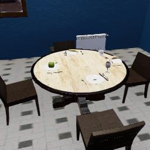
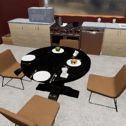
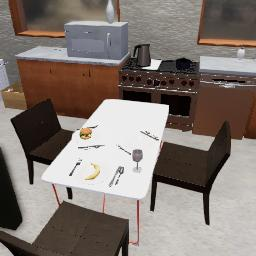
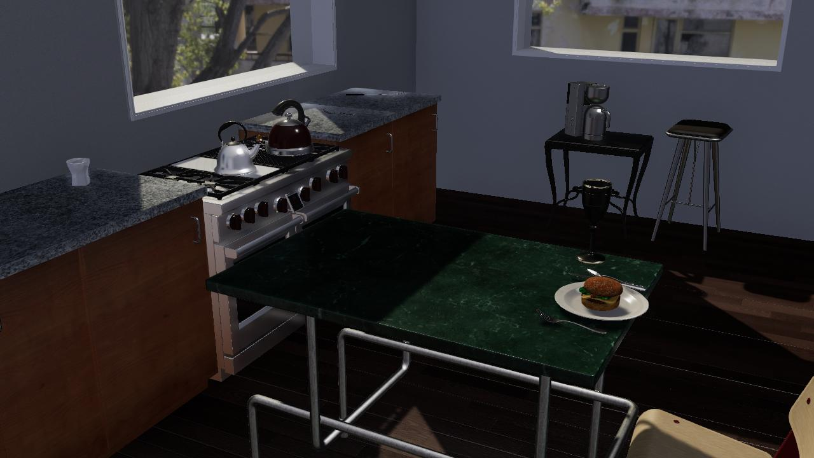

##### Scene Setup (High-Level APIs)

# Procedural Generation (the `ProcGenKitchen` add-on)

The [`ProcGenKitchen`](../../python/add_ons/proc_gen_kitchen.md) add-on is currently TDW's only high-level proc-gen scene setup implement. In the near future, we intend to add proc-gen add-ons for other types of rooms e.g. a `ProcGenBedroom`.

Create procedurally-generated kitchens by creating a `ProcGenKitchen`, adding it to `c.add_ons`, and then calling `proc_gen_kitchen.create()`:

```python
from tdw.controller import Controller
from tdw.add_ons.proc_gen_kitchen import ProcGenKitchen
from tdw.add_ons.third_person_camera import ThirdPersonCamera
from tdw.add_ons.image_capture import ImageCapture
from tdw.backend.paths import EXAMPLE_CONTROLLER_OUTPUT_PATH

path = EXAMPLE_CONTROLLER_OUTPUT_PATH.joinpath("proc_gen_kitchen_minimal")
print(f"Images will be saved to: {path}")
proc_gen_kitchen = ProcGenKitchen()
proc_gen_kitchen.create()
camera = ThirdPersonCamera(position={"x": 2, "y": 1.8, "z": -0.5},
                           look_at={"x": 0, "y": 0.6, "z": 0},
                           avatar_id="a")
capture = ImageCapture(avatar_ids=["a"], path=path, pass_masks=["_img"])
c = Controller()
c.add_ons.extend([proc_gen_kitchen, camera, capture])
c.communicate([])
c.communicate({"$type": "terminate"})
```

Result:



## How `ProcGenKitchen` works

[A detailed explanation of how `ProcGenKitchen` works can be found in the API documentation.](../../python/add_ons/proc_gen_kitchen.md) Broadly speaking, `ProcGenKitchen` has a notion of [arrangements of objects](arrangements.md), such as a shelf with objects on it. It then uses places quasi-atomic arrangements in the scene, for example creating a lateral span of kitchen counters.

When reading the API documentation, be sure to click through to the documentation for each `Arrangement`. `ProcGenKitchen` has a few parameters (such as `SCENE_NAMES`) but *most* of the parameters affecting kitchen generation are actually in [`Arrangement`](../../python/proc_gen/arrangement.md) and its subclasses.

## The `rng` parameter

If you try to run the previous example, you'll get a different image because every kitchen scene is randomly generated. `proc_gen_kitchen` includes an optional `rng` parameter that can be either an integer or a numpy RandomState object (for example: `rng=numpy.random.RandomState(0)`).

If you set the `rng` parameter, you'll recreate the same scene every time.

```python
from tdw.controller import Controller
from tdw.add_ons.proc_gen_kitchen import ProcGenKitchen
from tdw.add_ons.third_person_camera import ThirdPersonCamera
from tdw.add_ons.image_capture import ImageCapture
from tdw.backend.paths import EXAMPLE_CONTROLLER_OUTPUT_PATH

path = EXAMPLE_CONTROLLER_OUTPUT_PATH.joinpath("proc_gen_kitchen_random_seed")
print(f"Images will be saved to: {path}")
proc_gen_kitchen = ProcGenKitchen()
proc_gen_kitchen.create(rng=0)
camera = ThirdPersonCamera(position={"x": -2, "y": 1.8, "z": -0.5},
                           look_at={"x": 0, "y": 0.6, "z": 0},
                           avatar_id="a")
capture = ImageCapture(avatar_ids=["a"], path=path, pass_masks=["_img"])
c = Controller()
c.add_ons.extend([proc_gen_kitchen, camera, capture])
c.communicate([])
c.communicate({"$type": "terminate"})
```

Result:



## The `scene` parameter

Set the `scene` parameter to specify the [scene](../core_concepts/scenes.md). If None, a random *valid* scene will be selected.

Only certain scenes are valid for `ProcGenKitchen`. They must be single-room interior scenes with pre-set [room data](rooms.md). Although it is not a requirement per se, `ProcGenKitchen` does work best with smaller rooms.

If `scene` isn't set or is set to None, the scene is randomly selected. To review the list of possible scenes:

```python
from tdw.add_ons.proc_gen_kitchen import ProcGenKitchen

for scene_name in ProcGenKitchen.SCENE_NAMES:
    print(scene_name)
```

Output:

```
mm_craftroom_2a
mm_craftroom_2b
mm_craftroom_3a
mm_craftroom_3b
mm_kitchen_2a
mm_kitchen_2b
mm_kitchen_3a
mm_kitchen_3b
```

`scene` can alternatively be:

- A string, for example `"mm_craftroom_2a"`
- A [`SceneRecord`](../../python/librarian/scene_librarian.md), for example `SceneLibrarian().get_record("mm_craftroom_2a")`
- A [`Room`](rooms.md), in which case the add-on assumes that the actual scene has already been loaded.
- A list of strings and/or `SceneRecord`, in which case a random string or `SceneRecord` will be selected.

This example explicitly sets the `scene` parameter to a scene name. Notice that we're also setting the `rng` parameter; this is not necessary but it will be used for setting everything in the scene *except* for selecting the scene itself.

```python
from tdw.controller import Controller
from tdw.add_ons.proc_gen_kitchen import ProcGenKitchen
from tdw.add_ons.third_person_camera import ThirdPersonCamera
from tdw.add_ons.image_capture import ImageCapture
from tdw.backend.paths import EXAMPLE_CONTROLLER_OUTPUT_PATH

path = EXAMPLE_CONTROLLER_OUTPUT_PATH.joinpath("proc_gen_kitchen_scene")
print(f"Images will be saved to: {path}")
proc_gen_kitchen = ProcGenKitchen()
proc_gen_kitchen.create(scene="mm_kitchen_2b", rng=0)
camera = ThirdPersonCamera(position={"x": -2, "y": 1.8, "z": -1},
                           look_at={"x": 0, "y": 0.6, "z": 0},
                           avatar_id="a")
capture = ImageCapture(avatar_ids=["a"], path=path, pass_masks=["_img"])
c = Controller()
c.add_ons.extend([proc_gen_kitchen, camera, capture])
c.communicate([])
c.communicate({"$type": "terminate"})
```

Result:



## The `room_index` parameter

The `room_index` parameter is mostly for future-proofing `ProcGenKitchen` for a time when it can be used in a multi-room scene; this parameter should almost always be set to 0 (the default value).

## `ProcGenKitchen` models

The models used in `ProcGenKitchen` are stored [`Arrangement.MODEL_CATEGORIES`](../../python/proc_gen/arrangement.md). This is dictionary that has been curated from the overall list of models. The key of `Arrangement.MODEL_CATEGORIES` is a "proc-gen category", which overlaps with [`model_record.wcategory`](../../python/librarian/model_librarian.md) but is often not the same. For example, in TDW kitchen counters and wall cabinets have the same `wcategory` but not the same proc-gen category:

```python
from tdw.proc_gen.arrangements.arrangement import Arrangement
from tdw.librarian import ModelLibrarian

lib = ModelLibrarian()
model_names = ["cabinet_24_wall_wood_beech_honey_composite",
               "cabinet_24_single_door_wood_beech_honey_composite"]
for model_name in model_names:
    # Get the proc-gen category.
    for category in Arrangement.MODEL_CATEGORIES:
        if model_name in Arrangement.MODEL_CATEGORIES[category]:
            # Get the record.
            record = lib.get_record(model_name)
            print(category, record.wcategory)
```

Output:

```
wall_cabinet cabinet
kitchen_counter cabinet
```

To add a model to `MODEL_CATEGORIES`, simply add the model name to the dictionary in your controller:

```python
from tdw.proc_gen.arrangements.arrangement import Arrangement

Arrangement.MODEL_CATEGORIES["knife"].append("knife1")
```

Note that `knife1` is a pre-existing model in `models_core.json` but not included in `Arrangment.MODEL_CATEGORIES`.

## `ProcGenKitchen` and other add-ons

`ProcGenKitchen` is meant to be as modular as possible and it can be combined with other add-ons and commands. You've already seen that it's possible use `ProcGenKitchen` along with [`ThirdPersonCamera`](../../python/add_ons/third_person_camera.md) and [`ImageCapture`](../../python/add_ons/image_capture.md).

This example combines `ProcGenKitchen` with [`InteriorSceneLighting`](../photorealism/interior_lighting.md). Note that we can use the same random seed for both add-ons to ensure that the scene is recreated exactly the same every time:

```python
import numpy as np
from tdw.controller import Controller
from tdw.add_ons.proc_gen_kitchen import ProcGenKitchen
from tdw.add_ons.third_person_camera import ThirdPersonCamera
from tdw.add_ons.image_capture import ImageCapture
from tdw.add_ons.interior_scene_lighting import InteriorSceneLighting
from tdw.backend.paths import EXAMPLE_CONTROLLER_OUTPUT_PATH

path = EXAMPLE_CONTROLLER_OUTPUT_PATH.joinpath("proc_gen_kitchen_lighting")
print(f"Images will be saved to: {path}")
proc_gen_kitchen = ProcGenKitchen()
random_seed = 14
proc_gen_kitchen.create(rng=np.random.RandomState(random_seed))
interior_scene_lighting = InteriorSceneLighting(rng=np.random.RandomState(random_seed))
camera = ThirdPersonCamera(position={"x": -1, "y": 1.8, "z": 2},
                           look_at={"x": 0, "y": 1, "z": 0},
                           avatar_id="a")
capture = ImageCapture(avatar_ids=["a"], path=path, pass_masks=["_img"])
c = Controller()
c.add_ons.extend([proc_gen_kitchen, interior_scene_lighting, camera, capture])
c.communicate([{"$type": "set_screen_size",
                "width": 1280,
                "height": 720}])
c.communicate({"$type": "terminate"})
```

Result:



## Saving scene setup commands

Whenever `ProcGenKitchen` is updated, it is possible that a random seed used in a previous version will generate a different scene in a newer version. In fact, it's likely that subsequent changes to `ProcGenKitchen` since this document has written have adjusted the procedural generator such that if you run the example controllers, you'll capture different images.

In order to guarantee that you can recreate a kitchen scene,  you can save the list of commands in addition to the random seed.

When you call `proc_gen_kitchen.create()`, the add-on appends a long list of commands to `proc_gen_kitchen.commands`. As with all other [add-ons](../core_concepts/add_ons.md), the `commands` list will be automatically sent to the build the next time `c.communicate()` is called.

You can save `proc_gen_kitchen.commands` to a JSON file like this:

```python
from json import dumps
from pathlib import Path
from tdw.add_ons.proc_gen_kitchen import ProcGenKitchen

proc_gen_kitchen = ProcGenKitchen()
proc_gen_kitchen.create(rng=0)
Path("proc_gen_kitchen.json").write_text(dumps(proc_gen_kitchen.commands))
```

...and then reload them like this:

```python
from json import loads
from pathlib import Path
from tdw.controller import Controller

c = Controller()
c.communicate(loads(Path("proc_gen_kitchen.json").read_text()))
```

***

**Next: [Regions, interior regions, and rooms](rooms.md)**

[Return to the README](../../../README.md)

***

Example controllers:

- [proc_gen_kitchen_minimal.py](https://github.com/threedworld-mit/tdw/blob/master/Python/example_controllers/scene_setup_high_level/proc_gen_kitchen_minimal.py) Minimal example of the proc-gen kitchen.
- [proc_gen_kitchen_lighting.py](https://github.com/threedworld-mit/tdw/blob/master/Python/example_controllers/scene_setup_high_level/proc_gen_kitchen_lighting.py) ProcGenKitchen with realistic lighting.

Python API:

- [`ProcGenKitchen`](../../python/add_ons/proc_gen_kitchen.md)
- [`Arrangement`](../../python/proc_gen/arrangement.md)
- [`SceneRecord`](../../python/librarian/scene_librarian.md)
- [`ModelRecord`](../../python/librarian/model_librarian.md)
- [`Room`](../../python/scene_data/room.md)
- [`ThirdPersonCamera`](../../python/add_ons/third_person_camera.md)
- [`ImageCapture`](../../python/add_ons/image_capture.md)
- [`InteriorSceneLighting`](../../python/add_ons/interior_scene_lighting.md)