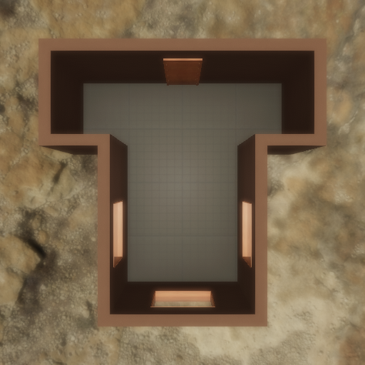
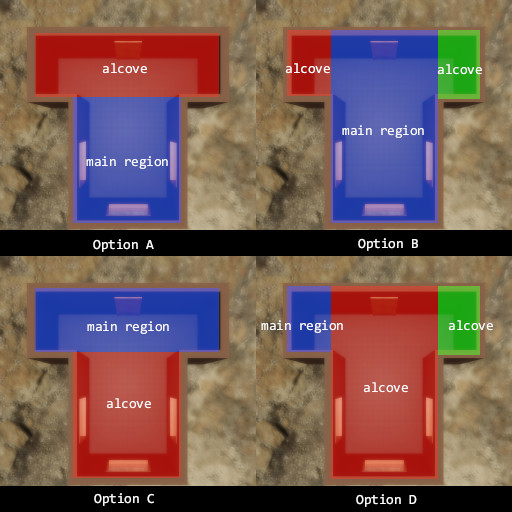

##### Scene Setup (High-Level APIs)

# Regions, interior regions, and rooms

[`ProcGenKitchen`](proc_gen_kitchen.md) relies on cached *scene room data* in order to populate the scene with objects. Only certain scenes in the [scene library](../../python/librarian/scene_librarian.md) have this data; [see the previous document for a list](proc_gen_kitchen.md). This document explains what exactly room data is and how it's generated. In many cases, you can use `ProcGenKitchen` without needing to read this document.

## Runtime data

`ProcGenKitchen` does *not* use scene data calculated at runtime, but it can be helpful to understand this data in order to understand the cached scene data:

By sending [`send_scene_regions`](../../api/command_api.md#send_scene_regions), a controller can receive [`SceneRegions`](../../api/output_data.md#SceneRegions) output data. You can then convert `SceneRegions` into the more convenient [`SceneBounds`](../../python/scene_data/scene_bounds.md) data class. `SceneBounds` includes the bounds of the scene as well as the [`RegionBounds`](../../python/scene_data/region_bounds.md). A region is an empty space within a scene that can be used for object placement.

Regions are always box-shaped.

In [streamed scenes](../core_concepts/scenes.md) the scene regions were set up manually as part of the scene creation process. This is a fast process that is adequate for most projects. However, it is insufficient for `ProcGenKitchen` because the add-on needs to programmatically place objects *exactly* flush to the wall. It also doesn't include some information that `ProcGenKitchen` requires.

## Cached data

Each [`SceneRecord`](../../python/librarian/scene_librarian.md) has a list called `rooms`, which is a list of cached [`Room`](../../python/scene_data/room.md) data. A `Room` has two fields:

- `main_region` An [`InteriorRegion`](../../python/scene_data/interior_region.md) 
- `alcoves` A list of `InteriorRegion`

Rooms can have more than one region (a main region plus one or more alcoves) if it isn't box-shaped. For example, the scene `mm_kitchen_4a` is a single T-shaped room:



The top of the T is an alcove region and the bottom of the T is the main region.

The differentiation between "main" regions and "alcove" regions is used in `ProcGenKitchen` for object placement. Most objects, such as kitchen counters, will be placed in the "main" region.

[`InteriorRegion`](../../python/scene_data/interior_region.md) is a subclass of [`RegionBounds`](../../python/scene_data/region_bounds.md) with two extra fields:

- `non_continuous_walls` is an integer describing which walls are missing, have doorways, etc. This data can be used in procedural generators such as `ProcGenKitchen` to avoid creating barricades of objects in the middle of the room.

```python
from tdw.librarian import SceneLibrarian

lib = SceneLibrarian()
record = lib.get_record("mm_kitchen_4a")
print(record.rooms[0].main_region.non_continuous_walls)
```

Output:

```
1
```

To convert this into a human-readable direction, you can use the enum values of the [`CardinalDirection`](../../python/cardinal_direction.md) class:

```python
from tdw.librarian import SceneLibrarian
from tdw.cardinal_direction import CardinalDirection

lib = SceneLibrarian()
record = lib.get_record("mm_kitchen_4a")
for direction in CardinalDirection:
    if direction & record.rooms[0].main_region.non_continuous_walls != 0:
        print(direction)
```

Output:

```
CardinalDirection.north
```

...which is correct! The main region of `mm_kitchen_4a` doesn't have a wall to its north; instead, it connects to the alcove region.

- `walls_with_windows` is an integer describing which walls in the region have windows. This can be used in procedural generation to avoid placing tall objects in front of windows:

```python
from tdw.librarian import SceneLibrarian
from tdw.cardinal_direction import CardinalDirection

lib = SceneLibrarian()
record = lib.get_record("mm_kitchen_4a")
for direction in CardinalDirection:
    if direction & record.rooms[0].main_region.walls_with_windows != 0:
        print(direction)
```

Output:

```
CardinalDirection.east
CardinalDirection.south
CardinalDirection.west
```

## Cached regions vs. runtime regions

The regions cached in `SceneRecord` are slightly different sizes than the runtime data calculated via the `send_scene_regions` command. This is because the cached data was programmatically calculated rather than set up manually.

## Automatically calculating `Room` data

At present, there is no way to automatically calculate `Room` data for several reasons:

- There is no way at present to calculate where non-continuous walls are or where windows are.
- Automatically calculating region bounds is a non-trival task. For example, `mm_kitchen_4a` is currently divided into 2 regions, but could be divided into 4, which is *algorithmically* correct but not useful for procedural generation. Right now, it's unclear how to algorithmically decide which subdivision is more useful. In the example below, the *top-left* diagram is the "best" option (and the one currently being used) but any of the others could feasibly be programmatically calculated:



Accordingly, we strongly recommend that you use pre-existing cached `Room` data in the `SceneRecord` rather than attempt to calculate your own room data.

***

**Next: [Procedural object arrangements](arrangements.md)**

[Return to the README](../../../README.md)

***

Python API:

- [`ProcGenKitchen`](../../python/add_ons/proc_gen_kitchen.md)
- [`SceneBounds`](../../python/scene_data/scene_bounds.md) 
- [`RegionBounds`](../../python/scene_data/region_bounds.md)
- [`SceneRecord`](../../python/librarian/scene_librarian.md) 
- [`Room`](../../python/scene_data/room.md)
- [`InteriorRegion`](../../python/scene_data/interior_region.md)
- [`CardinalDirection`](../../python/cardinal_direction.md)

Command API:

- [`send_scene_regions`](../../api/command_api.md#send_scene_regions)

Output Data:

- [`SceneRegions`](../../api/output_data.md#SceneRegions) 