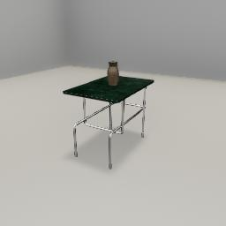

##### Scene Setup (Low-Level APIs)

# `Bounds` output data

[As noted earlier,](../core_concepts/objects.md) the object position returned by [`Transforms` output data](../../api/output_data.md#Transforms) is the **bottom-center** of the object. To get the *center* of the object, you need to request [`Bounds` output data](../../api/output_data.md#Bounds) with the [`send_bounds` command](../../api/command_api.md#send_bounds):

```python
from tdw.controller import Controller
from tdw.tdw_utils import TDWUtils
from tdw.output_data import OutputData, Bounds

c = Controller()
object_id = c.get_unique_id()

# Create the scene. Add an object. Request Bounds output data.
resp = c.communicate([TDWUtils.create_empty_room(12, 12),
                      c.get_add_object(model_name="small_table_green_marble",
                                       position={"x": 0, "y": 0, "z": 0},
                                       object_id=object_id),
                      {"$type": "send_bounds",
                       "frequency": "once"}])

# Get the center of the object.
for i in range(len(resp) - 1):
    r_id = OutputData.get_data_type_id(resp[i])
    if r_id == "boun":
        bounds = Bounds(resp[i])
        for j in range(bounds.get_num()):
            if bounds.get_id(j) == object_id:
                print(object_id, bounds.get_center(j))
c.communicate({"$type": "terminate"})
```

The bounds data also includes the *top, bottom, left, right, front,* and *back* of each object. In this example, we'll use the *top* of the bounds to place another object on the table:

```python
from tdw.controller import Controller
from tdw.tdw_utils import TDWUtils
from tdw.output_data import OutputData, Bounds
from tdw.add_ons.third_person_camera import ThirdPersonCamera
from tdw.add_ons.image_capture import ImageCapture
from tdw.backend.paths import EXAMPLE_CONTROLLER_OUTPUT_PATH

c = Controller()
object_id = c.get_unique_id()

# Add a camera and enable image capture.
cam = ThirdPersonCamera(position={"x": 2.478, "y": 1.602, "z": 1.412},
                        look_at={"x": 0, "y": 0.5, "z": 0},)
output_directory = EXAMPLE_CONTROLLER_OUTPUT_PATH.joinpath("bounds")
print(f"Images will be saved to: {output_directory.resolve()}")
c.add_ons.append(cam)
cap = ImageCapture(path=output_directory, avatar_ids=[cam.avatar_id], pass_masks=["_img"])
c.add_ons.append(cap)
# Create the scene. Add a table. Request Bounds output data.
resp = c.communicate([TDWUtils.create_empty_room(12, 12),
                      c.get_add_object(model_name="small_table_green_marble",
                                       position={"x": 0, "y": 0, "z": 0},
                                       object_id=object_id),
                      {"$type": "send_bounds",
                       "frequency": "once"}])

# Get the top of the table.
top = (0, 0, 0)
for i in range(len(resp) - 1):
    r_id = OutputData.get_data_type_id(resp[i])
    if r_id == "boun":
        bounds = Bounds(resp[i])
        for j in range(bounds.get_num()):
            if bounds.get_id(j) == object_id:
                top = bounds.get_top(j)
                break
# Put an object on top of the table.
c.communicate(c.get_add_object(model_name="jug01",
                               position=TDWUtils.array_to_vector3(top),
                               object_id=c.get_unique_id()))
c.communicate({"$type": "terminate"})
```

Result:



## The `ObjectManager` add-on

We've seen the [`ObjectManager` add-on in the Core Concepts documentation.](../core_concepts/output_data.md) If you need to frequently use bounds data, you can use the `ObjectManager` which will conveniently sort all bounds data by object per frame. 

Note that:

- In this example, the `ObjectManager` will include data for the table but *not* for the object on the table because that object didn't exist when the `ObjectManager` was initialized.
- Bounds data is returned by the build as (x, y, z) tuples but in `ObjectManager` data those tuples are automatically converted into numpy arrays.

This controller does the exact same thing as the previous example but uses an `ObjectManager`:

```python
from tdw.controller import Controller
from tdw.tdw_utils import TDWUtils
from tdw.add_ons.third_person_camera import ThirdPersonCamera
from tdw.add_ons.image_capture import ImageCapture
from tdw.backend.paths import EXAMPLE_CONTROLLER_OUTPUT_PATH
from tdw.add_ons.object_manager import ObjectManager

c = Controller()
object_id = c.get_unique_id()

# Add a camera and enable image capture.
cam = ThirdPersonCamera(position={"x": 2.478, "y": 1.602, "z": 1.412},
                        look_at={"x": 0, "y": 0.5, "z": 0},)
output_directory = EXAMPLE_CONTROLLER_OUTPUT_PATH.joinpath("bounds")
print(f"Images will be saved to: {output_directory.resolve()}")
c.add_ons.append(cam)
cap = ImageCapture(path=output_directory, avatar_ids=[cam.avatar_id], pass_masks=["_img"])
c.add_ons.append(cap)

# Add an ObjectManager.
om = ObjectManager(transforms=False, bounds=True, rigidbodies=True)
c.add_ons.append(om)

# Create the scene. Add a table. Request Bounds output data.
resp = c.communicate([TDWUtils.create_empty_room(12, 12),
                      c.get_add_object(model_name="small_table_green_marble",
                                       position={"x": 0, "y": 0, "z": 0},
                                       object_id=object_id)])

# Get the top of the table.
top = om.bounds[object_id].top
# Put an object on top of the table.
c.communicate(c.get_add_object(model_name="jug01",
                               position=TDWUtils.array_to_vector3(top),
                               object_id=c.get_unique_id()))
c.communicate({"$type": "terminate"})
```

***

**Next: [Materials, textures, and colors](materials_textures_colors.md)**

[Return to the README](../../../README.md)

***

Example controllers:

- [object_on_table.py](https://github.com/threedworld-mit/tdw/blob/master/Python/example_controllers/scene_setup_low_level/object_on_table.py) Put an object on a table using `Bounds` output data.

Python API:

- [`TDWUtils.array_to_vector3(arr)`](../../python/tdw_utils.md) Convert an x, y, z array or tuple to an x, y, z dictionary.
- [`ObjectManager`](../../python/add_ons/object_manager.md)

Command API:

- [`send_bounds`](../../api/command_api.md#send_bounds)

Output Data API:

- [`Bounds`](../../api/output_data.md#Bounds) 

