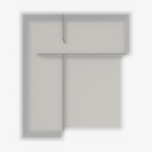
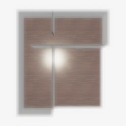
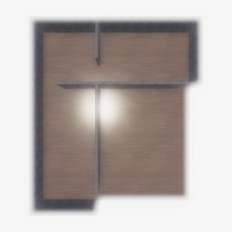
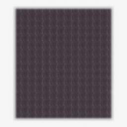

##### Scene Setup (Low-Level APIs)

# ProcGenRoom

TDW includes a "ProcGen Room" scene for procedurally generating interior environments. We've been utilizing this every time we call `TDWUtils.create_empty_room(12, 12)`. However, TDW is capable of generating arbitrary indoor environments, with the caveat that each "section" of wall is always 1 meter long and walls must always be at 90 degree angles.

## 1. Create a random number generator

It can be useful to define a random number generator with a fixed seed so that you can re-create the exact same scene as needed:

```python
from typing import List
import numpy as np
from tdw.controller import Controller

class ProcGenRoom(Controller):
    def __init__(self, port: int = 1071, launch_build: bool = True, seed: int = 0):
        super().__init__(port=port, launch_build=launch_build)
        self.rng: np.random.RandomState = np.random.RandomState(seed)
```

## 2. Procedurally generate the walls of an indoor scene

This tutorial will define an L-shaped scene with interior walls.

To start, we'll define the bounds of the room with a randomly-sized numpy array, where 0 = no walls, 1 = exterior walls, and 2 = interior walls:

```python
from typing import List
import numpy as np
from tdw.controller import Controller

class ProcGenRoom(Controller):
    def __init__(self, port: int = 1071, launch_build: bool = True, seed: int = 0):
        super().__init__(port=port, launch_build=launch_build)
        self.rng: np.random.RandomState = np.random.RandomState(seed)

    def create_scene(self) -> List[dict]:
        width: int = self.rng.randint(12, 18)
        length: int = self.rng.randint(14, 20)
        room_arr: np.array = np.zeros(shape=(width, length), dtype=int)
```

Define a position to start turning south and generate "walls" up to that point:

```python
from typing import List
import numpy as np
from tdw.controller import Controller

class ProcGenRoom(Controller):
    def __init__(self, port: int = 1071, launch_build: bool = True, seed: int = 0):
        super().__init__(port=port, launch_build=launch_build)
        self.rng: np.random.RandomState = np.random.RandomState(seed)

    def create_scene(self) -> List[dict]:
        width: int = self.rng.randint(12, 18)
        length: int = self.rng.randint(14, 20)
        room_arr: np.array = np.zeros(shape=(width, length), dtype=int)
        # Define the uppermost width-wise wall.
        turn_south_at = int(length * 0.75) + self.rng.randint(1, 3)
        for i in range(turn_south_at + 1):
            room_arr[0, i] = 1
        print(room_arr)
```

Using similar logic, we'll define the rest of the L-shape:

```python
from typing import List
import numpy as np
from tdw.controller import Controller

class ProcGenRoom(Controller):
    def __init__(self, port: int = 1071, launch_build: bool = True, seed: int = 0):
        super().__init__(port=port, launch_build=launch_build)
        self.rng: np.random.RandomState = np.random.RandomState(seed)

    def create_scene(self) -> List[dict]:
        width: int = self.rng.randint(12, 18)
        length: int = self.rng.randint(14, 20)
        room_arr: np.array = np.zeros(shape=(width, length), dtype=int)
        # Define the uppermost width-wise wall.
        turn_south_at = int(length * 0.75) + self.rng.randint(1, 3)
        for i in range(turn_south_at + 1):
            room_arr[0, i] = 1
        turn_west_at = int(width * 0.75) + self.rng.randint(0, 2)
        for i in range(turn_west_at + 1):
            room_arr[i, turn_south_at] = 1
        turn_north_at = turn_south_at - self.rng.randint(4, 6)
        for i in range(turn_north_at, turn_south_at):
            room_arr[turn_west_at, i] = 1
        turn_west_at_2 = self.rng.randint(4, 6)
        for i in range(turn_west_at_2, turn_west_at):
            room_arr[i, turn_north_at] = 1
        for i in range(turn_north_at):
            room_arr[turn_west_at_2, i] = 1
        for i in range(turn_west_at_2):
            room_arr[i, 0] = 1
        print(room_arr)
```

Next, add interior walls at the corner of the L, leaving some space for an entryway:

```python
from typing import List
import numpy as np
from tdw.controller import Controller

class ProcGenRoom(Controller):
    def __init__(self, port: int = 1071, launch_build: bool = True, seed: int = 0):
        super().__init__(port=port, launch_build=launch_build)
        self.rng: np.random.RandomState = np.random.RandomState(seed)

    def create_scene(self) -> List[dict]:
        width: int = self.rng.randint(12, 18)
        length: int = self.rng.randint(14, 20)
        room_arr: np.array = np.zeros(shape=(width, length), dtype=int)
        # Define the uppermost width-wise wall.
        turn_south_at = int(length * 0.75) + self.rng.randint(1, 3)
        for i in range(turn_south_at + 1):
            room_arr[0, i] = 1
        turn_west_at = int(width * 0.75) + self.rng.randint(0, 2)
        for i in range(turn_west_at + 1):
            room_arr[i, turn_south_at] = 1
        turn_north_at = turn_south_at - self.rng.randint(4, 6)
        for i in range(turn_north_at, turn_south_at):
            room_arr[turn_west_at, i] = 1
        turn_west_at_2 = self.rng.randint(4, 6)
        for i in range(turn_west_at_2, turn_west_at):
            room_arr[i, turn_north_at] = 1
        for i in range(turn_north_at):
            room_arr[turn_west_at_2, i] = 1
        for i in range(turn_west_at_2):
            room_arr[i, 0] = 1
        # Create interior walls.
        if self.rng.random() < 0.5:
            interior_wall_0 = range(turn_north_at + 1, turn_south_at - 1)
            interior_wall_1 = range(1, turn_west_at_2 - 1)
        else:
            interior_wall_0 = range(turn_north_at + 2, turn_south_at)
            interior_wall_1 = range(2, turn_west_at_2)
        for i in interior_wall_0:
            room_arr[turn_west_at_2, i] = 2
        for i in interior_wall_1:
            room_arr[i, turn_north_at] = 2
        print(room_arr)
```

We now have completed the interior and exterior walls. We will convert the array into commands, add an avatar, and send the commands:

```python
from typing import List
import numpy as np
from tdw.controller import Controller
from tdw.add_ons.image_capture import ImageCapture
from tdw.add_ons.third_person_camera import ThirdPersonCamera
from tdw.backend.paths import EXAMPLE_CONTROLLER_OUTPUT_PATH


class ProcGenRoom(Controller):
    def __init__(self, port: int = 1071, launch_build: bool = True, seed: int = 0):
        super().__init__(port=port, launch_build=launch_build)
        self.rng: np.random.RandomState = np.random.RandomState(seed)

    def create_scene(self) -> List[dict]:
        width: int = self.rng.randint(12, 18)
        length: int = self.rng.randint(14, 20)
        room_arr: np.array = np.zeros(shape=(width, length), dtype=int)
        # Define the uppermost width-wise wall.
        turn_south_at = int(length * 0.75) + self.rng.randint(1, 3)
        for i in range(turn_south_at + 1):
            room_arr[0, i] = 1
        turn_west_at = int(width * 0.75) + self.rng.randint(0, 2)
        for i in range(turn_west_at + 1):
            room_arr[i, turn_south_at] = 1
        turn_north_at = turn_south_at - self.rng.randint(4, 6)
        for i in range(turn_north_at, turn_south_at):
            room_arr[turn_west_at, i] = 1
        turn_west_at_2 = self.rng.randint(4, 6)
        for i in range(turn_west_at_2, turn_west_at):
            room_arr[i, turn_north_at] = 1
        for i in range(turn_north_at):
            room_arr[turn_west_at_2, i] = 1
        for i in range(turn_west_at_2):
            room_arr[i, 0] = 1
        # Create interior walls.
        if self.rng.random() < 0.5:
            interior_wall_0 = range(turn_north_at + 1, turn_south_at - 1)
            interior_wall_1 = range(1, turn_west_at_2 - 1)
        else:
            interior_wall_0 = range(turn_north_at + 2, turn_south_at)
            interior_wall_1 = range(2, turn_west_at_2)
        for i in interior_wall_0:
            room_arr[turn_west_at_2, i] = 2
        for i in interior_wall_1:
            room_arr[i, turn_north_at] = 2
        # Convert the array to commands.
        exterior_walls: List[dict] = list()
        interior_walls: List[dict] = list()
        for ix, iy in np.ndindex(room_arr.shape):
            if room_arr[ix, iy] == 1:
                exterior_walls.append({"x": ix, "y": iy})
            elif room_arr[ix, iy] == 2:
                interior_walls.append({"x": ix, "y": iy})
        # load_scene typically gets sent in the controller constructor.
        return [{"$type": "load_scene",
                 "scene_name": "ProcGenScene"},
                {"$type": "create_exterior_walls",
                 "walls": exterior_walls},
                {"$type": "create_interior_walls",
                 "walls": interior_walls}]

    def run(self) -> None:
        path = EXAMPLE_CONTROLLER_OUTPUT_PATH.joinpath("proc_gen_room")
        print(f"Images will be saved to {path}")
        camera = ThirdPersonCamera(avatar_id="a", position={"x": 0, "y": 20, "z": 0}, look_at={"x": 0, "y": 0, "z": 0})
        capture = ImageCapture(avatar_ids=["a"], pass_masks=["_img"], path=path)
        self.add_ons.extend([camera, capture])
        self.communicate(self.create_scene())
        self.communicate({"$type": "terminate"})


if __name__ == "__main__":
    c = ProcGenRoom()
    c.run()
```

Result:



## 3. Add and adjust the ceiling

Add a ceiling with [`create_proc_gen_ceiling`](../../api/command_api.md#create_proc_gen_ceiling). Remove it with [`destroy_proc_gen_ceiling`](../../api/command_api.md#destroy_proc_gen_ceiling).

The ceiling is subdivided into 1x1 meter "tiles". You can selectively add or destroy ceiling tiles with [`create_proc_gen_ceiling_tiles`](../../api/command_api.md#create_proc_gen_ceiling_tiles) and [`destroy_proc_gen_ceiling_tiles`](../../api/command_api.md#destroy_proc_gen_ceiling_tiles), respectively.

## 3. Set colors and visual materials

It is possible to set the [visual materials and colors](materials_textures_colors.md) of the floor, walls, and ceiling of a proc-gen room. In each case, make sure you first send  [`add_material` or `c.get_add_material(material_name)`](materials_textures_colors.md) to load the material asset bundle into memory (just like you would with an object).

|             | Set visual material                                          | Set texture scale                                            | Set color                                                    |
| ----------- | ------------------------------------------------------------ | ------------------------------------------------------------ | ------------------------------------------------------------ |
| **Floor**   | [`set_floor_material`](../../api/command_api.md#set_floor_material) | [`set_floor_texture_scale`](../../api/command_api.md#set_floor_texture_scale) | [`set_floor_color`](../../api/command_api.md#set_floor_color) |
| **Walls**   | [`set_proc_gen_walls_material`](../../api/command_api.md#set_proc_gen_walls_material) | [`set_proc_gen_walls_texture_scale`](../../api/command_api.md#set_proc_gen_walls_texture_scale) | [`set_proc_gen_walls_color`](../../api/command_api.md#set_proc_gen_walls_color) |
| **Ceiling** | [`set_proc_gen_ceiling_material`](../../api/command_api.md#set_proc_gen_ceiling_material) | [`set_proc_gen_ceiling_texture_scale`](../../api/command_api.md#set_proc_gen_ceiling_texture_scale) | [`set_proc_gen_ceiling_color`](../../api/command_api.md#set_proc_gen_ceiling_color) |

```python
from typing import List
import numpy as np
from tdw.controller import Controller
from tdw.add_ons.image_capture import ImageCapture
from tdw.add_ons.third_person_camera import ThirdPersonCamera
from tdw.backend.paths import EXAMPLE_CONTROLLER_OUTPUT_PATH


class ProcGenRoom(Controller):
    """
    Procedurally create an interior scene.
    """

    def __init__(self, port: int = 1071, launch_build: bool = True, seed: int = 0):
        super().__init__(port=port, launch_build=launch_build)
        self.rng: np.random.RandomState = np.random.RandomState(seed)

    def create_scene(self) -> List[dict]:
        width: int = self.rng.randint(12, 18)
        length: int = self.rng.randint(14, 20)
        room_arr: np.array = np.zeros(shape=(width, length), dtype=int)
        # Define the uppermost width-wise wall.
        turn_south_at = int(length * 0.75) + self.rng.randint(1, 3)
        for i in range(turn_south_at + 1):
            room_arr[0, i] = 1
        turn_west_at = int(width * 0.75) + self.rng.randint(0, 2)
        for i in range(turn_west_at + 1):
            room_arr[i, turn_south_at] = 1
        turn_north_at = turn_south_at - self.rng.randint(4, 6)
        for i in range(turn_north_at, turn_south_at):
            room_arr[turn_west_at, i] = 1
        turn_west_at_2 = self.rng.randint(4, 6)
        for i in range(turn_west_at_2, turn_west_at):
            room_arr[i, turn_north_at] = 1
        for i in range(turn_north_at):
            room_arr[turn_west_at_2, i] = 1
        for i in range(turn_west_at_2):
            room_arr[i, 0] = 1
        # Create interior walls.
        if self.rng.random() < 0.5:
            interior_wall_0 = range(turn_north_at + 1, turn_south_at - 1)
            interior_wall_1 = range(1, turn_west_at_2 - 1)
        else:
            interior_wall_0 = range(turn_north_at + 2, turn_south_at)
            interior_wall_1 = range(2, turn_west_at_2)
        for i in interior_wall_0:
            room_arr[turn_west_at_2, i] = 2
        for i in interior_wall_1:
            room_arr[i, turn_north_at] = 2
        # Convert the array to commands.
        exterior_walls: List[dict] = list()
        interior_walls: List[dict] = list()
        for ix, iy in np.ndindex(room_arr.shape):
            if room_arr[ix, iy] == 1:
                exterior_walls.append({"x": ix, "y": iy})
            elif room_arr[ix, iy] == 2:
                interior_walls.append({"x": ix, "y": iy})
        # load_scene typically gets sent by calling c.start()
        return [{"$type": "load_scene",
                 "scene_name": "ProcGenScene"},
                {"$type": "create_exterior_walls",
                 "walls": exterior_walls},
                {"$type": "create_interior_walls",
                 "walls": interior_walls}]

    def set_floor(self) -> List[dict]:
        materials = ["parquet_wood_mahogany", "parquet_long_horizontal_clean", "parquet_wood_red_cedar"]
        material_name = materials[self.rng.randint(0, len(materials))]
        texture_scale: float = float(self.rng.uniform(4, 4.5))
        return [self.get_add_material(material_name=material_name),
                {"$type": "set_floor_material",
                 "name": material_name},
                {"$type": "set_floor_texture_scale",
                 "scale": {"x": texture_scale, "y": texture_scale}},
                {"$type": "set_floor_color",
                 "color": {"r": float(self.rng.uniform(0.7, 1)),
                           "g": float(self.rng.uniform(0.7, 1)),
                           "b": float(self.rng.uniform(0.7, 1)),
                           "a": 1.0}}]

    def set_walls(self) -> List[dict]:
        materials = ["cinderblock_wall", "concrete_tiles_linear_grey", "old_limestone_wall_reinforced"]
        material_name = materials[self.rng.randint(0, len(materials))]
        texture_scale: float = float(self.rng.uniform(0.2, 0.3))
        return [self.get_add_material(material_name=material_name),
                {"$type": "set_proc_gen_walls_material",
                 "name": material_name},
                {"$type": "set_proc_gen_walls_texture_scale",
                 "scale": {"x": texture_scale, "y": texture_scale}},
                {"$type": "set_proc_gen_walls_color",
                 "color": {"r": float(self.rng.uniform(0.7, 1)),
                           "g": float(self.rng.uniform(0.7, 1)),
                           "b": float(self.rng.uniform(0.7, 1)),
                           "a": 1.0}}]

    def set_ceiling(self) -> List[dict]:
        materials = ["bricks_red_regular", "bricks_chatham_gray_used", "bricks_salem_matt_used"]
        material_name = materials[self.rng.randint(0, len(materials))]
        texture_scale: float = float(self.rng.uniform(0.1, 0.2))
        return [{"$type": "create_proc_gen_ceiling"},
                self.get_add_material(material_name=material_name),
                {"$type": "set_proc_gen_ceiling_material",
                 "name": material_name},
                {"$type": "set_proc_gen_ceiling_texture_scale",
                 "scale": {"x": texture_scale, "y": texture_scale}},
                {"$type": "set_proc_gen_ceiling_color",
                 "color": {"r": float(self.rng.uniform(0.7, 1)),
                           "g": float(self.rng.uniform(0.7, 1)),
                           "b": float(self.rng.uniform(0.7, 1)),
                           "a": 1.0}}]

    def run(self) -> None:
        path = EXAMPLE_CONTROLLER_OUTPUT_PATH.joinpath("proc_gen_room")
        print(f"Images will be saved to {path}")
        camera = ThirdPersonCamera(avatar_id="a", position={"x": 0, "y": 20, "z": 0}, look_at={"x": 0, "y": 0, "z": 0})
        capture = ImageCapture(avatar_ids=["a"], pass_masks=["_img"], path=path)
        self.add_ons.extend([camera, capture])

        # Create the scene.
        self.communicate(self.create_scene())
        # Set the floor.
        self.communicate(self.set_floor())
        # Set the walls.
        self.communicate(self.set_walls())
        # Set the ceiling.
        self.communicate(self.set_ceiling())
        # End the simulation.
        self.communicate({"$type": "terminate"})


if __name__ == "__main__":
    c = ProcGenRoom()
    c.run()
```

Result:

  

***

**This is the last document in the "Scene Setup (Low-Level APIs)" tutorial.**

[Return to the README](../../../README.md)

***

Example controllers:

- [proc_gen_room.py](https://github.com/threedworld-mit/tdw/blob/master/Python/example_controllers/scene_setup_low_level/proc_gen_room.py) Procedurally create an interior scene.
- [proc_gen_room_from_image.py](https://github.com/threedworld-mit/tdw/blob/master/Python/example_controllers/scene_setup_low_level/proc_gen_room_from_image.py) Generate a room from a .png file.

Python API:

- [`TDWUtils.get_box(width, length)`](../../python/tdw_utils.md)

Command API:

- General:
  - [`load_scene`](../../api/command_api.md#load_scene)
  - [`create_exterior_walls`](../../api/command_api.md#create_exterior_walls)
  - [`create_interior_walls`](../../api/command_api.md#create_interior_walls)
- Floor:
  - [`set_floor_material`](../../api/command_api.md#set_floor_material)
  - [`set_floor_texture_scale`](../../api/command_api.md#set_floor_texture_scale)
  - [`set_floor_color`](../../api/command_api.md#set_floor_color)
- Walls:
  - [`set_proc_gen_walls_material`](../../api/command_api.md#set_proc_gen_walls_material)
  - [`set_proc_gen_walls_texture_scale`](../../api/command_api.md#set_proc_gen_walls_texture_scale)
  - [`set_proc_gen_walls_color`](../../api/command_api.md#set_proc_gen_walls_color)
- Ceiling:
  - [`create_proc_gen_ceiling`](../../api/command_api.md#create_proc_gen_ceiling)
  - [`destroy_proc_gen_ceiling`](../../api/command_api.md#destroy_proc_gen_ceiling)
  - [`create_proc_gen_ceiling_tiles`](../../api/command_api.md#create_proc_gen_ceiling_tiles)
  - [`destroy_proc_gen_ceiling_tiles`](../../api/command_api.md#destroy_proc_gen_ceiling_tiles)
  - [`set_proc_gen_ceiling_material`](../../api/command_api.md#set_proc_gen_ceiling_material)
  - [`set_proc_gen_ceiling_texture_scale`](../../api/command_api.md#set_proc_gen_ceiling_texture_scale)
  - [`set_proc_gen_ceiling_color`](../../api/command_api.md#set_proc_gen_ceiling_color)
