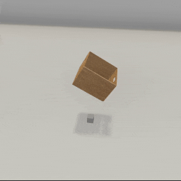
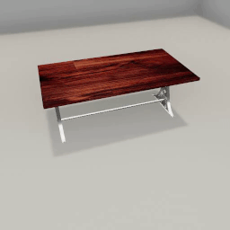
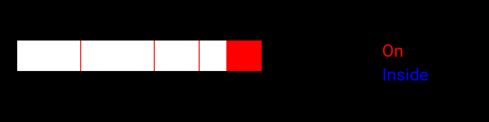
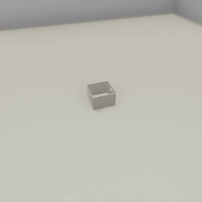
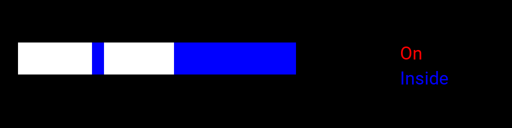

##### Semantic States

# Containment (the `ContainerManager` add-on)

"Containment" in TDW refers to when objects overlap with a 3D space and return [`Overlap` output data](overlap.md). Containment doesn't necessarily imply a cavity-shaped space. In TDW, there are three types of containment: "on", "inside", and "enclosed":

| Containment type | Example                  |
| ---------------- | ------------------------ |
| `on`             | An object on a table     |
| `inside`         | An object in a basket    |
| `enclosed`       | An object in a microwave |

## The `ContainerManager` add-on

[`ContainerManager`](../../python/add_ons/container_manager.md) is an add-on that adds semantic containment listeners to objects. Every [model record](../../python/librarian/model_librarian.md) has a `container_shapes` field. Each `ContainerShape` defines a 3D space and includes a semantic tag.

Only a subset of objects in TDW that could be containers have these predefined container shapes; more will be added over time. To print the current full list:

```python
from tdw.librarian import ModelLibrarian

librarian = ModelLibrarian()
for record in librarian.records:
    if not record.do_not_use and len(record.container_shapes) > 0:
        print(record.name)
```

To use the `ContainerManager` you must add it to `c.add_ons`:

```python
from tdw.controller import Controller
from tdw.tdw_utils import TDWUtils
from tdw.add_ons.container_manager import ContainerManager
from tdw.add_ons.third_person_camera import ThirdPersonCamera

c = Controller()
# Add a container manager.
container_manager = ContainerManager()
# Add a camera.
camera = ThirdPersonCamera(position={"x": 2, "y": 2, "z": 0.3},
                           look_at={"x": 0, "y": 0.6, "z": 0})
c.add_ons.extend([container_manager, camera])
commands = [TDWUtils.create_empty_room(12, 12)]
container_id = Controller.get_unique_id()
# Add a basket. This is the container.
commands.extend(Controller.get_add_physics_object(model_name="basket_18inx18inx12iin_bamboo",
                                                  position={"x": 0, "y": 0.7, "z": 0},
                                                  rotation={"x": 30, "y": 0, "z": 0},
                                                  object_id=container_id,
                                                  kinematic=True))
# Add an octahedron. This object will fall in the basket.
octahedron_id = Controller.get_unique_id()
commands.extend(Controller.get_add_physics_object(model_name="octahedron",
                                                  position={"x": 0, "y": 3, "z": 0.1},
                                                  object_id=octahedron_id,
                                                  library="models_flex.json",
                                                  default_physics_values=False,
                                                  mass=15,
                                                  scale_mass=False,
                                                  dynamic_friction=0.9,
                                                  static_friction=0.9,
                                                  scale_factor={"x": 0.12, "y": 0.12, "z": 0.12}))
# Add a cube. This object will be placed under the basket.
cube_id = Controller.get_unique_id()
commands.extend(Controller.get_add_physics_object(model_name="cube",
                                                  position={"x": 0, "y": 0, "z": 0},
                                                  object_id=cube_id,
                                                  library="models_flex.json",
                                                  default_physics_values=False,
                                                  mass=1,
                                                  scale_mass=False,
                                                  scale_factor={"x": 0.1, "y": 0.1, "z": 0.1}))
container_manager = ContainerManager()
c.add_ons.append(container_manager)
c.communicate(commands)
print("container_id", container_id)
print("octahedron_id", octahedron_id)
print("cube_id", cube_id)
for i in range(200):
    for container_shape_id in container_manager.events:
        event = container_manager.events[container_shape_id]
        object_id = container_manager.container_shapes[container_shape_id]
        tag = container_manager.tags[container_shape_id]
        print(i, object_id, event.object_ids, tag)
    c.communicate([])
c.communicate({"$type": "terminate"})
```

Result:



Output:

```
container_id 12430333
octahedron_id 1769801
cube_id 5420808
31 12430333 [1769801] ContainerTag.inside
32 12430333 [1769801] ContainerTag.inside
33 12430333 [1769801] ContainerTag.inside
34 12430333 [1769801] ContainerTag.inside
35 12430333 [1769801] ContainerTag.inside
36 12430333 [1769801] ContainerTag.inside
37 12430333 [1769801] ContainerTag.inside
38 12430333 [1769801] ContainerTag.inside
```

## Container shape IDs

An object can have more than one container shape. For example, a kitchen counter may have two container shape: one on the counter-top and one enclosed by the cabinet doors.

To identify the container shapes per object, each container shape has its own unique ID. `ContainerManager` provides the means to map container shape IDs to object IDs, as described below: 

## Fields

- `container_manager.events` is a dictionary where the key is the container shape ID (not the object ID) and the value is a list of [`ContainmentEvent`](../../python/container_data/containment_event.md) data. `ContainmentEvent` data includes the object ID of the container, a list of contained object IDs, and a semantic tag. The `container_manager.events` dictionary is updated per-frame.
- `container_manager.container_shapes` is a dictionary mapping container shape IDs to parent object IDs. The key is the container shape ID and the value is the object ID.
- `container_manager.tags` is a dictionary of container shape tags. The key is the container shape ID (not the object ID) and the value is a [`ContainerTag`](../../python/container_data/container_tag.md), a semantic description of the containment event. 

In this example, we'll add a kitchen counter object that has two container shapes: one with the `on` tag (on the top of the kitchen counter) and one with the `enclosed` tag (inside the cabinet). We'll add two objects, one on top of the kitchen counter and one in the cabinet, and output the containment data:

```python
from tdw.controller import Controller
from tdw.tdw_utils import TDWUtils
from tdw.add_ons.container_manager import ContainerManager

c = Controller()
container_manager = ContainerManager()
c.add_ons.append(container_manager)
commands = [TDWUtils.create_empty_room(12, 12)]
container_id = Controller.get_unique_id()
commands.extend(Controller.get_add_physics_object(model_name="cabinet_24_single_door_wood_beech_honey_composite",
                                                  object_id=container_id,
                                                  kinematic=True))
box_id = Controller.get_unique_id()
commands.extend(Controller.get_add_physics_object(model_name="iron_box",
                                                  object_id=box_id,
                                                  position={"x": 0, "y": 1, "z": 0}))
coaster_id = Controller.get_unique_id()
commands.extend(Controller.get_add_physics_object(model_name="square_coaster_001_cork",
                                                  object_id=coaster_id,
                                                  position={"x": 0, "y": 0.3, "z": 0}))
print("Kitchen counter:", container_id)
print("Box:", box_id)
print("Coaster:", coaster_id)
c.communicate(commands)
for i in range(5):
    c.communicate([])
    for container_shape_id in container_manager.events:
        event = container_manager.events[container_shape_id]
        print(i, event.container_id, event.object_ids, event.tag)
c.communicate({"$type": "terminate"})
```

Output:

```
Kitchen counter: 13601349
Box: 10390624
Coaster: 9074723
0 13601349 [9074723] ContainerTag.enclosed
1 13601349 [9074723] ContainerTag.enclosed
2 13601349 [9074723] ContainerTag.enclosed
3 13601349 [9074723] ContainerTag.enclosed
4 13601349 [10390624] ContainerTag.on
4 13601349 [9074723] ContainerTag.enclosed
```

## Add custom container shapes

It is possible to add container shapes to objects at runtime to objects in the scene. There are three container shapes: boxes, cylinders, and spheres. They can be added via `container_manager.add_box()`, `container_manager.add_cylinder()` and `container_manager.add_sphere()`.

## Visualize containment

This is a simple example of how to capture images and containment data and convert the containment data into a diagram using PIL. For aesthetic reasons, you will probably want to improve upon this visualizer or perhaps use a different visualizer entirely:

```python
from PIL import Image, ImageDraw, ImageFont
from tdw.controller import Controller
from tdw.tdw_utils import TDWUtils
from tdw.add_ons.container_manager import ContainerManager
from tdw.add_ons.object_manager import ObjectManager
from tdw.add_ons.third_person_camera import ThirdPersonCamera
from tdw.add_ons.image_capture import ImageCapture
from tdw.container_data.container_tag import ContainerTag
from tdw.backend.paths import EXAMPLE_CONTROLLER_OUTPUT_PATH


class Containment(Controller):
    """
    Add objects to the scene and listen for containment events.
    Save the image of each frame.
    At the end of a trial, create a timeline diagram of the containment states.
    """

    def __init__(self, port: int = 1071, check_version: bool = True, launch_build: bool = True):
        super().__init__(port=port, check_version=check_version, launch_build=launch_build)
        self.container_manager: ContainerManager = ContainerManager()
        self.object_manager: ObjectManager = ObjectManager(transforms=False, rigidbodies=True, bounds=False)
        self.camera = ThirdPersonCamera(position={"x": 3, "y": 2.5, "z": -1},
                                        look_at={"x": 0, "y": 0, "z": 0},
                                        avatar_id="a")
        self.path = EXAMPLE_CONTROLLER_OUTPUT_PATH.joinpath("containment")
        print(f"Images will be saved to: {str(self.path.resolve())}")
        self.capture = ImageCapture(path=self.path, avatar_ids=["a"], pass_masks=["_img"])
        self.add_ons.extend([self.object_manager, self.container_manager, self.camera, self.capture])

    def trial(self, container_name: str):
        self.container_manager.reset()
        self.object_manager.reset()
        self.camera.initialized = False
        self.capture.initialized = False
        # Create the room.
        commands = [{'$type': "load_scene",
                     'scene_name': "ProcGenScene"},
                    TDWUtils.create_empty_room(12, 12)]
        # Add the container.
        container_id = Controller.get_unique_id()
        commands.extend(Controller.get_add_physics_object(model_name=container_name,
                                                          object_id=container_id,
                                                          kinematic=True))
        falling_object_id = Controller.get_unique_id()
        # Add the falling object.
        commands.extend(Controller.get_add_physics_object(model_name="jug02",
                                                          object_id=falling_object_id,
                                                          position={"x": 0, "y": 3, "z": 0}))
        self.communicate(commands)
        # Wait for the object to stop moving.
        sleeping = False
        # Record the containment states.
        frames = []
        while not sleeping:
            sleeping = self.object_manager.rigidbodies[falling_object_id].sleeping
            containment = False
            tag = ContainerTag.inside
            for container_shape_id in self.container_manager.events:
                object_id = self.container_manager.container_shapes[container_shape_id]
                if object_id == container_id:
                    event = self.container_manager.events[container_shape_id]
                    if falling_object_id in event.object_ids:
                        containment = True
                        tag = event.tag
                        break
            frames.append((containment, tag))
            self.communicate([])
        # Create a timeline diagram of the containment states.
        image = Image.new(mode="RGB", size=(1024, 256))
        x_0 = 36
        y_0 = 256 // 3
        frame_width = 2
        for frame in frames:
            if not frame[0]:
                color = (255, 255, 255)
            else:
                if frame[1] == ContainerTag.on:
                    color = (255, 0, 0)
                else:
                    color = (0, 0, 255)
            for x in range(x_0, x_0 + frame_width):
                for y in range(y_0, y_0 + 64):
                    image.putpixel((x, y), color)
            x_0 += frame_width
        draw = ImageDraw.Draw(image)
        font = ImageFont.truetype("Roboto-Regular.ttf", size=36)
        draw.text((800, y_0), "On", (255, 0, 0), font=font)
        draw.text((800, y_0 + 50), "Inside", (0, 0, 255), font=font)
        # Save the image.
        image.save(str(self.path.joinpath(container_name + ".png").resolve()))

    def run(self):
        for container_name in ["quatre_dining_table", "basket_18inx18inx12iin_plastic_lattice"]:
            self.trial(container_name=container_name)
        self.communicate({"$type": "terminate"})


if __name__ == "__main__":
    c = Containment()
    c.run()
```

**Table:**

 



**Basket:**

 



## Refining and defining containment

An object is "contained" by another object as soon as it intersects with one of the object's container shapes. In the above two examples, this is not necessarily a totally intuitive definition of "containment":

- In the table trial, there are three initial short "containment" events as the object bounces on the table, even though it is unlikely that you would intuitively consider the table to be "containing" the object until the end of the trial.
- In the basket trial, there is one initial medium-length "containment" event as the object bounces. The basket's container shape is the size of the total interior of the basket (this way, objects stacked on top of each other but not touching the base of the basket are still "inside" the basket). As the object bounces, it stays within this box-shaped region for a relatively long time span.

You may wish to record the raw containment data and then further filter it for containment events. Some possible strategies:

- Ignore short containment events to filter out bounces.
- You may choose to filter out containment events if the object is moving; however, this will remove scenarios such as when there is a basket containing an object and the basket is lifted or otherwise moved.

## Low-level API

Per object in the scene, `ContainerManager` tries to find a corresponding `ModelRecord` and then checks its `container_shapes` list. For each container shape, `ContainerManager` sends the following:

| Container Shape                                              | Command                                                      |
| ------------------------------------------------------------ | ------------------------------------------------------------ |
| [`BoxContainer`](../../python/container_data/box_container.md) | [`add_box_container`](../../api/command_api.md#add_box_container) |
| [`CylinderContainer`](../../python/container_data/cylinder_container.md) | [`add_cylinder_container`](../../api/command_api.md#add_cylinder_container) |
| [`SphereContainer`](../../python/container_data/sphere_container.md) | [`add_sphere_container`](../../api/command_api.md#add_sphere_container) |

`ContainerManager` then sends [`send_containment`](../../api/command_api.md#send_containment) which, per `communicate()` call, sends [`Overlap`](../../api/output_data.md#Overlap) data for all container shapes that have overlapping objects (other than the parent object). `Overlap` data is *not* sent if there are no overlapping objects.

***

**Next: [Composite objects (objects with affordances)](composite_objects.md)**

[Return to the README](../../../README.md)

***

Example controllers:

- [containment.py](https://github.com/threedworld-mit/tdw/blob/master/Python/example_controllers/semantic_states/containment.py) Add objects to the scene and listen for containment events. Save the image of each frame. At the end of a trial, create a timeline diagram of the containment states.

Python API:

- [`ContainerManager`](../../python/add_ons/container_manager.md)
- [`ContainmentEvent`](../../python/container_data/containment_event.md)
- [`ContainerTag`](../../python/container_data/container_tag.md)
- [`ModelLibrarian`](../../python/librarian/model_librarian.md)
- [`BoxContainer`](../../python/container_data/box_container.md)
- [`CylinderContainer`](../../python/container_data/cylinder_container.md)
- [`SphereContainer`](../../python/container_data/sphere_container.md)

Command API: 

- [`add_box_container`](../../api/command_api.md#add_box_container)
- [`add_cylinder_container`](../../api/command_api.md#add_cylinder_container)
- [`add_sphere_container`](../../api/command_api.md#add_sphere_container)
- [`send_containment`](../../api/command_api.md#send_containment)

Output Data:

- [`Overlap`](../../api/output_data.md#Overlap)