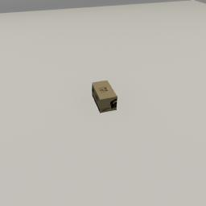

# Setup TDW on a PC (Linux, MacOS, Windows)

*If you want to run a TDW Python controller on a local desktop and the build on a remote server, [read this instead](desktop_server.md).*

You can run TDW on a Linux, MacOS, or Windows person computer. If you have the required hardware, this is almost always easier to set up than a server; it is often useful to run TDW on a PC where it's easier to troubleshoot problems before moving it to a remote server. 

## System Requirements

- Linux (we've tested TDW on Ubuntu 18, 20, and 22), MacOS (Sierra or newer), Windows 10 or 11
- Python 3.8+
- A GPU, the faster the better, with up-to-date drivers. It is possible to run TDW without a GPU but you will lose some speed and photorealism. NVIDIA drivers tend to work better,
- For [audio simulations](../audio/overview.md), you will need an audio driver; unless you're running a minimal Linux install, you probably already have this.

## Install

1. `pip3 install tdw`
2. Create this Python script and run it:

```python
from tdw.controller import Controller

c = Controller()
print("Hello world!")
c.communicate({"$type": "terminate"})
```

**Result:** The terminal window will print messages about downloading a build. Then, it will launch a windowed application, print `Hello world!`, kill the windowed application process, and exit.

3. Test image capture:

```python
from tdw.controller import Controller
from tdw.tdw_utils import TDWUtils
from tdw.add_ons.third_person_camera import ThirdPersonCamera
from tdw.add_ons.image_capture import ImageCapture
from tdw.backend.paths import EXAMPLE_CONTROLLER_OUTPUT_PATH

camera = ThirdPersonCamera(position={"x": 2, "y": 1.6, "z": -0.6},
                           avatar_id="a",
                           look_at={"x": 0, "y": 0, "z": 0})
path = EXAMPLE_CONTROLLER_OUTPUT_PATH.joinpath("image_capture")
print(f"Images will be saved to: {path}")
capture = ImageCapture(avatar_ids=["a"], path=path)

c = Controller()
c.add_ons.extend([camera, capture])
object_id = c.get_unique_id()
commands = [TDWUtils.create_empty_room(12, 12)]
commands.extend(c.get_add_physics_object(model_name="iron_box",
                                         position={"x": 0, "y": 0, "z": 0},
                                         object_id=object_id))
c.communicate(commands)
c.communicate({"$type": "terminate"})
```

Result:



##  Troubleshooting

See [this list of common problems](../troubleshooting/common_errors.md). If you don't see your problem on the list, let us know by opening a GitHub Issue.

