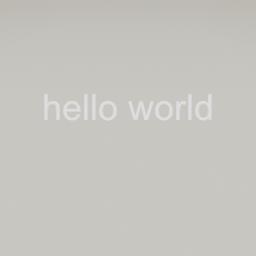
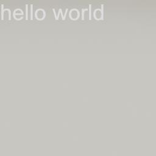
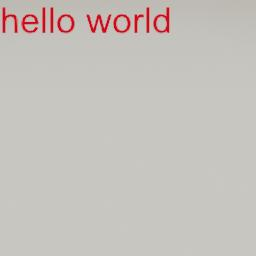
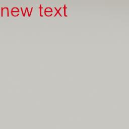
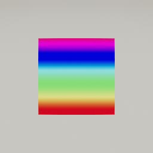
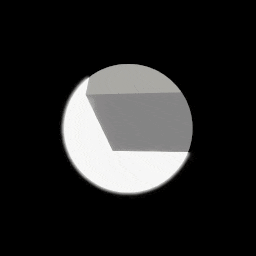

##### UI

# The `UI` add-on

The easiest way to create a basic UI in TDW is via the [`UI`](../../python/add_ons/ui.md) add-on:

```python
from tdw.controller import Controller
from tdw.tdw_utils import TDWUtils
from tdw.add_ons.third_person_camera import ThirdPersonCamera
from tdw.add_ons.image_capture import ImageCapture
from tdw.add_ons.ui import UI
from tdw.backend.paths import EXAMPLE_CONTROLLER_OUTPUT_PATH

c = Controller()
camera = ThirdPersonCamera(avatar_id="a",
                           position={"x": 1, "y": 2.5, "z": 0},
                           look_at={"x": 0, "y": 0, "z": 0})
path = EXAMPLE_CONTROLLER_OUTPUT_PATH.joinpath("ui")
print(f"Images will be saved to: {path}")
capture = ImageCapture(path=path, avatar_ids=["a"])
ui = UI()
c.add_ons.extend([camera, capture, ui])
c.communicate(TDWUtils.create_empty_room(12, 12))
ui.attach_canvas_to_avatar(avatar_id="a")
ui.add_text(text="hello world",
            position={"x": 0, "y": 0},
            font_size=36)
c.communicate({"$type": "terminate"})

```

Result:



## Limitations

TDW's UI API is deliberately limited. Unity has a powerful UI API, but it was designed assuming that the developer would have access to Unity Editor. Without visual aids, it is extremely difficult to use, or even to explain. TDW's implementation of the Unity UI API has only as subset of the full functionality; it is not designed for a good-looking video game-like interface, and more for displaying rudimentary metrics or messages. There is also no user input such as button presses, although this may be implemented in the future.

## Canvases, avatars, and VR rigs

In Unity, UI elements ("RectTransforms") must be attached to a **canvas**. There can be more than one canvas in the scene.

In TDW, the `UI` add on has an optional `canvas_id` in its constructor (default value is 0). When the add-on initializes, it automatically sends [`add_ui_canvas`](../../api/command_api.md#add_ui_canvas). The `UI` add-on will then automatically append its canvas ID to all subsequent commands.

To add multiple canvases to the scene, simply add multiple `UI` add-ons:

```python
from tdw.add_ons.ui import UI
from tdw.controller import Controller

ui_0 = UI(canvas_id=0)
ui_1 = UI(canvas_id=1)
c = Controller()
c.add_ons.extend([ui_0, ui_1])
```

In practice, the only reason to add multiple UI canvases is if there are multiple [avatars](../core_concepts/avatars.md) in the scene.

By default, a canvas is in "overlay" mode. It is rendered separately from TDW's camera passes. In order for the canvas to actually appear in [image output data](../core_concepts/images.md) it must be "attached" to an avatar. To do this, create an avatar (i.e. `ThirdPersonCamera`) and then call `ui.attach_canvas_to_avatar(avatar_id)`. This function automatically sends [`attach_ui_canvas_to_avatar`](../../api/command_api.md#attach_ui_canvas_to_avatar).

`ui.attach_canvas_to_avatar()` also has an additional optional parameter `focus_distance`. This should be set to the default (2.5) or higher, otherwise the UI will look blurry. This is mostly important for VR, where it is possible that the ideal focus distance might differ between headsets.

For [VR rigs](../vr/overview.md), call `ui.attach_canvas_to_vr_rig()` instead of `ui.attach_canvas_to_avatar()`.

## Anchors, pivots, and positions

UI elements are positioned using *local screen space positions*, parameterized as Vector2 objects, e.g. `{"x": 0, "y": 0}`. `"x"` is the horizontal value, and `"y"` is the vertical value.

Positions can reflect the "true" screen position but it is often convenient to apply offsets using *anchors* and *pivots*.

An *anchor* is position offset factor Vector2 where each value is between 0 and 1. By default, the anchor of all UI elements is `{"x": 0.5, "y": 0.5}`, meaning that there is no offset; position `{"x": 0, "y": 0}` is in the center of the screen. But, if the anchor is `{"x": 0, "y": 1}`, then position `{"x": 0, "y": 0}` is actually the top-left corner of the screen.

A *pivot* is the UI element's pivot point as a Vector2 factor where each value is between 0 and 1. By default, the pivot of all UI elements is `{"x": 0.5, "y": 0.5}` meaning that the pivot is in the center of the object.

You can set the anchor, pivot, and position of a UI element to easily snap it to sides or corners of the screen without actually knowing the dimensions of the screen.

In this example, we'll add text to the top-left corner of the screen. Note that in both this example and the previous "hello world" world example, `position={"x": 0, "y": 0}` but we've adjusted the anchor and pivot such that the top-left corner of the text will be moved to the top-left corner of the screen.

```python
from tdw.controller import Controller
from tdw.tdw_utils import TDWUtils
from tdw.add_ons.third_person_camera import ThirdPersonCamera
from tdw.add_ons.image_capture import ImageCapture
from tdw.add_ons.ui import UI
from tdw.backend.paths import EXAMPLE_CONTROLLER_OUTPUT_PATH

c = Controller()
camera = ThirdPersonCamera(avatar_id="a",
                           position={"x": 1, "y": 2.5, "z": 0},
                           look_at={"x": 0, "y": 0, "z": 0})
path = EXAMPLE_CONTROLLER_OUTPUT_PATH.joinpath("anchors_and_pivots")
print(f"Images will be saved to: {path}")
capture = ImageCapture(path=path, avatar_ids=["a"])
ui = UI()
c.add_ons.extend([camera, capture, ui])
c.communicate(TDWUtils.create_empty_room(12, 12))
ui.attach_canvas_to_avatar(avatar_id="a")
ui.add_text(text="hello world",
            position={"x": 0, "y": 0},
            anchor={"x": 0, "y": 1},
            pivot={"x": 0, "y": 1},
            font_size=36)
c.communicate({"$type": "terminate"})
```



## Text

Add text to the screen via `ui.add_text(text)`, which sends [`add_ui_text`](../../api/command_api.md#add_ui_text). See above for some minimal examples. 

Set the color of the text with the optional `color` parameter:

```python
from tdw.controller import Controller
from tdw.tdw_utils import TDWUtils
from tdw.add_ons.third_person_camera import ThirdPersonCamera
from tdw.add_ons.image_capture import ImageCapture
from tdw.add_ons.ui import UI
from tdw.backend.paths import EXAMPLE_CONTROLLER_OUTPUT_PATH

c = Controller()
camera = ThirdPersonCamera(avatar_id="a",
                           position={"x": 1, "y": 2.5, "z": 0},
                           look_at={"x": 0, "y": 0, "z": 0})
path = EXAMPLE_CONTROLLER_OUTPUT_PATH.joinpath("text_color")
print(f"Images will be saved to: {path}")
capture = ImageCapture(path=path, avatar_ids=["a"])
ui = UI()
c.add_ons.extend([camera, capture, ui])
c.communicate(TDWUtils.create_empty_room(12, 12))
ui.attach_canvas_to_avatar(avatar_id="a")
ui.add_text(text="hello world",
            position={"x": 0, "y": 0},
            anchor={"x": 0, "y": 1},
            pivot={"x": 0, "y": 1},
            font_size=36,
            color={"r": 1, "g": 0, "b": 0, "a": 1})
c.communicate({"$type": "terminate"})
```

Result:



`ui.add_text()` returns the ID of the UI text element.

Dynamically set the text of an existing UI element by calling `ui.set_text(ui_id, text)`:

```python
from tdw.controller import Controller
from tdw.tdw_utils import TDWUtils
from tdw.add_ons.third_person_camera import ThirdPersonCamera
from tdw.add_ons.image_capture import ImageCapture
from tdw.add_ons.ui import UI
from tdw.backend.paths import EXAMPLE_CONTROLLER_OUTPUT_PATH

c = Controller(launch_build=False)
camera = ThirdPersonCamera(avatar_id="a",
                           position={"x": 1, "y": 2.5, "z": 0},
                           look_at={"x": 0, "y": 0, "z": 0})
path = EXAMPLE_CONTROLLER_OUTPUT_PATH.joinpath("set_text")
print(f"Images will be saved to: {path}")
capture = ImageCapture(path=path, avatar_ids=["a"])
ui = UI()
c.add_ons.extend([camera, capture, ui])
c.communicate(TDWUtils.create_empty_room(12, 12))
ui.attach_canvas_to_avatar(avatar_id="a")
ui_id = ui.add_text(text="hello world",
                    position={"x": 0, "y": 0},
                    anchor={"x": 0, "y": 1},
                    pivot={"x": 0, "y": 1},
                    font_size=36,
                    color={"r": 1, "g": 0, "b": 0, "a": 1})
c.communicate([])
ui.set_text(ui_id=ui_id, text="new text")
c.communicate({"$type": "terminate"})
```

Result:

 

## Images

Add UI images via `ui.add_image(image, position, size)`, which sends [`add_ui_image`](../../api/command_api.md#add_ui_image). 

Mandatory parameters:

- The `image` parameter can be a string (a filepath), a `Path` object (a filepath), or bytes (the image byte data). If `image` is a filepath, then it must be valid on the computer running the *controller*.
- The `position` parameter is the position of the image; see above for how to set this.
- The `size` parameter is the actual pixel size of the images as a Vector2.

Optional parameters:

- The `rgba` parameter tells the build whether to expect RGBA data or RGB data.
- The `scale_factor` parameter can be set to resize the image.
- See above for how `anchor` and `pivot` work.
- `color` is the same as in text; an RGBA dictionary with values ranging from 0 to 1. `color` will tint an image; by default, it is white (no tint).

You can dynamically resize an image (or text, though it's less useful) via `ui.set_size(ui_id, size)`, which sends [`set_ui_element_size`](../../api/command_api.md#set_ui_element_size).

```python
from tdw.controller import Controller
from tdw.tdw_utils import TDWUtils
from tdw.add_ons.third_person_camera import ThirdPersonCamera
from tdw.add_ons.image_capture import ImageCapture
from tdw.add_ons.ui import UI
from tdw.backend.paths import EXAMPLE_CONTROLLER_OUTPUT_PATH

c = Controller()
camera = ThirdPersonCamera(avatar_id="a",
                           position={"x": 1, "y": 2.5, "z": 0},
                           look_at={"x": 0, "y": 0, "z": 0})
path = EXAMPLE_CONTROLLER_OUTPUT_PATH.joinpath("ui_image")
print(f"Images will be saved to: {path}")
capture = ImageCapture(path=path, avatar_ids=["a"])
ui = UI()
c.add_ons.extend([camera, capture, ui])
c.communicate(TDWUtils.create_empty_room(12, 12))
ui.attach_canvas_to_avatar(avatar_id="a")
ui.add_image(image="test.jpg",
             rgba=False,
             size={"x": 128, "y": 128},
             position={"x": 0, "y": 0})
c.communicate({"$type": "terminate"})
```

Result:



## Create a UI "mask"

Creating a UI mask is as simple as creating a new image and drawing a transparent shape:

```python
from io import BytesIO
from PIL import Image, ImageDraw

w = 512
h = 512
image = Image.new(mode="RGBA", size=(w, h), color=(0, 0, 0, 255))
# Draw a circle on the mask.
draw = ImageDraw.Draw(image)
diameter = 256
x = w // 2 - diameter // 2
y = h // 2 - diameter // 2
draw.ellipse([(x, y), (y + diameter, y + diameter)], fill=(0, 0, 0, 0))
# Convert the PIL image to bytes.
with BytesIO() as output:
    image.save(output, "PNG")
    mask = output.getvalue()
# `mask` can now be used by `ui.add_image()`
```

## Move a UI element

To move a UI image or text, call `ui.set_position(id, position)`, which sends [`set_ui_element_position`](../../api/command_api.md#set_ui_element_position).

In this example, an image with a "mask" is added to the scene. This image is larger than the screen size so that it can be moved while still covering the entire screen:

```python
from io import BytesIO
from PIL import Image, ImageDraw
from tdw.controller import Controller
from tdw.add_ons.third_person_camera import ThirdPersonCamera
from tdw.add_ons.ui import UI
from tdw.add_ons.image_capture import ImageCapture
from tdw.backend.paths import EXAMPLE_CONTROLLER_OUTPUT_PATH


c = Controller()
# Add the UI add-on and the camera.
camera = ThirdPersonCamera(position={"x": 0, "y": 0, "z": -1.2},
                           avatar_id="a")
ui = UI()
c.add_ons.extend([camera, ui])
ui.attach_canvas_to_avatar(avatar_id="a")
screen_size = 512
commands = [{"$type": "create_empty_environment"},
            {"$type": "set_screen_size",
             "width": screen_size,
             "height": screen_size}]
# Add a cube slightly off-center.
commands.extend(Controller.get_add_physics_object(model_name="cube",
                                                  library="models_flex.json",
                                                  object_id=0,
                                                  position={"x": 0.25, "y": 0, "z": 1},
                                                  rotation={"x": 30, "y": 10, "z": 0},
                                                  kinematic=True))
c.communicate(commands)

# Enable image capture.
path = EXAMPLE_CONTROLLER_OUTPUT_PATH.joinpath("ui_mask")
print(f"Images will be saved to: {path}")
capture = ImageCapture(path=path, avatar_ids=["a"])
c.add_ons.append(capture)

# Create the UI image with PIL.
# The image is larger than the screen size so we can move it around.
image_size = screen_size * 3
image = Image.new(mode="RGBA", size=(image_size, image_size), color=(0, 0, 0, 255))
# Draw a circle on the mask.
draw = ImageDraw.Draw(image)
diameter = 256
d = image_size // 2 - diameter // 2
draw.ellipse([(d, d), (d + diameter, d + diameter)], fill=(0, 0, 0, 0))
# Convert the PIL image to bytes.
with BytesIO() as output:
    image.save(output, "PNG")
    mask = output.getvalue()
x = 0
y = 0
# Add the image.
mask_id = ui.add_image(image=mask, position={"x": x, "y": y}, size={"x": image_size, "y": image_size}, raycast_target=False)
c.communicate([])

# Move the image.
for i in range(100):
    x += 4
    y += 3
    ui.set_position(ui_id=mask_id, position={"x": x, "y": y})
    c.communicate([])
c.communicate({"$type": "terminate"})
```

Result:



## Set a UI element's depth (z value)

Call `ui.set_depth(id, depth)` to set a UI element's depth relative to its parent canvas. This function sends [`set_ui_element_depth`](../../api/command_api.md#set_ui_element_depth).

`depth` is measured in meters from the parent canvas.

If the canvas is attached to a camera (see `ui.attach_canvato_avatar(avatar_id, focus_distance, plane_distance)` or to a VR rig's camera (see `ui.attach_canvas_to_vr_rg(plane_distance)`), the canvas' distance from the camera is `plane_distance`, and so the true local z value is `plane_distance + depth`.

## Destroy UI elements

Destroy a specific UI element via `ui.destroy(ui_id)`, which sends [`destroy_ui_element`](../../api/command_api.md#destroy_ui_element).

Destroy all UI elements, and optionally the canvas, via `ui.destroy_all()`.

If the canvas is attached to the avatar and you're resetting a scene and/or destroying the avatar, call `ui.destroy_all(destroy_canvas=True)` which tells the add-on to send [`destroy_ui_canvas`](../../api/command_api.md#destroy_ui_canvas).

***

**Next: [UI Widgets](widgets.md)**

[Return to the README](../../../README.md)

***

Example controllers:

- [hello_world_ui.py](https://github.com/threedworld-mit/tdw/blob/master/Python/example_controllers/ui/hello_world_ui.py) Minimal UI example.
- [anchors_and_pivots.py](https://github.com/threedworld-mit/tdw/blob/master/Python/example_controllers/ui/anchors_and_pivots.py) Anchor text to the top-left corner of the screen.
- [image.py](https://github.com/threedworld-mit/tdw/blob/master/Python/example_controllers/ui/image.py) Add a UI image.
- [mask.py](https://github.com/threedworld-mit/tdw/blob/master/Python/example_controllers/ui/mask.py) Create black background with a circular "hole" in it and move the image around.

Python API:

- [`UI`](../../python/add_ons/ui.md)

Command API:

- [`add_ui_canvas`](../../api/command_api.md#add_ui_canvas)
- [`attach_ui_canvas_to_avatar`](../../api/command_api.md#attach_ui_canvas_to_avatar)
- [`add_ui_text`](../../api/command_api.md#add_ui_text)
- [`add_ui_image`](../../api/command_api.md#add_ui_image)
- [`set_ui_element_size`](../../api/command_api.md#set_ui_element_size)
- [`set_ui_element_position`](../../api/command_api.md#set_ui_element_position)
- [`set_ui_element_depth`](../../api/command_api.md#set_ui_element_depth)
- [`set_target_framerate`](../../api/command_api.md#set_target_framerate)
- [`destroy_ui_element`](../../api/command_api.md#destroy_ui_element)
- [`destroy_ui_canvas`](../../api/command_api.md#destroy_ui_canvas)