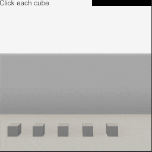
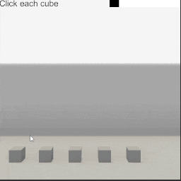

##### UI

# UI Widgets

To create a basic UI, you can use the `UI` add-on, as described in [the previous document](ui.md). TDW also includes subclasses of the `UI` add-on called "UI Widgets". These widgets are separate from the base `UI` add-on because they have internal state (for example, a `ProgressBar` needs to store its own progress value). You can have as many `UI` and UI Widget add-ons as you want in a single `c.add_ons` list.

Because UI widgets are subclasses of `UI`, they inherit the parent class's functions such as `attach_canvas_to_avatar()`.

## Loading Screen

A [`LoadingScreen`](../../python/add_ons/ui_widgets/loading_screen.md) creates a loading screen upon initialization, and removes the loading screen at the end of initialization.

Counterintuitively, a loading screen should always be the *last* add-on in `c.add_ons`. Regardless of where `LoadingScreen` is in `c.add_ons`, its commands will be inserted into the beginning of the list of commands being sent to the build, meaning that the loading screen will always appear before any other commands (such as `add_scene`) are executed. The `LoadingScreen` then "initializes" by *destroying* the loading screen. Add-ons always execute after any commands users sent, and add-ons always execute sequentially--therefore, if the `LoadingScreen` is the last add-on, the last commands in the overall list will be commands telling the build  to destroy the loading screen.

This is a minimal example of how to add a loading screen:

```python
from time import sleep
from tdw.add_ons.ui_widgets.loading_screen import LoadingScreen
from tdw.controller import Controller
from tdw.add_ons.third_person_camera import ThirdPersonCamera


"""
Add a loading screen and then create a scene.
"""

c = Controller()
loading_screen = LoadingScreen()
camera = ThirdPersonCamera(position={"x": 0, "y": 1.8, "z": 0})

# Always add the loading screen last, so that it is destroyed at the right time.
c.add_ons.extend([camera, loading_screen])

# Create the scene.
c.communicate(Controller.get_add_scene(scene_name="mm_craftroom_1a"))

# Wait a few seconds to show that the scene has loaded and the screen has been destroyed.
sleep(5)

c.communicate({"$type": "terminate"})
```

## Progress Bar

A [`ProgressBar`](../../python/add_ons/ui_widgets/progress_bar.md) stores a value between 0 and 1 that can be incremented or set as-needed. In this example, the progress bar increments until all objects in the scene have been clicked. There are many optional parameters that aren't shown in this example, such as parameters to set the size, color, and initial value of the progress bar. To learn more about these values, read [the API documentation](../../python/add_ons/ui_widgets/progress_bar.md).

```python
from math import tan, radians
from tdw.controller import Controller
from tdw.tdw_utils import TDWUtils
from tdw.add_ons.third_person_camera import ThirdPersonCamera
from tdw.add_ons.ui import UI
from tdw.add_ons.mouse import Mouse
from tdw.add_ons.ui_widgets.progress_bar import ProgressBar


class Progress(Controller):
    """
    Add a progress bar that increments every time you click an object until all objects have been clicked.
    """

    def run(self):
        # Clear all add-ons.
        self.add_ons.clear()
        field_of_view = 54
        avatar_z = -1.5
        # Add a camera and enable image capture.
        camera = ThirdPersonCamera(avatar_id="a",
                                   position={"x": 0, "y": 1.8, "z": avatar_z},
                                   field_of_view=field_of_view)
        # Add a UI add-on for the text.
        ui = UI()
        # Add UI text.
        ui.add_text(text="Click each cube",
                    font_size=24,
                    color={"r": 0, "g": 0, "b": 0, "a": 1},
                    position={"x": 0, "y": 0},
                    anchor={"x": 0, "y": 1},
                    pivot={"x": 0, "y": 1})
        # Add the progress bar. This is a subclass of UI that will automatically add a progress bar to the scene.
        progress_bar = ProgressBar(size={"x": 200, "y": 24})
        # Listen to the mouse.
        mouse = Mouse()
        self.add_ons.extend([camera, mouse, ui, progress_bar])
        num_objects = 5
        # Create the scene and add objects.
        commands = [TDWUtils.create_empty_room(12, 12)]
        object_z = 3
        # Get the initial x coordinate.
        x = -tan(radians(field_of_view / 2)) * (object_z + abs(avatar_z)) * 0.8
        dx = 2 * abs(x) / num_objects
        s = 0.3
        object_ids = []
        for i in range(num_objects):
            # Add an object.
            object_id = i
            commands.extend(Controller.get_add_physics_object(model_name="cube",
                                                              object_id=object_id,
                                                              library="models_flex.json",
                                                              position={"x": x, "y": 0, "z": object_z},
                                                              scale_factor={"x": s, "y": s, "z": s},
                                                              kinematic=True))
            object_ids.append(object_id)
            # Increment the x position.
            x += dx
        # Create the scene.
        self.communicate(commands)
        # Wait until all objects are clicked.
        clicked = list()
        while len(clicked) < len(object_ids):
            commands.clear()
            # The mouse is over an object, the mouse button is down, and the object hasn't been clicked yet.
            if mouse.mouse_is_over_object and mouse.left_button_pressed and mouse.mouse_over_object_id not in clicked:
                # Change the color of the cube.
                commands.append({"$type": "set_color",
                                 "id": mouse.mouse_over_object_id,
                                 "color": {"r": 1, "g": 0, "b": 0, "a": 1}})
                # Record the object as clicked.
                clicked.append(mouse.mouse_over_object_id)
                # Set the progress bar's value.
                progress_bar.set_value(len(clicked) / len(object_ids))
            # Continue the simulation.
            self.communicate(commands)
        self.communicate({"$type": "terminate"})


if __name__ == "__main__":
    c = Progress()
    c.run()
```

Result:



## Timer Bar

A [`TimerBar`](../../python/add_ons/ui_widgets/timer_bar.md) is a subclass of `ProgressBar` in which the stored value is automatically decremented over time. `TimerBar` shares most of the optional parameters of `ProgressBar` plus a few more. To learn more about these values, read [the API documentation](../../python/add_ons/ui_widgets/timer_bar.md).

The `TimerBar` must be manually started by calling `TimerBar.start()`.

This example is like the previous example, except that the `ProgressBar` has been replaced with a `TimerBar`. The trial ends with either the user clicks all objects or time runs out.

```python
from math import tan, radians
from tdw.controller import Controller
from tdw.tdw_utils import TDWUtils
from tdw.add_ons.third_person_camera import ThirdPersonCamera
from tdw.add_ons.ui import UI
from tdw.add_ons.mouse import Mouse
from tdw.add_ons.ui_widgets.timer_bar import TimerBar


class Timer(Controller):
    """
    Add a progress bar to the screen. Click all the objects before time runs out.
    """

    def run(self):
        # Clear all add-ons.
        self.add_ons.clear()
        field_of_view = 54
        avatar_z = -1.5
        # Add a camera and enable image capture.
        camera = ThirdPersonCamera(avatar_id="a",
                                   position={"x": 0, "y": 1.8, "z": avatar_z},
                                   field_of_view=field_of_view)
        # Add a UI add-on for the text.
        ui = UI()
        # Add UI text.
        ui.add_text(text="Click each cube",
                    font_size=24,
                    color={"r": 0, "g": 0, "b": 0, "a": 1},
                    position={"x": 0, "y": 0},
                    anchor={"x": 0, "y": 1},
                    pivot={"x": 0, "y": 1})
        # Add the timer bar. This is a subclass of UI that will automatically add a progress bar to the scene.
        timer_bar = TimerBar(total_time=3, size={"x": 200, "y": 24}, left_to_right=False)
        # Listen to the mouse.
        mouse = Mouse()
        self.add_ons.extend([camera, mouse, ui, timer_bar])
        num_objects = 5
        # Create the scene and add objects.
        commands = [TDWUtils.create_empty_room(12, 12)]
        object_z = 3
        # Get the initial x coordinate.
        x = -tan(radians(field_of_view / 2)) * (object_z + abs(avatar_z)) * 0.8
        dx = 2 * abs(x) / num_objects
        s = 0.3
        object_ids = []
        for i in range(num_objects):
            # Add an object.
            object_id = i
            commands.extend(Controller.get_add_physics_object(model_name="cube",
                                                              object_id=object_id,
                                                              library="models_flex.json",
                                                              position={"x": x, "y": 0, "z": object_z},
                                                              scale_factor={"x": s, "y": s, "z": s},
                                                              kinematic=True))
            object_ids.append(object_id)
            # Increment the x position.
            x += dx
        # Create the scene.
        self.communicate(commands)
        # Start the timer.
        timer_bar.start()
        # Wait until all objects are clicked.
        clicked = list()
        done = False
        while not done:
            commands.clear()
            # The mouse is over an object, the mouse button is down, and the object hasn't been clicked yet.
            if mouse.mouse_is_over_object and mouse.left_button_pressed and mouse.mouse_over_object_id not in clicked:
                # Change the color of the cube.
                commands.append({"$type": "set_color",
                                 "id": mouse.mouse_over_object_id,
                                 "color": {"r": 1, "g": 0, "b": 0, "a": 1}})
                # Record the object as clicked.
                clicked.append(mouse.mouse_over_object_id)
            # Continue the simulation.
            self.communicate(commands)
            # The game ends if all objects have been clicked or time ran out.
            done = len(clicked) == len(object_ids) or timer_bar.done
        if len(clicked) == len(object_ids):
            print("You win!")
        else:
            print("You lose! You ran out of time.")
        self.communicate({"$type": "terminate"})


if __name__ == "__main__":
    c = Timer()
    c.run()
```

Result:



***

**This is the last document in the "UI" tutorial.**

[Return to the README](../../../README.md)

***

Example controllers:

- [loading_screen.py](https://github.com/threedworld-mit/tdw/blob/master/Python/example_controllers/ui/loading_screen.py) Add a loading screen and then create a scene.
- [progress.py](https://github.com/threedworld-mit/tdw/blob/master/Python/example_controllers/ui/progress.py) Add a progress bar that increments every time you click an object until all objects have been clicked.
- [timer.py](https://github.com/threedworld-mit/tdw/blob/master/Python/example_controllers/ui/timer.py) Add a timer bar to the screen. Click all the objects before time runs out.

Python API:

- [`LoadingScreen`](../../python/add_ons/ui_widgets/loading_screen.md)
- [`ProgressBar`](../../python/add_ons/ui_widgets/progress_bar.md)
- [`TimerBar`](../../python/add_ons/ui_widgets/timer_bar.md)