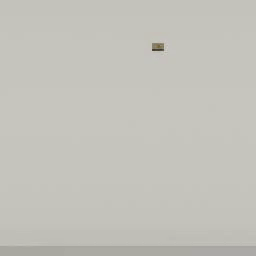

##### Video

# The `CinematicCamera` add-on

The [`CinematicCamera` add-on](../../python/add_ons/cinematic_camera.md) is a [camera (avatar)](../camera_controls/overview.md) with additional "cinematic" functionality. This camera can rotate and move smoothly. `CinematicCamera` isn't meant to be used for image dataset generation, agent training, etc. It is most useful when generating videos in TDW.

The `CinematicCamera` API is very similar to the [`ThirdPersonCamera`](../../python/add_ons/third_person_camera.md) API; this is because they both create avatars and therefore use the some of the same low-level TDW commands. The `CinematicCamera` essentially replaces the instantaneous move/rotate API calls in `ThirdPersonCamera` with API calls that initiate smooth, continuous movement.

Adding a `CinematicCamera` is similar to adding a `ThirdPersonCamera`:

```python
from tdw.controller import Controller
from tdw.tdw_utils import TDWUtils
from tdw.add_ons.cinematic_camera import CinematicCamera
from tdw.add_ons.image_capture import ImageCapture
from tdw.backend.paths import EXAMPLE_CONTROLLER_OUTPUT_PATH

c = Controller()
object_id = c.get_unique_id()
camera = CinematicCamera(position={"x": 2, "y": 1.6, "z": -0.6},
                         look_at=object_id,
                         avatar_id="a")
path = EXAMPLE_CONTROLLER_OUTPUT_PATH.joinpath("cinematic_camera_minimal")
capture = ImageCapture(path=path, avatar_ids=["a"])
print(f"Images will be save to: {path.resolve()}")
c.add_ons.extend([camera, capture])
c.communicate([TDWUtils.create_empty_room(12, 12),
               c.get_add_object(model_name="iron_box",
                                position={"x": 1, "y": 3, "z": -0.5},
                                object_id=object_id)])
c.communicate({"$type": "terminate"})
```

## Constructor parameters

`CinematicCamera` shares many constructor parameters with `ThirdPersonCamera`. It also has some parameters not found in the `ThirdPersonCamera` constructor, and vice versa.

| Parameter       | `ThirdPersonCamera` | `CinematicCamera` |
| --------------- | ------------------- | ----------------- |
| `avatar_id`     | X                   | X                 |
| `position`      | X                   | X                 |
| `look_at`       | X                   | X                 |
| `rotation`      | X                   | X                 |
| `field_of_view` | X                   | X                 |
| `follow_object` |                     | X                 |
| `follow_rotate` |                     | X                 |
| `move_speed`    | X                   |                   |
| `rotate_speed`  | X                   |                   |
| `focus_speed`   | X                   |                   |

- `move_speed` is the directional speed of the camera. This can later be adjusted by setting `camera.move_speed`.
- `rotate_speed` is the angular speed of the camera. This can later be adjusted by setting `camera.rotate_speed`.

`CinematicCamera` API calls *start* a camera motion. It will then continuously move per `c.communicate(commands)` call until the motion is done.

This controller moves a `CinematicCamera` forward by four meters while looking at an object:

```python
from tdw.controller import Controller
from tdw.tdw_utils import TDWUtils
from tdw.add_ons.cinematic_camera import CinematicCamera
from tdw.add_ons.image_capture import ImageCapture
from tdw.backend.paths import EXAMPLE_CONTROLLER_OUTPUT_PATH

c = Controller()
object_id = c.get_unique_id()
camera = CinematicCamera(position={"x": 0, "y": 13, "z": -4},
                         rotation={"x": 80, "y": 0, "z": 0},
                         avatar_id="a")
path = EXAMPLE_CONTROLLER_OUTPUT_PATH.joinpath("cinematic_camera_move")
capture = ImageCapture(path=path, avatar_ids=["a"])
print(f"Images will be save to: {path.resolve()}")
c.add_ons.extend([camera, capture])
c.communicate([TDWUtils.create_empty_room(12, 12),
               {"$type": "set_target_framerate",
                "framerate": 60},
               c.get_add_object(model_name="iron_box",
                                position={"x": 1, "y": 0, "z": 1},
                                object_id=object_id)])
camera.move_to_position({"x": 0, "y": 0, "z": 4}, relative=True)
while camera.moving:
    c.communicate([])
c.communicate({"$type": "terminate"})
```

Result:


This will move the camera to the object, stopping at a given distance and height:

```python
from tdw.controller import Controller
from tdw.tdw_utils import TDWUtils
from tdw.add_ons.cinematic_camera import CinematicCamera
from tdw.add_ons.image_capture import ImageCapture
from tdw.backend.paths import EXAMPLE_CONTROLLER_OUTPUT_PATH

c = Controller()
object_id = c.get_unique_id()
camera = CinematicCamera(position={"x": 0, "y": 13, "z": -4},
                         rotation={"x": 80, "y": 0, "z": 0},
                         avatar_id="a")
path = EXAMPLE_CONTROLLER_OUTPUT_PATH.joinpath("cinematic_camera_move_to_object")
capture = ImageCapture(path=path, avatar_ids=["a"])
print(f"Images will be save to: {path.resolve()}")
c.add_ons.extend([camera, capture])
c.communicate([TDWUtils.create_empty_room(12, 12),
               {"$type": "set_target_framerate",
                "framerate": 60},
               c.get_add_object(model_name="iron_box",
                                position={"x": 1, "y": 0, "z": 1},
                                object_id=object_id)])
camera.move_to_object(target=object_id, offset_distance=4, min_y=3)
while camera.moving:
    c.communicate([])
c.communicate({"$type": "terminate"})
```

Result:



