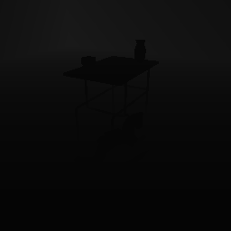
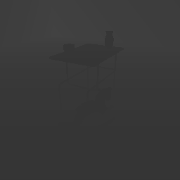
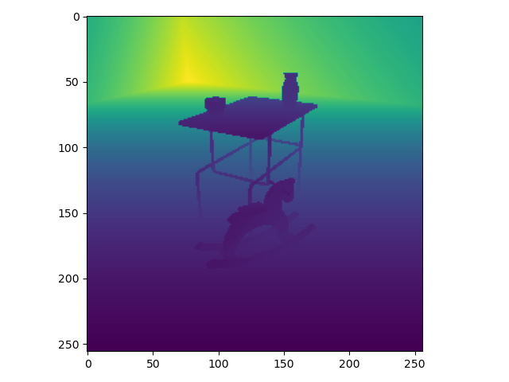

##### Visual Perception

# Depth maps (`_depth` and `_depth_simple` passes)

## The `_depth` pass

The `_depth` pass encodes depth values per pixel into 3 bytes (RGB). The resulting image looks strange but is very accurate:


## The `_depth_simple` pass

The `_depth_simple` pass is similar to the `_depth` pass but encodes depth values to grayscale (1 byte). This makes it less accurate but somewhat easier to use. The first image is a `_depth_simple` image; it is very dark but it *is* accurate. The second image is the same as the first, but with the brightness/contrast adjusted:

 


## Convert a depth pass to depth values

To convert the image into depth values, you can use `TDWUtils.get_depth_values()`:

```python
import matplotlib.pyplot as plt
from tdw.controller import Controller
from tdw.tdw_utils import TDWUtils
from tdw.add_ons.third_person_camera import ThirdPersonCamera
from tdw.add_ons.image_capture import ImageCapture
from tdw.backend.paths import EXAMPLE_CONTROLLER_OUTPUT_PATH

"""
Convert the _depth pass to depth values and plot them using matplotlib.
"""

c = Controller()
object_id_0 = c.get_unique_id()
object_id_1 = c.get_unique_id()
object_id_2 = c.get_unique_id()
object_id_3 = c.get_unique_id()
object_names = {object_id_0: "small_table_green_marble",
                object_id_1: "rh10",
                object_id_2: "jug01",
                object_id_3: "jug05"}

cam = ThirdPersonCamera(position={"x": 2.478, "y": 1.602, "z": 1.412},
                        look_at={"x": 0, "y": 0.2, "z": 0},
                        avatar_id="a")
output_directory = EXAMPLE_CONTROLLER_OUTPUT_PATH.joinpath("depth")
print(f"Images will be saved to: {output_directory.resolve()}")
c.add_ons.append(cam)
cap = ImageCapture(path=output_directory, avatar_ids=["a"], pass_masks=["_depth"])
c.add_ons.append(cap)
c.communicate([TDWUtils.create_empty_room(12, 12),
               c.get_add_object(object_names[object_id_0],
                                object_id=object_id_0),
               c.get_add_object(object_names[object_id_1],
                                position={"x": 0.7, "y": 0, "z": 0.4},
                                rotation={"x": 0, "y": 30, "z": 0},
                                object_id=object_id_1),
               c.get_add_object(model_name=object_names[object_id_2],
                                position={"x": -0.3, "y": 0.9, "z": 0.2},
                                object_id=object_id_2),
               c.get_add_object(object_names[object_id_3],
                                position={"x": 0.3, "y": 0.9, "z": -0.2},
                                object_id=object_id_3)])
images = cap.images["a"]
for i in range(images.get_num_passes()):
    if images.get_pass_mask(i) == "_depth":
        depth_values = TDWUtils.get_depth_values(images.get_image(i), depth_pass="_depth",
                                                 width=images.get_width(), height=images.get_height())
        plt.imshow(depth_values)
        plt.show()
c.communicate({"$type": "terminate"})
```

Result:



## Convert depth values to point clouds

It is possible to convert the `_depth` pass into a point cloud. To this we need to add 3 things to the previous example:

- Send the [`send_camera_matrices`](../../api/command_api.md#send_camera_matrices) command.
- Parse the output data to receive [`CameraMatrices`](../../api/output_data.md#CameraMatrices).
- Call [`TDWUtils.get_point_cloud(depth, filename, camera_matrix)`](../../python/tdw_utils.md).

```python
import matplotlib.pyplot as plt
from tdw.controller import Controller
from tdw.tdw_utils import TDWUtils
from tdw.add_ons.third_person_camera import ThirdPersonCamera
from tdw.add_ons.image_capture import ImageCapture
from tdw.output_data import OutputData, CameraMatrices
from tdw.backend.paths import EXAMPLE_CONTROLLER_OUTPUT_PATH

"""
Convert the _depth pass to depth values, plot them using matplotlib, and generate a point cloud
"""

c = Controller()
object_id_0 = c.get_unique_id()
object_id_1 = c.get_unique_id()
object_id_2 = c.get_unique_id()
object_id_3 = c.get_unique_id()
object_names = {object_id_0: "small_table_green_marble",
                object_id_1: "rh10",
                object_id_2: "jug01",
                object_id_3: "jug05"}

cam = ThirdPersonCamera(position={"x": 2.478, "y": 1.602, "z": 1.412},
                        look_at={"x": 0, "y": 0.2, "z": 0},
                        avatar_id="a")
output_directory = EXAMPLE_CONTROLLER_OUTPUT_PATH.joinpath("depth")
print(f"Images will be saved to: {output_directory.resolve()}")
c.add_ons.append(cam)
cap = ImageCapture(path=output_directory, avatar_ids=["a"], pass_masks=["_depth"])
c.add_ons.append(cap)
resp = c.communicate([TDWUtils.create_empty_room(12, 12),
                      c.get_add_object(object_names[object_id_0],
                                       object_id=object_id_0),
                      c.get_add_object(object_names[object_id_1],
                                       position={"x": 0.7, "y": 0, "z": 0.4},
                                       rotation={"x": 0, "y": 30, "z": 0},
                                       object_id=object_id_1),
                      c.get_add_object(model_name=object_names[object_id_2],
                                       position={"x": -0.3, "y": 0.9, "z": 0.2},
                                       object_id=object_id_2),
                      c.get_add_object(object_names[object_id_3],
                                       position={"x": 0.3, "y": 0.9, "z": -0.2},
                                       object_id=object_id_3),
                      {"$type": "send_camera_matrices",
                       "frequency": "always"}])
# Get the camera matrix.
camera_matrix = None
for i in range(len(resp) - 1):
    r_id = OutputData.get_data_type_id(resp[i])
    if r_id == "cama":
        camera_matrix = CameraMatrices(resp[i]).get_camera_matrix()
images = cap.images["a"]
for i in range(images.get_num_passes()):
    if images.get_pass_mask(i) == "_depth":
        # Get the depth values.
        depth_values = TDWUtils.get_depth_values(images.get_image(i), depth_pass="_depth",
                                                 width=images.get_width(), height=images.get_height())
        
        # Comment out these two lines on a Linux server.
        plt.imshow(depth_values)
        plt.show()
        
        # Convert the depth values to a point cloud.
        point_cloud_filename = str(output_directory.joinpath("point_cloud.txt").resolve())
        TDWUtils.get_point_cloud(depth=depth_values, filename=point_cloud_filename, camera_matrix=camera_matrix)
c.communicate({"$type": "terminate"})
```

***

**Next: [Motion perception (`_flow` pass)](flow.md)**

[Return to the README](../../../README.md)

***

Example controllers:

- [depth.py](https://github.com/threedworld-mit/tdw/blob/master/Python/example_controllers/visual_perception/depth.py) Save a depth pass, get the depth values, and save a point cloud.

Python API:

- [`TDWUtils.get_depth_values(image, depth_pass, width, height, near_plane, far_plane)`](../../python/tdw_utils.md) 
- [`TDWUtils.get_point_cloud(depth, filename, camera_matrix)`](../../python/tdw_utils.md) 

Command API:

- [`send_camera_matrices`](../../api/command_api.md#send_camera_matrices)

Output Data API:

- [`CameraMatrices`](../../api/output_data.md#CameraMatrices)
