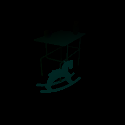
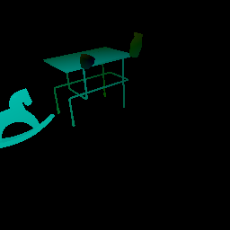
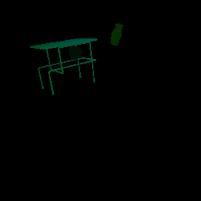

##### Visual Perception

# Motion perception (`_flow` pass)

In the `_flow` pass, pixels are colored according to their motion in relation to the camera. In the example used above, nothing is moving, so the image is totally black. We can add motion to the scene with the [`apply_force_to_object`](../../api/command_api.md#apply_force_to_object) command:

```python
from tdw.controller import Controller
from tdw.tdw_utils import TDWUtils
from tdw.add_ons.image_capture import ImageCapture
from tdw.backend.paths import EXAMPLE_CONTROLLER_OUTPUT_PATH

"""
Get the _flow pass.
"""

c = Controller()
object_id_0 = c.get_unique_id()
object_id_1 = c.get_unique_id()
object_id_2 = c.get_unique_id()
object_id_3 = c.get_unique_id()
object_names = {object_id_0: "small_table_green_marble",
                object_id_1: "rh10",
                object_id_2: "jug01",
                object_id_3: "jug05"}

output_directory = EXAMPLE_CONTROLLER_OUTPUT_PATH.joinpath("flow")

# Enable image capture for the _flow pass.
print(f"Images will be saved to: {output_directory}")
capture = ImageCapture(path=output_directory, pass_masks=["_flow"], avatar_ids=["a"])
c.add_ons.append(capture)

commands = [TDWUtils.create_empty_room(12, 12),
            c.get_add_object(object_names[object_id_0],
                             object_id=object_id_0),
            c.get_add_object(object_names[object_id_1],
                             position={"x": 0.7, "y": 0, "z": 0.4},
                             rotation={"x": 0, "y": 30, "z": 0},
                             object_id=object_id_1),
            c.get_add_object(model_name=object_names[object_id_2],
                             position={"x": -0.3, "y": 0.9, "z": 0.2},
                             object_id=object_id_2),
            c.get_add_object(object_names[object_id_3],
                             position={"x": 0.3, "y": 0.9, "z": -0.2},
                             object_id=object_id_3),
            {"$type": "apply_force_to_object",
             "id": object_id_1,
             "force": {"x": 0, "y": 5, "z": -200}}]

commands.extend(TDWUtils.create_avatar(position={"x": 2.478, "y": 1.602, "z": 1.412},
                                       look_at={"x": 0, "y": 0.2, "z": 0},
                                       avatar_id="a"))
c.communicate(commands)
for i in range(3):
    c.communicate([])
c.communicate({"$type": "terminate"})
```

Result:

  

***

**Next: [Other image passes (`_mask`, `_normals`, and `_albedo` passes)](other_passes.md)**

[Return to the README](../../../README.md)

***

Example controllers:

- [flow.py](https://github.com/threedworld-mit/tdw/blob/master/Python/example_controllers/visual_perception/flow.py) Enable `_flow` pass image capture and apply a force.

Command API:

- [`apply_force_to_object`](../../api/command_api.md#apply_force_to_object)


