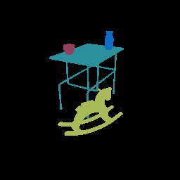

##### Visual Perception

# Instance ID segmentation colors (`_id` pass)

Each object in a TDW scene has a random and unique **segmentation color**. The `_id` capture pass shows the segmentation colors of each object in the scene:

```python
from tdw.controller import Controller
from tdw.tdw_utils import TDWUtils
from tdw.add_ons.third_person_camera import ThirdPersonCamera
from tdw.add_ons.image_capture import ImageCapture
from tdw.backend.paths import EXAMPLE_CONTROLLER_OUTPUT_PATH

c = Controller()
object_id_0 = c.get_unique_id()
object_id_1 = c.get_unique_id()
object_id_2 = c.get_unique_id()
object_id_3 = c.get_unique_id()
object_names = {object_id_0: "small_table_green_marble",
                object_id_1: "rh10",
                object_id_2: "jug01",
                object_id_3: "jug05"}

cam = ThirdPersonCamera(position={"x": 2.478, "y": 1.602, "z": 1.412},
                        look_at={"x": 0, "y": 0.2, "z": 0},
                        avatar_id="a")
output_directory = EXAMPLE_CONTROLLER_OUTPUT_PATH.joinpath("id_pass")
print(f"Images will be saved to: {output_directory.resolve()}")
c.add_ons.append(cam)
cap = ImageCapture(path=output_directory, avatar_ids=["a"], pass_masks=["_id"])
c.add_ons.append(cap)
c.communicate([TDWUtils.create_empty_room(12, 12),
               c.get_add_object(object_names[object_id_0],
                                object_id=object_id_0),
               c.get_add_object(object_names[object_id_1],
                                position={"x": 0.7, "y": 0, "z": 0.4},
                                rotation={"x": 0, "y": 30, "z": 0},
                                object_id=object_id_1),
               c.get_add_object(model_name=object_names[object_id_2],
                                position={"x": -0.3, "y": 0.9, "z": 0.2},
                                object_id=object_id_2),
               c.get_add_object(object_names[object_id_3],
                                position={"x": 0.3, "y": 0.9, "z": -0.2},
                                object_id=object_id_3)])
c.communicate({"$type": "terminate"})
```

Result:



## `SegmentationColors` output data

You can get a mapping of the segmentation colors of each object in the scene with the [`send_segmentation_colors`](../../api/command_api.md#send_segmentation_colors), which will return [`SegmentationColors`](../../api/output_data.md#SegmentationColors) output data. You can use this information to determine which objects are in the image and to what extent they are in the image.

You should only send `send_segmentation_colors` once after adding all objects in the scene. It is static data that won't change per frame.

```python
from collections import Counter
from tdw.controller import Controller
from tdw.tdw_utils import TDWUtils
from tdw.add_ons.third_person_camera import ThirdPersonCamera
from tdw.add_ons.image_capture import ImageCapture
from tdw.backend.paths import EXAMPLE_CONTROLLER_OUTPUT_PATH
from tdw.output_data import OutputData, SegmentationColors

c = Controller()
object_id_0 = c.get_unique_id()
object_id_1 = c.get_unique_id()
object_id_2 = c.get_unique_id()
object_id_3 = c.get_unique_id()
object_names = {object_id_0: "small_table_green_marble",
                object_id_1: "rh10",
                object_id_2: "jug01",
                object_id_3: "jug05"}

cam = ThirdPersonCamera(position={"x": 2.478, "y": 1.602, "z": 1.412},
                        look_at={"x": 0, "y": 0.2, "z": 0},
                        avatar_id="a")
output_directory = EXAMPLE_CONTROLLER_OUTPUT_PATH.joinpath("id_pass")
print(f"Images will be saved to: {output_directory.resolve()}")
c.add_ons.append(cam)
cap = ImageCapture(path=output_directory, avatar_ids=["a"], pass_masks=["_id"])
c.add_ons.append(cap)
resp = c.communicate([TDWUtils.create_empty_room(12, 12),
                      c.get_add_object(object_names[object_id_0],
                                       object_id=object_id_0),
                      c.get_add_object(object_names[object_id_1],
                                       position={"x": 0.7, "y": 0, "z": 0.4},
                                       rotation={"x": 0, "y": 30, "z": 0},
                                       object_id=object_id_1),
                      c.get_add_object(model_name=object_names[object_id_2],
                                       position={"x": -0.3, "y": 0.9, "z": 0.2},
                                       object_id=object_id_2),
                      c.get_add_object(object_names[object_id_3],
                                       position={"x": 0.3, "y": 0.9, "z": -0.2},
                                       object_id=object_id_3),
                      {"$type": "send_segmentation_colors",
                       "frequency": "once"}])
segmentation_colors = dict()
for i in range(len(resp) - 1):
    r_id = OutputData.get_data_type_id(resp[i])
    # Get segmentation color output data.
    if r_id == "segm":
        segm = SegmentationColors(resp[i])
        for j in range(segm.get_num()):
            object_id = segm.get_object_id(j)
            object_name = object_names[object_id]
            segmentation_color = segm.get_object_color(j)
            segmentation_colors[object_id] = segmentation_color

# The total number of pixels in the image.
num_pixels = 256 * 256
# Get PIL images from `ImageCapture`.
pil_image = cap.get_pil_images()["a"]["_id"]
colors = Counter(pil_image.getdata())
# Get the percentage of the image occupied by each object.
for object_id in segmentation_colors:
    segmentation_color = tuple(segmentation_colors[object_id])
    object_name = object_names[object_id]
    if segmentation_color not in colors:
        print(object_name + " is not in the image!")
    else:
        print(object_name + " is in the frame!", float(colors[segmentation_color]) / num_pixels)
c.communicate({"$type": "terminate"})
```

Output:

```
small_table_green_marble is in the frame! 0.04205322265625
rh10 is in the frame! 0.03570556640625
jug01 is in the frame! 0.0045013427734375
jug05 is in the frame! 0.003204345703125
```

## `IdPassSegmentationColors` output data

If you only need to know which segmentation colors are in the image, as opposed to *to what extent* an object is in the image, you can send [`send_id_pass_segmentation_colors`](../../api/command_api.md#send_id_pass_segmentation_colors), which will return [`IdPassSegmentationColors`](../../api/output_data.md#IdPassSegmentationColors).

Sometimes, this is faster than the `_id` pass. The build scans an image for unique colors before creating the output data. The more objects are in the image, the slower the process. If there are only a few objects in the frame, `IdPassSegementationColors` is significantly faster than the `_id` pass but it _can_ be slower if there are many objects in the frame:

```python
from tdw.controller import Controller
from tdw.tdw_utils import TDWUtils
from tdw.output_data import OutputData, SegmentationColors, IdPassSegmentationColors

"""
Get the IDs of each object in the frame.
"""

c = Controller()
object_id_0 = c.get_unique_id()
object_id_1 = c.get_unique_id()
object_id_2 = c.get_unique_id()
object_id_3 = c.get_unique_id()
object_names = {object_id_0: "small_table_green_marble",
                object_id_1: "rh10",
                object_id_2: "jug01",
                object_id_3: "jug05"}

commands = [TDWUtils.create_empty_room(12, 12),
            c.get_add_object(object_names[object_id_0],
                             object_id=object_id_0),
            c.get_add_object(object_names[object_id_1],
                             position={"x": 0.7, "y": 0, "z": 0.4},
                             rotation={"x": 0, "y": 30, "z": 0},
                             object_id=object_id_1),
            c.get_add_object(model_name=object_names[object_id_2],
                             position={"x": -0.3, "y": 0.9, "z": 0.2},
                             object_id=object_id_2),
            c.get_add_object(object_names[object_id_3],
                             position={"x": 0.3, "y": 0.9, "z": -0.2},
                             object_id=object_id_3)]

commands.extend(TDWUtils.create_avatar(position={"x": 2.478, "y": 1.602, "z": 1.412},
                                       look_at={"x": 0, "y": 0.2, "z": 0},
                                       avatar_id="a"))
commands.extend([{"$type": "set_pass_masks",
                  "avatar_id": "a",
                  "pass_masks": ["_id"]},
                 {"$type": "send_segmentation_colors",
                  "frequency": "once"},
                 {"$type": "send_id_pass_segmentation_colors",
                  "frequency": "always"}])
resp = c.communicate(commands)
# Get each segmentation color.
segmentation_colors_per_object = dict()
segmentation_colors_in_image = list()
for i in range(len(resp) - 1):
    r_id = OutputData.get_data_type_id(resp[i])
    # Get segmentation color output data.
    if r_id == "segm":
        segm = SegmentationColors(resp[i])
        for j in range(segm.get_num()):
            object_id = segm.get_object_id(j)
            object_name = object_names[object_id]
            segmentation_color = segm.get_object_color(j)
            segmentation_colors_per_object[object_id] = segmentation_color
    elif r_id == "ipsc":
        ipsc = IdPassSegmentationColors(resp[i])
        for j in range(ipsc.get_num_segmentation_colors()):
            segmentation_colors_in_image.append(ipsc.get_segmentation_color(j))
# Print the ID of each object in the image.
for object_id in segmentation_colors_per_object:
    for i in range(len(segmentation_colors_in_image)):
        if any((segmentation_colors_in_image[i] == j).all() for j in segmentation_colors_per_object.values()):
            print(object_id)
            break
c.communicate({"$type": "terminate"})
```

***

**Next: [Semantic category segmentation colors (`_category` pass)](category.md)**

[Return to the README](../../../README.md)

***

Example controllers:

- [id.py](https://github.com/threedworld-mit/tdw/blob/master/Python/example_controllers/visual_perception/id.py) Example implementation of the `_id` pass.
- [id_pass_segmentation_colors.py](https://github.com/threedworld-mit/tdw/blob/master/Python/example_controllers/visual_perception/id_pass_segmentation_colors.py) Example implementation of `IdPassSegmentationColors` pass.

Command API:

- [`send_segmentation_colors`](../../api/command_api.md#send_segmentation_colors)
- [`send_id_pass_segmentation_colors`](../../api/command_api.md#send_id_pass_segmentation_colors)

Output Data API:

- [`SegmentationColors`](../../api/output_data.md#SegmentationColors)
- [`IdPassSegmentationColors`](../../api/output_data.md#IdPassSegmentationColors)

