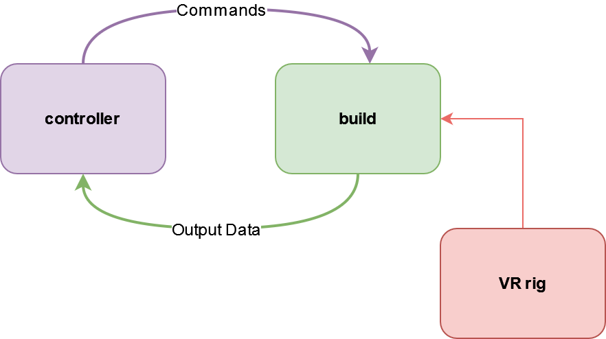

##### Virtual Reality (VR)

# Overview

It is possible for a human to interact with a TDW scene using virtual reality (VR).

## VR hardware, rigs, and agents

- **VR hardware** refers to the physical devices needed for a VR simulation.
- A **VR rig** is a virtual body i.e. simulated hands and head plus the code required to track the rig's position, to pick up objects, and so on. In TDW, a controller adds a VR rig to the scene and thereafter the rig communicates directly with the build.
- A **VR agent** is the human operating the VR hardware and embodying the VR rig.

The hardware/rig that you use can greatly alter what the VR simulation is capable of. Additionally, TDW supports only certain VR rigs. The other documents in this section will cover supported hardware/rig types; if there is no documentation for it, it's not supported.

All VR rigs share some common commands and output data and they all have unique commands and output data as well. To simplify API, each VR rig has a separate TDW add-on class.

## Requirements

*All VR hardware have additional requirements. Read the relevant document to learn more.*

- **All VR setups require Windows.** They won't work on OS X or Linux.
- There can only be one VR headset per computer.
- The VR hardware communicates directly with the build and must therefore be installed on the same computer as the build. The build can route VR output data to the controller like it normally would:

## VR and photorealism

*For more information regarding photorealism, [read this](../photorealism/overview.md).*

In VR, [post-processing](../photorealism/post_processing.md) is disabled for three main reasons: 

1. Photorealism can affect performance. 
2. Some post-processing effects don't work in VR. 
3. Some post-processing settings such as [depth of field](../photorealism/depth_of_field.md) are difficult to dynamically adjust for a VR rig.

Other visual effects such as [HDRI skyboxes](../photorealism/lighting.md) *do* work in VR.

***

**Next: [Oculus Touch](oculus_touch.md)**

[Return to the README](../../../README.md)

