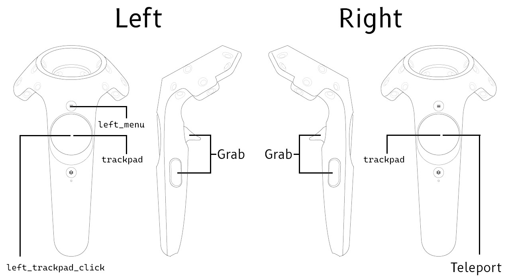

##### Virtual Reality (VR)

# Vive Pro Eye

The **Vive Pro Eye** is a VR rig that uses an HTC Vive Pro Eye headset and controllers. It supports head, hand, and eye tracking, grasping and dropping objects, controller button input, and teleporting around the room.

## Requirements

- Windows 10
- [A compatible GPU](https://www.vive.com/us/support/vive-pro-hmd/category_howto/what-are-the-system-requirements.html)
- [Vive Pro Eye](https://www.vive.com/sea/product/vive-pro-eye/overview/) **This is the only supported Vive headset.** Newer Vive headsets are not supported in TDW.

## Install (do this once)

1. If you haven't done so already, [create a Steam account](https://store.steampowered.com/about/).
2. [Download and install Steam.](https://store.steampowered.com/about/)
3. Open Steam and login.
4. Connect your headset to the PC. Wait for all drivers to install. You should be prompted to install SteamVR; if so, press the "Install SteamVR" button; if not, [install SteamVR manually](https://store.steampowered.com/app/250820/SteamVR/).
5. SteamVR may ask you to calibrate your headset. Do this.
6. [Download and install VivePort.](https://business.vive.com/eu/setup/vive-pro/)
7. [Download and install SRanipal.](https://www.dropbox.com/s/wx23k6oo1ks9i83/VIVE_SRanipalInstaller.msi?dl=0)
8. Put on the headset. You will be prompted to enable and calibrate eye tracking. Do this.

## Setup (do this every time)

*Do the following steps IN ORDER:*

1. Plug your headset into your computer
2. Plug your base trackers into wall outlets and point them at where you're sitting.
3. Turn the controllers on (if they turn themselves off, you can safely turn them back on without restarting this process).
4. Run SteamVR.
5. Run VivePort.
6. Run Sraninpal.

If everything is setup correctly:

- SteamVR will show green/blue icons for the headset, controls, and trackers.
- The Sranipal tray icon will have black or green eyes.

Once you've done this, you can run your TDW controller + build as you normally would.

If you accidentally disconnect the headset, shut *everything* down: SteamVR, VivePort, SRanipal, and TDW. Then, restart them, following the steps listed above.

## Rig description

The Vive Pro Eye rig has two floating hands. The hands can interact with objects either by pushing them (the hands have colliders and Rigidbodies) or by grabbing them. The hands may be "robot" hands or "human" hands. The rig has a small collider on the floor and a head camera. The head, torso, legs, etc. don't have visual meshes or physics colliders.

The Vive Pro Eye rig tracks the position of the head. It also supports eye gaze tracking.

## Controls



*[Source](https://help.r3dt.com/space/KBEN/1562116323)*

- Squeeze with the trigger + side buttons to grab and release objects.

- Click and hold the right trackpad to draw a line towards a position you want to teleport to. Release to teleport.
- The left and right trackpad axis sensors, the left trackpad click action, and the left menu button can optionally receive callbacks. Read the next section to learn how.

## The `ViveProEye` add-on

Add a Vive Pro Eye rig to the scene via the [`ViveProEye` add-on](../../python/add_ons/vive_pro_eye.md):

```python
from tdw.controller import Controller
from tdw.tdw_utils import TDWUtils
from tdw.add_ons.vive_pro_eye import ViveProEye

c = Controller()
vr = ViveProEye()
c.add_ons.append(vr)
c.communicate([TDWUtils.create_empty_room(12, 12),
               c.get_add_object(model_name="rh10",
                                object_id=Controller.get_unique_id(),
                                position={"x": 0, "y": 0, "z": 0.5})])
while True:
    c.communicate([])
```

Result:


### 1. Set the initial position and rotation

Set the initial position and rotation of the VR rig by setting `position` and `rotation` in the constructor or in `vr.reset()`:

```python
from tdw.controller import Controller
from tdw.tdw_utils import TDWUtils
from tdw.add_ons.vive_pro_eye import ViveProEye

c = Controller()
vr = ViveProEye(position={"x": 1, "y": 0, "z": 0}, rotation=30)
c.add_ons.append(vr)
c.communicate([TDWUtils.create_empty_room(12, 12),
               c.get_add_object(model_name="rh10",
                                object_id=Controller.get_unique_id(),
                                position={"x": 0, "y": 0, "z": 0.5})])
while True:
    c.communicate([])
```

### 2. Teleport and rotate the VR rig

You can "teleport" around your scene by clicking down the right control stick; release to teleport to the location at the end of the rendered arc. This can be useful when your virtual scene space is larger than your real-world space, and you cannot simply walk to certain areas within your virtual space.

You can programatically set the rig's position in the scene with `vr.set_position(position)`. This can be useful for initially placing yourself at a particular location within your scene.

You can rotate the rig by physically turning your body. You can programatically rotate the rig with `vr.rotate_by(angle)`. This can be useful for setting the initial rotation of the rig, in order to start off facing a particular direction in your scene. 

### 3. Button presses and control sticks

It can be useful to listen to button presses in order to trigger events in the controller. To do so, call `vr.listen_to_button(button, function)` to listen for a button press. The `button` is a  [`ViveButton`](../../python/vr_data/vive_button.md) value and the `function` is a callback that will be invoke when the button is pressed. You can, for example, invoke a quit function, or a function that sets a boolean that will tell the controller to start a new trial.

Call `vr.listen_to_axis()` to listen to axis movement from the left and right control sticks. These functions must have a single parameter: a numpy array of expected shape (`2`) (the x, y coordinates of the control stick movement delta, ranging from -1 to 1).

This example listens to control stick input to move two joints of a [robot arm](../robots/overview.md). The functions `left_axis(delta)` and `right_axis(delta)` are every frame. They then evaluate `delta` to determine a) if there was movement along a particular axis and if so b) which commands to send. This example also adds a button callback: When the left menu button is pressed, `self.is_done` is set to True which stops the loop in `run()` and ends the simulation:

```python
import numpy as np
from tdw.controller import Controller
from tdw.add_ons.vive_pro_eye import ViveProEye
from tdw.add_ons.robot import Robot
from tdw.tdw_utils import TDWUtils
from tdw.vr_data.vive_button import ViveButton


class ViveProEyeInputCallback(Controller):
    """
    Control a robot arm with the Vive Pro Eye control sticks. Press the left menu button to quit.
    """

    # This controls how fast the joints will rotate.
    SPEED: float = 10

    def __init__(self, port: int = 1071, check_version: bool = True, launch_build: bool = True):
        super().__init__(port=port, check_version=check_version, launch_build=launch_build)
        self.robot: Robot = Robot(name="ur5", position={"x": 0, "y": 0.5, "z": 2})
        self.vr: ViveProEye = ViveProEye()
        # Move the robot joints with the control sticks.
        self.vr.listen_to_axis(is_left=True, function=self.left_axis)
        self.vr.listen_to_axis(is_left=False, function=self.right_axis)
        # Quit when the left button is pressed.
        self.vr.listen_to_button(button=ViveButton.left_menu, function=self.quit)
        self.add_ons.extend([self.robot, self.vr])
        self.done: bool = False

    def run(self) -> None:
        self.communicate(TDWUtils.create_empty_room(12, 12))
        while not self.done:
            self.communicate([])
        self.communicate({"$type": "terminate"})

    def left_axis(self, delta: np.array) -> None:
        if self.robot.joints_are_moving():
            return
        targets = dict()
        # Rotate the shoulder link.
        if abs(delta[0]) > 0:
            shoulder_link_id = self.robot.static.joint_ids_by_name["shoulder_link"]
            shoulder_link_angle = self.robot.dynamic.joints[shoulder_link_id].angles[0]
            targets[shoulder_link_id] = shoulder_link_angle + delta[0] * ViveProEyeInputCallback.SPEED
        self.robot.set_joint_targets(targets=targets)

    def right_axis(self, delta: np.array) -> None:
        if self.robot.joints_are_moving():
            return
        targets = dict()
        # Rotate the upper arm link.
        if abs(delta[0]) > 0:
            upper_arm_link_id = self.robot.static.joint_ids_by_name["upper_arm_link"]
            upper_arm_link_angle = self.robot.dynamic.joints[upper_arm_link_id].angles[0]
            targets[upper_arm_link_id] = upper_arm_link_angle + delta[1] * ViveProEyeInputCallback.SPEED
        self.robot.set_joint_targets(targets=targets)

    def quit(self):
        self.done = True


if __name__ == "__main__":
    c = ViveProEyeInputCallback()
    c.run()
```

Result:


### 4. Graspable objects

By default, objects in TDW are not graspable in VR; they must be explicitly set as such via a command. **The `ViveProEye` add-on sets all non-kinematic objects as graspable in VR.** You can optionally disable this by setting `set_graspable=False` in the constructor:

```python
from tdw.controller import Controller
from tdw.tdw_utils import TDWUtils
from tdw.add_ons.vive_pro_eye import ViveProEye

c = Controller()
vr = ViveProEye(set_graspable=False)
c.add_ons.append(vr)
c.communicate([TDWUtils.create_empty_room(12, 12),
               c.get_add_object(model_name="rh10",
                                object_id=Controller.get_unique_id(),
                                position={"x": 0, "y": 0, "z": 0.5})])
while True:
    c.communicate([])
```

### 5. Composite objects

It is possible to grasp [composite sub-objects](../composite_objects/overview.md) such as the door of a microwave in VR. The VR system automatically finds 'affordance points' for the hands to grasp. The resulting motion may at times be jittery; this is due to the underlying hand tracking and object grasping system:

```python
from tdw.controller import Controller
from tdw.tdw_utils import TDWUtils
from tdw.add_ons.vive_pro_eye import ViveProEye
from tdw.vr_data.vive_button import ViveButton


class ViveProEyeCompositeObject(Controller):
    def __init__(self, port: int = 1071, check_version: bool = True, launch_build: bool = True):
        super().__init__(port=port, check_version=check_version, launch_build=launch_build)
        self.communicate(TDWUtils.create_empty_room(12, 12))
        self.done = False
        self.vr = ViveProEye()
        self.vr.listen_to_button(button=ViveButton.left_menu, function=self.quit)
        self.add_ons.append(self.vr)

    def run(self) -> None:
        self.communicate(Controller.get_add_physics_object(model_name="vm_v5_072_composite",
                                                           object_id=Controller.get_unique_id(),
                                                           position={"x": 0, "y": 0.7, "z": 0.9},
                                                           kinematic=True))
        while not self.done:
            self.communicate([])
        self.communicate({"$type": "terminate"})

    def quit(self):
        self.done = True


if __name__ == "__main__":
    c = ViveProEyeCompositeObject()
    c.run()
```

Result:


### 6. Set specific objects to be non-graspable

If you want *specific* non-kinematic objects to be non-graspable you can set the optional `non_graspable` parameter in the constructor:

```python
from tdw.controller import Controller
from tdw.tdw_utils import TDWUtils
from tdw.add_ons.vive_pro_eye import ViveProEye

c = Controller()
object_id = Controller.get_unique_id()
vr = ViveProEye(non_graspable=[object_id])
c.add_ons.append(vr)
c.communicate([TDWUtils.create_empty_room(12, 12),
               c.get_add_object(model_name="rh10",
                                object_id=object_id,
                                position={"x": 0, "y": 0, "z": 0.5})])
while True:
    c.communicate([])
```

### 7. Loading screen

If you load a new scene, the VR rig will appear to act strangely while the scene is loading. This is harmless but can be unintuitive for new users.

You can "solve" this by adding a loading screen to the VR rig. Call `vr.show_loading_screen(True)` followed by `c.communicate([])` to show the loading screen. The `communicate([])` call should be sent *before* loading the scene. After loading the scene, call `vr.show_loading_screen(False)` followed by `c.communicate([])`

### 8. Hand models

The Vive Pro Eye rig has two hand models:

1. Human-like hands
2. Robot-like hands

Set the hand model with the optional constructor parameter `human_hands` (default is True).

### 9. Reset

Whenever you reset a scene, you must call `vr.reset()` to re-initialize the VR add-on. There are optional parameters. [Read the API documentation for more information.](../../python/add_ons/vive_pro_eye.md)

### 10. Other optional parameters

There are many other optional constructor parameters that are likely less-commonly used. [Read the API documentation for more information.](../../python/add_ons/vive_pro_eye.md)

## Physics

### 1. Collisions

*For more information regarding collision detection, [read this](../physx/collisions.md).*

The Oculus Touch rig can send basic haptics data. The rig has a small collider at its base. Each palm has a Rigidbody and a collider. The base and the palms will be detected if [collision detection is enabled](../physx/collisions.md) as if they were standard TDW objects. If you are using [PyImpact](../audio/py_impact.md) (see below), tapping your hands together will create a faint sound.

### 2. Physics glitches

There are known physics glitches associated with the Vive Eye Pro rig, particularly when grasping objects, the most common being that objects will interpenetrate. There are several overlapping causes for this:

 By default, all objects in TDW use [the `continuous_dynamic` collision detection mode](../../api/command_api.md#set_object_collision_detection_mode). VR simulations seem to work better when non-kinematic objects use the `discrete` collision detection mode (emphasis on "seem" because there isn't an automated means of testing this behavior). By default, the `ViveProEye` add-on will set the hands of the rig and all graspable objects to `discrete`. There are cases where this won't be desirable because the physics behavior will be different in a VR scene than in a non-VR scene. You can optionally set `discrete_collision_detection=False` in the `ViveProEye` constructor.

Some of the glitchiness is possibly due to how the rig's hands work (they use third-party code), but we haven't yet fully explored to what extent this is true or what can be done to fix it.

Some of the glitchiness is probably due to issues in the PhysX engine itself. In general, models with simpler geometry seem to work better in VR.

## Output data

### 1. Transform data

The `ViveProEye` add-on saves the head, rig base, and hands data per-frame as [`Transform` objects](../../python/object_data/transform.md): `vr.rig`, `vr.head`, `vr.left_hand`, and `vr.right_hand`. For example, to get the position of the left hand: `vr.left_hand.position`.

### 2. Held objects.

`vr.held_left` and `vr.held_right` are arrays of IDs of objects held in the left and right hands. For example, if `vr.held_left == [1]` then object `1` is held by the left hand.

### 3. Images

VR rig cameras are not [avatars](../core_concepts/avatars.md).  You can attach an avatar to a VR rig by setting `attach_avatar=True` in the constructor: `vr = ViveProEye(attach_avatar=True)`.

You can then adjust the camera and capture image data like with any other avatar. The ID of this avatar is always `"vr"`.

For performance reasons, the default width of the avatar's images is 512, which is lower than the resolution of the headset. The height is always scaled proportional to the width. To adjust the pixel width and height ratio, set `avatar_camera_width` and `headset_aspect_ratio` in the constructor.

### 4. Eye tracking data

The `ViveProEye` add-on includes the following eye tracking data:

- `vr.world_eye_data` is a [`ViveEyeData`](../../python/vr_data/vive_eye_data.md) object that include a numpy array describing the origin and direction of the eye gaze ray and eye blinking booleans.
- `vr.local_eye_data` is the same as `vr.world_eye_data`. It, too, is a [`ViveEyeData`](../../python/vr_data/vive_eye_data.md) object, but the eye ray data is relative to the position and rotation of the head.
- `vr.focused_objects` is a list of object IDs that the eyes are looking at. This is handled by [spherecasting](../semantic_states/raycast.md) along the eye ray. You can control the radius of the spherecast by setting the `gaze_radius` parameter in the constructor: `vr = ViveProEye(gaze_radius=0.1)`.

### 5. Disable output data

You can disable output data by setting `output_data=False` in the constructor: `vr = ViveProEye(output_data=False)`

## An example of callbacks and output data

This example is a relatively complicated controller. It is not designed to be a good example of an actual use-case and many of the input/output choices are atypical. Instead, this controller is meant only to showcase how to set up callbacks and read output data:

```python
import numpy as np
from tdw.controller import Controller
from tdw.tdw_utils import TDWUtils
from tdw.add_ons.vive_pro_eye import ViveProEye
from tdw.add_ons.ui import UI
from tdw.vr_data.vive_button import ViveButton
from tdw.output_data import OutputData, Raycast


class ViveProEyeOutputData(Controller):
    """
    An example of how to read the Vive Pro Eye output data.

    - Left trackpad click to apply a force to the cube.
    - Left reset click to quit.
    - Left and right trackpads to change the color of the cube.
    - Look at the cube to show a UI message.
    - Look around to move a marker showing the gaze position.
    """

    def __init__(self, port: int = 1071, check_version: bool = True, launch_build: bool = True):
        super().__init__(port=port, check_version=check_version, launch_build=launch_build)

        # The color of the cube. This will be modified by controller axis events.
        self.color = {"r": 0, "g": 0, "b": 1, "a": 1}
        # Change the color of the cube at this rate.
        self.color_delta = 0.005
        # The ID of the cube.
        self.object_id = Controller.get_unique_id()
        # If True, we'll apply a force to the cube. This gets set in the left trackpad callback function.
        self.apply_force = False
        # If True, quit the simulation. This gets set in the left menu callback function.
        self.done = False

        # Initialize the Vive Pro Eye.
        self.vr = ViveProEye()
        # Do something on left/right axis movement.
        self.vr.listen_to_axis(is_left=True, function=self.left_axis)
        self.vr.listen_to_axis(is_left=False, function=self.right_axis)
        # Do something on button presses.
        self.vr.listen_to_button(button=ViveButton.left_trackpad_click, function=self.left_trackpad)
        self.vr.listen_to_button(button=ViveButton.left_menu, function=self.quit)

        # The `UI` add-on is used to show text if the user is looking at the cube.
        self.ui = UI()
        self.ui.attach_canvas_to_vr_rig()
        self.text_id = self.ui.add_text(text="",
                                        font_size=36,
                                        position={"x": 0, "y": 0},
                                        color={"r": 1, "g": 0, "b": 0, "a": 1},
                                        raycast_target=False)
        self.add_ons.extend([self.vr, self.ui])

    def left_axis(self, axis: np.ndarray):
        # Adjust the cube's color.
        # Notice that we aren't sending a command.
        # This will tell the controller in `run()` to send the relevant command.
        if axis[0] > 0:
            self.color_up("r")
        elif axis[0] < 0:
            self.color_down("r")
        if axis[1] > 0:
            self.color_up("g")
        elif axis[1] < 0:
            self.color_down("g")

    def right_axis(self, axis: np.ndarray):
        # Adjust the cube's color.
        # Notice that we aren't sending a command.
        # This will tell the controller in `run()` to send the relevant command.
        if axis[0] > 0:
            self.color_up("b")
        elif axis[0] < 0:
            self.color_down("b")
        if axis[1] > 0:
            self.color_up("a")
        elif axis[1] < 0:
            self.color_down("a")

    def left_trackpad(self):
        # When the left trackpad is clicked, apply force.
        # Notice that we aren't actually sending a command.
        # This will tell the controller in `run()` to send the relevant command.
        self.apply_force = True

    def quit(self):
        # Quit the simulation.
        # Notice that we aren't sending a command.
        # This will tell the controller in `run()` to send the relevant command.
        self.done = True

    def color_up(self, channel: str):
        self.color[channel] += self.color_delta
        if self.color[channel] > 1:
            self.color[channel] = 1

    def color_down(self, channel: str):
        self.color[channel] -= self.color_delta
        if self.color[channel] < 0:
            self.color[channel] = 0

    def run(self):
        resp = self.communicate([TDWUtils.create_empty_room(12, 12),
                                 Controller.get_add_object(model_name="cube",
                                                           library="models_flex.json",
                                                           object_id=self.object_id,
                                                           position={"x": 0, "y": 0, "z": 0.5}),
                                 {"$type": "scale_object",
                                  "id": self.object_id,
                                  "scale_factor": {"x": 0.2, "y": 0.2, "z": 0.2}}])
        while not self.done:
            # Set the color of the cube.
            commands = [{"$type": "set_color",
                         "id": self.object_id,
                         "color": self.color}]
            # Apply a force to the cube.
            if self.apply_force:
                self.apply_force = False
                commands.append({"$type": "apply_force_to_object",
                                 "force": {"x": 0.25, "y": 0, "z": 0},
                                 "id": self.object_id})
            if self.object_id in self.vr.focused_objects:
                self.ui.set_text(text="I can see the object", ui_id=self.text_id)
            else:
                self.ui.set_text(text="", ui_id=self.text_id)
            # If we have eye tracking data, raycast along the eye ray.
            if self.vr.world_eye_data.valid:
                origin = self.vr.world_eye_data.ray[0]
                direction = self.vr.world_eye_data.ray[1]
                destination = origin + direction * 20
                commands.append({"$type": "send_raycast",
                                 "id": 0,
                                 "origin": TDWUtils.array_to_vector3(origin),
                                 "destination": TDWUtils.array_to_vector3(destination)})
            # If there was a raycast, add a position marker.
            for i in range(len(resp) - 1):
                r_id = OutputData.get_data_type_id(resp[i])
                if r_id == "rayc":
                    raycast = Raycast(resp[i])
                    if raycast.get_hit():
                        point = raycast.get_point()
                        commands.extend([{"$type": "remove_position_markers"},
                                         {"$type": "add_position_marker",
                                          "position": {"x": point[0], "y": point[1], "z": point[2]}}])
            resp = self.communicate(commands)
        self.communicate({"$type": "terminate"})


if __name__ == "__main__":
    c = ViveProEyeOutputData()
    c.run()
```

## Low-level commands

The `ViveProEye` initializes the rig with the following commands:

- [`create_vr_rig`](../../api/command_api.md#create_vr_rig)
- [`set_vr_resolution_scale`](../../api/command_api.md#set_vr_resolution_scale)
- [`set_post_process`](../../api/command_api.md#set_post_process) (Disables post-process)
- [`send_vr_rig`](../../api/command_api.md#send_vr_rig) (Sends [`VRRig`](../../api/output_data.md#VRRig) output data every frame)
- [`attach_avatar_to_vr_rig`](../../api/command_api.md#attach_avatar_to_vr_rig) (If `attach_avatar` in the constructor is True)
- [`set_screen_size`](../../api/command_api.md#set_screen_size) (If `attach_avatar` in the constructor is True; this sets the size of the images captured by the avatar)
- [`send_static_rigidbodies`](../../api/command_api.md#send_static_rigidbodies) (Only once, and only if `set_graspable` in the constructor is True. This will return [`StaticRigidbodies`](../../api/output_data.md#StaticRigidbodies) output data, which is used to set graspable objects)
- [`send_vive_pro_eye`](../../api/command_api.md#send_vive_pro_eye) Requests [`ViveProEye`](../../api/output_data.md#ViveProEye) output data.
- [`set_vive_pro_eye_gaze_radius`](../../api/command_api.md#set_vive_pro_eye_gaze_radius)
-  [`send_static_oculus_touch`](../../api/command_api.md#send_static_oculus_touch) (Sends [`StaticOculusTouch`](../../api/output_data.md#StaticOculusTouch) output data on the first frame; this data happens to be compatible with the Vive Eye Pro, despite the name)

On the second `communicate()` call after initialization:

- Using `StaticRigidbodies` data, send [`set_vr_graspable`](../../api/command_api.md#set_vr_graspable) for each non-kinematic object in the scene.

Position and rotation:

- [`teleport_vr_rig`](../../api/command_api.md#teleport_vr_rig)
- [`rotate_vr_rig_by`](../../api/command_api.md#rotate_vr_rig_by)

Loading screen:

- [`set_vr_loading_screen`](../../api/command_api.md#set_vr_loading_screen)

On the backend, the root body and hands are cached as objects with their own IDs (generated randomly by the build).

***

[Return to the README](../../../README.md)

***

Python API:

- [`ViveProEye`](../../python/add_ons/vive_pro_eye.md)
- [`ViveButton`](../../python/vr_data/vive_button.md)
- [`ViveEyeData`](../../python/vr_data/vive_eye_data.md)
- [`Transform`](../../python/object_data/transform.md)

Example controllers:

- [vive_pro_eye_minimal.py](https://github.com/threedworld-mit/tdw/blob/master/Python/example_controllers/vr/vive_pro_eye_minimal.py) Minimal VR example.
- [vive_pro_eye_input_callbacks.py](https://github.com/threedworld-mit/tdw/blob/master/Python/example_controllers/vr/vive_pro_eye_input_callbacks.py) Button and axis callbacks.
- [vive_pro_eye_composite_object.py](https://github.com/threedworld-mit/tdw/blob/master/Python/example_controllers/vr/vive_pro_eye_composite_object.py) Maniupate a composite object.
- [vive_pro_eye_output_data.py](https://github.com/threedworld-mit/tdw/blob/master/Python/example_controllers/vr/vive_pro_eye_output_data.py) An example of how to read the Vive Pro Eye output data.

Command API:

- [`create_vr_rig`](../../api/command_api.md#create_vr_rig)
- [`set_vr_resolution_scale`](../../api/command_api.md#set_vr_resolution_scale)
- [`set_post_process`](../../api/command_api.md#set_post_process)
- [`send_vr_rig`](../../api/command_api.md#send_vr_rig) 
- [`attach_avatar_to_vr_rig`](../../api/command_api.md#attach_avatar_to_vr_rig)
- [`set_screen_size`](../../api/command_api.md#set_screen_size)
- [`send_static_rigidbodies`](../../api/command_api.md#send_static_rigidbodies)
- [`set_vr_graspable`](../../api/command_api.md#set_vr_graspable)
- [`teleport_vr_rig`](../../api/command_api.md#teleport_vr_rig)
- [`rotate_vr_rig_by`](../../api/command_api.md#rotate_vr_rig_by)
- [`send_static_oculus_touch`](../../api/command_api.md#send_static_oculus_touch)
- [`set_vr_loading_screen`](../../api/command_api.md#set_vr_loading_screen)
- [`send_vive_pro_eye`](../../api/command_api.md#send_vive_pro_eye) 
- [`set_vive_pro_eye_gaze_radius`](../../api/command_api.md#set_vive_pro_eye_gaze_radius)

Output Data:

- [`VRRig`](../../api/output_data.md#VRRig)
- [`ViveProEye`](../../api/output_data.md#ViveProEye)
- [`StaticRigidbodies`](../../api/output_data.md#StaticRigidbodies)
- [`StaticOculusTouch`](../../api/output_data.md#StaticOculusTouch)
