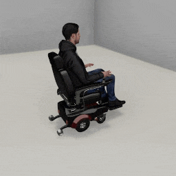

##### Wheelchair Replicants

# Actions

The `WheelchairReplicant` has a pre-defined action space, divided into separate function calls:

- `turn_by(angle)`
- `turn_to(target)`
- `move_by(distance)`
- `move_to(target)`
- `reach_for(target, arm)`
- `reset_arm(arm)`
- `grasp(target, arm)`
- `drop(arm)`
- `look_at(target)`
- `rotate_head(angle, axis)`
- `reset_head()`

Calling one of these action functions will *start* the action but won't actually *do* the action. This means that a Wheelchair Replicant can move concurrently with other agents in a [multi-agent simulation](../multi_agent/overview.md).

This example doesn't actually do anything:

```python
from tdw.controller import Controller
from tdw.tdw_utils import TDWUtils
from tdw.add_ons.wheelchair_replicant import WheelchairReplicant

c = Controller()
replicant = WheelchairReplicant()
c.add_ons.append(replicant)
c.communicate(TDWUtils.create_empty_room(12, 12))

# This doesn't do anything!
replicant.move_by(2)
```

All actions require multiple `communicate()` calls to complete.

In this example, we'll tell the Wheelchair Replicant to move 2 meters forward. We'll also add a [camera](../core_concepts/add_ons.md) to the scene and enable [image capture](../core_concepts/images.md). Note that this example is *not* an optimal way to use a Wheelchair Replicant and that subsequent examples will fix some naïve assumptions we're making. 

```python
from tdw.controller import Controller
from tdw.tdw_utils import TDWUtils
from tdw.add_ons.wheelchair_replicant import WheelchairReplicant
from tdw.add_ons.third_person_camera import ThirdPersonCamera
from tdw.add_ons.image_capture import ImageCapture
from tdw.backend.paths import EXAMPLE_CONTROLLER_OUTPUT_PATH

c = Controller()
replicant = WheelchairReplicant(position={"x": 0, "y": 0, "z": 2})
camera = ThirdPersonCamera(position={"x": 2, "y": 1.6, "z": 1},
                           look_at=replicant.replicant_id,
                           avatar_id="a")
path = EXAMPLE_CONTROLLER_OUTPUT_PATH.joinpath("move_by")
print(f"Images will be saved to: {path}")
capture = ImageCapture(avatar_ids=["a"],
                       path=path)
# Note the order in which the add-ons are added. The replicant needs to be first so that the camera can look at it.
c.add_ons.extend([replicant, camera, capture])
# Create the scene.
c.communicate(TDWUtils.create_empty_room(12, 12))
# Start moving.
replicant.move_by(2)
# Loop for a while.
for i in range(100):
    c.communicate([])
c.communicate({"$type": "terminate"})
```

Result:



## Action Status

In the previous example, we didn't actually check whether the action succeeded or ended.

In the case of `move_by(distance)`, the action can end in success (the Wheelchair Replicant , moved the target distance), or failure ([a collision or near-collision](movement.md)).

Within the add-on, every action is a data object: `replicant.action`. This is a subclass of [`Action`](../../python/replicant/actions/action.md).

When we call `replicant.move_by(distance)`, we actually set the `replicant.action` field, like this:

```
        self.action = MoveBy(distance=distance,
                             dynamic=self.dynamic,
                             collision_detection=self.collision_detection,
                             previous=self._previous_action,
                             reset_arms=reset_arms,
                             reset_arms_duration=reset_arms_duration,
                             arrived_at=arrived_at)
```

The [`Action`](../../python/replicant/actions/action.md) (in this case, a [`MoveBy`](../../python/wheelchair_replicant/actions/move_by.md) action), has a `status` field. While the action is ongoing, `action.status == ActionStatus.ongoing`. If it is ever something else, we know that the action is done.

This example replaces the `for i in range(100):` loop with a `while` loop that continuously checks the action's status for completion. Note that there is an additional, `c.communicate([])` call at the end; this is to send commands that end the action.

```python
from tdw.controller import Controller
from tdw.tdw_utils import TDWUtils
from tdw.add_ons.wheelchair_replicant import WheelchairReplicant
from tdw.add_ons.third_person_camera import ThirdPersonCamera
from tdw.add_ons.image_capture import ImageCapture
from tdw.backend.paths import EXAMPLE_CONTROLLER_OUTPUT_PATH
from tdw.replicant.action_status import ActionStatus

c = Controller()
replicant = WheelchairReplicant(position={"x": 0, "y": 0, "z": 2})
camera = ThirdPersonCamera(position={"x": 2, "y": 1.6, "z": 1},
                           look_at=replicant.replicant_id,
                           avatar_id="a")
path = EXAMPLE_CONTROLLER_OUTPUT_PATH.joinpath("move_by")
print(f"Images will be saved to: {path}")
capture = ImageCapture(avatar_ids=["a"],
                       path=path)
# Note the order in which the add-ons are added. The replicant needs to be first so that the camera can look at it.
c.add_ons.extend([replicant, camera, capture])
# Create the scene. Set the framerate.
c.communicate(TDWUtils.create_empty_room(12, 12))
# Start moving.
replicant.move_by(2)
# Continue walking until the action ends.
while replicant.action.status == ActionStatus.ongoing:
    c.communicate([])
# End the action.
c.communicate([])
print(replicant.action.status)
c.communicate({"$type": "terminate"})
```

Result:

```
ActionStatus.success
```

It is *not* necessary to wrap all Wheelchair Replicant actions in a loop like this. For example, in the context of a multi-agent simulation you won't want to loop like this because you'll want to be checking multiple agent actions at the same time. For the sake of subsequent example code, we know we have only one agent, so this simple loop is good enough for showcasing the rest of the Wheelchair Replicant's behavior.

## Low-level description

Actions are very similar to add-ons in that they have a list of commands that can be returned. Actions are handled within `replicant.on_send(resp)`. Thus, the full sequence of how commands are injected into the controller is:

- The `Action` returns a list of commands to the `WheelchairReplicant`.
- The `WheelchairReplicant` returns that list of commands to the `Controller`.
- The `Controller` appends the `WheelchairReplicant`'s commands to the rest of the commands it's about to send.
- The `Controller` sends all of its commands to the build.

Thus, in the remainder of this description, `communicate()` (from the Controller) should be understood as equivalent to `replicant.on_send(resp)`.

### Initialization

Each [`Action`](../../python/replicant/actions/action.md) has an `initialized` boolean. In most cases, this is initially set to False but sometimes will be True, usually because the action fails before it's allowed to begin.

If `action.initialized = False`, the action is initialized on the first `replicant.on_send(resp)` call. The action sets `initialized = True` and then returns `get_initialization_commands(resp, static, dynamic, image_frequency)`, a list of commands which includes the following:

- [`replicant_step`](../../api/command_api.md#replicant_step)
- Depending on the [`image_frequency`](../../python/replicant/image_frequency.md) value, [`enable_image_sensor`](../../api/command_api.md#enable_image_sensor),  [`send_images`](../../api/command_api.md#send_images), and/or  [`send_camera_matrices`](../../api/command_api.md#send_camera_matrices). 
- Most actions will include additional commands, e.g. commands to download and play an animation.

### Ongoing

Actions have a `status` parameter. An action is ongoing if `status == ActionStatus.ongoing`. An action has  ended if `status` is anything else.

It is possible for an `Action` to end immediately after initialization, in which case its end commands are appended to the list of initialization commands (see below).

If the `Action` is ongoing after initialization, then on every *subsequent* `replicant.on_send(resp)` call, it will return `get_ongoing_commands(resp, static, dynamic)`. The commands returned by this function vary depending on the action but always include [`replicant_step`](../../api/command_api.md#replicant_step). In most cases, the action will read `resp` and `dynamic` to decide which commands to send, whether the action is done, etc.

### End

When the action ends, it returns `get_end_commands(resp, static, dynamic, image_frequency)`, a list of commands which includes the following:

- [`replicant_step`](../../api/command_api.md#replicant_step)
- Depending on the [`image_frequency`](../../python/replicant/image_frequency.md) value, [`enable_image_sensor`](../../api/command_api.md#enable_image_sensor),  [`send_images`](../../api/command_api.md#send_images), and/or  [`send_camera_matrices`](../../api/command_api.md#send_camera_matrices). 
- Some actions will include additional commands, e.g. commands to stop an animation.

## Wheelchair Replicants and Replicants

The action space of the `Replicant` and the `WheelchairReplicant` is nearly the same. The only major difference is that the `WheelchairReplicant` action space doesn't include [`animate(animation)`](../replicants/animations.md).

The behaviors of the actions, for example what actually happens when the agent moves, as well as the API used to control each action, may or may not differ between the `WheelchairReplicant` and the `Replicant` actions. Per-action differences will be covered in subsequent documents in this lesson.

The `Action` base class is used by both the `Replicant` and the `WheelchairReplicant`. Some of the sub-class actions, such as `LookAt`, are use by both agent types as well. `MoveBy` is an example of an action that is *not* the same: `Replicant` uses `tdw.replicant.move_by` and `WheelchairReplicant` uses `tdw.wheelchair_replicant.move_by`. There needs to be two different MoveBy classes because Replicants and Wheelchair Replicants have completely different means of locomotion. The two agent types can share the same action class if their behavior and underlying API commands are exactly the same. Most frontend users will never need to use the underlying `Action` classes, but if you want to create [custom actions](custom_actions.md), be sure to check the API for whether you need to create a subclass of an existing Wheelchair Replicant action, as opposed to an identically-named Replicant action.

In the [Replicant's Action documentation](../replicants/actions.md) there is a section regarding framerate. This section has been omitted in this document. It is still possible to control the framerate of a Wheelchair Replicant simulation, or any TDW simulation, but it's less relevant to the Wheelchair Replicant than a Replicant because its movements aren't animation-driven. Arm articulation *is* still influenced by framerate, and will be covered later in this lesson.

***

**Next: [Output data](output_data.md)**

[Return to the README](../../../README.md)

***

Commands API:

- [`replicant_step`](../../api/command_api.md#replicant_step)
- [`enable_image_sensor`](../../api/command_api.md#enable_image_sensor)
- [`send_images`](../../api/command_api.md#send_images)
- [`send_camera_matrices`](../../api/command_api.md#send_camera_matrices)

Python API:

- [`WheelchairReplicant`](../../python/add_ons/wheelchair_replicant.md)
-  [`Action`](../../python/replicant/actions/action.md)
-  [`MoveBy`](../../python/wheelchair_replicant/actions/move_by.md)