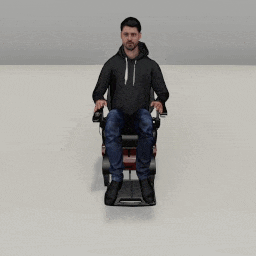
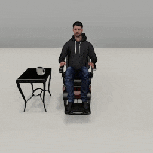
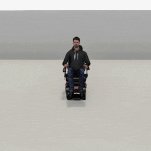
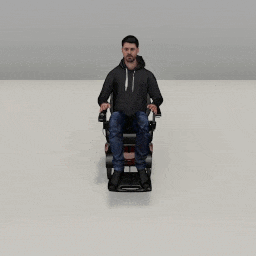

##### Wheelchair Replicants

# Arm articulation, pt. 1: Basics

*Replicant arm articulation is a complex topic. This document covers basic arm articulation actions. [Part 2](arm_articulation_2.md) covers grasping and dropping. [Part 3](arm_articulation_3.md) covers more advanced examples that use some additional optional parameters.*

Unlike [movement](movement.md) actions, which are controlled by pre-recorded animation data, Wheelchair Replicant arm articulation actions are procedural and use inverse kinematic (IK) and the [FinalIK Unity asset](https://root-motion.com/) to solve an end pose, given a target position that a hand is reaching for.

## The `reach_for(target, arm)` action

The Wheelchair Replicant can reach for a target position or object via `reach_for(target, arm)`.

### Reach for a target position

To reach for a target position, set `target` to an x, y, z, dictionary or numpy array, and `arm` to an [`Arm`](../../python/replicant/arm.md) value:

```python
from tdw.controller import Controller
from tdw.tdw_utils import TDWUtils
from tdw.add_ons.wheelchair_replicant import WheelchairReplicant
from tdw.add_ons.third_person_camera import ThirdPersonCamera
from tdw.add_ons.image_capture import ImageCapture
from tdw.replicant.action_status import ActionStatus
from tdw.replicant.arm import Arm
from tdw.backend.paths import EXAMPLE_CONTROLLER_OUTPUT_PATH

c = Controller()
replicant = WheelchairReplicant()
camera = ThirdPersonCamera(position={"x": 0, "y": 1.5, "z": 2.1},
                           look_at=replicant.replicant_id,
                           avatar_id="a")
path = EXAMPLE_CONTROLLER_OUTPUT_PATH.joinpath("wheelchair_replicant_reach_for_position")
print(f"Images will be saved to: {path}")
capture = ImageCapture(avatar_ids=[camera.avatar_id], path=path)
c.add_ons.extend([replicant, camera, capture])
c.communicate(TDWUtils.create_empty_room(12, 12))
replicant.reach_for(target={"x": 0.3, "y": 0.8, "z": 0.3}, arm=Arm.right)
while replicant.action.status == ActionStatus.ongoing:
    c.communicate([])
c.communicate([])
c.communicate({"$type": "terminate"})
```

Result:



### Reach with both hands at the same time

The Wheelchair Replicant can reach with both hands at the same time. To do this, set  `arm` to a list of arms:

```python
from tdw.controller import Controller
from tdw.tdw_utils import TDWUtils
from tdw.add_ons.wheelchair_replicant import WheelchairReplicant
from tdw.add_ons.third_person_camera import ThirdPersonCamera
from tdw.add_ons.image_capture import ImageCapture
from tdw.replicant.action_status import ActionStatus
from tdw.replicant.arm import Arm
from tdw.backend.paths import EXAMPLE_CONTROLLER_OUTPUT_PATH

c = Controller()
replicant = WheelchairReplicant()
camera = ThirdPersonCamera(position={"x": 0, "y": 1.5, "z": 2.1},
                           look_at=replicant.replicant_id,
                           avatar_id="a")
path = EXAMPLE_CONTROLLER_OUTPUT_PATH.joinpath("wheelchair_replicant_reach_for_two_targets")
print(f"Images will be saved to: {path}")
capture = ImageCapture(avatar_ids=[camera.avatar_id], path=path)
c.add_ons.extend([replicant, camera, capture])
c.communicate(TDWUtils.create_empty_room(12, 12))
replicant.reach_for(target=[{"x": -0.3, "y": 0.9, "z": 0.3},
                            {"x": 0.3, "y": 0.9, "z": 0.3}],
                    arm=[Arm.left, Arm.right])
while replicant.action.status == ActionStatus.ongoing:
    c.communicate([])
c.communicate([])
c.communicate({"$type": "terminate"})
```


### Reach for a target object

To reach for a target object, set `target` to an object ID integer:

```python
from tdw.controller import Controller
from tdw.tdw_utils import TDWUtils
from tdw.add_ons.wheelchair_replicant import WheelchairReplicant
from tdw.add_ons.third_person_camera import ThirdPersonCamera
from tdw.add_ons.image_capture import ImageCapture
from tdw.replicant.action_status import ActionStatus
from tdw.replicant.arm import Arm
from tdw.backend.paths import EXAMPLE_CONTROLLER_OUTPUT_PATH

c = Controller()
replicant = WheelchairReplicant()
camera = ThirdPersonCamera(position={"x": 0, "y": 1.5, "z": 2.5},
                           look_at=replicant.replicant_id,
                           avatar_id="a")
path = EXAMPLE_CONTROLLER_OUTPUT_PATH.joinpath("wheelchair_replicant_reach_for_object")
print(f"Images will be saved to: {path}")
capture = ImageCapture(avatar_ids=[camera.avatar_id], path=path)
c.add_ons.extend([replicant, camera, capture])
# Set the object ID.
object_id = Controller.get_unique_id()
commands = [TDWUtils.create_empty_room(12, 12)]
# Add a table and a coffee mug.
commands.extend(Controller.get_add_physics_object(model_name="side_table_wood",
                                                  object_id=Controller.get_unique_id(),
                                                  position={"x": 0.72, "y": 0, "z": 0.1},
                                                  rotation={"x": 0, "y": 90, "z": 0},
                                                  kinematic=True))
commands.extend(Controller.get_add_physics_object(model_name="coffeemug",
                                                  object_id=object_id,
                                                  position={"x": 0.6, "y": 0.6108887, "z": 0.18}))
c.communicate(commands)
# Reach for the mug.
replicant.reach_for(target=object_id, arm=Arm.right)
while replicant.action.status == ActionStatus.ongoing:
    c.communicate([])
c.communicate([])
c.communicate({"$type": "terminate"})

```

Result:



### Affordance points

**Notice that in the previous example, the Wheelchair Replicant does *not* reach for the center of the object.** This is intentional.

Certain models in TDW have "**affordance points**" that are automatically attached to them upon instantiation. Affordance points don't have meshes, colliders, etc.; they are just an transform with a position and rotation. Affordance points are parented to objects, meaning that when the object moves and rotates, the empty objects will follow within the local coordinate space.

When you call `replicant.reach_for(target, arm)`, the Wheelchair Replicant will always try to reach for the *affordance point closest to the hand*. If there are no affordance points, the Wheelchair Replicant will reach for the *bounds position closest to the hand.*

In the above example, `coffeemug` has 4 affordance points, one on each side of the lid. This means that the Replicant will always try to reach for one of the sides of the basket.

Right now, only a small amount of models in TDW have affordance points. To get a list of objects with affordance positions, review `model_record.empty_objects`:

```python
from tdw.librarian import ModelLibrarian

lib = ModelLibrarian()
for record in lib.records:
    if record.do_not_use:
        continue
    if len(record.affordance_points) > 0:
        print(record.name)
```

### Action success and collision detection

The action succeeds if, when it ends, the hand is near the target (see below, `arrived_at`).

The action has several fail states:

- If, at the start of the action, the target is too far away, the action immediately fails with `ActionStatus.cannot_reach`.
- If, at the end of the action, the target is too far away, the action ends with `ActionStatus.failed_to_reach`.
- If, during the action, the Replicant collides with an object, the action ends with `ActionStatus.collision`. To suppress this behavior, set `replicant.collision_detection.objects = False` or add an object ID to `replicant.collision_detection.exclude_objects`

In this example, the Wheelchair Replicant will move to an object, pick it up, move away, and drop the object. Notice that we add the table's ID to `collision_detection.exclude_objects`. This is because the Replicant's lower arm will collide with the table while reaching for the mug.

**Unlike most of our examples controllers, this example is a subclass of `Controller`.** This is much closer to how you should structure your controllers. We've written a `do_action()` function to handle the basic Wheelchair Replicant action loop.

```python
from tdw.controller import Controller
from tdw.tdw_utils import TDWUtils
from tdw.add_ons.third_person_camera import ThirdPersonCamera
from tdw.add_ons.image_capture import ImageCapture
from tdw.add_ons.wheelchair_replicant import WheelchairReplicant
from tdw.replicant.action_status import ActionStatus
from tdw.replicant.arm import Arm
from tdw.backend.paths import EXAMPLE_CONTROLLER_OUTPUT_PATH


class MoveGraspDrop(Controller):
    """
    Move to an object, grasp it, move away, and drop it.
    """

    def __init__(self, port: int = 1071, check_version: bool = True, launch_build: bool = True):
        super().__init__(port=port, check_version=check_version, launch_build=launch_build)
        # Set the replicant and the object IDs here because we need to reference them elsewhere.
        self.replicant = WheelchairReplicant()
        self.table_id = 1
        self.mug_id = 2

    def do_action(self) -> None:
        while self.replicant.action.status == ActionStatus.ongoing:
            self.communicate([])
        self.communicate([])

    def run(self) -> None:
        camera = ThirdPersonCamera(position={"x": -3.5, "y": 1.175, "z": 1},
                                   avatar_id="a",
                                   look_at=self.replicant.replicant_id)
        path = EXAMPLE_CONTROLLER_OUTPUT_PATH.joinpath("wheelchair_replicant_move_grasp_drop")
        print(f"Images will be saved to: {path}")
        capture = ImageCapture(avatar_ids=["a"], path=path)
        self.add_ons.extend([self.replicant, camera, capture])
        # Create the room.
        commands = [TDWUtils.create_empty_room(12, 12)]
        commands.extend(Controller.get_add_physics_object(model_name="side_table_wood",
                                                          object_id=self.table_id,
                                                          position={"x": -1.8, "y": 0, "z": 1.3},
                                                          rotation={"x": 0, "y": 70, "z": 0},
                                                          kinematic=True))
        commands.extend(Controller.get_add_physics_object(model_name="coffeemug",
                                                          object_id=self.mug_id,
                                                          rotation={"x": 0, "y": 180, "z": 0},
                                                          position={"x": -1.6, "y": 0.6108887, "z": 1.358}))
        self.communicate(commands)
        self.replicant.collision_detection.avoid = False
        self.replicant.collision_detection.objects = False
        self.replicant.move_to(target={"x": -1.05, "y": 0, "z": 1.485}, arrived_at=0.1)
        self.do_action()
        self.replicant.reach_for(target=self.mug_id, arm=Arm.left)
        self.do_action()
        self.replicant.grasp(target=self.mug_id, arm=Arm.left, offset=0.2, relative_to_hand=False, angle=0)
        self.do_action()
        self.replicant.move_by(-2, reset_arms=False)
        self.do_action()
        self.replicant.drop(arm=Arm.left)
        self.do_action()
        self.replicant.move_by(-2)
        self.do_action()
        self.communicate({"$type": "terminate"})


if __name__ == "__main__":
    c = MoveGraspDrop()
    c.run()
```

Result:


### Reach for a relative position (the `absolute` parameter)

If `target` is a position (a dictionary or a numpy array, as opposed to a position), it defaults to a world space position. It's often useful, however, to set `absolute=False`, which defines `target` as being relative to the Wheelchair Replicant's position and rotation:

```python
from tdw.controller import Controller
from tdw.tdw_utils import TDWUtils
from tdw.add_ons.wheelchair_replicant import WheelchairReplicant
from tdw.add_ons.third_person_camera import ThirdPersonCamera
from tdw.add_ons.image_capture import ImageCapture
from tdw.replicant.action_status import ActionStatus
from tdw.replicant.arm import Arm
from tdw.backend.paths import EXAMPLE_CONTROLLER_OUTPUT_PATH


def do_action():
    while replicant.action.status == ActionStatus.ongoing:
        c.communicate([])
    c.communicate([])


c = Controller()
replicant = WheelchairReplicant()
camera = ThirdPersonCamera(position={"x": 0, "y": 1.5, "z": 3.5},
                           look_at=replicant.replicant_id,
                           avatar_id="a")
path = EXAMPLE_CONTROLLER_OUTPUT_PATH.joinpath("wheelchair_replicant_reach_for_relative")
print(f"Images will be saved to: {path}")
capture = ImageCapture(avatar_ids=[camera.avatar_id], path=path)
c.add_ons.extend([replicant, camera, capture])
for rotation in [0, 30, -45]:
    replicant.reset()
    camera.initialized = False
    capture.initialized = False
    c.communicate([{"$type": "load_scene",
                    "scene_name": "ProcGenScene"},
                   TDWUtils.create_empty_room(12, 12)])
    # Turn the Replicant.
    replicant.turn_by(rotation)
    do_action()
    # Reach for a relative target with the right hand.
    replicant.reach_for(target={"x": 0.3, "y": 1, "z": 0.3}, arm=Arm.right, absolute=False)
    do_action()
    print(replicant.action.status)
c.communicate({"$type": "terminate"})
```

Result:



### The `duration` parameter

`duration` is an optional parameter that controls the speed in seconds of the arm motion:

```python
from tdw.controller import Controller
from tdw.tdw_utils import TDWUtils
from tdw.add_ons.wheelchair_replicant import WheelchairReplicant
from tdw.add_ons.third_person_camera import ThirdPersonCamera
from tdw.add_ons.image_capture import ImageCapture
from tdw.replicant.action_status import ActionStatus
from tdw.replicant.arm import Arm
from tdw.backend.paths import EXAMPLE_CONTROLLER_OUTPUT_PATH


c = Controller()
replicant = WheelchairReplicant()
camera = ThirdPersonCamera(position={"x": 0, "y": 1.5, "z": 2.1},
                           look_at=replicant.replicant_id,
                           avatar_id="a")
path = EXAMPLE_CONTROLLER_OUTPUT_PATH.joinpath("wheelchair_replicant_reach_for_position_slow")
print(f"Images will be saved to: {path}")
capture = ImageCapture(avatar_ids=[camera.avatar_id], path=path)
c.add_ons.extend([replicant, camera, capture])
c.communicate(TDWUtils.create_empty_room(12, 12))
replicant.reach_for(target={"x": 0.3, "y": 0.8, "z": 0.3}, arm=Arm.right, duration=1.5)
while replicant.action.status == ActionStatus.ongoing:
    c.communicate([])
c.communicate([])
c.communicate({"$type": "terminate"})
```

### The `scale_duration` parameter

`duration` is measured in seconds. If the simulation is running faster than real life, this will appear too slow. To handle this, the `ReachFor` action dynamically scales the `duration` value in proportion to the actual framerate: `duration *= 60 / (1 / framerate)`. This is usually desirable, but can be suppressed by setting `scale_duration=False`.

### The `arrived_at` parameter

`arrived_at` controls the distance that defines a successful action. If, at the end of the action, the hand is this distance or less from the target position (a position, affordance point, or bounds position), the action is successful.

## The `reset_arm(arm)` action

Reset a Wheelchair Replicant's arm to its neutral position by calling `replicant.reset_arm(arm)`:

```python
from tdw.controller import Controller
from tdw.tdw_utils import TDWUtils
from tdw.add_ons.wheelchair_replicant import WheelchairReplicant
from tdw.add_ons.third_person_camera import ThirdPersonCamera
from tdw.add_ons.image_capture import ImageCapture
from tdw.replicant.action_status import ActionStatus
from tdw.replicant.arm import Arm
from tdw.backend.paths import EXAMPLE_CONTROLLER_OUTPUT_PATH

c = Controller()
replicant = WheelchairReplicant()
camera = ThirdPersonCamera(position={"x": 0, "y": 1.5, "z": 2.5},
                           look_at=replicant.replicant_id,
                           avatar_id="a")
path = EXAMPLE_CONTROLLER_OUTPUT_PATH.joinpath("wheelchair_replicant_reset_arm")
print(f"Images will be saved to: {path}")
capture = ImageCapture(avatar_ids=[camera.avatar_id], path=path)
c.add_ons.extend([replicant, camera, capture])
c.communicate(TDWUtils.create_empty_room(12, 12))
replicant.reach_for(target={"x": 0.3, "y": 0.9, "z": 0.3}, arm=Arm.right)
while replicant.action.status == ActionStatus.ongoing:
    c.communicate([])
c.communicate([])
replicant.reset_arm(arm=Arm.right)
while replicant.action.status == ActionStatus.ongoing:
    c.communicate([])
c.communicate([])
c.communicate({"$type": "terminate"})

```

Result:



The `arm` parameter can be a single value such as `Arm.right` or a list of values, such as `[Arm.left, Arm.right]`, in which case both arms are reset.

### The `duration` parameter

`duration` is an optional parameter that controls the speed in seconds of the arm motion; it works the same way as it does in `reach_for(target, arm)`.

### The `scale_duration` parameter

The `scale_duration` parameter works the same way that it does in `reach_for(target, arm)`.

### Action success and collision detection

The action succeeds when the arm(s) finish resetting. The action can end in `ActionStatus.collision`. The collision detection rules for `reset_arm(arm)` are the same as those for `reach_for(target, arm)`; see above for more information.

The action can't end in `ActionStatus.cannot_reach` or `ActionStatus.failed_to_reach` because the Replicant isn't reaching for a target.

## Low-level description

### The `reach_for(target, arm)` action

`replicant.reach_for(target, arm)` sets `replicant.action` to an [`ReachFor`](../../python/wheelchair_replicant/actions/reach_for.md) action. 

In addition to [the usual `Action` initialization commands](actions.md), `ReachFor` sends [`wheelchair_replicant_reach_for_position`](../../api/command_api.md#wheelchair_replicant_reach_for_position) or [`wheelchair_replicant_reach_for_object`](../../api/command_api.md#wheelchair_replicant_reach_for_object).

The action continues until there is a collision or until `replicant.dynamic.output_action_status != ActionStatus.ongoing` (meaning that the build has signaled that the animation ended).

### The `reset_arm(arm)` action

`replicant.reset_arm(arm)` sets `replicant.action` to an [`ResetArm`](../../python/wheelchair_replicant/actions/reset_arm.md) action. 

In addition to [the usual `Action` initialization commands](actions.md), `ResetArm` sends [`wheelchair_replicant_reset_arm`](../../api/command_api.md#wheelchair_replicant_reset_arm).

The action continues until there is a collision or until `replicant.dynamic.output_action_status == ActionStatus.success` (meaning that the build has signaled that the animation ended).

## Wheelchair Replicants and Replicants

From a user-end perspective, basic Wheelchair Replicant and Replicant arm articulation is mostly the same. The Wheelchair Replicant has, of course, more limited range. It also uses an IK solver that tends to be much simpler but less fluid in motion. The user-end APIs are nearly the same, except that Wheelchair Replicants can't use [IK plans](../replicant/arm_articulation_3.md).

Because the solvers are different, the Wheelchair Replicant and Replicant use actions with identical names that are actually different classes. The Wheelchair Replicant uses `tdw.wheelchair_replicant.actions.reach_for` and `tdw.wheelchair_replicant.actions.reset_arm`, while the Replicant uses `tdw.replicant.actions.reach_for` and `tdw.replicant.actions.reset_arm` .

***

**Next: [Arm articulation, pt. 2: Grasp and drop objects](arm_articulation_2.md)**

[Return to the README](../../../README.md)

***

Example controllers:

- [reach_for_position.py](https://github.com/threedworld-mit/tdw/blob/master/Python/example_controllers/wheelchair_replicant/reach_for_position.py) Reach for a target position.
- [reach_for_object.py](https://github.com/threedworld-mit/tdw/blob/master/Python/example_controllers/wheelchair_replicant/reach_for_object.py) Reach for a target object.
- [reach_for_relative.py](https://github.com/threedworld-mit/tdw/blob/master/Python/example_controllers/wheelchair_replicant/reach_for_relative.py) Reach for a relative target position.
- [reach_for_two_targets.py](https://github.com/threedworld-mit/tdw/blob/master/Python/example_controllers/wheelchair_replicant/reach_for_two_targets.py) Reach for two target positions, one per hand.
- [move_grasp_drop.py](https://github.com/threedworld-mit/tdw/blob/master/Python/example_controllers/wheelchair_replicant/move_grasp_drop.py) Move to an object, grasp it, move away, and drop it.
- [reset_arm.py](https://github.com/threedworld-mit/tdw/blob/master/Python/example_controllers/wheelchair_replicant/reset_arm.py) Reach for a target position and then reset the arm.

Command API:

- [`wheelchair_replicant_reach_for_position`](../../api/command_api.md#wheelchair_replicant_reach_for_position)
- [`wheelchair_replicant_reach_for_object`](../../api/command_api.md#wheelchair_replicant_reach_for_object)
- [`wheelchair_replicant_reset_arm`](../../api/command_api.md#wheelchair_replicant_reset_arm)

Python API:

- [`WheelchairReplicant`](../../python/add_ons/wheelchair_replicant.md)
- [`Arm`](../../python/replicant/arm.md)
- [`CollisionDetection`](../../python/replicant/collision_detection.md)
- [`ModelRecord`](../../python/librarian/model_librarian.md)
- [`ReachFor`](../../python/wheelchair_replicant/actions/reach_for.md)
- [`ResetArm`](../../python/wheelchair_replicant/actions/reset_arm.md)
