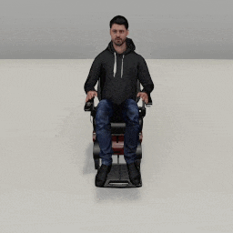
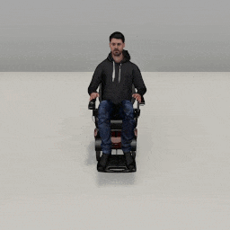
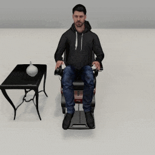
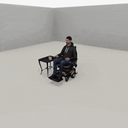

##### Wheelchair Replicants

# Arm articulation, pt. 3: Advanced topics

*Replicant arm articulation is a complex topic. [Part 1](arm_articulation_1.md) covers basic arm articulation actions. [Part 2](arm_articulation_2.md) covers grasping and dropping. This document covers more advanced examples that use some additional optional parameters.*

This document describes how to use the Wheelchair Replicant API's more advanced arm articulation features. All of these features can be found in the actions you're now familiar with (`reach_for(target, arm)`, `grasp(target, arm)` and `drop(arm)`) by setting optional parameters.

## When to set optional parameters

**There is no bounded solution for when to set optional parameters.** There is no way to determine using a simple algorithm which optional parameter, if any, is correct for any given situation, because "correctness" is impossible to define. It is often possible for a Replicant to achieve a desired behavior without using an optional parameters, or by using several different combinations. It is up to the user or the training system to decide how to best use the full capabilities of the Replicant arm articulation API.

## `reach_for(target, arm)` for two arms at the same time

The Wheelchair Replicant can reach for multiple targets at the same time by setting `target` and `arm` to lists of values:

```python
from tdw.controller import Controller
from tdw.tdw_utils import TDWUtils
from tdw.add_ons.wheelchair_replicant import WheelchairReplicant
from tdw.add_ons.third_person_camera import ThirdPersonCamera
from tdw.add_ons.image_capture import ImageCapture
from tdw.replicant.action_status import ActionStatus
from tdw.replicant.arm import Arm
from tdw.backend.paths import EXAMPLE_CONTROLLER_OUTPUT_PATH

c = Controller()
replicant = WheelchairReplicant()
camera = ThirdPersonCamera(position={"x": 0, "y": 1.5, "z": 2.1},
                           look_at=replicant.replicant_id,
                           avatar_id="a")
path = EXAMPLE_CONTROLLER_OUTPUT_PATH.joinpath("wheelchair_replicant_reach_for_two_targets")
print(f"Images will be saved to: {path}")
capture = ImageCapture(avatar_ids=[camera.avatar_id], path=path)
c.add_ons.extend([replicant, camera, capture])
c.communicate(TDWUtils.create_empty_room(12, 12))
replicant.reach_for(target=[{"x": -0.3, "y": 0.9, "z": 0.3},
                            {"x": 0.3, "y": 0.9, "z": 0.3}],
                    arm=[Arm.left, Arm.right])
while replicant.action.status == ActionStatus.ongoing:
    c.communicate([])
c.communicate([])
c.communicate({"$type": "terminate"})
```

Result:



## `reach_for(target, arm)` and make one hand follow the other

During a `reach_for(target, arm)` action, If the `arm` parameter is a single value (e.g. `Arm.left`, not `[Arm.left, Arm.right]`), you can set the optional parameter `offhand_follows=True`. This will make the offhand (the opposite of whatever `arm` is set to) follow the primary hand. If there are multiple targets and/or arms (see above), `offhand_follows` is ignored.

```python
from tdw.controller import Controller
from tdw.tdw_utils import TDWUtils
from tdw.add_ons.wheelchair_replicant import WheelchairReplicant
from tdw.add_ons.third_person_camera import ThirdPersonCamera
from tdw.add_ons.image_capture import ImageCapture
from tdw.replicant.action_status import ActionStatus
from tdw.replicant.arm import Arm
from tdw.backend.paths import EXAMPLE_CONTROLLER_OUTPUT_PATH

c = Controller()
replicant = WheelchairReplicant()
camera = ThirdPersonCamera(position={"x": 0, "y": 1.5, "z": 2.5},
                           look_at=replicant.replicant_id,
                           avatar_id="a")
path = EXAMPLE_CONTROLLER_OUTPUT_PATH.joinpath("wheelchair_replicant_reach_for_follow")
print(f"Images will be saved to: {path}")
capture = ImageCapture(avatar_ids=[camera.avatar_id], path=path)
c.add_ons.extend([replicant, camera, capture])
c.communicate(TDWUtils.create_empty_room(12, 12))
# Reach for a target with the right hand.
replicant.reach_for(target={"x": 0.6, "y": 0.9, "z": 0.3}, arm=Arm.right)
while replicant.action.status == ActionStatus.ongoing:
    c.communicate([])
c.communicate([])
# Reach for a target with the left hand.
replicant.reach_for(target={"x": -0.4, "y": 1, "z": 0.1}, arm=Arm.left)
while replicant.action.status == ActionStatus.ongoing:
    c.communicate([])
c.communicate([])
# Reach for a target with the right hand and have the left hand follow.
replicant.reach_for(target={"x": 0.8, "y": 0.8, "z": 0.3}, arm=Arm.right, offhand_follows=True)
while replicant.action.status == ActionStatus.ongoing:
    c.communicate([])
c.communicate([])
c.communicate({"$type": "terminate"})
```

Result:



## `grasp(target, arm)` and rotate the object

A grasped object will continuously rotate relative to the hand grasping it. By default, the rotation is 90 degrees along the relative pitch axis.

The optional `angle` parameter controls the angle and the optional `axis` parameter controls the axis. The `axis` parameter is a string: `"pitch"`, `"yaw"`, or `"roll"`.

The optional `relative_to_hand` parameter sets whether the rotation is relative to the hand (True) or relative to the Replicant( False). 

If you set either `angle` *or* `axis` to None, the object will maintain its initial rotation even as the hand rotates and the `relative_to_hand` parameter will be ignored.

Some scenarios in which you might want to adjust these parameters:

- If you want the Wheelchair Replicant to hold a staff, set `relative_to_hand=True` so that the angle of the staff is relative to the angle of the wrist.
- If you want the Wheelchair Replicant to hold an object parallel to the floor, set `angle=0`, `axis="pitch"`, and `relative_to_hand=False`.
- If you want to rotate the object using low-level commands such as `rotate_object_by`, set `angle=None` and `axis=None`.

In this example, the Wheelchair Replicant grasps the object in three trials: In the first trial, `angle` and `axis` are set and the rotation is relative to the hand. In the second trial, `angle` and `axis` are set and the rotation is relative to the Wheelchair Replicant. In the third trial, `angle` and `axis` are set the None:

```python
from typing import Optional
from tdw.controller import Controller
from tdw.tdw_utils import TDWUtils
from tdw.add_ons.wheelchair_replicant import WheelchairReplicant
from tdw.add_ons.third_person_camera import ThirdPersonCamera
from tdw.add_ons.image_capture import ImageCapture
from tdw.replicant.action_status import ActionStatus
from tdw.replicant.arm import Arm
from tdw.backend.paths import EXAMPLE_CONTROLLER_OUTPUT_PATH


class GraspRotate(Controller):
    def __init__(self, port: int = 1071, check_version: bool = True, launch_build: bool = True):
        super().__init__(port=port, check_version=check_version, launch_build=launch_build)
        self.replicant = WheelchairReplicant()
        self.camera = ThirdPersonCamera(position={"x": 0, "y": 1.6, "z": 1.9},
                                        look_at=self.replicant.replicant_id,
                                        avatar_id="a")
        path = EXAMPLE_CONTROLLER_OUTPUT_PATH.joinpath("replicant_grasp_rotate")
        print(f"Images will be saved to: {path}")
        self.capture = ImageCapture(avatar_ids=[self.camera.avatar_id], path=path)
        self.add_ons.extend([self.replicant, self.camera, self.capture])

    def do_action(self):
        while self.replicant.action.status == ActionStatus.ongoing:
            self.communicate([])
        self.communicate([])

    def trial(self, angle: Optional[float], axis: Optional[str], relative_to_hand: bool):
        # Reset the add-ons.
        self.replicant.reset()
        self.camera.initialized = False
        self.capture.initialized = False
        # Load the scene.
        object_id = Controller.get_unique_id()
        commands = [{"$type": "load_scene",
                     "scene_name": "ProcGenScene"},
                    TDWUtils.create_empty_room(12, 12)]
        # Add a table and a coffee mug.
        commands.extend(Controller.get_add_physics_object(model_name="side_table_wood",
                                                          object_id=Controller.get_unique_id(),
                                                          position={"x": 0.72, "y": 0, "z": 0.1},
                                                          rotation={"x": 0, "y": 90, "z": 0},
                                                          kinematic=True))
        commands.extend(Controller.get_add_physics_object(model_name="vase_02",
                                                          object_id=object_id,
                                                          position={"x": 0.6, "y": 0.6108887, "z": 0.18}))
        self.communicate(commands)
        self.replicant.reach_for(target=object_id, arm=Arm.right)
        self.do_action()
        self.replicant.grasp(target=object_id, arm=Arm.right, relative_to_hand=relative_to_hand, axis=axis, angle=angle)
        self.do_action()
        self.replicant.reach_for(target={"x": 0.3, "y": 0.8, "z": 0.6}, arm=Arm.right, absolute=False)
        self.do_action()


if __name__ == "__main__":
    c = GraspRotate()
    c.trial(angle=45, axis="pitch", relative_to_hand=True)
    c.trial(angle=45, axis="pitch", relative_to_hand=False)
    c.trial(angle=None, axis=None, relative_to_hand=False)
    c.communicate({"$type": "terminate"})
```

Result:



## `grasp(target, arm)` and offset the object

By default, a grasped object sets its [grasped affordance point](arm_articulation_1.md) (i.e. its pivot) to the same position as the hand holding the object.

For some objects, especially boxier ones that might collide with the Replicant's lower arm, you might want to offset the distance from the pivot to the hand by setting the optional `offset` parameter, for example: `grasp(target, arm, offset=0.3)`. `offset` is a distance. The direction of the offset is always the local up vector from the hand.

## Set the `drop(arm)`  offset

When the Replicant drops an object, the object can optionally be positioned at an offset before falling. This is controlled by the optional `offset` parameter, which can be either a float, dictionary, or numpy array. By default, `offset` is set to `0.1`.

- If `offset` is a float, it is a distance along the object's forward directional vector: `replicant.drop(arm=Arm.right, offset=0.1)`. If you want the object to fall directly downward, set `offset=0`. 
- If `offset` is a dictionary or numpy array, it is a world space position. `replicant.drop(arm=Arm.right, offset={"x": 0, "y": 1.1, "z": 0})`. If you need to object to fall onto a target position, set `offset={"x": position["x"], "y": y, "z": position["z"]}` where `position` is the target position and `y` is the current y coordinate of the object.

## `reach_for(target, arm)` and offset the target by a held object

In many scenarios, you might want the target position to change if the Replicant is holding an object. For example, if you want the Replicant to place a plate on a table, then you will want the Replicant to move the *plate* to the target position rather than the *hand*. You can achieve this by setting two optional parameters in the `reach_for()` action: `from_held` and `held_point`.

`from_held` is a boolean that by default is False. If True, the Replicant will offset the action's target position by a point on the held object. If the hand isn't holding an object, this is ignored.

`held_point` is a string describing a bounds position such as `"bottom"`, `"top"`, etc. that will be used to calculate the offset from the hand. It defaults to `"bottom"` and is only used if `from_held=True` (and if the Replicant is actually holding an object). In the above scenario, where we want the Replicant to place a plate on a table,  we probably want to set `held_point="bottom"`. 

In this example, the Replicant will grasp an object and then reach for the same positioning but applying different offsets per trial. For more information regarding the `grasp()` action, read [the previous document in this lesson](arm_articulation_2.md).

```python
from tdw.controller import Controller
from tdw.tdw_utils import TDWUtils
from tdw.add_ons.wheelchair_replicant import WheelchairReplicant
from tdw.add_ons.third_person_camera import ThirdPersonCamera
from tdw.add_ons.image_capture import ImageCapture
from tdw.replicant.action_status import ActionStatus
from tdw.replicant.arm import Arm
from tdw.backend.paths import EXAMPLE_CONTROLLER_OUTPUT_PATH


class ReachForOffset(Controller):
    def __init__(self, port: int = 1071, check_version: bool = True, launch_build: bool = True):
        super().__init__(port=port, check_version=check_version, launch_build=launch_build)
        self.replicant = WheelchairReplicant()
        self.camera = ThirdPersonCamera(position={"x": -2.4, "y": 2, "z": 3.2},
                                        look_at=self.replicant.replicant_id,
                                        avatar_id="a")
        path = EXAMPLE_CONTROLLER_OUTPUT_PATH.joinpath("wheelchair_replicant_reach_for_offset")
        print(f"Images will be saved to: {path}")
        self.capture = ImageCapture(avatar_ids=[self.camera.avatar_id], path=path)
        self.add_ons.extend([self.replicant, self.camera, self.capture])

    def do_action(self):
        while self.replicant.action.status == ActionStatus.ongoing:
            self.communicate([])
        self.communicate([])

    def trial(self, from_held: bool, held_point: str):
        # Reset the add-ons.
        self.replicant.reset()
        self.camera.initialized = False
        self.capture.initialized = False
        # Load the scene.
        object_id = Controller.get_unique_id()
        commands = [{"$type": "load_scene",
                     "scene_name": "ProcGenScene"},
                    TDWUtils.create_empty_room(12, 12)]
        commands.extend(Controller.get_add_physics_object(model_name="side_table_wood",
                                                          object_id=Controller.get_unique_id(),
                                                          position={"x": 0.72, "y": 0, "z": 0.1},
                                                          rotation={"x": 0, "y": 90, "z": 0},
                                                          kinematic=True))
        commands.extend(Controller.get_add_physics_object(model_name="coffeemug",
                                                          object_id=object_id,
                                                          position={"x": 0.55, "y": 0.6108887, "z": 0.18}))
        self.communicate(commands)
        self.replicant.reach_for(target=object_id, arm=Arm.right)
        self.do_action()
        self.replicant.grasp(target=object_id, arm=Arm.right, relative_to_hand=False, axis="pitch", angle=0)
        self.do_action()
        self.replicant.reach_for(target={"x": 0.1, "y": 1.1, "z": 0.6}, arm=Arm.right, absolute=False,
                                 from_held=from_held, held_point=held_point)
        self.do_action()


if __name__ == "__main__":
    c = ReachForOffset()
    c.trial(from_held=False, held_point="")
    c.trial(from_held=True, held_point="bottom")
    c.trial(from_held=True, held_point="top")
    c.communicate({"$type": "terminate"})
```

Result:



## Wheelchair Replicants and Replicants

Nearly all of these optional parameters exist for both the Wheelchair Replicant and Replicant and behave the same way, despite the some of the underlying actions being different. The only major difference is that `wheelchair_replicant.grasp(target, arm)` lacks an optional `plan` parameter; Wheelchair Replicants can't use IK plans. Because of this, this lesson lacks a Wheelchair Replicant variant of [stacking objects](../replicant/arm_articulation_4.md).

***

**Next: [Head rotation](head_rotationmd)**

[Return to the README](../../../README.md)

***

Example controllers:

- [reach_for_follow.py](https://github.com/threedworld-mit/tdw/blob/master/Python/example_controllers/wheelchair_replicant/reach_for_follow.py) Reach for a target position and have the offhand follow the main hand.
- [reach_for_two_targets.py](https://github.com/threedworld-mit/tdw/blob/master/Python/example_controllers/wheelchair_replicant/reach_for_two_targets.py) Reach for two target positions, one per hand.
- [reach_for_offset.py](https://github.com/threedworld-mit/tdw/blob/master/Python/example_controllers/wheelchair_replicant/reach_for_offset.py) A minimal example of how to reach for a position that is offset by a held object.
- [reach_for_with_plan.py](https://github.com/threedworld-mit/tdw/blob/master/Python/example_controllers/wheelchair_replicant/reach_for_with_plan.py) An example of the difference between a `reach_for()` action with and without a plan.

Python API:

- [`WheelchairReplicant`](../../python/add_ons/wheelchair_replicant.md)
- [`Arm`](../../python/replicant/arm.md)
- [`ReachFor`](../../python/wheelchair_replicant/actions/reach_for.md)
