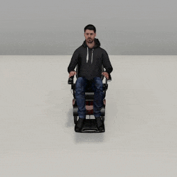

##### Wheelchair Replicants

# Custom actions

[Wheelchair Replicant actions](actions.md) are designed to be easily subclassed. This document will cover two basic strategies for creating custom actions.

## 1. How to create a minimal `DoNothing` action

Every action needs to be a subclass of [`Action`](../../python/replicant/actions/action.md) or a subclass of one of its subclasses. Every action needs to define `get_initialization_commands(resp, static, dynamic, image_frequency)` and `get_ongoing_commands(resp, static, dynamic)`.

This is a minimal action:

```python
from typing import List
from tdw.replicant.actions.action import Action
from tdw.replicant.action_status import ActionStatus
from tdw.replicant.replicant_static import ReplicantStatic
from tdw.replicant.replicant_dynamic import ReplicantDynamic
from tdw.replicant.image_frequency import ImageFrequency


class DoNothing(Action):
    def get_initialization_commands(self, resp: List[bytes], static: ReplicantStatic, dynamic: ReplicantDynamic,
                                    image_frequency: ImageFrequency) -> List[dict]:
        commands = super().get_initialization_commands(resp=resp, static=static, dynamic=dynamic,
                                                       image_frequency=image_frequency)
        return commands

    def get_ongoing_commands(self, resp: List[bytes], static: ReplicantStatic, dynamic: ReplicantDynamic) -> List[dict]:
        self.status = ActionStatus.success
        commands = super().get_ongoing_commands(resp=resp, static=static, dynamic=dynamic)
        return commands
```

- In both functions, `resp` is the latest response from the build. Many actions need this to parse arbitrary output data. `static` is the Wheelchair Replicant's [`ReplicantStatic`](../../python/replicant/replicant_static.md) and `dynamic` is the Wheelchair Replicant's [`ReplicantDynamic`](../../python/replicant/replicant_dynamic.md); these will be handled within the `Replicant` add-on.
- *Always* add `commands = super().get_initialization_commands(resp=resp, static=static, dynamic=dynamic, image_frequency=image_frequency)`. This will set up the camera, image capture, and "Replicant step" correctly.
- *Always* add `commands = super().get_ongoing_commands(resp=resp, static=static, dynamic=dynamic, image_frequency=image_frequency)`. This will set up "Replicant step" correctly.
- In `ongoing_commands(resp, static, dynamic)`, we want the command to end immediately in success, so we added `self.status = ActionStatus.success`.

The "Replicant step" refers to a command that always gets sent from every action on every `communicate()` call: [`replicant_step`](../../api/command_api.md). This command forces the Wheelchair Replicant's underlying [IK system](arm_articulation_1.md) to sync with the physics time step. If you don't call `commands = super().get_initialization_commands()`, `commands = super().get_ongoing_commands()`, etc., your action won't send `replicant_step` and there will likely be bugs due to the IK system desyncing.

You can optionally add `get_end_commands(resp, static, dynamic, image_frequency)`. *This is not necessary.* You only need to add it if you need the action to send extra commands when it ends. This function always gets called when an action ends, regardless of whether it succeeds:

```python
from typing import List
from tdw.replicant.actions.action import Action
from tdw.replicant.action_status import ActionStatus
from tdw.replicant.replicant_static import ReplicantStatic
from tdw.replicant.replicant_dynamic import ReplicantDynamic
from tdw.replicant.image_frequency import ImageFrequency


class DoNothing(Action):
    def get_initialization_commands(self, resp: List[bytes], static: ReplicantStatic, dynamic: ReplicantDynamic,
                                    image_frequency: ImageFrequency) -> List[dict]:
        commands = super().get_initialization_commands(resp=resp, static=static, dynamic=dynamic,
                                                       image_frequency=image_frequency)
        return commands

    def get_ongoing_commands(self, resp: List[bytes], static: ReplicantStatic, dynamic: ReplicantDynamic) -> List[dict]:
        self.status = ActionStatus.success
        commands = super().get_ongoing_commands(resp=resp, static=static, dynamic=dynamic)
        return commands
    
    def get_end_commands(self, resp: List[bytes], static: ReplicantStatic, dynamic: ReplicantDynamic,
                         image_frequency: ImageFrequency) -> List[dict]:
        commands = super().get_end_commands(resp=resp, static=static, dynamic=dynamic, image_frequency=image_frequency)
        return commands
```

To add this action do a controller, simply manually assign `replicant.action = DoNothing()`:

```python
from typing import List
from tdw.tdw_utils import TDWUtils
from tdw.controller import Controller
from tdw.add_ons.wheelchair_replicant import WheelchairReplicant
from tdw.replicant.actions.action import Action
from tdw.replicant.action_status import ActionStatus
from tdw.wheelchair_replicant.wheelchair_replicant_static import WheelchairReplicantStatic
from tdw.wheelchair_replicant.wheelchair_replicant_dynamic import WheelchairReplicantDynamic
from tdw.replicant.image_frequency import ImageFrequency


class DoNothing(Action):
    def get_initialization_commands(self, resp: List[bytes],
                                    static: WheelchairReplicantStatic,
                                    dynamic: WheelchairReplicantDynamic,
                                    image_frequency: ImageFrequency) -> List[dict]:
        commands = super().get_initialization_commands(resp=resp, static=static, dynamic=dynamic, image_frequency=image_frequency)
        return commands

    def get_ongoing_commands(self, resp: List[bytes],
                             static: WheelchairReplicantStatic,
                             dynamic: WheelchairReplicantDynamic) -> List[dict]:
        self.status = ActionStatus.success
        commands = super().get_ongoing_commands(resp=resp, static=static, dynamic=dynamic)
        return commands

    def get_end_commands(self, resp: List[bytes],
                         static: WheelchairReplicantStatic,
                         dynamic: WheelchairReplicantDynamic,
                         image_frequency: ImageFrequency) -> List[dict]:
        commands = super().get_end_commands(resp=resp, static=static, dynamic=dynamic, image_frequency=image_frequency)
        return commands


if __name__ == "__main__":
    c = Controller()
    replicant = WheelchairReplicant()
    c.add_ons.append(replicant)
    c.communicate(TDWUtils.create_empty_room(12, 12))
    replicant.action = DoNothing()
    while replicant.action.status == ActionStatus.ongoing:
        c.communicate([])
    c.communicate([])
    print(replicant.action.status)
    c.communicate({"$type": "terminate"})
```

Output:

```
ActionStatus.success
```

You can wrap the new `DoNothing` action in a Wheelchair Replicant function such as `replicant.do_nothing()`. This is totally optional, though. If you wish to do this, create a custom subclass of `WheelchairReplicant` and add your function:

```python
from typing import List
from tdw.tdw_utils import TDWUtils
from tdw.controller import Controller
from tdw.add_ons.wheelchair_replicant import WheelchairReplicant
from tdw.replicant.actions.action import Action
from tdw.replicant.action_status import ActionStatus
from tdw.replicant.replicant_static import ReplicantStatic
from tdw.replicant.replicant_dynamic import ReplicantDynamic
from tdw.replicant.image_frequency import ImageFrequency


class DoNothing(Action):
    def get_initialization_commands(self, resp: List[bytes], static: ReplicantStatic, dynamic: ReplicantDynamic,
                                    image_frequency: ImageFrequency) -> List[dict]:
        commands = super().get_initialization_commands(resp=resp, static=static, dynamic=dynamic,
                                                       image_frequency=image_frequency)
        return commands

    def get_ongoing_commands(self, resp: List[bytes], static: ReplicantStatic, dynamic: ReplicantDynamic) -> List[dict]:
        self.status = ActionStatus.success
        commands = super().get_ongoing_commands(resp=resp, static=static, dynamic=dynamic)
        return commands
    
    def get_end_commands(self, resp: List[bytes], static: ReplicantStatic, dynamic: ReplicantDynamic,
                         image_frequency: ImageFrequency) -> List[dict]:
        commands = super().get_end_commands(resp=resp, static=static, dynamic=dynamic, image_frequency=image_frequency)
        return commands
    

class MyReplicant(WheelchairReplicant):
    def do_nothing(self) -> None:
        self.action = DoNothing()


if __name__ == "__main__":
    c = Controller()
    replicant = MyReplicant()
    c.add_ons.append(replicant)
    c.communicate(TDWUtils.create_empty_room(12, 12))
    replicant.do_nothing()
    while replicant.action.status == ActionStatus.ongoing:
        c.communicate([])
    c.communicate([])
    print(replicant.action.status)
    c.communicate({"$type": "terminate"})
```

## 2. How to create an action using a state machine and create a `Clap` action

Now we're going to define a much more complicated action: `Clap`, which tells the Wheelchair Replicant to clap its hands.

### 2.1 Create the state machine

We're going to use a *state machine* to handle the motion. A state machine is a basic concept in algorithms that just means that the action has been divided into discrete *states*. In this case, there are three states:

1. The Wheelchair Replicant raises its hands.
2. The Wheelchair Replicant brings its hands together.
3. The Wheelchair Replicant pulls its hands apart.

When state 1 ends, state 2 begins. When state 2 ends, state 3 begins. When state 3 ends, the action ends.

To start, we'll define our state machine as a subclass of `Enum`:

```python
from enum import Enum

class ClapState(Enum):
    raising_hands = 1
    coming_together = 2
    pulling_apart = 4
```

### 2.2 Create the `Clap` constructor

Now we're going to start to write our `Clap` action. Instead of being a subclass of `Action`, this will be a subclass of [`ArmMotion`](../../python/replicant/actions/arm_motion.md), the abstract class used by [`ReachFor`](../../python/wheelchair_replicant/actions/reach_for.md) and [`ResetArm`](../../python/replicant/actions/reset_arm.md). We want to subclass `ArmMotion` because it automatically handles [collision detection](collision_detection.md) for us while the arms are moving.

We also need to define a local position for where the hands we'll meet, which will make a class variable called POSITION:

```python
from enum import Enum
from tdw.replicant.actions.arm_motion import ArmMotion
from tdw.replicant.replicant_dynamic import ReplicantDynamic
from tdw.replicant.collision_detection import CollisionDetection
from tdw.replicant.arm import Arm


class ClapState(Enum):
    raising_hands = 1
    coming_together = 2
    pulling_apart = 4


class Clap(ArmMotion):
    """
    Clap your hands.
    """
    
    POSITION: Dict[str, float] = {"x": 0, "y": 0.9, "z": 0.2}

    def __init__(self, dynamic: ReplicantDynamic, collision_detection: CollisionDetection):
        super().__init__(arms=[Arm.left, Arm.right], dynamic=dynamic, collision_detection=collision_detection,
                         duration=0.25, previous=None, scale_duration=False)
        self.clap_state: ClapState = ClapState.raising_hands
```

- We need to call `super().__init__(...)` because that will call the constructor for `ArmMotion` and set up the rest of the action correctly. We've set `arms` to both arms because you need both hands to clap, and `duration` to a fast speed.
- `self.clap_state` will manage the state machine of this action. When the action begins, the state is `raising_hands`.

### 2.3 Get the initial position of the hands

We need to define where the arms are extending to (in local space) before and after being brought together. We'll do this in a helper function that returns two [`wheelchair_replicant_reach_for_position`](../../api/command_api.md#wheelchair_replicant_reach_for_position) commands:

```python
from enum import Enum
from tdw.replicant.actions.arm_motion import ArmMotion
from tdw.replicant.replicant_dynamic import ReplicantDynamic
from tdw.replicant.collision_detection import CollisionDetection
from tdw.replicant.arm import Arm


class ClapState(Enum):
    raising_hands = 1
    coming_together = 2
    pulling_apart = 4


class Clap(ArmMotion):
    """
    Clap your hands.
    """

    def __init__(self, dynamic: ReplicantDynamic, collision_detection: CollisionDetection):
        super().__init__(arms=[Arm.left, Arm.right], dynamic=dynamic, collision_detection=collision_detection,
                         duration=0.25, previous=None, scale_duration=False)
        self.clap_state: ClapState = ClapState.raising_hands
    
    def get_initial_position_commands(self, static: ReplicantStatic) -> List[dict]:
        commands = []
        # Reach for the initial positions.
        for arm, position in zip(self.arms, [{"x": -0.2, "y": Clap.POSITION["y"], "z": Clap.POSITION["z"]},
                                             {"x": 0.2, "y": Clap.POSITION["y"], "z": Clap.POSITION["z"]}]):
            commands.append({"$type": "wheelchair_replicant_reach_for_position",
                             "id": static.replicant_id,
                             "position": position,
                             "duration": self.duration,
                             "absolute": False,
                             "arm": arm.name})
        return commands
```

### 2.4 Define `get_initialization_commands()`

As with all actions, we need to define `get_initialization_commands(resp, static, dynamic, image_frequency)`. In this case, we'll get the standard initialization commands with `super()` and then extend that list with `get_initial_position_commands(static, dynamic)`:

```python
from typing import List
from enum import Enum
from tdw.replicant.actions.arm_motion import ArmMotion
from tdw.replicant.replicant_static import ReplicantStatic
from tdw.replicant.replicant_dynamic import ReplicantDynamic
from tdw.replicant.collision_detection import CollisionDetection
from tdw.replicant.arm import Arm
from tdw.replicant.image_frequency import ImageFrequency


class ClapState(Enum):
    raising_hands = 1
    coming_together = 2
    pulling_apart = 4


class Clap(ArmMotion):
    """
    Clap your hands.
    """

    def __init__(self, dynamic: ReplicantDynamic, collision_detection: CollisionDetection):
        super().__init__(arms=[Arm.left, Arm.right], dynamic=dynamic, collision_detection=collision_detection,
                         duration=0.25, previous=None, scale_duration=False)
        self.clap_state: ClapState = ClapState.raising_hands
        
    def get_initialization_commands(self, resp: List[bytes], static: ReplicantStatic, dynamic: ReplicantDynamic,
                                    image_frequency: ImageFrequency) -> List[dict]:
        # Get the standard initialization commands.
        commands = super().get_initialization_commands(resp=resp, static=static, dynamic=dynamic,
                                                       image_frequency=image_frequency)
        # Get the initial position of each hand.
        commands.extend(self.get_initial_position_commands(static=static))
        return commands

    def get_initial_position_commands(self, static: ReplicantStatic) -> List[dict]:
        commands = []
        # Reach for the initial positions.
        for arm, position in zip(self.arms, [{"x": -0.2, "y": Clap.POSITION["y"], "z": Clap.POSITION["z"]},
                                             {"x": 0.2, "y": Clap.POSITION["y"], "z": Clap.POSITION["z"]}]):
            commands.append({"$type": "wheelchair_replicant_reach_for_position",
                             "id": static.replicant_id,
                             "position": position,
                             "duration": self.duration,
                             "absolute": False,
                             "arm": arm.name})
        return commands
```

### 2.5 Define `get_ongoing_commands()`

This is where most of any action's logic is handled. This action gets call on every `communicate()` call. We'll use it to evaluate the current state of the Wheelchair Replicant and update the state if needed.

First, we'll call `super()`, which, because this is a subclass of `ArmMotion`, will check for collisions:

```
    def get_ongoing_commands(self, resp: List[bytes], static: ReplicantStatic, dynamic: ReplicantDynamic) -> List[dict]:
        # Continue the action, checking for collisions.
        commands = super().get_ongoing_commands(resp=resp, static=static, dynamic=dynamic)
```

If `self.status != ActionStatus.ongoing`, that doesn't mean that action has *actually* ended; it just means that the current *motion* has ended. Every time the Wheelchair Replicant finishes reaching for a target, the build will signal that the motion is complete. We're going to use that information to check whether we need to start the next *clap state*:

```
    def get_ongoing_commands(self, resp: List[bytes], static: ReplicantStatic, dynamic: ReplicantDynamic) -> List[dict]:
        # Continue the action, checking for collisions.
        commands = super().get_ongoing_commands(resp=resp, static=static, dynamic=dynamic)
        # The motion ended. Decide if we need to do more motions.
        # It's ok in this case if the motion ends in failed_to_reach because we don't need it to be precise.
        if self.status == ActionStatus.success or self.status == ActionStatus.failed_to_reach:
```

The initial clap state is `raising_hands`. If the *motion* ended and the *state* is `raising_hands`, then we need to set our *status* to `ongoing` and the *state* to `coming_together`. We also need to reach for a new target position:

```
    def get_ongoing_commands(self, resp: List[bytes], static: ReplicantStatic, dynamic: ReplicantDynamic) -> List[dict]:
        # Continue the action, checking for collisions.
        commands = super().get_ongoing_commands(resp=resp, static=static, dynamic=dynamic)
        # The motion ended. Decide if we need to do more motions.
        # It's ok in this case if the motion ends in failed_to_reach because we don't need it to be precise.
        if self.status == ActionStatus.success or self.status == ActionStatus.failed_to_reach:
            # We're done raising the hands. Bring the hands together.
            if self.clap_state == ClapState.raising_hands:
                # The action is ongoing.
                self.status = ActionStatus.ongoing
                # The state is coming together.
                self.clap_state = ClapState.coming_together
                # Tell both hands to reach for the target position.
                commands = []
                for arm in self.arms:
                    commands.append({"$type": "wheelchair_replicant_reach_for_position",
                                     "id": static.replicant_id,
                                     "position": Clap.POSITION,
                                     "duration": self.duration,
                                     "absolute": False,
                                     "arm": arm.name})
```

If the *motion* ends and the *state* is `coming_together`, then it's time to pull the hands apart:

```
    def get_ongoing_commands(self, resp: List[bytes], static: ReplicantStatic, dynamic: ReplicantDynamic) -> List[dict]:
        # Continue the action, checking for collisions.
        commands = super().get_ongoing_commands(resp=resp, static=static, dynamic=dynamic)
        # The motion ended. Decide if we need to do more motions.
        # It's ok in this case if the motion ends in failed_to_reach because we don't need it to be precise.
        if self.status == ActionStatus.success or self.status == ActionStatus.failed_to_reach:
            # We're done raising the hands. Bring the hands together.
            if self.clap_state == ClapState.raising_hands:
                # The action is ongoing.
                self.status = ActionStatus.ongoing
                # The state is coming together.
                self.clap_state = ClapState.coming_together
                # Tell both hands to reach for the target position.
                commands = []
                for arm in self.arms:
                    commands.append({"$type": "wheelchair_replicant_reach_for_position",
                                     "id": static.replicant_id,
                                     "position": Clap.POSITION,
                                     "duration": self.duration,
                                     "absolute": False,
                                     "arm": arm.name})
            # We're done moving the hands together. Bring the hands apart again.
            elif self.clap_state == ClapState.coming_together:
                # The action is ongoing.
                self.status = ActionStatus.ongoing
                # The state is pulling apart.
                self.clap_state = ClapState.pulling_apart
                # Reach for the initial positions.
                commands.extend(self.get_initial_position_commands(static=static))
            # If the motion is successful and the state is `pulling_apart`, then we're done.
            elif self.clap_state == ClapState.pulling_apart:
                self.status = ActionStatus.success
```

If the *motion* ends and the *state* is `pulling_apart`, then the action is done.

### 2.6 Use `Clap` in a controller

We'll assign and run `Clap` the same way we assigned and ran `DoNothing`:

```python
from typing import List, Dict
from enum import Enum
from tdw.tdw_utils import TDWUtils
from tdw.controller import Controller
from tdw.add_ons.third_person_camera import ThirdPersonCamera
from tdw.add_ons.image_capture import ImageCapture
from tdw.add_ons.wheelchair_replicant import WheelchairReplicant
from tdw.backend.paths import EXAMPLE_CONTROLLER_OUTPUT_PATH
from tdw.replicant.actions.arm_motion import ArmMotion
from tdw.replicant.action_status import ActionStatus
from tdw.replicant.replicant_static import ReplicantStatic
from tdw.replicant.replicant_dynamic import ReplicantDynamic
from tdw.replicant.collision_detection import CollisionDetection
from tdw.replicant.arm import Arm
from tdw.replicant.image_frequency import ImageFrequency


class ClapState(Enum):
    raising_hands = 1
    coming_together = 2
    pulling_apart = 4


class Clap(ArmMotion):
    """
    Clap your hands.
    """

    POSITION: Dict[str, float] = {"x": 0, "y": 0.9, "z": 0.2}

    def __init__(self, dynamic: ReplicantDynamic, collision_detection: CollisionDetection):
        super().__init__(arms=[Arm.left, Arm.right], dynamic=dynamic, collision_detection=collision_detection,
                         duration=0.25, previous=None, scale_duration=False)
        self.clap_state: ClapState = ClapState.raising_hands

    def get_initialization_commands(self, resp: List[bytes], static: ReplicantStatic, dynamic: ReplicantDynamic,
                                    image_frequency: ImageFrequency) -> List[dict]:
        # Get the standard initialization commands.
        commands = super().get_initialization_commands(resp=resp, static=static, dynamic=dynamic,
                                                       image_frequency=image_frequency)
        # Get the initial position of each hand.
        commands.extend(self.get_initial_position_commands(static=static))
        return commands

    def get_ongoing_commands(self, resp: List[bytes], static: ReplicantStatic, dynamic: ReplicantDynamic) -> List[dict]:
        # Continue the action, checking for collisions.
        commands = super().get_ongoing_commands(resp=resp, static=static, dynamic=dynamic)
        # The motion ended. Decide if we need to do more motions.
        # It's ok in this case if the motion ends in failed_to_reach because we don't need it to be precise.
        if self.status == ActionStatus.success or self.status == ActionStatus.failed_to_reach:
            # We're done raising the hands. Bring the hands together.
            if self.clap_state == ClapState.raising_hands:
                # The action is ongoing.
                self.status = ActionStatus.ongoing
                # The state is coming together.
                self.clap_state = ClapState.coming_together
                # Tell both hands to reach for the target position.
                commands = []
                for arm in self.arms:
                    commands.append({"$type": "wheelchair_replicant_reach_for_position",
                                     "id": static.replicant_id,
                                     "position": Clap.POSITION,
                                     "duration": self.duration,
                                     "absolute": False,
                                     "arm": arm.name})
            # We're done moving the hands together. Bring the hands apart again.
            elif self.clap_state == ClapState.coming_together:
                # The action is ongoing.
                self.status = ActionStatus.ongoing
                # The state is pulling apart.
                self.clap_state = ClapState.pulling_apart
                # Reach for the initial positions.
                commands.extend(self.get_initial_position_commands(static=static))
            # If the motion is successful and the state is `pulling_apart`, then we're done.
            elif self.clap_state == ClapState.pulling_apart:
                self.status = ActionStatus.success
        return commands

    def get_initial_position_commands(self, static: ReplicantStatic) -> List[dict]:
        commands = []
        # Reach for the initial positions.
        for arm, position in zip(self.arms, [{"x": -0.2, "y": Clap.POSITION["y"], "z": Clap.POSITION["z"]},
                                             {"x": 0.2, "y": Clap.POSITION["y"], "z": Clap.POSITION["z"]}]):
            commands.append({"$type": "wheelchair_replicant_reach_for_position",
                             "id": static.replicant_id,
                             "position": position,
                             "duration": self.duration,
                             "absolute": False,
                             "arm": arm.name})
        return commands


if __name__ == "__main__":
    c = Controller()
    replicant = WheelchairReplicant()
    camera = ThirdPersonCamera(position={"x": 0, "y": 1.5, "z": 2.5},
                               look_at=replicant.replicant_id,
                               avatar_id="a")
    path = EXAMPLE_CONTROLLER_OUTPUT_PATH.joinpath("wheelchair_replicant_clap")
    print(f"Images will be saved to: {path}")
    capture = ImageCapture(avatar_ids=[camera.avatar_id], path=path)
    c.add_ons.extend([replicant, camera, capture])
    c.communicate(TDWUtils.create_empty_room(12, 12))
    replicant.action = Clap(dynamic=replicant.dynamic, collision_detection=replicant.collision_detection)
    while replicant.action.status == ActionStatus.ongoing:
        c.communicate([])
    c.communicate([])
    print(replicant.action.status)
    c.communicate({"$type": "terminate"})
```

Result:



## Wheelchair Replicants and Replicants

Custom actions work the same for Wheelchair Replicants and Replicants. They may require different action subclasses, commands, etc. but the underlying logic and best-practices are the same.

The [Replicant version of this document](../replicants/custom_actions.md) includes an additional section that describes how to create a basic pathfinding action. This document doesn't include that section because Wheelchair Replicants don't work well with NavMeshes. For more information, [read the last section of this document](navigation.md).

***

**Next: [Multiple Agents](multiple_agents.md)**

[Return to the README](../../../README.md)

***

Example controllers:

- [minimal_custom_action.py](https://github.com/threedworld-mit/tdw/blob/master/Python/example_controllers/wheelchair_replicant/minimal_custom_action.py) A minimal custom action.
- [clap.py](https://github.com/threedworld-mit/tdw/blob/master/Python/example_controllers/wheelchair_replicant/clap.py) Clap your hands.

Command API:

- [`replicant_step`](../../api/command_api.md#replicant_step)
- [`wheelchair_replicant_reach_for_position`](../../api/command_api.md#wheelchair_replicant_reach_for_position)

Python API:

- [`WheelchairReplicant`](../../python/add_ons/wheelchair_replicant.md)
- [`Action`](../../python/replicant/actions/action.md)
- [`ArmMotion`](../../python/replicant/actions/arm_motion.md)