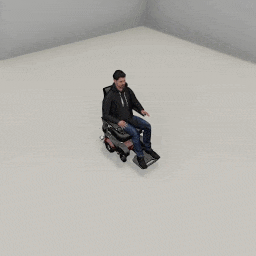
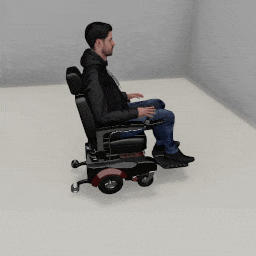
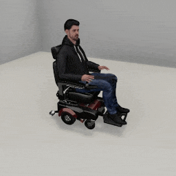

##### Wheelchair Replicants

# Movement

The Wheelchair Replicant can move a distance, turn by an angle, move to a target, or turn to face a target. Move and turn actions are driven by torques applied to the wheelchair's wheels.

## The `move_by(distance)` action

Call [`replicant.move_by(distance)`](../../python/add_ons/wheelchair_replicant.md) to start to move a target distance:

```python
from tdw.controller import Controller
from tdw.tdw_utils import TDWUtils
from tdw.add_ons.wheelchair_replicant import WheelchairReplicant
from tdw.replicant.action_status import ActionStatus

c = Controller()
replicant = WheelchairReplicant()
c.add_ons.append(replicant)
c.communicate(TDWUtils.create_empty_room(12, 12))
replicant.move_by(distance=2)
while replicant.action.status == ActionStatus.ongoing:
    c.communicate([])
c.communicate([])
c.communicate({"$type": "terminate"})
```

If the target distance is < 0, the Wheelchair Replicant will move backwards.

In addition to `distance` there are other optional parameters; [read the API documentation for more information](../../python/add_ons/wheelchair_replicant.md).

### Success and failure

The `move_by(distance)` action succeeds (i.e. `replicant.action.status == ActionStatus.success`) if the Wheelchair Replicant moves the target distance minus a small offset (see the `arrived_at` optional parameter).

The action can end in failure due to a [collision](collision_detection.md).

### Resetting the arms

By default, the Wheelchair Replicant's arms reset at the start of a `move_by(distance)` action. The arms reset while the Wheelchair Replicant is moving, rather than before. For more information regarding arm movement, [read this](arm_articulation_1.md).

```python
from tdw.controller import Controller
from tdw.tdw_utils import TDWUtils
from tdw.add_ons.wheelchair_replicant import WheelchairReplicant
from tdw.add_ons.third_person_camera import ThirdPersonCamera
from tdw.add_ons.image_capture import ImageCapture
from tdw.replicant.action_status import ActionStatus
from tdw.replicant.arm import Arm
from tdw.backend.paths import EXAMPLE_CONTROLLER_OUTPUT_PATH

c = Controller()
replicant = WheelchairReplicant()
camera = ThirdPersonCamera(position={"x": 2, "y": 3, "z": 2.53},
                           look_at=replicant.replicant_id,
                           avatar_id="a")
path = EXAMPLE_CONTROLLER_OUTPUT_PATH.joinpath("wheelchair_replicant_reach_for_move")
print(f"Images will be saved to: {path}")
capture = ImageCapture(avatar_ids=[camera.avatar_id], path=path)
c.add_ons.extend([replicant, camera, capture])
c.communicate(TDWUtils.create_empty_room(12, 12))
replicant.reach_for(target={"x": 0.8, "y": 0.9, "z": 0.3}, arm=Arm.right)
while replicant.action.status == ActionStatus.ongoing:
    c.communicate([])
c.communicate([])
replicant.move_by(distance=3)
while replicant.action.status == ActionStatus.ongoing:
    c.communicate([])
c.communicate([])
c.communicate({"$type": "terminate"})
```

Result:


You might want the Wheelchair Replicant to hold a pose with its arms while walking (for example, if it is [holding an object](arm_articulation_2.md)). If so, you can set the optional parameter `reset_arms=False`:

```python
from tdw.controller import Controller
from tdw.tdw_utils import TDWUtils
from tdw.add_ons.wheelchair_replicant import WheelchairReplicant
from tdw.add_ons.third_person_camera import ThirdPersonCamera
from tdw.add_ons.image_capture import ImageCapture
from tdw.replicant.action_status import ActionStatus
from tdw.replicant.arm import Arm
from tdw.backend.paths import EXAMPLE_CONTROLLER_OUTPUT_PATH

c = Controller()
replicant = WheelchairReplicant()
camera = ThirdPersonCamera(position={"x": 2, "y": 3, "z": 2.53},
                           look_at=replicant.replicant_id,
                           avatar_id="a")
path = EXAMPLE_CONTROLLER_OUTPUT_PATH.joinpath("wheelchair_replicant_reach_for_move")
print(f"Images will be saved to: {path}")
capture = ImageCapture(avatar_ids=[camera.avatar_id], path=path)
c.add_ons.extend([replicant, camera, capture])
c.communicate(TDWUtils.create_empty_room(12, 12))
replicant.reach_for(target={"x": 0.8, "y": 0.9, "z": 0.3}, arm=Arm.right)
while replicant.action.status == ActionStatus.ongoing:
    c.communicate([])
c.communicate([])
replicant.move_by(distance=3,
                  reset_arms=False)
while replicant.action.status == ActionStatus.ongoing:
    c.communicate([])
c.communicate([])
c.communicate({"$type": "terminate"})
```

Result:



The duration of the reset arm motion is controlled by the optional parameter `reset_arms_duration`, which by default is 0.25 seconds. This is then scaled dynamically with the actual framerate: `reset_arms_duration *= 60 / (1 / framerate)`. This is usually desireable as it will match the arm speed relative to the walk animation speed. To suppress this, set `scale_reset_arms_duration=False`.

## The `turn_by(angle)` action

Call [`replicant.turn_by(angle)`](../../python/add_ons/wheelchair_replicant.md) to turn the Wheelchair Replicant by an angle in degrees.

```python
from tdw.controller import Controller
from tdw.tdw_utils import TDWUtils
from tdw.add_ons.wheelchair_replicant import WheelchairReplicant
from tdw.replicant.action_status import ActionStatus

c = Controller()
replicant = WheelchairReplicant()
c.add_ons.append(replicant)
c.communicate(TDWUtils.create_empty_room(12, 12))
replicant.turn_by(angle=40)
while replicant.action.status == ActionStatus.ongoing:
    c.communicate([])
c.communicate([])
c.communicate({"$type": "terminate"})
```

## The `turn_to(target)` action

Call [`replicant.turn_to(target)`](../../python/add_ons/wheelchair_replicant.md) to turn the Replicant to face a target position or object. `target` can be an object ID, a position as an x, y, z dictionary, or a position as a 3-element numpy array:

```python
import numpy as np
from tdw.controller import Controller
from tdw.tdw_utils import TDWUtils
from tdw.add_ons.wheelchair_replicant import WheelchairReplicant
from tdw.replicant.action_status import ActionStatus

c = Controller()
replicant = WheelchairReplicant()
c.add_ons.append(replicant)
object_id = Controller.get_unique_id()
c.communicate([TDWUtils.create_empty_room(12, 12),
               Controller.get_add_object(model_name="rh10",
                                         object_id=object_id,
                                         position={"x": 2, "y": 0, "z": 2.3})])
# Turn to a target position.
replicant.turn_to(target={"x": -1, "y": 0, "z": 0})
while replicant.action.status == ActionStatus.ongoing:
    c.communicate([])
c.communicate([])
# Turn to a target position.
replicant.turn_to(target=np.array([1, 0, 0]))
while replicant.action.status == ActionStatus.ongoing:
    c.communicate([])
c.communicate([])
# Turn to a target object.
replicant.turn_to(target=object_id)
while replicant.action.status == ActionStatus.ongoing:
    c.communicate([])
c.communicate([])
c.communicate({"$type": "terminate"})
```

## The `move_to(target)` action

Call [`replicant.move_to(target)`](../../python/add_ons/wheelchair_replicant.md) to tell the Wheelchair Replicant to move to a target position or object.

`move_to(target)` combines a `turn_to(target)` action with a `move_by(distance)` action. It has all of the same optional parameters and collision detection rules as `move_by(distance)` plus a few more; [read the API documentation for more information](../../python/add_ons/wheelchair_replicant.md).

Like `turn_to(target)`, the `target` can be an object ID, a position as an x, y, z dictionary, or a position as a 3-element numpy array.

This example tells the Wheelchair Replicant to move to a target position behind it:

```python
from tdw.controller import Controller
from tdw.tdw_utils import TDWUtils
from tdw.add_ons.replicant import Replicant
from tdw.add_ons.third_person_camera import ThirdPersonCamera
from tdw.add_ons.image_capture import ImageCapture
from tdw.backend.paths import EXAMPLE_CONTROLLER_OUTPUT_PATH
from tdw.replicant.action_status import ActionStatus

c = Controller()
replicant = Replicant(position={"x": 0, "y": 0, "z": 2})
camera = ThirdPersonCamera(position={"x": 2, "y": 1.6, "z": 1},
                           look_at=replicant.replicant_id,
                           avatar_id="a")
path = EXAMPLE_CONTROLLER_OUTPUT_PATH.joinpath("replicant_move_to")
print(f"Images will be saved to: {path}")
capture = ImageCapture(avatar_ids=["a"],
                       path=path)
c.add_ons.extend([replicant, camera, capture])
# Create the scene.
c.communicate(TDWUtils.create_empty_room(12, 12))
# Start walking.
replicant.move_to(target={"x": 0, "y": 0, "z": -3})
# Continue walking until the action ends.
while replicant.action.status == ActionStatus.ongoing:
    c.communicate([])
c.communicate([])
c.communicate({"$type": "terminate"})
```

Result:


### Resetting the arms

Resetting the arms is controlled exactly the same as in `move_by(distance)` and can be adjusted with the same optional parameters.

## Physics and collision detection

*For more information regarding collision detection, [read this.](collision_detection.md)*

### Obstacle avoidance

By default, `move_by(distance)`, `move_to(target)`, `turn_by(angle)`, and `turn_to(target)` will try to *avoid* obstacles *before* colliding with them.

In this example, the Wheelchair Replicant will start to move to a wall and stop before it hits it:

```python
from tdw.controller import Controller
from tdw.tdw_utils import TDWUtils
from tdw.add_ons.wheelchair_replicant import WheelchairReplicant
from tdw.add_ons.third_person_camera import ThirdPersonCamera
from tdw.add_ons.image_capture import ImageCapture
from tdw.backend.paths import EXAMPLE_CONTROLLER_OUTPUT_PATH
from tdw.replicant.action_status import ActionStatus

c = Controller()
replicant = WheelchairReplicant()
camera = ThirdPersonCamera(position={"x": 2, "y": 1.6, "z": 1},
                           look_at=replicant.replicant_id,
                           avatar_id="a")
path = EXAMPLE_CONTROLLER_OUTPUT_PATH.joinpath("wheelchair_replicant_avoid_wall")
print(f"Images will be saved to: {path}")
capture = ImageCapture(avatar_ids=["a"], path=path)
c.add_ons.extend([replicant, camera, capture])
c.communicate(TDWUtils.create_empty_room(8, 8))
replicant.move_by(10)
while replicant.action.status == ActionStatus.ongoing:
    c.communicate([])
c.communicate([])
print(replicant.action.status)
c.communicate({"$type": "terminate"})
```

Result:



Output:

```
ActionStatus.detected_obstacle
```

This also works with any objects in the Wheelchair Replicant's path:

```python
from tdw.controller import Controller
from tdw.tdw_utils import TDWUtils
from tdw.add_ons.wheelchair_replicant import WheelchairReplicant
from tdw.add_ons.third_person_camera import ThirdPersonCamera
from tdw.add_ons.image_capture import ImageCapture
from tdw.backend.paths import EXAMPLE_CONTROLLER_OUTPUT_PATH
from tdw.replicant.action_status import ActionStatus

c = Controller()
replicant = WheelchairReplicant()
camera = ThirdPersonCamera(position={"x": 2, "y": 1.6, "z": 1},
                           look_at=replicant.replicant_id,
                           avatar_id="a")
path = EXAMPLE_CONTROLLER_OUTPUT_PATH.joinpath("wheelchair_replicant_avoid_object")
print(f"Images will be saved to: {path}")
capture = ImageCapture(avatar_ids=["a"], path=path)
c.add_ons.extend([replicant, camera, capture])
c.communicate([TDWUtils.create_empty_room(8, 8),
               Controller.get_add_object(model_name="rh10",
                                         object_id=Controller.get_unique_id(),
                                         position={"x": 0, "y": 0, "z": 2})])
replicant.move_by(10)
while replicant.action.status == ActionStatus.ongoing:
    c.communicate([])
c.communicate([])
print(replicant.action.status)
c.communicate({"$type": "terminate"})
```

Result:



Output:

```
ActionStatus.detected_obstacle
```

**To disable obstacle avoidance, set `replicant.collision_detection.avoid = False`.** If you do this:

- The Replicant will walk until it collides with non-kinematic objects.
- The Replicant will walk through kinematic objects.
- The Replicant will walk through walls.

### Collision detection and previous actions

By default, the Wheelchair Replicant will fail a move action depending on the result of the *previous* action. If the previous action was a move action, and it was in the same direction, and it ended in a collision, the current move action will immediately fail (because it's assumed that it would also end in a collision).

To override this behavior, set `replicant.collision_detection.previous_was_same = False`.

## Wheel Values

[`MoveBy`](../../python/wheelchair_replicant/actions/move_by.md) and [`TurnBy`](../../python/wheelchair_replicant/actions/turn_by.md) are subclasses of the abstract base class [`WheelchairMotion`](../../python/wheelchair_replicant/actions/wheelchair_motion.md) and share a lot of the same code. The many differences are how success/failure is defined and  *wheel values* that are applied.

Wheel values are values that are stored in a [`WheelValues`](../../python/wheelchair_replicant/wheel_values.md) class and defines the motor torques and brake torques applied to the rear wheels, the distance or angle at which the wheelchair will start to brake, and the steer angle of the front wheels.

By default, each move/turn action will a derive a best-guess [`WheelValues`](../../python/wheelchair_replicant/wheel_values.md) from the target distance or angle. You can optionally also set the `wheel_values` parameter of each move/turn action. This can be useful if, for example, you don't want the wheelchair to turn in-place, or you want the wheelchair to move faster:

```python
from tdw.controller import Controller
from tdw.tdw_utils import TDWUtils
from tdw.add_ons.wheelchair_replicant import WheelchairReplicant
from tdw.add_ons.third_person_camera import ThirdPersonCamera
from tdw.add_ons.image_capture import ImageCapture
from tdw.backend.paths import EXAMPLE_CONTROLLER_OUTPUT_PATH
from tdw.replicant.action_status import ActionStatus
from tdw.wheelchair_replicant.wheel_values import WheelValues


def do_action():
    while replicant.action.status == ActionStatus.ongoing:
        c.communicate([])
    c.communicate([])


c = Controller()
replicant = WheelchairReplicant(position={"x": 0, "y": 0, "z": 0})
camera = ThirdPersonCamera(position={"x": -2, "y": 2, "z": -1.75},
                           look_at=replicant.replicant_id,
                           avatar_id="a")
path = EXAMPLE_CONTROLLER_OUTPUT_PATH.joinpath("wheelchair_replicant_wheel_values")
print(f"Images will be saved to: {path}")
capture = ImageCapture(avatar_ids=["a"],
                       path=path)
c.add_ons.extend([replicant, camera, capture])
c.communicate(TDWUtils.create_empty_room(12, 12))
# Turn by an angle using default wheel values.
replicant.turn_by(angle=-45)
do_action()
# Turn by an angle using custom wheel values.
angle = 45
replicant.turn_by(angle=angle, wheel_values=WheelValues(brake_at=angle - 1,
                                                        brake_torque=5,
                                                        left_motor_torque=20,
                                                        right_motor_torque=-5,
                                                        steer_angle=angle))
do_action()
# Move by a distance using default wheel values.
distance = 1.5
replicant.move_by(distance=distance)
do_action()
# Move by a distance using custom wheel values.
replicant.move_by(distance=distance, wheel_values=WheelValues(brake_at=distance - 0.25,
                                                              brake_torque=5,
                                                              left_motor_torque=2,
                                                              right_motor_torque=2,
                                                              steer_angle=0))
do_action()
c.communicate({"$type": "terminate"})
```

Result:


## Low-level description

`replicant.turn_by(angle)` sets `replicant.action` to a [`TurnBy`](../../python/wheelchair_replicant/actions/turn_by.md) action. `replicant.turn_to(target)` sets `replicant.action` to a [`TurnTo`](../../python/wheelchair_replicant/actions/turn_to.md).

`replicant.move_by(distance)` sets `replicant.action` to a [`MoveBy`](../../python/wheelchair_replicant/actions/move_by.md) action. `replicant.move_to(target)` sets `replicant.action` to a [`MoveTo`](../../python/wheelchair_replicant/actions/move_to.md) action.

All move/turn actions accept or derive a [`WheelchairMotion`](../../python/wheelchair_replicant/actions/wheelchair_motion.md) parameter that is used throughout the action. Each action begins by sending 

In addition to [the usual `Action` initialization commands](actions.md), each action sends [`wheelchair_replicant_reset_arm`](../../api/command_api.md#wheelchair_replicant_reset_arm), [`replicant_reset_head`](../../api/command_api.md#replicant_reset_head),  [`set_wheelchair_motor_torque`](../../api/command_api.md#set_wheelchair_motor_torque),  [`set_wheelchair_brake_torque`](../../api/command_api.md#set_wheelchair_brake_torque), and  [`set_wheelchair_steer_angle`](../../api/command_api.md#set_wheelchair_steer_angle).

Each action will apply a brake torque by sending `set_wheelchair_brake_torque` shortly before the agent arrives at its target distance or angle. 

In addition to [the usual `Action` end commands](actions.md), each action sends [`set_wheelchair_motor_torque`](../../api/command_api.md#set_wheelchair_motor_torque),  [`set_wheelchair_brake_torque`](../../api/command_api.md#set_wheelchair_brake_torque), and  [`set_wheelchair_steer_angle`](../../api/command_api.md#set_wheelchair_steer_angle).

Obstacle avoidance is achieved via overlap shapes. Per `communicate()` call, the action sends [`send_overlap_box`](../../api/command_api.md#send_overlap_box), which returns [`Overlap`](../../api/output_data.md#Overlap) data. The overlap box is cast in front or behind the Replicant, depending on whether it is walking forwards or backwards. If the `Overlap` data includes walls or object IDs, the Replicant stops walking.

## Wheelchair Replicants and Replicants

There are significant differences between the `WheelchairReplicant` and `Replicant` move and turn actions.

At a high level, the APIs of the two agents are similar. They both have the actions `turn_by(angle)`, `turn_to(target)`, `move_by(distance)`, and `move_to(target)`. The interaction between movement and arm articulation is mostly the same, in that arms can optionally be set to a neutral position while moving or turning.

Beyond that, the move/turn actions are very different. The underlying actions, `TurnBy`, `MoveBy`, etc. are named the same but are actually different classes. For example, the Replicant uses `tdw.replicant.actions.turn_by` while the Wheelchair Replicant uses `tdw.wheelchair_replicant.actions.turn_by`.

The Wheelchair Replicant's wheels are driven by physics, while the Replicant's legs are driven by a walk animation. The Wheelchair Replicant's can be fine-tuned by using different wheel values; the Replicant doesn't have an analogue to this. Wheelchair Replicants don't need to [resolve collider intersections](../replicant/movement.md) like Replicants do.

A Wheelchair Replicant turns by applying torques and steer angles to its wheels. A Replicant turns instanteously in a non-physical motion.

A  Replicant can walk through kinematic objects and walls and will attempt to preememptively avoid this. A Wheelchair Replicant will collider with kinematic objects and walls, but will still try to preemptively avoid collision exactly like the Replicant does.

Wheelchair Replicants are significantly slower than Replicants. This is by design and is true to real life.

***

**Next: [Arm articulation, pt. 1: Basics](arm_articulation_1.md)**

[Return to the README](../../../README.md)

***

Example controllers:

- [move.py](https://github.com/threedworld-mit/tdw/blob/master/Python/example_controllers/wheelchair_replicant/move.py) Move the Wheelchair Replicant by distances and to targets.
- [turn.py](https://github.com/threedworld-mit/tdw/blob/master/Python/example_controllers/wheelchair_replicant/turn.py) Turn the Wheelchair Replicant by angles and to targets.
- [crash.py](https://github.com/threedworld-mit/tdw/blob/master/Python/example_controllers/wheelchair_replicant/crash.py) Collide with an obstacle.
- [reach_for_move.py](https://github.com/threedworld-mit/tdw/blob/master/Python/example_controllers/wheelchair_replicant/reach_for_move.py) Reach for a target position and then move forward, resetting the arm.
- [wheel_values.py](https://github.com/threedworld-mit/tdw/blob/master/Python/example_controllers/wheelchair_replicant/wheel_values.py) Turn and move with explicit wheel values.

Command API:

- [`wheelchair_replicant_reset_arm`](../../api/command_api.md#wheelchair_replicant_reset_arm)
- [`replicant_reset_head`](../../api/command_api.md#replicant_reset_head)
- [`set_wheelchair_motor_torque`](../../api/command_api.md#set_wheelchair_motor_torque)
- [`set_wheelchair_brake_torque`](../../api/command_api.md#set_wheelchair_brake_torque)
- [`set_wheelchair_steer_angle`](../../api/command_api.md#set_wheelchair_steer_angle)
- [`send_overlap_box`](../../api/command_api.md#send_overlap_box)

Output Data API:

- [`Overlap`](../../api/output_data.md#Overlap)

Python API:

- [`WheelchairReplicant`](../../python/add_ons/wheelchair_replicant.md)
- [`TurnBy`](../../python/wheelchair_replicant/actions/turn_by.md)
- [`TurnTo`](../../python/wheelchair_replicant/actions/turn_to.md)
- [`MoveBy`](../../python/wheelchair_replicant/actions/move_by.md)
- [`MoveTo`](../../python/wheelchair_replicant/actions/move_to.md)
- [`MoveTo`](../../python/wheelchair_replicant/actions/move_to.md)
- [`WheelValues`](../../python/wheelchair_replicant/wheel_values.md)