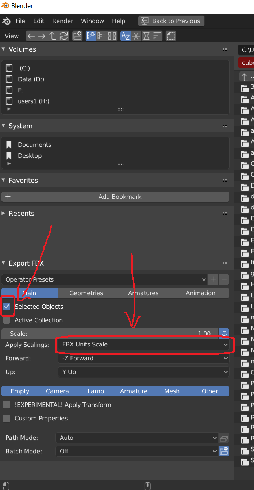

# How to Add Your Own Models to TDW

You can add your own objects to the build by doing the following:

1. Create a .fbx  or .obj+.mtl file.
2. Use the [`AssetBundleCreator`](../python/asset_bundle_creator.md) to create an asset bundle and local metadata file.
3. Run a controller that includes the [command](../api/command_api.md) `add_object`.
4. (Optional) Store the object metadata in a custom [library file](../python/librarian/model_librarian.md).

**For example implementation, see: `tdw/Python/example_controllers/local_object.py`**

### Requirements

- Windows 10 or OS X
- (Windows only) [Visual C++ 2012 Redistributable](https://www.microsoft.com/en-au/download/confirmation.aspx?id=30679)
- The `tdw` module
- Python 3.6+
- Unity Hub
- Unity Editor 2019.2 (installed via Unity Hub)
  - Build options must enabled for Windows, OS X, and Linux (these can  be set when installing Unity).
- A .fbx or .obj+.mtl model

### What `AssetBundleCreator` does

**Asset bundles** are binaries that Unity Engine can read at runtime. All of TDW's models, scenes, materials, etc. are stored as _asset bundles_ on a remote S3 server, but you can create your own object asset bundles on your local machine and load them into the build the same way (with the `add_object` command).

`AssetBundleCreator.create_asset_bundle` will do the following:

1. Create a new Unity project on your local machine and add some scripts to it (this project will be used to generate the asset bundle).
2. Create a few extra files from your source 3D model in order to generate physics colliders. This process can take a while; be patient.
3. Create asset bundles from the resulting files.
4. Create a metadata record.

Once the asset bundles and metadata are created, you don't need to create them again; move them out of the `asset_bundle_creator/Assets` folder to wherever you want them to be (you can also safely keep them in the project folder, but if you generate another model with the same name, the original file will be overwritten).

### How to Export .fbx files from Blender 2.8

Blender can be fussy when exporting to Unity. If you export a .obj, you shouldn't have any problems. If you export a .fbx, there may be problems with the model's scale, as well as the collider's scale.

To set correct .fbx model scaling in Blender:

1. Set the scale of your model to 0.5

2. Making sure that the model is still selected, apply the scale: **ctrl+a+s**
3. Making sure that the model is still selected, export the .fbx file. Make sure you're exporting only the selected object, and set the scaling to "FBX Units Scale".

### Creating Many Asset Bundles

You could convert many models to asset bundles by creating a loop that repeatedly calls `AssetBundleCreator.create_asset_bundles()`. **This is not a good idea.** Repeatedly calling Unity from a Python script is actually very slow. (It also appears to slow down over many consecutive calls).

Instead, consider using `create_many_asset_bundles(library_path)` for large numbers of models. This function will walk through `asset_bundle_creator/Assets/Resources/models/` searching for .obj and .fbx models. It will convert these models to asset bundles.

The `library_path` parameter is the path to the local [model records database](../python/librarian/model_librarian.md). 

### Troubleshooting

- Make sure that Unity Editor and Visual Studio are _closed_ when running `AssetBundleCreator`.
- Make sure that you have installed the Editor _via Unity Hub_; the Python script assumes this when trying to find the editor .exe
- If `AssetBundleCreator` is crashing with errors, please let us know; copy+paste the error when you do.

### Roadmap

- Add support for OS X. _(Linux support isn't likely in the near future, as the pipeline requires Unity Editor.)_

