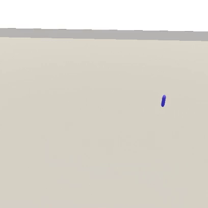
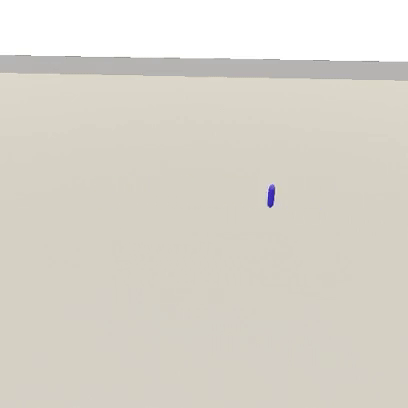
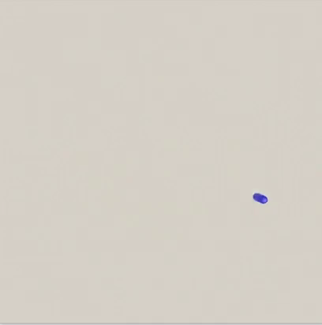

# Avatar Movement

### Physics vs. non-physics

- Some avatars in TDW respond to physics; they are _non-kinematic_. 
- Some avatars in TDW _don't_ respond to physics; they are _kinematic_.

Some avatar [commands](../api/command_api.md) move or rotate the avatar by applying a force or torque. These commands only affect non-kinematic avatars.

Commands that move or rotate the avatar without interacting with the physics engine (e.g. `rotate_avatar_by`) _shouldn't be sent to non-kinematic avatars._ Moving a physics-enabled object in the UnityEngine outside of the physics engine can result in glitchy behavior over time.

In the [commands](../api/command_api.md), check whether an Avatar Command is tagged **Physics motion** or **Non-physics motion**. If you don't see either tag, you can assume that the command can safely be used for any avatar.

### "Sleep"

When any moving object (including avatars) have a speed less than 0.005, the physics engine will consider it to be non-moving, and mark the object as sleeping.

- To determine if an object is sleeping,  send `send_rigidbodies`.
- To determine if a non-kinematic avatar is sleeping, send `send_avatars`. 

### Stopping a non-kinematic avatar

#### `set_avatar_drag`

Send the command `set_avatar_drag` to stop a non-kinematic avatar.  A high drag value will cause the avatar to slow down quickly. Lower the drag value to allow the avatar to move again.

Drag can safely be adjusted on-the-fly.

#### Mid-air drag

An unfortunate side-effect of setting drag values is that they will affect how slow  an object descends due to gravity; high drag makes an object act as if it has a parachute.

See the controller `Python/example_controllers/avatar_drag.py` for an example of how to adjust drag while the avatar is in the air.

### Physics-based movement

There are many ways to move a non-kinematic (physics-enabled) avatar.  Below are several options, in pseudo-code:



```python
for i in range(500):
	# On one frame:
	# 1. Set a low drag value.
	# 2. Move the avatar forward.
	# 3. Step 1 physics frame.
	# 4. Set a high value (stops the avatar).
	c.communicate([
		set_avatar_drag(2), 
		move_avatar_forward_by(300),
    	step_physics(1),
    	set_avatar_drag(500)
	])
```

***


```python
# Set a high drag value.
set_avatar_drag(30)

for i in range(500):
	# Move the avatar forward.
    #
	# Due to the high drag value, the avatar will quickly slow down,
    # and maintain a steady speed.
	c.communicate(move_avatar_forward_by(120))
```

***



```python
# Set a low drag value.
set_avatar_drag(0.5)

c.communicate(move_avatar_forward_by(1800))

for i in range(500):
	# Let the avatar glide.
	c.communicate(do_nothing)

# Stop the avatar.
c.communicate(set_avatar_drag(500))
```

***

### Physics-based rotation

Send the command `turn_avatar_by` to apply a _torque_ to the avatar's rotation. Send this along with the movement commands to curve the avatar's movement.



```python
# Set the drag values.
set_avatar_drag(drag=30, angular_drag=20)

for i in range(500):
	# Move the avatar forward.
	# Turn the avatar.
    #
	# Due to the high drag values, the avatar will quickly slow down,
    # and maintain a steady speed.
	c.communicate([
			move_avatar_forward_by(400),
            turn_avatar_by(-100)
            ])
```

### Example Controller

See `Python/example_controllers/avatar_movement.py`.