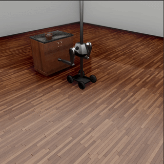
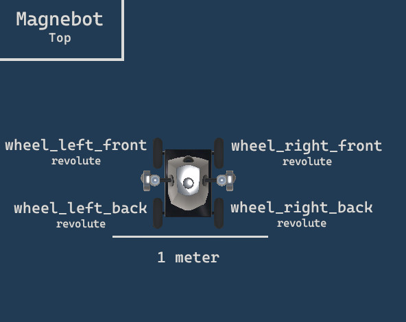

# TDW Robotics

## Robotics API

TDW's robots are handled very similarly to how 3D models are handled. They are stored in a robot library and have [corresponding metadata records](../python/librarian/robot_librarian.md). 

Add robots to the scene using either [the `add_robot` command or `Controller.get_add_robot()`](../python/librarian/robot_librarian.md#Command API).

| Command                  | Description                                                  |
| ------------------------ | ------------------------------------------------------------ |
| `destroy_robot`          | Destroys a robot in the scene.                               |
| `set_immovable`          | Set whether or not the root object of the robot is immovable. Its joints will still be moveable. |
| `set_prismatic_target`   | Set the target angle of a prismatic robot joint. Per frame, the joint will move towards the target until it is either no longer possible to do so (i.e. due to physics) or because it has reached the target position. |
| `set_revolute_target`    | Set the target angle of a revolute robot joint. Per frame, the joint will revolve towards the target until it is either no longer possible to do so (i.e. due to physics) or because it has reached the target angle. |
| `set_spherical_target`   | Set the target angles (x, y, z) of a spherical robot joint. Per frame, the joint will revolve towards the targets until it is either no longer possible to do so (i.e. due to physics) or because it has reached the target angles. |
| `send_robots`            | [Send data for each robot in the scene](https://github.com/threedworld-mit/tdw/blob/master/Documentation/api/output_data.md#Robot) (including Magnebots). |
| `send_static_robots`     | [Send static data for each robot in the scene](https://github.com/threedworld-mit/tdw/blob/master/Documentation/api/output_data.md#StaticRobot) (including Magnebots). |
| `parent_avatar_to_robot` | Parent an avatar to a robot.                                 |

### Joint targets

| Joint Type | Degrees of freedom | Units   |
| ---------- | ------------------ | ------- |
| fixed      | 0                  |         |
| revolute   | 1                  | degrees |
| prismatic  | 1                  | meters  |
| spherical  | 3                  | degrees |

Once the target is set, the joint still needs to move to the target. You can determine if joints are still moving by checking the [`Robot.get_joint_positions()`](https://github.com/threedworld-mit/tdw/blob/master/Documentation/api/output_data.md#Robot). See `robot_arm.py` for example implementation. Note that in the output data, revolute and spherical angles are in radians.

Targets are always *cumulative*, not deltas. If you do this:

1. Set revolute target to `720`
2. Wait
3. Set revolute target to `0`
4. Wait

You will get the following behavior:

1. Joint turns 720 degrees
2. Joint turns -720 degrees

## Robots and Avatars

TDW has a built-in concept of what an "Avatar" is, which has implications for which commands can be sent to which objects in the scene. Robots are *not* avatar; they are *robots*.

Robots by default don't have cameras. However, you can add a camera to a robot by first creating an avatar and then parenting that avatar to the robot. See: `example_controllers/robot_camera.py` for example implementation.

## Magnebot API

The Magnebot is a specialized robot in TDW that can use "magnets" to pick up objects.

[**Get the high-level Magnebot API here.**](https://github.com/alters-mit/magnebot)

Add a Magnebot to the scene with the `add_magnebot` command (`add_robot` will *not* add a Magnebot!). With the except of `add_robot`, all other commands in the Robotics API are compatible with the Magnebot. 

| Joint               | Command                |
| ------------------- | ---------------------- |
| `column`            | `set_revolute_target`  |
| `torso`             | `set_prismatic_target` |
| `shoulder_left`     | `set_spherical_target` |
| `shoulder_right`    | `set_spherical_target` |
| `elbow_left`        | `set_revolute_target`  |
| `elbow_right`       | `set_revolute_target`  |
| `wrist_left`        | `set_spherical_target` |
| `wrist_right`       | `set_spherical_target` |
| `magnet_left`       |                        |
| `magnet_right`      |                        |
| `wheel_left_front`  | `set_revolute_target`  |
| `wheel_right_front` | `set_revolute_target`  |
| `wheel_left_back`   | `set_revolute_target`  |
| `wheel_right_back`  | `set_revolute_target`  |

To get the corresponding name and object ID of each joint:

There are also additional commands that are specific to the Magnebot:

| Command              | Description                                                  |
| -------------------- | ------------------------------------------------------------ |
| `set_magnet_targets` | Set the objects that the Magnebot magnet will try to pick up. If the magnet collides with any of these objects, the Magnebot will pick up them up. |
| `drop_from_magnet`   | Drop an object held by a Magnebot magnet.                    |
| `send_magnebots`     | [Send data for each Magnebot in the scene.](https://github.com/threedworld-mit/tdw/blob/master/Documentation/api/output_data.md#Magnebot) This includes the IDs of any held objects. |

### Picking up objects with magnets

The Magnebot's magnets "picks up" objects by first colliding with a target object (see `set_magnet_targets`), then caching Rigidbody data (mass, angular drag, etc.), adding the object's mass to the magnet's mass, then destroying the Rigidbody component, then parenting the object to the magnet. The Magnebot "puts down" the object by recreating the Rigidbody, subtracting the mass, and unparenting the object. This is to ensure maximum physics stability.

The upshot is that rigidbody commands such as `set_mass` will throw an error if the object is being held by a Magnebot magnet. Data returned by `send_rigidbodies` will be 0s if the object is being held (for example, the mass will be 0).

## Example controllers

[**See the high-level Magnebot API for additional examples.**](https://github.com/alters-mit/magnebot)

| Controller        | Description                                  |
| ----------------- | -------------------------------------------- |
| `magnebot.py`     | Add a Magnebot and move it around the scene. |
| `robot_arm.py`    | Move the joints of a robot arm.              |
| `robot_camera.py` | Add a camera to a Magnebot.                  |

