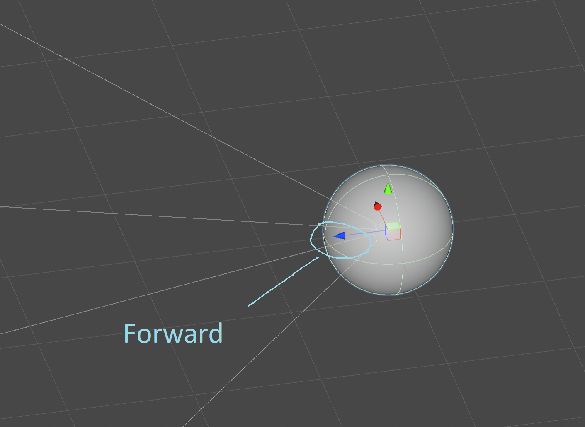

# Eulers angles, directional vectors, and quaternions, oh my!

There are three rotational data types in TDW: Quaternions, Euler angles, an directional vectors. The [Command API](../api/command_api.md) exposes these data types selectively depending on the command; each data type has advantages and disadvantages.

## 1. Euler angles

Euler angles are three degrees of rotation expressed as a vector: `(x, y, z)`.

```python
c.communicate({"$type": "rotate_object_to_euler_angles", "euler_angles": {"x": 3.5, "y": -45, "z": 0}, "id": 1})
```

#### Pros

- Many people find Euler angles to be the most intuitive means of applying a rotation. To rotate around the `y` axis by 5 degrees, simply set the Euler angles to `(x, y + 5, z)`.

#### Cons

As soon as you rotate around any axis more than 180 degrees, it is possible to achieve [gimbal lock](https://www.youtube.com/watch?v=zc8b2Jo7mno). **Gimbal lock is unavoidable, and the resulting Euler angles won't be useful data.** TDW _never_ sends Euler angles as part of output data because it's impossible to guarantee that they'll be accurate or meaningful.

#### Recommendations

 - **Don't use Euler angles to repeatedly rotate objects.** It's just not a good way to continuously apply rotation.
 - Use Eulers only the first time an object is rotated (this is why `add_object.rotation` is an Euler; because it is the first time the object is rotated, it will always be accurate).
 - Don't bother to convert between quaternions and Eulers; this doesn't avert the possibility of gimbal lock.
 - Check if a command uses Eulers or not; all Euler commands are marked as such in the [Command API](../api/command_api.md).

## 2. Directional vectors

Every object in Unity has a forward directional vector in the form of `(x, y, z`):



You can get the forward directional vector of avatars and objects from [output data](../api/output_data.md).

Avatars:

```python
a = AvatarNonKinematic(byte_array)
x, y, z = a.get_forward()
```

Objects:

```python
t = Transforms(byte_array)

for i in range(t.get_num()):
    x, y, z = t.get_forward(i)
```

#### Pros

- Directional vectors are always accurate.
- You can calculate angles between bearings to objects and directional vectors using basic vector math and trigonometry.

#### Cons

- You can't apply rotations to directional vectors without first converting the math to either Euler angles or quaternions. For this reason, we expose directional vectors in [output data](../api/output_data.md) but not in [commands](../api/command_api.md).

#### Recommendations

Use directional vector data to get the angle of an object with respect to a bearing and then sending a `rotate_< >_by` command (see below).

## 3. Quaternions

Quaternions are four-dimensional number systems with three real numbers and one imaginary number: `{x, y, z, w}`.

https://www.youtube.com/watch?v=zjMuIxRvygQ

You can get the rotation of avatars and objects as a quaternion from [output data](../api/output_data.md).

Avatars:

```python
a = AvatarNonKinematic(byte_array)
x, y, z, w = a.get_rotation()
```

Objects:

```python
t = Transforms(byte_array)

for i in range(t.get_num()):
    x, y, z, w = t.get_rotation(i)
```

You can set the rotation of avatar or objects:

```python
c.communicate({"$type": "rotate_avatar_to", "avatar_id": "a", "rotation": {"w": 0.6, "x": 3.5, "y": -45, "z": 0}})
```

```python
c.communicate({"$type": "rotate_object_to", "id": 1, "rotation": {"w": 0.6, "x": 3.5, "y": -45, "z": 0}})
```

#### Pros

- **Quaternions are the only accurate way to describe three-dimensional rotations.** Accept no substitutes!

#### Cons

 - **Quaternions are very counter-intuitive and hard to work with.**
 - You can't convert quaternions to Euler angles and expect meaningful data (because the Euler angle is still susceptible to gimbal lock).

#### Recommendations

Use these commands:

 - `rotate_avatar_by`
 - `rotate_sensor_container_by`
 - `rotate_object_by`

```python
c.communicate({"$type": "rotate_avatar_by", "angle": 15.0, "avatar_id": "a", "axis": "pitch", "is_world": True})
```

Under the hood, these commands rotate only using quaternions. By supplying an `axis` and an `angle`, you can rotate the object _as if_ you were using Euler angles while only rotating about a single directional vector at a time.

The `is_world` parameter specifies whether the rotation is applied to the object's _current_ rotation (`is_world = False`) or `Quaternion.identity`. Many people find the results of these commands to be more intuitive when `is_world == True`.

## Summary

| Data type           | Pros                                                     | Cons                                                         |
| ------------------- | -------------------------------------------------------- | ------------------------------------------------------------ |
| Euler angles        | Generally intuitive (at least initially...)              | Gimbal lock is unavoidable after repeated rotations, making results inaccurate. |
| Directional vectors | Can be accurately used to calculate angles and bearings. | Must be converted to Euler angles or quaternions to be directly manipulated. |
| Quaternions         | The only accurate option.                                | Very unintuitive (unless you use `rotate_< >_by` commands).  |

