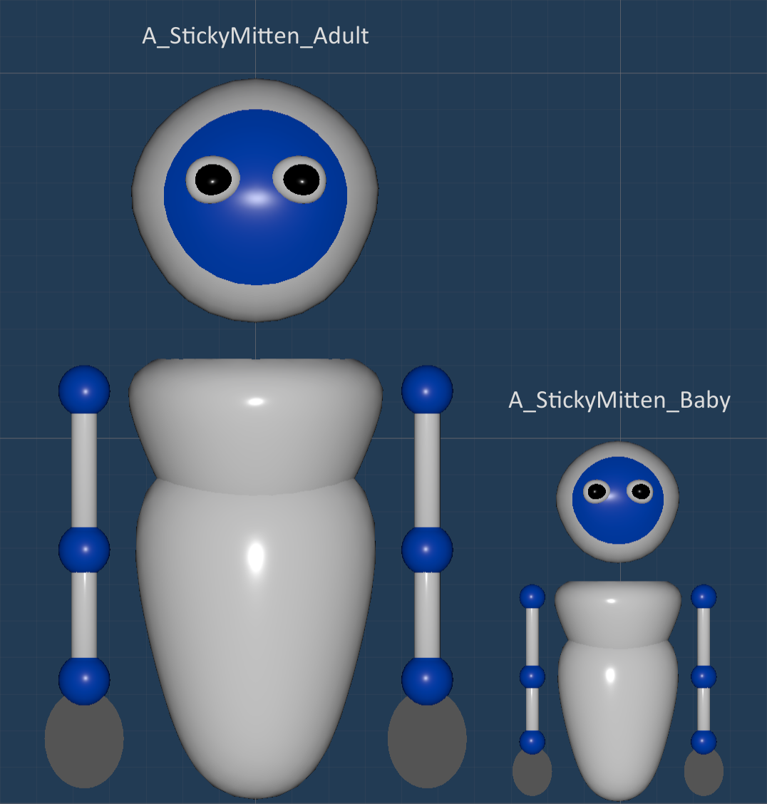
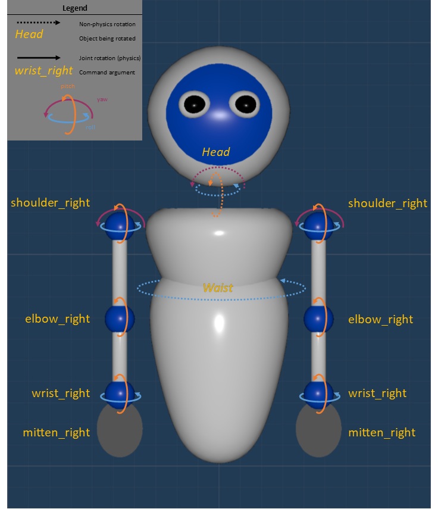
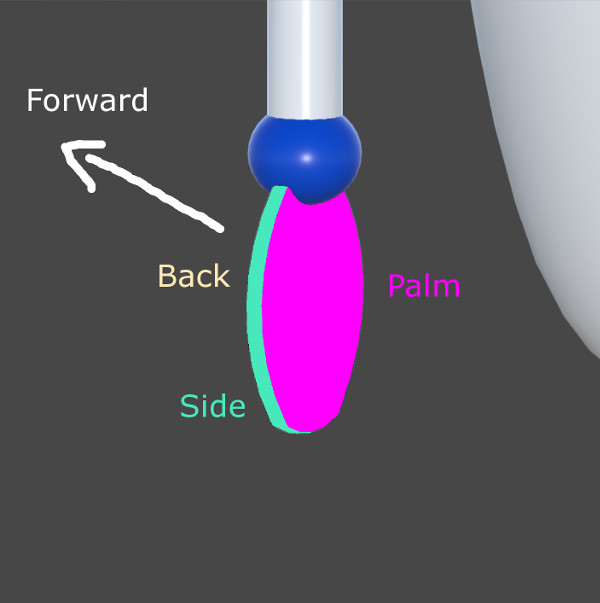
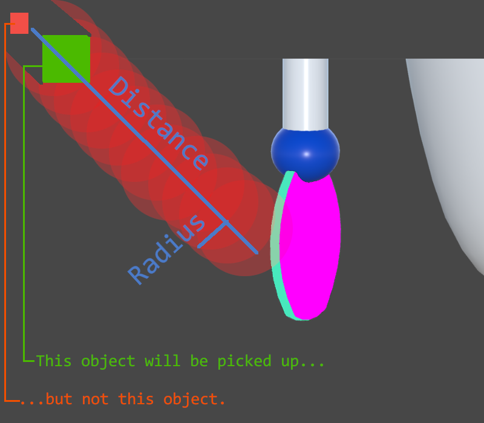
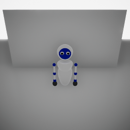
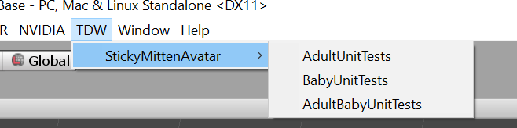

# Sticky Mitten Avatar

The Sticky Mitten Avatar is a specialized TDW avatar. It has arms that can move, and it can pick up and put down objects.

## 1. Creating the Avatar

There are two Stick Mitten Avatar prefabs:

1. `A_StickyMitten_Adult`
2. `A_StickyMitten_Baby`

**To create a Sticky Mitten Avatar**, send the [`create_avatar`](../api/command_api.md#create_avatar) command with either of the above as the avatar type:

```json
{"$type": "create_avatar", "type": "A_StickyMitten_Adult", "id": "A"}
```



## 2. Arm Joints

Arm movement is handled in the build by using "HingeJoints", which are a built-in Unity feature. Each joint pivots along one axis.



### Bending/rotating joints

Each frame, a joint will apply a force and attempt to reach the target angle.

- If a joint achieves the target angle, it will apply continuous force in an attempt to stay at that angle.
- If, due to a combination of force/torque/mass parameters, the joint can't reach the target angle, it will still continuously attempt to do so.
- This system is _entirely_ determined by Unity's physics engine.

**To bend a joint**, send the command [`bend_arm_joint_to`](../api/command_api.md#bend_arm_joint_to) or [`bend_arm_joint_by`](../api/command_api.md#bend_arm_joint_by). The former sets the target angle; the latter adjusts the current joint angle by a delta.

```json
{"$type": "bend_arm_joint_to", "avatar_id": "A", "angle": 50, "joint_type": "shoulder_left", "axis": "pitch"}
```

### Joint Limits

Every joint has a minimum and maximum angle to which it can bend or rotate. These values are the same for both arms and for both the `adult` and `baby` avatars.

| Joint | Axis | Minimum Angle | Maximum Angle |
| --- | --- | --- | --- |
| `shoulder` | `pitch` | -60         | 179         |
| `shoulder` | `yaw` | -90           | 90          |
| `shoulder` | `roll` | -45 | 45 |
| `elbow` | `pitch` | 0             | 160         |
| `wrist` | `roll` | -90 | 90 |
| `wrist` | `pitch` | 0             | 90            |

### Stopping joints

**To stop a joint**, send the command [`stop_arm_joint`](../api/command_api.md#stop_arm_joint). This command will set the target angle of the joint to the current angle of the joint. If the arm can't support the mass of the object(s) it's holding, this command won't override the overall "strength" of the arm; the arm will still fall until it can support itself.

```json
{"$type": "stop_arm_joint", "avatar_id": "A", "joint_type": "shoulder_left", "axis": "pitch"}
```

### Recommended algorithm for bending arm joints

```python
from tdw.controller import Controller

bend_arm = get_bend_arm_command()
stop_arm = get_stop_arm_command()
step = {"$type": "step_physics", "frames": 1}

for i in range(10):
    c.communicate([bend_arm, step, stop_arm])
```

## 3. Mittens

Mittens are a GameObject parented to the "actual" mitten mesh with a `StickyMitten` component. They are located at the "palm" and have a Trigger BoxCollider (meaning that this collider won't respond or induce physics.)

An object adheres to a mitten by being assigned a `FixedJoint` component and setting the joint's parent Rigidbody to the mitten. Conversely, by destroying the object's joint, the mitten "puts down" the object.

### Stickiness

Each mitten is divided into "sub-mittens": a palm, a back, and a side. Each "sub-mitten" has a `sticky` boolean. If the sub-mitten is `sticky`, it can adhere to objects. By default, every side is _not_ sticky (`False`).

**To set sub-mitten's stickiness**, send the command [`set_stickiness`](../api/command_api.md#set_stickiness).



### Picking up objects

**To pick up objects touching a `sticky` sub-mitten**, send the command [`pick_up`](../api/command_api.md#pick_up).

**To pick up  objects within a given "emitted volume"of a `sticky` sub-mitten**, send the command [`pick_up_proximity`](../api/command_api.md#pick_up_proximity). The "emitted" volume is a either a sphere (front and back of the mitten) or a capsule (sides of a mitten) of a given radius emitted along a directorial vector up to a distance. Any objects within the sphere will be picked up. However, it is possible for one object to occlude another. This is a deliberate design decision to prevent the avatar from picking up objects through walls or large obstacles:



##### Object IDs

For either of these commands, you can send an optional `"object_ids"` parameter. If the list of IDs is empty ( `[ ]` ), all valid objects will be picked up. Otherwise, only valid objects whose IDs are in the list will be picked up.

### Putting down objects

**To put down all objects held by a mitten**, send the command [`put_down`](../api/command_api.md#put_down).

## 4. Adjusting arm parameters

**If you want to adjust the arm parameters on the fly**, send [`set_sticky_mitten_profile`](../api/command_api.md#set_sticky_mitten_profile.md). Example:

```python
{"$type": "set_sticky_mitten_profile", "avatar_id": "uniqueid0", "profile": {"mass": 80.0, "arm_left": {"shoulder_pitch": {"mass": 20.0, "damper": 200.0, "force": 10.0}, "shoulder_yaw": {"mass": 1.0, "damper": 20.0, "force": 50.0}, "shoulder_roll": {"mass": 1.0, "damper": 20.0, "force": 50.0}, "elbow": {"mass": 1.0, "damper": 10.0, "force": 50.0}, "wrist_roll": {"mass": 1.0, "damper": 10.0, "force": 35.0}, "wrist_pitch": {"mass": 1.0, "damper": 10.0, "force": 35.0}, "mitten": {"mass": 1.0}}, "arm_right": {"shoulder_pitch": {"mass": 20.0, "damper": 200.0, "force": 10.0}, "shoulder_yaw": {"mass": 1.0, "damper": 20.0, "force": 50.0}, "shoulder_roll": {"mass": 1.0, "damper": 20.0, "force": 50.0}, "elbow": {"mass": 1.0, "damper": 10.0, "force": 50.0}, "wrist_roll": {"mass": 1.0, "damper": 10.0, "force": 35.0}, "wrist_pitch": {"mass": 1.0, "damper": 10.0, "force": 35.0}, "mitten": {"mass": 1.0}}}
```

### Recommended algorithm for adjusting arm parameters

```python
load_scene()
create_avatar()
arms_are_optimized = False
while not arms_are_optimized:
	profile = set_new_profile(param1, param2, etc.)
	set_profile(profile)
	arms_are_optimized = run_tests()
```

## 5. Head

**To rotate the head**, send the command [`rotate_head_by`](../api/command_api.md#rotate_head_by). Rotating the head _doesn't utilize Unity physics._ Rather, the commands simply adjust the rotational parameters of the head GameObject.

The angle of rotation is clamped:

| Axis | Minimum angle | Maximum angle |
| --- | --- | --- |
| `pitch` | -55 | 55 |
| `roll` | -55 | 55 |
| `yaw` | -85 | 85 |

## 6. Waist

**To rotate the waist**, send the command [`rotate_waist`](../api/command_api.md#rotate_waist). Rotating the waist _doesn't utilize Unity physics._ Rather, the command simply adjusts the rotational parameters of the torso GameObject.

## 7. Moving the avatar

**See [Avatar Movement](avatar_movement.md).** 

## 8. Cameras

The Sticky Mitten Avatar has two cameras.

| Sensor Name | Description |
| --- | --- |
| `SensorContainer` | The view from the "eyes" of the avatar. |
| `FollowCamera` | A camera in front of the avatar, looking at it.  |

By default, neither camera will send image passes. However, the cameras are _enabled_, meaning that they are still rendering to the GPU. Consider sending [`toggle_sensor`](../api/command_api.md#toggle_sensor) to toggle off unused sensors to speed up your simulation.

## 9. Example Controller

See: `TDWBase/Python/sticky_mitten_avatar.py`

## 10. Unit Tests

**This section is for backend developers only (i.e. those who have access to the TDWBase repo).**

<details>

The TDW repo includes a series of unit tests for the Sticky Mitten Avatars. These unit tests are meant to verify on the backend that any changes to the avatars haven't broken any expected behaviors. If you aren't making changes to the Sticky Mitten Avatars as part of the backend development process, you don't need to run these tests.

#### Python

The repo contains a unit test controller for the Sticky Mitten Avatars. This controller will run tests for the baby and adult avatars. This controller is best used in Unity Editor.

To run the unit tests:

``` bash
cd <root>/Python/tests
python3 sticky_mitten_avatar_unit_tests.py
```

```
<run build in Editor>
```

#### Unity Editor

TDW contains additional unit tests for the avatars. They can be found by selecting TDW/StickyMittenAvatar/.



| Test               | Description                                                  |
| ------------------ | ------------------------------------------------------------ |
| AdultUnitTests     | For the adult prefab. Verify that every child object and component exists and is in the correct place. Verify that all arm objects perfectly mirror each other. |
| BabyUnitTests      | For the baby prefab. Verify that every child object and component exists and is in the correct place. Verify that all arm objects perfectly mirror each other. |
| AdultBabyUnitTests | Verify that every value for the baby prefab matches or is proportional to the adult prefab. (The adult values are assumed to be correct.) |

</details>