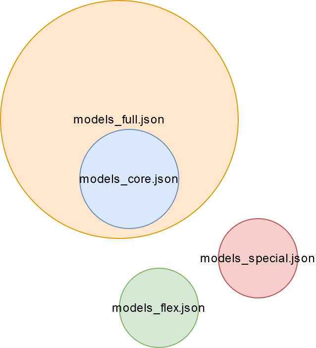

# Model Librarian

A **Model Librarian** is a model records database. 

```python
from tdw.librarian import ModelLibrarian

lib = ModelLibrarian()
```

```python
from tdw.librarian import ModelLibrarian

lib = ModelLibrarian(library="path/to/your/database/file.json")
```

A Model Librarian contains `ModelRecord` objects.

```python
record = lib.records[0]
print(record.name, record.wcategory) # afl_lamp table lamp
```

## Default Libraries

TDW has three database files for three remote model libraries. To access these files, just provide the filename in the constructor without a path, e.g.:

```python
from tdw.librarian import ModelLibrarian

lib = ModelLibrarian(library="models_full.json")
```

If you don't provided a value for `library`, the default is `models_core.json`.

| Library               | Description                                                  | Free? |
| --------------------- | ------------------------------------------------------------ | ----- |
| `models_core.json`    | Approximately 200 high-quality models.                       | ✓     |
| `models_full.json`    | Approximately 2000 high-quality models + all models from `models_core.json`. | ✕     |
| `models_special.json` | Primitives and specialized models.                           | ✓     |
| `models_flex.json`    | Primitives that have been optimized for Flex deformation.    | ✓     |



## Command API

Send the `add_object` command to add a model to the scene from a remote or local asset bundle.

```python
from tdw.controller import Controller

c = Controller()

init(c) # Initialize the scene. Your code here.
record = get_record() # Get a model record. Your code here.
position = get_position() # Your code here.
rotation = get_rotation() # Your code here.

object_id = Controller.get_unique_id()
c.communicate({"$type": "add_object",
                "name": record.name,
                "url": record.get_url(),
                "scale_factor": record.scale_factor,
                "position": position,
                "rotation": rotation,
                "id": object_id})
```

The `Controller` class includes a few helper functions for using records to add objects to the scene. See the [Controller documentation](../controller.md).

## ModelRecord API

A record of a model asset bundle.

```python
from tdw.librarian import ModelRecord

record = ModelRecord() # Creates a record with blank or default values.
```

```python
from tdw.librarian import ModelRecord

record = ModelRecord(data=data) # Creates a record from JSON data.
```

### Fields

| Field                | Type                        | Description                                                  |
| -------------------- | --------------------------- | ------------------------------------------------------------ |
| `name`               | str                         | The name of the model.                                       |
| `urls`               | Dict[str, str]              | A dictionary of URLs or local filepaths of asset bundles per platform. See: `ModelRecord.get_url()` |
| `wnid`               | str                         | The WordNet/ImageNet semantic category ID of the model.      |
| `wcategory`          | str                         | The category description associated with the wnid. Required for the `_category` image pass to work correctly. |
| `scale_factor`       | float                       | When the model is first loaded into the build, it will be scaled from its default size by this factor. |
| `flex`               | bool                        | If true, this model is Flex-compatible.                      |
| `do_not_use`         | bool                        | If true, there is something wrong with this model (we're working on it!). The build will still load the model if prompted; this is just a warning for you. |
| `do_not_use_reason`  | str                         | If `do_not_use == True`, this is a brief reason why.         |
| `substructure`       | List[dict]                  | A list of all sub-objects in the model and their visual materials. Use this with the `set_visual_material` command.<br> Each element is a dictionary structured as: `{"name": "sub-object", "materials": ["material", "material", "etc."]}` |
| `bounds`             | Dict[str, Dict[str, float]] | A list of points around the object defining its bounds after being scaled by the `scale_factor`. |
| `canonical_rotation` | Dict[str, float]            | The Vector3 Euler angles that the object should face if an avatar is loaded into the scene (and the avatar isn't rotated). |
| `physics_quality`    | float                       | The percentage of the object's mesh covered by colliders.    |
| `asset_bundle_sizes` | Dict[str, int]              | A dictionary of asset bundle sizes. Key=Platform. Value=The size of the binary in bytes. |
| `composite_object`   | bool                        | If true, this model is a composite object.                   |
| `volume`             | float                       | The volume of the object in cubic meters.                    |
| `container_shapes`   | List[ContainerShape]        | A list of [`ContainerShape`](../container_data/container_shape.md) data. This data is used by the [`ContainerManager`](../add_ons/container_manager.md) add-on. |

### Functions

##### `def get_url(self) -> str:`

Returns the URL of the asset bundle for this platform. This is a wrapper for `record.urls`.

```python
lib = ModelLibrarian()
record = lib.records[0]

print(record.get_url())
```

***

## ModelLibrarian API

### Fields

| Field         | Type              | Description                                                  |
| ------------- | ----------------- | ------------------------------------------------------------ |
| `library`     | str               | The path to the records database file.                       |
| `data`        | dict              | The raw JSON dictionary loaded from the records database file. |
| `description` | str               | A brief description of the library.                          |
| `records`     | List[ModelRecord] | The list of model records.                                   |

### Static Functions

##### `def create_library(description: str, path: str) -> None:`

Create a new library JSON file.

```python
ModelLibrarian.create_library("My library", path="path/to/new/library.json")
```

| Parameter     | Type | Description                                               |
| ------------- | ---- | --------------------------------------------------------- |
| `description` | str  | A description of the library.                             |
| `path`        | str  | The absolute filepath to the .json records database file. |

***

##### `def get_library_filenames() -> List[str]:`

Returns a list of the filenames of the libraries of this type in the `tdw` module.

```python
filenames = ModelLibrarian.get_library_filenames()

print(filenames) # ['models_core.json', 'models_full.json', 'models_special.json', 'models_flex.json']
```

***

##### `def get_default_library() -> List[str]:`

Returns the filename of the default library (which is always the first element in the list returned by `get_library_filenames()`.

```python
default_library = ModelLibrarian.get_default_library()

print(default_library) # models_core.json
```

### Functions

##### `def get_record(self, name: str) -> Optional[ModelRecord]:`

Returns a record with the specified name. If that record can't be found, returns None.

```python
lib = ModelLibrarian()
record = lib.get_record("arco_lamp")

print(record.name) # arco_lamp
```

| Parameter | Type | Description             |
| --------- | ---- | ----------------------- |
| `name`    | str  | The name of the record. |

***

##### `def search_records(self, search: str) -> List[ModelRecord]:`

Returns a list of records whose names include the search keyword.

```python
lib = ModelLibrarian()
records = lib.search_records("lamp")

for record in records:
    print(record.name) # afl_lamp, alma_floor_lamp, etc.
```

| Parameter | Type | Description                                 |
| --------- | ---- | ------------------------------------------- |
| `search`  | str  | The string to search for in the model name. |

***

##### `def add_or_update_record(self, record: ModelRecord, overwrite: bool, write: bool = True, quiet: bool = True) -> bool:`

Add a new record or update an existing record.

```python
record = define_record() # Provide your own code here.
lib = ModelLibrarian()

lib.add_or_update_record(record, False, write=True, quiet=False)
```

| Parameter   | Type        | Description                                                  |
| ----------- | ----------- | ------------------------------------------------------------ |
| `record`    | ModelRecord | The new or modified record.                                  |
| `overwrite` | bool        | **If True:** If there is a record with the same name as this record, replace it with the new record and return True. Otherwise, return False.<br>**If False:** If there is a record with the same name as this record, don't add the model, and suggest a new name. |
| `write`     | bool        | If true, write the library data to disk  (overwriting the existing file). |
| `quiet`     | bool        | If true, don't print out messages to the console.            |

***

##### `def remove_record(self, record: Union[str, MaterialRecord], write: bool = True) -> bool:`

Remove a record. Returns true if the record was removed.

```python
record = define_record() # Provide your own code here.
lib = ModelLibrarian()

lib.remove_record(record) # Returns False.
```

```python
lib = ModelLibrarian()

lib.remove_record("arco_lamp") # Returns True.
```

| Parameter | Type | Description                                 |
| --------- | ---- | ------------------------------------------- |
| `record` | ModelRecord _or_ str | The record or the name of the record. |
| `write` | bool | If true, write the library data to disk  (overwriting the existing file). |

***

##### `def write(self, pretty=True) -> None:`

Write the library data to disk (overwriting the existing file).

| Parameter | Type | Description                                 |
| --------- | ---- | ------------------------------------------- |
| `pretty` | bool | "Pretty print" the JSON data with line breaks and indentations. |

***

##### `def get_valid_record_name(self, name: str, overwrite: bool) -> Tuple[bool, str, List[str]]:`

Generates a valid record name. Returns: true if the name is good as-is, the new name, and a list of problems with the old name.

```python
lib = ModelLibrarian()

ok, name, problems = lib.get_valid_record_name("arco_lamp", True)

print(ok) # True
print(name) # arco_lamp
```

```python
lib = ModelLibrarian()

ok, name, problems = lib.get_valid_record_name("arco_lamp", False)

print(ok) # False
print(name) # arco_lampabcd
print(problems) # ["A record named arco_lamp already exists, and we don't want to overwrite it."]
```

| Parameter | Type | Description                                 |
| --------- | ---- | ------------------------------------------- |
| `name` | str | The name of a record we'd like to add. |
| `overwrite` | str | **If True:** raise an exception if a record named `name` doesn't already exist.<br>**If False:** If the record exists, suggest a new name. |

***

##### `def get_model_wnids_and_wcategories(self) -> Dict[str, str]:`

Returns a dictionary of all model wnids and categories. Key=wnid Value=wcategory

```python
lib = ModelLibrarian()

wnids_dict = lib.get_model_wnids_and_wcategories()
```

***

##### `def get_model_wnids(self) -> List[str]:`

Returns a list of all unique wnids in the database, sorted numerically.

```python
lib = ModelLibrarian()
wnids = lib.get_model_wnids()

print(wnids[0]) # n02206856
```

***

##### `def get_flex_models(self) -> List[ModelRecord]:`

Returns a list of all Flex-compatible models.

```python
lib = ModelLibrarian()
records = lib.get_flex_models()

print(records[0].name, records[0].flex) # alma_floor_lamp True
```

