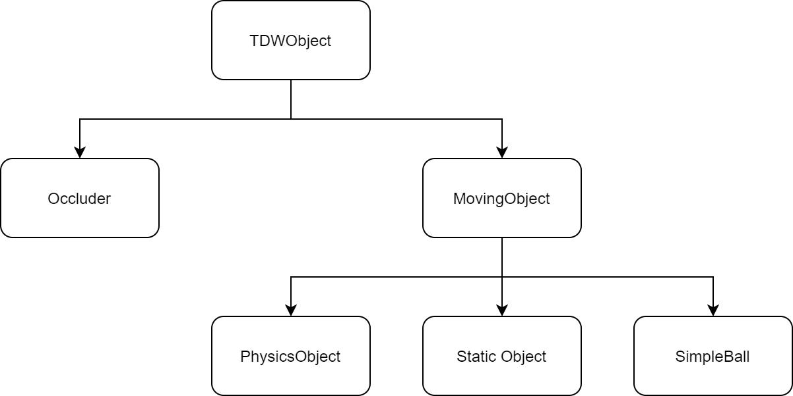

# `int_phys.py`

**Seth Alter**

**February 2019**

## Overview

`int_phys.py` (Python/use_cases/int_phys.py) mimics [IntPhys](https://intphys.com/) in TDW.

The controller will run eight trials with different parameters and generate eight image sets:

| Trial                                   | Impossibility                                       |
| --------------------------------------- | --------------------------------------------------- |
| Object Permanence - Possible            |                                                     |
| Object Permanence - Impossible          | Object disappears behind occluder.                  |
| Shape Constancy - Possible              |                                                     |
| Shape Constancy - Impossibility         | Object behind occluder transforms into a new shape. |
| Spatio-Temporal Continuity - Possible   |                                                     |
| Spatio-Temporal Continuity - Impossible | Object teleports in mid-air.                        |
| Energy Conservation - Possible          |                                                     |
| Energy Conservation - Impossible        | Object slows down in mid-air.                       |

Each image set contains four image passes:

1. `_img`
2. `_id` (segmentation colors)
3. `_depth`
4. `_id_random` (random segmentation colors per frame)

Additionally, each trial will generate a record of the state of the objects per frame.

## Usage

```bash
cd <root>/Python/use_cases/int_phys
python3 int_phys.py
```

```bash
<run build>
```

Images will be saved to: `<home directory>/int_phys_output`

The simulation metadata per frame is saved as: `<home director>/int_phys_output/<trial>/state.json`

## Differences between `int_phys.py` and IntPhys

`int_phys.py` is _not_ a substitute for IntPhys. It is meant to be a proof-of-concept that IntPhys can be replicated in TDW. As such, there are some differences between the two that haven't been corrected.

#### 1. The metadata is somewhat different.

Most of the TDW metadata can be mapped to IntPhys metadata; some of it can't. In particular, some of the trials don't use Unity physics, so restitution (known as "bounciness" in Unity and TDW) isn't applicable. 

#### 2. `int_phys.py` includes photo-real scenes.

The Spatio-Temporal and Energy Conservation blocks use TDW's photoreal environments and models.

#### 3. The TDW depth pass looks different.

TDW's  `_depth` pass is blue-and-green instead of grayscale because TDW `_depth` passes are 24-bit for greater accuracy. To decode the image, use [`TDWUtils.get_depth_values()`](../tdw_utils.md).

## How it works

#### Metadata Library

`int_phys.py` uses custom models for the primitives and the occluders. Accordingly, there are local asset bundles in `int_phys/Darwin/`, `int_phys/Linux/`, and `int_phys/Windows/`. `models.json` is the local [model library](../librarian/model_librarian.md) and includes the local asset bundles plus a few from the TDW core library. This doesn't require any extra setup from the user.

#### `TDWObject`

`int_phys.py` includes a `TDWObject` class that has a list of commands to be sent to the build to initialize the model and a list of commands to send per-frame. All objects in this simulation run on top of this `TDWObject` wrapper.

Differing object behavior is handled by sub-classes of `TDWObject`. 



#### `Possibility`

A `MovingObject` can have an additional `Possibility` wrapper class that will generate commands per frame:

```python
obj = SimpleBall(8, material="aluminium_foil", possibility=Hideable(), speed=-0.1)
```

 The base class `Possibility` generates an empty list of commands (meaning that it won't introduce any impossible behavior).

#### `State`

The `State` class is the per-frame metadata of the simulation.

#### `Trial`

A `Trial` is a wrapper class for all of the commands that need to be sent to run a simulation. A trial accepts a list of occluders and moving objects as parameters, as well as initialization commands, the number of frames total, etc.

By calling `Trial.run(controller)`, the `controller` will per frame:

1. Gather a list of commands from the `TDWObject` classes (which in turn might gather commands from a `Possibility` class).
2. Send the list of commands to the build.
3. Receive output data.
    - Add object metadata from the output data to the `State`.
    - Write images to disk.