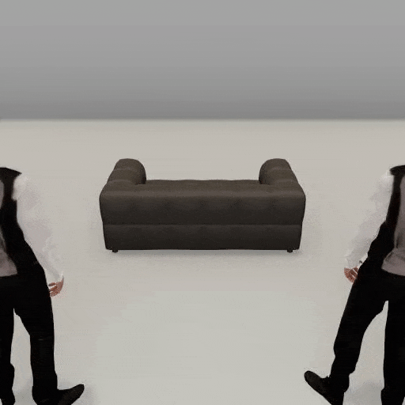

# How to upgrade from TDW v1.10 to v1.11

## Read the changelog

[Read this](../Changelog.md) for a complete list of changes. TDW v1.11 introduces one major feature, the Replicant API, and various smaller changes to the API.

## 1. Added Replicants

Added Replicants, physically-embodied humanoid agents. For more information, [read this](../lessons/replicants/overview.md).

## 2. Revised containment data

[Containment output data](../lessons/semantic_states/containment.md) has been revised to make it more accessible outside of the `ContainerManager`. The `send_containment` command now returns `Containment` output data instead of `Overlap` data; `Containment` is similar but faster and includes the semantic containment tag.

Previously, `ContainerManager` added container shapes to objects after adding objects to the scene. This was finicky (container shapes didn't exist on the initial `communicate()` call), buggy, and inflexible (in that other add-ons such as `Replicant` couldn't easily initialize a scene with container shapes). 

Now, container shapes are automatically added if you add objects with `Controller.get_add_physics_object()`. This is much easier to use, but, as a trade-off, if you add objects with `Controller.get_add_object()`, the controller *won't* add container shapes. This is because container shapes are added as commands such as `add_box_container` and `Controller.get_add_object()` has  to return a single command, as opposed to a list of commands.