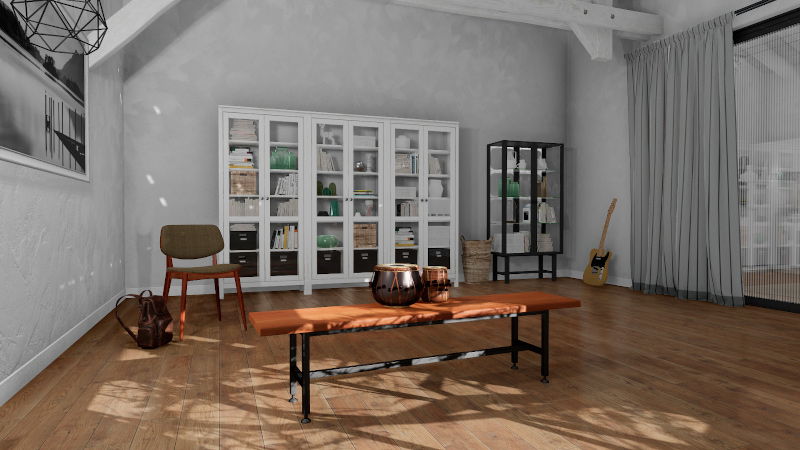

# ThreeDWorld (TDW)

**ThreeDWorld (TDW)** is a platform for interactive multi-modal physical simulation. With TDW, users can simulate high-fidelity sensory data and physical interactions between mobile agents and objects in a wide variety of rich 3D environments.

- [Code of Conduct](https://github.com/threedworld-mit/tdw/blob/master/code_of_conduct.md)
- [Changelog](https://github.com/threedworld-mit/tdw/blob/master/Documentation/Changelog.md)
- [License](https://github.com/threedworld-mit/tdw/blob/master/LICENSE.txt)
- [Website](https://threedworld.org/)
- [Example controllers](https://github.com/threedworld-mit/tdw/tree/master/Python/example_controllers)

# General guide to TDW

## Setup

1. [Install TDW](Documentation/lessons/setup/install.md)
3. [Upgrade TDW](Documentation/lessons/setup/upgrade.md)

## Core Concepts

1. [The controller](Documentation/lessons/core_concepts/controller.md)
2. [Auto-launching the TDW build](Documentation/lessons/core_concepts/launch_build.md)
3. [Commands](Documentation/lessons/core_concepts/commands.md)
4. [Design philosophy of TDW](Documentation/lessons/core_concepts/design_philosophy.md)
5. [Scenes](Documentation/lessons/core_concepts/scenes.md)
6. [Avatars and cameras](Documentation/lessons/core_concepts/avatars.md)
7. [Add-ons and the `ThirdPersonCamera`](Documentation/lessons/core_concepts/add_ons.md)
8. [Objects](Documentation/lessons/core_concepts/objects.md)
9. [Output data](Documentation/lessons/core_concepts/output_data.md)
10. [Images](Documentation/lessons/core_concepts/images.md)

## Troubleshooting

1. [How to report an issue](Documentation/lessons/troubleshooting/issues.md)
2. [Common errors](Documentation/lessons/troubleshooting/common_errors.md)
3. [Performance optimizations](Documentation/lessons/troubleshooting/performance_optimizations.md)
4. [Good coding practices](Documentation/lessons/troubleshooting/good_coding_practices.md)
5. [The `Logger` add-on](Documentation/lessons/troubleshooting/logger.md)

# Tutorials

## 1. Scene Setup

**[Overview](Documentation/lessons/scene_setup/overview.md)**

### 1.1 Scene Setup (High-Level APIs)

1. [Overview](Documentation/lessons/scene_setup_high_level/overview.md)
2. [Procedural generation (the `ProcGenKitchen` add-on)](Documentation/lessons/scene_setup_high_level/proc_gen_kitchen.md)
2. [Regions, interior regions, and rooms](Documentation/lessons/scene_setup_high_level/rooms.md)
3. [Procedural object arrangements](Documentation/lessons/scene_setup_high_level/arrangements.md)
4. [Scripted object placement (floorplan layouts)](Documentation/lessons/scene_setup_high_level/floorplans.md)
5. [Reset a scene](Documentation/lessons/scene_setup_high_level/reset_scene.md)

High-level APs: [Floorplan](Documentation/python/add_ons/floorplan.md) and [ProcGenKitchen](Documentation/python/add_ons/proc_gen_kitchen.md)

### 1.2 Scene Setup (Low-Level APIs)

1. [Overview](Documentation/lessons/scene_setup_low_level/overview.md)
2. [Units and data formats](Documentation/lessons/scene_setup_low_level/units.md)
3. [`Bounds` output data](Documentation/lessons/scene_setup_low_level/bounds.md)
4. [Visual materials, textures, and colors](Documentation/lessons/scene_setup_low_level/materials_textures_colors.md)
5. [ProcGenRoom](Documentation/lessons/scene_setup_low_level/proc_gen_room.md)

## 2. 3D Model Libraries

1. [Overview](Documentation/lessons/3d_models/overview.md)
2. [Free models](Documentation/lessons/3d_models/free_models.md)
3. [Non-free models](Documentation/lessons/3d_models/non_free_models.md)
4. [Add your own models to TDW](Documentation/lessons/3d_models/custom_models.md)
5. [Add ShapeNet models to TDW](Documentation/lessons/3d_models/shapenet.md)

## 3. Semantic States

1. [Overview](Documentation/lessons/semantic_states/overview.md)
2. [Line of sight (`Raycast` output data)](Documentation/lessons/semantic_states/raycast.md)
3. [Proximity to region (`Overlap` output data)](Documentation/lessons/semantic_states/overlap.md)
3. [Proximity to other objects (the `TriggerCollisionManager` add-on)](Documentation/lessons/semantic_states/trigger_collisions.md)
3. [Containment (the `ContainerManager` add-on)](Documentation/lessons/semantic_states/containment.md)
4. [Composite objects (objects with affordances)](Documentation/lessons/semantic_states/composite_objects.md)
4. [Grasped objects](Documentation/lessons/semantic_states/grasped.md)

## 4. Visual Perception

1. [Overview](Documentation/lessons/visual_perception/overview.md)
2. [Instance ID segmentation colors (`_id` pass)](Documentation/lessons/visual_perception/id.md)
3. [Semantic category segmentation colors (`_category` pass)](Documentation/lessons/visual_perception/category.md)
4. [Depth maps (`_depth` and `_depth_simple` passes)](Documentation/lessons/visual_perception/depth.md)
5. [Motion perception (`_flow` pass)](Documentation/lessons/visual_perception/flow.md)
6. [Other image passes (`_mask`, `_normals`, and `_albedo` passes)](Documentation/lessons/visual_perception/other_passes.md)
7. [`Occlusion` output data](Documentation/lessons/visual_perception/occlusion.md)

## 5. Camera Controls

1. [Overview](Documentation/lessons/camera/overview.md)
2. [Move a camera](Documentation/lessons/camera/position.md)
3. [Rotate a camera](Documentation/lessons/camera/rotation.md)
4. [Follow an object](Documentation/lessons/camera/follow.md)
4. [The `CinematicCamera` add-on](Documentation/lessons/camera/cinematic_camera.md)

## 6. Photorealism

1. [Overview](Documentation/lessons/photorealism/overview.md)
2. [Lighting (HDRI skyboxes)](Documentation/lessons/photorealism/lighting.md)
3. [Post-processing](Documentation/lessons/photorealism/post_processing.md)
3. [Interior lighting (the `InteriorSceneLighting` add-on)](Documentation/lessons/photorealism/interior_lighting.md)
4. [Depth of field](Documentation/lessons/photorealism/depth_of_field.md)

High-level API: [tdw_image_dataset](https://github.com/alters-mit/tdw_image_dataset)

## 7. Physics

**[Overview](Documentation/lessons/physx/overview.md)**

### 7.1 Physics (PhysX)

1. [PhysX](Documentation/lessons/physx/physx.md)
2. [Object physics parameters](Documentation/lessons/physx/physics_objects.md)
3. [`Rigidbodies` output data](Documentation/lessons/physx/rigidbodies.md)
4. [`Collision` output data](Documentation/lessons/physx/collisions.md)
5. [Apply forces to objects](Documentation/lessons/physx/forces.md)
6. [Skip physics frames](Documentation/lessons/physx/step_physics.md)
7. [Disable physics](Documentation/lessons/physx/disable_physics.md)

High-level API: [tdw_physics](https://github.com/alters-mit/tdw_physics)

### 7.2 Physics (Obi)

1. [Obi](Documentation/lessons/obi/obi.md)
2. [Fluids](Documentation/lessons/obi/fluids.md)
2. [Cloth](Documentation/lessons/obi/cloth.md)
3. [`ObiParticles` output data](Documentation/lessons/obi/obi_particles.md)
4. [Colliders and collision materials](Documentation/lessons/obi/colliders_and_collision_materials.md)
5. [Solvers](Documentation/lessons/obi/solvers.md)
6. [Obi and robots](Documentation/lessons/obi/robots.md)
6. [Obi and Flex](Documentation/lessons/obi/obi_and_flex.md)

### 7.3 Physics (Flex)

1. [Flex](Documentation/lessons/flex/flex.md)
2. [Solid and soft actors](Documentation/lessons/flex/solid_and_soft.md)
3. [Cloth actors](Documentation/lessons/flex/cloth.md)
4. [Fluid and source actors](Documentation/lessons/flex/fluid_and_source.md)
5. [Move, rotate, and scale Flex objects](Documentation/lessons/flex/transform.md)
6. [`FlexParticles` output data](Documentation/lessons/flex/output_data.md)
7. [Apply forces to Flex objects](Documentation/lessons/flex/forces.md)
8. [Reset a Flex scene](Documentation/lessons/flex/reset_scene.md)
8. [Other Flex commands](Documentation/lessons/flex/other_commands.md)

High-level API: [tdw_physics](https://github.com/alters-mit/tdw_physics)

## 8. Audio

1. [Overview](Documentation/lessons/audio/overview.md)
2. [Initialize audio and play .wav files](Documentation/lessons/audio/initialize_audio.md)
3. [Resonance Audio](Documentation/lessons/audio/resonance_audio.md)
4. [`PyImpact` (dynamic impact sounds)](Documentation/lessons/audio/py_impact.md)
6. [Recording audio](Documentation/lessons/audio/record_audio.md)
6. [`PyImpact` (advanced API)](Documentation/lessons/audio/py_impact_advanced.md)
7. [Audio perception](Documentation/lessons/audio/audio_perception.md)

## 9. Video Recording

1. [Overview](Documentation/lessons/video/overview.md)
2. [Image-only video](Documentation/lessons/video/images.md)
3. [Video with audio](Documentation/lessons/video/audio.md)

## 10. Agents

[**Overview**](Documentation/lessons/agents/overview.md)

### 10.1 Robots

1. [Overview](Documentation/lessons/robots/overview.md)
2. [The `Robot` add-on](Documentation/lessons/robots/robot_add_on.md)
3. [Robot arm add-ons](Documentation/lessons/robots/robot_arm.md)
4. [Robot collision detection](Documentation/lessons/robots/collision_detection.md)
5. [Select a robot](Documentation/lessons/robots/select_robot.md)
6. [Add your own robots to TDW](Documentation/lessons/robots/custom_robots.md)
7. [Robotics API (low-level)](Documentation/lessons/robots/custom_robots.md)
8. [Add a camera to a robot](Documentation/lessons/robots/add_camera.md)

### 10.2 Magnebots

1. [Magnebot API (external repo)](https://github.com/alters-mit/magnebot)

### 10.3 Virtual Reality (VR)

1. [Overview](Documentation/lessons/vr/overview.md)
2. [Oculus Touch rigs](Documentation/lessons/vr/oculus_touch.md)

### 10.4 Keyboard and Mouse

1. [Overview](Documentation/lessons/keyboard_and_mouse/overview.md)
2. [Mouse input](Documentation/lessons/keyboard_and_mouse/mouse.md)
3. [The `FirstPersonAvatar`](Documentation/lessons/keyboard_and_mouse/first_person_avatar.md)
4. [Keyboard input](Documentation/lessons/keyboard_and_mouse/keyboard.md)

### 10.5 Embodied avatars

1. [The `EmbodiedAvatar`](Documentation/lessons/embodied_avatars/embodied_avatar.md)

## 11. Multi-agent simulations

1. [Overview](Documentation/lessons/multi_agent/overview.md)
2. [Custom agent classes](Documentation/lessons/multi_agent/custom_agent_classes.md)

## 12. Navigation

1. [Overview](Documentation/lessons/navigation/overview.md)
2. [NavMesh pathfinding](Documentation/lessons/navigation/nav_mesh.md)
3. [Occupancy maps](Documentation/lessons/navigation/occupancy_maps.md)

## 13. Non-physics objects

1. [Overview](Documentation/lessons/non_physics/overview.md)
2. [Position markers](Documentation/lessons/non_physics/position_markers.md)
2. [Line renderers](Documentation/lessons/non_physics/line_renderers.md)
3. [Textured quads](Documentation/lessons/non_physics/textured_quads.md)
3. [User Interface (the `UI` add-on)](Documentation/lessons/non_physics/ui.md)
3. [Compass rose](Documentation/lessons/non_physics/compass_rose.md)
4. [Non-physics humanoids](Documentation/lessons/non_physics/humanoids.md)

## 14. Misc. remote server topics

1. [Launch a TDW build on a remote server from a personal computer](Documentation/lessons/remote/launch_build.md)
2. [Remote rendering with xpra](Documentation/lessons/remote/xpra.md)

## 15. Misc. other topics

1. [C# source code](Documentation/lessons/misc/c_sharp_sources.md)
2. [Freezing your code](Documentation/lessons/misc/freeze.md)
2. [Download asset bundles](Documentation/lessons/misc/download_asset_bundles.md)

# API Documentation

## Command API

- [Command API](Documentation/api/command_api.md)
- [Output Data](Documentation/api/output_data.md)

## `tdw` module API

**tdw**

- [AssetBundleCreator](Documentation/python/asset_bundle_creator.md)
- [AssetBundleCreatorBase](Documentation/python/asset_bundle_creator_base.md)
- [AudioConstants](Documentation/python/audio_constants.md)
- [AudioUtils](Documentation/python/audio_utils.md)
- [CardinalDirection](Documentation/python/cardinal_direction.md)
- [Controller](Documentation/python/controller.md)
- [IntPair](Documentation/python/int_pair.md)
- [OrdinalDirection](Documentation/python/ordinal_direction.md)
- [QuaternionUtils](Documentation/python/quaternion_utils.md)
- [RemoteBuildLauncher](Documentation/python/remote_build_launcher.md)
- [RobotCreator](Documentation/python/robot_creator.md)
- [TDWUtils](Documentation/python/tdw_utils.md)

**tdw.add_ons**

- [AddOn](Documentation/python/add_ons/add_on.md)
- [AudioInitializer](Documentation/python/add_ons/audio_initializer.md)
- [AudioInitializerBase](Documentation/python/add_ons/audio_initializer_base.md)
- [AvatarBody](Documentation/python/add_ons/avatar_body.md)
- [Benchmark](Documentation/python/add_ons/benchmark.md)
- [CinematicCamera](Documentation/python/add_ons/cinematic_camera.md)
- [CollisionManager](Documentation/python/add_ons/collision_manager.md)
- [CompositeObjectManager](Documentation/python/add_ons/composite_object_manager.md)
- [ContainerManager](Documentation/python/add_ons/container_manager.md)
- [EmbodiedAvatar](Documentation/python/add_ons/embodied_avatar.md)
- [FirstPersonAvatar](Documentation/python/add_ons/first_person_avatar.md)
- [Floorplan](Documentation/python/add_ons/floorplan.md)
- [ImageCapture](Documentation/python/add_ons/image_capture.md)
- [InteriorSceneLighting](Documentation/python/add_ons/interior_scene_lighting.md)
- [Keyboard](Documentation/python/add_ons/keyboard.md)
- [Logger](Documentation/python/add_ons/logger.md)
- [ModelVerifier](Documentation/python/add_ons/model_verifier.md)
- [Mouse](Documentation/python/add_ons/mouse.md)
- [Obi](Documentation/python/add_ons/obi.md)
- [ObjectManager](Documentation/python/add_ons/object_manager.md)
- [OccupancyMap](Documentation/python/add_ons/occupancy_map.md)
- [OculusTouch](Documentation/python/add_ons/oculus_touch.md)
- [PhysicsAudioRecorder](Documentation/python/add_ons/physics_audio_recorder.md)
- [ProcGenKitchen](Documentation/python/add_ons/proc_gen_kitchen.md)
- [PyImpact](Documentation/python/add_ons/py_impact.md)
- [ResonanceAudioInitializer](Documentation/python/add_ons/resonance_audio_initializer.md)
- [Robot](Documentation/python/add_ons/robot.md)
- [RobotArm](Documentation/python/add_ons/robot_arm.md)
- [RobotBase](Documentation/python/add_ons/robot_base.md)
- [StepPhysics](Documentation/python/add_ons/step_physics.md)
- [ThirdPersonCamera](Documentation/python/add_ons/third_person_camera.md)
- [ThirdPersonCameraBase](Documentation/python/add_ons/third_person_camera_base.md)
- [TriggerCollisionManager](Documentation/python/add_ons/trigger_collision_manager.md)
- [UI](Documentation/python/add_ons/ui.md)
- [VR](Documentation/python/add_ons/vr.md)

**tdw.collision_data**

- [CollisionBase](Documentation/python/collision_data/collision_base.md)
- [CollisionObjEnv](Documentation/python/collision_data/collision_obj_env.md)
- [CollisionObjObj](Documentation/python/collision_data/collision_obj_obj.md)
- [TriggerColliderShape](Documentation/python/collision_data/trigger_collider_shape.md)
- [TriggerCollisionEvent](Documentation/python/collision_data/trigger_collision_event.md)

**tdw.container_data**

- [BoxContainer](Documentation/python/container_data/box_container.md)
- [ContainerShape](Documentation/python/container_data/container_shape.md)
- [ContainerTag](Documentation/python/container_data/container_tag.md)
- [ContainmentEvent](Documentation/python/container_data/containment_event.md)
- [CylinderContainer](Documentation/python/container_data/cylinder_container.md)
- [SphereContainer](Documentation/python/container_data/sphere_container.md)

**tdw.flex_data**

- [FluidType](Documentation/python/flex_data/fluid_type.md)

**tdw.librarian**

- [HdriSkyboxLibrarian](Documentation/python/librarian/hdri_skybox_librarian.md)
- [HumanoidAnimationLibrarian](Documentation/python/librarian/humanoid_animation_librarian.md)
- [HumanoidLibrarian](Documentation/python/librarian/humanoid_librarian.md)
- [MaterialLibrarian](Documentation/python/librarian/material_librarian.md)
- [ModelLibrarian](Documentation/python/librarian/model_librarian.md)
- [RobotLibrarian](Documentation/python/librarian/robot_librarian.md)
- [SceneLibrarian](Documentation/python/librarian/scene_librarian.md)

**tdw.model_tests**

- [MissingMaterials](Documentation/python/model_tests/missing_materials.md)
- [ModelReport](Documentation/python/model_tests/model_report.md)
- [ModelTest](Documentation/python/model_tests/model_test.md)
- [PhysicsQuality](Documentation/python/model_tests/physics_quality.md)
- [RotateObjectTest](Documentation/python/model_tests/rotate_object_test.md)

**tdw.obi_data**

- [ForceMode](Documentation/python/obi_data/force_mode.md)
- [ObiActor](Documentation/python/obi_data/obi_actor.md)

**tdw.obi_data.cloth**

- [ClothMaterial](Documentation/python/obi_data/cloth/cloth_material.md)
- [SheetType](Documentation/python/obi_data/cloth/sheet_type.md)
- [TetherParticleGroup](Documentation/python/obi_data/cloth/tether_particle_group.md)
- [TetherType](Documentation/python/obi_data/cloth/tether_type.md)
- [VolumeType](Documentation/python/obi_data/cloth/volume_type.md)

**tdw.obi_data.collision_materials**

- [CollisionMaterial](Documentation/python/obi_data/collision_materials/collision_material.md)
- [MaterialCombineMode](Documentation/python/obi_data/collision_materials/material_combine_mode.md)

**tdw.obi_data.fluids**

- [CubeEmitter](Documentation/python/obi_data/fluids/cube_emitter.md)
- [DiskEmitter](Documentation/python/obi_data/fluids/disk_emitter.md)
- [EdgeEmitter](Documentation/python/obi_data/fluids/edge_emitter.md)
- [EmitterSamplingMethod](Documentation/python/obi_data/fluids/emitter_sampling_method.md)
- [EmitterShape](Documentation/python/obi_data/fluids/emitter_shape.md)
- [Fluid](Documentation/python/obi_data/fluids/fluid.md)
- [FluidBase](Documentation/python/obi_data/fluids/fluid_base.md)
- [GranularFluid](Documentation/python/obi_data/fluids/granular_fluid.md)
- [SphereEmitter](Documentation/python/obi_data/fluids/sphere_emitter.md)

**tdw.object_data**

- [Bound](Documentation/python/object_data/bound.md)
- [ObjectStatic](Documentation/python/object_data/object_static.md)
- [Rigidbody](Documentation/python/object_data/rigidbody.md)
- [Transform](Documentation/python/object_data/transform.md)

**tdw.object_data.composite_object**

- [CompositeObjectDynamic](Documentation/python/object_data/composite_object/composite_object_dynamic.md)
- [CompositeObjectStatic](Documentation/python/object_data/composite_object/composite_object_static.md)

**tdw.object_data.composite_object.sub_object**

- [HingeDynamic](Documentation/python/object_data/composite_object/sub_object/hinge_dynamic.md)
- [HingeStatic](Documentation/python/object_data/composite_object/sub_object/hinge_static.md)
- [HingeStaticBase](Documentation/python/object_data/composite_object/sub_object/hinge_static_base.md)
- [LightDynamic](Documentation/python/object_data/composite_object/sub_object/light_dynamic.md)
- [LightStatic](Documentation/python/object_data/composite_object/sub_object/light_static.md)
- [MotorStatic](Documentation/python/object_data/composite_object/sub_object/motor_static.md)
- [NonMachineStatic](Documentation/python/object_data/composite_object/sub_object/non_machine_static.md)
- [PrismaticJointStatic](Documentation/python/object_data/composite_object/sub_object/prismatic_joint_static.md)
- [SpringStatic](Documentation/python/object_data/composite_object/sub_object/spring_static.md)
- [SubObjectDynamic](Documentation/python/object_data/composite_object/sub_object/sub_object_dynamic.md)
- [SubObjectStatic](Documentation/python/object_data/composite_object/sub_object/sub_object_static.md)

**tdw.physics_audio**

- [AudioMaterial](Documentation/python/physics_audio/audio_material.md)
- [Base64Sound](Documentation/python/physics_audio/base64_sound.md)
- [CollisionAudioEvent](Documentation/python/physics_audio/collision_audio_event.md)
- [CollisionAudioInfo](Documentation/python/physics_audio/collision_audio_info.md)
- [CollisionAudioType](Documentation/python/physics_audio/collision_audio_type.md)
- [Modes](Documentation/python/physics_audio/modes.md)
- [ObjectAudioStatic](Documentation/python/physics_audio/object_audio_static.md)
- [ScrapeMaterial](Documentation/python/physics_audio/scrape_material.md)
- [ScrapeModel](Documentation/python/physics_audio/scrape_model.md)
- [ScrapeSubObject](Documentation/python/physics_audio/scrape_sub_object.md)

**tdw.proc_gen.arrangements**

- [Arrangement](Documentation/python/proc_gen/arrangements/arrangement.md)
- [ArrangementAlongWall](Documentation/python/proc_gen/arrangements/arrangement_along_wall.md)
- [ArrangementWithRootObject](Documentation/python/proc_gen/arrangements/arrangement_with_root_object.md)
- [Basket](Documentation/python/proc_gen/arrangements/basket.md)
- [CupAndCoaster](Documentation/python/proc_gen/arrangements/cup_and_coaster.md)
- [Dishwasher](Documentation/python/proc_gen/arrangements/dishwasher.md)
- [KitchenCabinet](Documentation/python/proc_gen/arrangements/kitchen_cabinet.md)
- [KitchenCounter](Documentation/python/proc_gen/arrangements/kitchen_counter.md)
- [KitchenCounterTop](Documentation/python/proc_gen/arrangements/kitchen_counter_top.md)
- [KitchenTable](Documentation/python/proc_gen/arrangements/kitchen_table.md)
- [Microwave](Documentation/python/proc_gen/arrangements/microwave.md)
- [Painting](Documentation/python/proc_gen/arrangements/painting.md)
- [Plate](Documentation/python/proc_gen/arrangements/plate.md)
- [Radiator](Documentation/python/proc_gen/arrangements/radiator.md)
- [Refrigerator](Documentation/python/proc_gen/arrangements/refrigerator.md)
- [Shelf](Documentation/python/proc_gen/arrangements/shelf.md)
- [SideTable](Documentation/python/proc_gen/arrangements/side_table.md)
- [Sink](Documentation/python/proc_gen/arrangements/sink.md)
- [StackOfPlates](Documentation/python/proc_gen/arrangements/stack_of_plates.md)
- [Stool](Documentation/python/proc_gen/arrangements/stool.md)
- [Stove](Documentation/python/proc_gen/arrangements/stove.md)
- [Suitcase](Documentation/python/proc_gen/arrangements/suitcase.md)
- [TableAndChairs](Documentation/python/proc_gen/arrangements/table_and_chairs.md)
- [TableSetting](Documentation/python/proc_gen/arrangements/table_setting.md)
- [Void](Documentation/python/proc_gen/arrangements/void.md)
- [WallCabinet](Documentation/python/proc_gen/arrangements/wall_cabinet.md)

**tdw.proc_gen.arrangements.cabinetry**

- [Cabinetry](Documentation/python/proc_gen/arrangements/cabinetry/cabinetry.md)
- [CabinetryType](Documentation/python/proc_gen/arrangements/cabinetry/cabinetry_type.md)

**tdw.release**

- [Build](Documentation/python/release/build.md)
- [PyPi](Documentation/python/release/pypi.md)

**tdw.robot_data**

- [Drive](Documentation/python/robot_data/drive.md)
- [JointDynamic](Documentation/python/robot_data/joint_dynamic.md)
- [JointStatic](Documentation/python/robot_data/joint_static.md)
- [JointType](Documentation/python/robot_data/joint_type.md)
- [NonMoving](Documentation/python/robot_data/non_moving.md)
- [RobotDynamic](Documentation/python/robot_data/robot_dynamic.md)
- [RobotStatic](Documentation/python/robot_data/robot_static.md)

**tdw.scene_data**

- [InteriorRegion](Documentation/python/scene_data/interior_region.md)
- [RegionBounds](Documentation/python/scene_data/region_bounds.md)
- [Room](Documentation/python/scene_data/room.md)
- [SceneBounds](Documentation/python/scene_data/scene_bounds.md)

**tdw.vr_data**

- [OculusTouchButton](Documentation/python/vr_data/oculus_touch_button.md)
- [RigType](Documentation/python/vr_data/rig_type.md)

# Performance benchmarks
1. [Performance benchmarks](Documentation/benchmark/benchmark.md)
2. [Image capture](Documentation/benchmark/image_capture.md)
3. [Object data](Documentation/benchmark/object_data.md)
4. [Command deserialization](Documentation/benchmark/command_deserialization.md)

